# Implementation Plan

> **Product (working name):** Requirement Lifecycle Control Hub (RLCH). **[Assumption]** This neutral working name comes from PRD.md §1 and has not been confirmed.
>
> **Principle:** *One requirement, one connected record, one auditable timeline.*

**Labels used in this plan**

| Label | Meaning |
|---|---|
| **[Confirmed]** | Stated by the business owner (Req Conversation.txt) or the requirement brief (ram-prasad.pdf) |
| **[Recommended]** | A planning recommendation. It is not an owner decision. |
| **[Assumption]** | A planning assumption. See §17. |
| **[Verify at build]** | Check against current vendor documentation before relying on it |
| **Must / Should / Could** | PRD MoSCoW priority carried into the task |
| **S / M / L** | Relative effort: S ≈ a short focused session, M ≈ one full session, L ≈ two or more sessions. **No calendar dates or hour estimates are given, because no deadline was provided.** |

---

## 1. Document Control

| Item | Detail |
|---|---|
| Product working name | Requirement Lifecycle Control Hub (RLCH) **[Assumption]** |
| Document | Implementation Plan (`IMPLEMENTATION-PLAN.md`) |
| Version | 0.9 |
| Status | Draft, ready for build |
| Date | 30 September 2026 |
| Companion documents | `PRD.md` v0.9 (what to build). `TECH-STACK.md` v0.9 (what to build it with). This plan covers the order and the checks. |
| Sources analysed | PRD.md (in full), TECH-STACK.md (in full), ram-prasad.pdf, Req Conversation.txt, and the nine workbooks (structure only, from the project asset archive) |
| Audience | AI coding agent, full-stack developer, database developer, QA, reviewer, business owner (for the open decisions in §18) |
| Confidentiality | Project team only. This plan contains **no** real customer, OEM, price, contact, bank, tax or credential data. All examples are fictional. |

---

## 2. Plan Summary

### 2.1 What will be built in the MVP

The MVP is a secure web CRM and workflow application. It runs on Next.js (Vercel) with Postgres, Auth and Storage on Supabase. It follows one requirement through the whole lifecycle:

**RFI / requirement (≤500 lines) → OEM sourcing → quantity coverage → quotation versions and approval → customer response and win/loss → customer PO with mismatch check → supplier PO → readiness → PDI → dispatch → delivery and acceptance → invoice → payment, deductions and ageing → commission**

The lifecycle is supported by:
- master data
- a document and certificate vault
- search and bid history
- a morning dashboard
- tasks and in-app reminders
- approvals and an audit trail
- feature-flagged plain-language questions
- controlled Excel import

The deliverable is a **public demo link** that opens with **one-click role sign-in** and holds **synthetic data only** **[Confirmed: S2 requires a password-free link. Recommended mechanism: TECH-STACK TS-C2]**.

### 2.2 Build approach

- **Vertical slices.** Each phase adds one working part of the lifecycle, end to end: migration → views and constraints → RLS → server actions → UI → tests → deploy.
- **Deploy from Phase 0.** Every later phase is checked on the live demo URL.
- **Database first.** Business rules, balances and gates live in Postgres (TECH-STACK P3, P10). Screens only display them.
- **Human approvals are real database gates.** They are never UI-only and never faked.
- **Test → fix → retest** loop on every task. A task is done only when its verification passes in the hosted Supabase validation project **and** on the deployed URL.

### 2.3 Number of phases

**16 phases (Phase 0 to Phase 15)** containing **83 tasks**. See §5 and §6.

### 2.4 Critical path (short list)

1. Setup, auth, roles, audit/approval framework, first deploy (Phase 0)
2. Customer, OEM and product masters (Phase 1)
3. Requirement with 500-line grid (Phase 2)
4. OEM sourcing: indication vs firm commitment (Phase 3)
5. Coverage view and gap warnings (Phase 4)
6. Quotation, owner approval, bid history (Phase 5)
7. Outcome: won/lost with reason (Phase 6)
8. Customer PO linked to the approved quote, with mismatch check (Phase 7)
9. PDI, dispatch block, partial delivery, acceptance (Phase 8)
10. Invoice, payment allocation, balance (Phase 9)
11. Dashboard with at least: enquiries pending quotation, orders pending, payments pending (Phases 2/7/9 early tiles, completed in Phase 12)
12. Synthetic seed, lifecycle E2E, final deploy (Phase 15)

The full ordered list is in §10.

### 2.5 Deliberately left out of the MVP

These are left out per PRD §9 and §25 and TECH-STACK §23:
- portal or GeM automation
- automatic external messaging (email, WhatsApp)
- full ERP or accounting
- automatic pricing or OEM selection
- AI letter drafting (FR-AI-02)
- global OEM capacity (FR-QTY-07)
- external user portals
- margin, GST and TDS reports
- credit notes
- peer-to-peer or owner-server hosting

The **Phase 2 roadmap** is in §19. The UI shows these as clearly labelled *"Planned – Phase 2"* items, never as working features (§11).

---

## 3. Prerequisites and Setup Checklist

Based on TECH-STACK.md §4, §16–§18. **Record exact tool versions in `docs/VERSIONS.md` at build time. Use the latest stable version and do not invent one.**

**Accounts** (owned by the business owner's organisation where possible, with the developer invited — TECH-STACK §17.1)
- [ ] GitHub: private repository `rlch` created. Branch protection on `main`.
- [ ] Vercel: project `rlch-demo` linked to the repo. Plan terms checked **[Verify at build]**.
- [ ] Supabase: project `rlch-demo`. Region chosen. Free-tier pausing and limits checked **[Verify at build]**. The `rlch-prod` project is **not** created until Q-T1/Q-T3 are answered.
- [ ] Password manager vault for secrets. **Never** store secrets in the repo, chat or tickets.

**Required tools and services**
- [ ] Node.js (active LTS) and a package manager (npm or pnpm — pick one and pin it in `packageManager`)
- [ ] Supabase CLI
- [ ] A dedicated hosted Supabase validation project (`rlch-ci`) with a separate database password and service credentials. This project is disposable and contains synthetic data only.
- [ ] `psql` (or an approved remote SQL runner) for executing pgTAP files against the validation project
- [ ] Git, plus a secret scanner (gitleaks or similar) as a pre-commit hook
- [ ] Playwright browsers (`npx playwright install`)
- [ ] sqlfluff (Postgres dialect) for SQL linting

**Repository**
- [ ] `PRD.md`, `TECH-STACK.md` and `IMPLEMENTATION-PLAN.md` committed in `/docs`
- [ ] `docs/DB-VALIDATION.md` documents the hosted validation reset, migration push, seed, pgTAP runner and cleanup workflow
- [ ] `.gitignore` includes `.env*.local`, `supabase/.temp`, `playwright-report`, `test-results`
- [ ] `.env.example` with **names only** (list below)

**Environment variable names** (TECH-STACK §18). Server-only variables are marked **S**.

| Variable | S | Needed from |
|---|---|---|
| `NEXT_PUBLIC_SUPABASE_URL` | – | T0.5 |
| `NEXT_PUBLIC_SUPABASE_ANON_KEY` | – | T0.5 |
| `SUPABASE_SERVICE_ROLE_KEY` | **S** | T0.7 |
| `SUPABASE_PROJECT_REF`, `SUPABASE_ACCESS_TOKEN`, `SUPABASE_DB_PASSWORD` | **S** (CI) | T0.8 |
| `SUPABASE_VALIDATION_DB_URL` | **S** (CI) | T0.8; TLS-enabled connection string for the hosted pgTAP runner |
| `APP_ENV` | S | T0.5 |
| `DEMO_MODE` | S | T0.7 |
| `DEMO_USER_PASSWORDS_JSON` | **S** | T0.7 |
| `PRODUCTION_SUPABASE_URL_GUARD` | S | T0.7 |
| `FIELD_ENCRYPTION_KEY`, `FIELD_ENCRYPTION_KEY_VERSION` | **S** | T1.1 |
| `CRON_SECRET` | **S** | T6.3 |
| `STORAGE_SIGNED_URL_TTL_SECONDS`, `MAX_UPLOAD_MB` | S | T2.5 |
| `AI_ENABLED`, `AI_PHRASING_ENABLED`, `AI_DEMO_ENABLED` | S | T13.1 |
| `AI_PROVIDER`, `AI_MODEL`, `AI_API_BASE_URL`, `AI_MONTHLY_REQUEST_CAP` | S | T13.2 |
| `AI_API_KEY` | **S** | T13.2 |
| `LOG_LEVEL` | S | T0.5 |
| `SMOKE_BASE_URL` | S (CI) | T0.9 |
| `SENTRY_DSN` | **S** | Not used unless the owner approves (Q-T12) |

**Hosted database validation**
- [ ] `supabase link --project-ref <validation-ref>` points the CLI at the hosted validation project
- [ ] `supabase db push` applies all migrations to the validation project with no errors
- [ ] The synthetic seed loads through the validation project connection
- [ ] `psql` (or the approved remote SQL runner) executes every `supabase/tests/*.test.sql` file with pgTAP enabled
- [ ] The validation project can be reset by applying the documented cleanup/seed workflow; never use production or the public demo project for destructive tests

**Deployment accounts ready**
- [ ] Vercel env vars set for Production (demo) and Preview. Server-only variables marked *Sensitive*.
- [ ] GitHub Actions secrets set for CI and demo migrations

---

## 4. Build Principles and Conventions

### 4.1 Branching and commits

- `main` is always deployable. It auto-deploys to the demo URL.
- Use one branch per task: `feat/T2.3-line-grid`, `fix/T8.3-dispatch-gate`.
- Commits use Conventional Commits with the task ID: `feat(T2.3): virtualised 500-line grid`.
- Merge to `main` through a PR only after CI is green. Squash-merge.

### 4.2 Migration naming

- `supabase/migrations/<YYYYMMDDHHMMSS>_<task>_<short_name>.sql`, for example `20261001090000_T2.1_requirement.sql`
- Migrations are forward-only. Never edit a migration that has already been merged. Add a new one instead.
- Each migration creates, in this order: tables → constraints and indexes → triggers → views → RLS policies → grants, plus pgTAP tests in `supabase/tests/<task>_*.test.sql`.
- Follow the order in §8.

### 4.3 Folder structure

Use the structure in TECH-STACK §6.1 exactly (`app/(app)/…`, `components/{data-state,status,grid,…}`, `lib/{auth,db,schemas,platform,ai,import}`, `supabase/{migrations,seed,tests}`). Add:
- `tests/e2e/` (Playwright)
- `tests/unit/` (Vitest)
- `tests/fixtures/workbooks/` (synthetic `.xls`/`.xlsx` only)
- `docs/` (PRD, tech stack, plan, VERSIONS, KNOWN-LIMITATIONS, REVIEWER-NOTES)

### 4.4 Code rules

- TypeScript strict. No `any` in domain code. Money and quantity values are strings in TS and converted with decimal.js.
- One Zod schema per form in `lib/schemas`, used by both the client and the Server Action.
- Every Server Action is wrapped in `defineAction({schema, capability, run})` (TECH-STACK §7.1).
- Every list, tile and panel is wrapped in `<DataState>`: loading, empty, filtered-empty, missing data, failed, forbidden.
- Never compute a balance in TS for display as a fact. Read it from the SQL views. TS values are only labelled "preview".
- `import 'server-only'` in every file that touches the service-role key or the encryption key.
- UI wording never says "compliant" or "certified". Use "evidence on file" (BR-27).

### 4.5 Code review and self-check (before opening a PR)

- [ ] Task acceptance criteria met and demonstrated
- [ ] `npm run lint && npm run typecheck && npm run test` plus the hosted pgTAP runner are all green
- [ ] New tables: RLS enabled, policies for all 5 roles, pgTAP RLS test added
- [ ] New writes: audit trigger attached. Status changes go through `app.transition`.
- [ ] Human-approval gates are enforced in the DB, not only in the UI
- [ ] UI states: empty, loading, error and missing data all visible and tested
- [ ] Mobile (390 px) quick check on new screens
- [ ] No secrets, no real data, no `console.log` of records
- [ ] Types regenerated (`supabase gen types`), and no drift

### 4.6 How the AI coding agent verifies each task

1. Read the task in §6, plus the cited PRD FR IDs and TECH-STACK sections.
2. Write the migration and the pgTAP tests **first**. Push the migration to the hosted validation project and run the remote pgTAP test runner.
3. Implement server actions, then UI.
4. Run unit tests, then Playwright for the touched flow at the desktop and phone viewports.
5. Run the **Verification steps** listed on the task against the hosted validation project and, where applicable, the local Next.js app.
6. Push the branch → Vercel preview → repeat the verification on the preview URL.
7. Merge → re-verify on the demo URL. Tick the task in §15.
8. **If any check fails: fix → rerun all the task's checks → only then continue.** Do not start the next task with a red check.

---

## 5. Phase Overview

### 5.1 Order and deviations from the brief

The brief's module order is kept for the **business modules**. The first three modules come first after foundations: Requirement → OEM master and sourcing → Quantity coverage.

**Deviations [Recommended]:**
1. **Roles, approvals and audit move to Phase 0 as a framework**, instead of being built last as the brief lists them. Every later gate (quote approval, OEM selection, overrides, PO mismatch, dispatch override) needs the approval table, `app.transition`, RLS and audit triggers to exist first. Building them last would mean reworking every module. Phase 15 still does the audit viewer and final hardening.
2. **Minimal master data (Phase 1) comes before the Requirement module.** A requirement needs a customer, and sourcing needs OEMs and products. The masters are kept thin, and richer master features are marked Should.
3. **Basic document upload is built in Phase 2**, because requirement attachments and the tender checklist need it. Certificates and renewals stay in Phase 10.
4. **Early dashboard tiles.** Enquiries pending quotation (Phase 2), orders pending (Phase 7) and payments pending (Phase 9) are added as each slice lands. The owner explicitly asked for these three (S2), so the live demo always shows value. The full dashboard is completed in Phase 12.
5. **The task and scheduled-job framework is built in Phase 6.** Follow-up tasks are first needed there (FR-RESP-02). Earlier modules record the data, and their jobs are switched on in Phase 6.

### 5.2 Phase table

| Phase | Goal | PRD modules / requirement IDs | Key deliverables | Exit criteria | Depends on |
|---|---|---|---|---|---|
| **0** | Project setup, auth, roles, audit and approval framework, layout shell, first deployment | FR-SEC-01/02, FR-AUDIT-01/02/03 (framework), NFR-03, NFR-20, NFR-23, NFR-24 | Repo, CI, base schema, `app.transition`, `approval`, `audit_event`, login and one-click demo sign-in, `<DataState>`, live demo URL | Demo URL live. All 5 roles can sign in with one click. CI green, including the RLS coverage assertion. | — |
| **1** | Master data | FR-CUST-01…05, FR-OEM-01…04, 06 (05 Should, 07 Should), FR-PROD-01…04 | Customer, partner and product tables, UI, part-number normalisation, exclusivity rule, synthetic masters | CRUD works per role. Exclusivity conflict blocked. Seed loaded on demo. | 0 |
| **2** | Requirement / RFI with ≤500 lines, statuses, attachments, timeline | FR-RFI-01…09 (10 Should), FR-DOC-01 (basic), FR-DOC-04 (tender checklist), FR-AUDIT-02 | Requirement header and numbering, virtualised 500-line grid, qualification, attachments with signed URLs, checklist, timeline, tile D-01/D-02 | A 500-line requirement saves and renders within target. 501st line blocked. Data survives refresh and redeploy. | 1 |
| **3** | OEM sourcing, responses, availability vs firm commitment | FR-SOURCE-01…05 (04 Should), FR-QTY-02, FR-QTY-06 | Shortlist, sourcing requests, responses, separate indication and commitment tables, commitment versioning, OEM selection approval | Indication never counts as commitment. OEM selection needs an owner approval. | 2 |
| **4** | Quantity coverage views and warnings | FR-QTY-01, 03, 04, 05, R-03, R-04 | `v_requirement_line_coverage`, coverage override and approval, `<QtyStrip>`, `<CoverageBar>`, tile D-08 | pgTAP: 600+400 → uncovered 0. Withdraw 400 → uncovered 400. The override path works. | 3 |
| **5** | Quotations, versions, approval, bid history | FR-QUOTE-01…11 (05, 09, 12 Should), FR-SEARCH-02 (panel), FR-RFI-09, FR-PROD-03/04, BR-01, BR-14, BR-19 | Quote tables, pricing build-up, approval gate (coverage + checklist + OEM selection), revisions and PNC, `v_bid_history`, comparable-history panel, submission | A quote cannot be approved with an uncovered gap or an open checklist item. Approved versions are immutable. | 4 |
| **6** | Customer response, follow-up tasks, win/loss with structured reasons | FR-RESP-01…05, FR-TASK-01…03, FR-RFI-08, FR-SOURCE-04 | Response log, PNC events, line outcomes and loss reasons, task and notification centre, pg_cron job framework and first jobs | A 7-day no-response task is created by the job. Loss reason required. | 5 |
| **7** | Customer PO, lines, mismatch check, supplier PO | FR-PO-01…06, FR-SPO-01 (02 Should), BR-02, BR-16, R-02, R-05, R-18 | PO linked to the approved version, mismatch trigger and approval, acknowledgement gate, amendments, schedules, supplier PO, tile D-05 | A PO without an approved quote is rejected. Rate 100 vs 90 is flagged and blocks acknowledgement until the owner accepts. | 6 |
| **8** | Readiness, PDI, dispatch block, dispatch, partial delivery, acceptance, delivery risk | FR-MFG-01, 02 (03 Should), FR-PDI-01…05, FR-DISP-01, FR-DEL-01…03, FR-RISK-01, 02 (03 Could), BR-12, BR-13, R-07, R-09, R-10, R-11, R-16 | `v_po_line_balance`, PDI with 4 quantities, dispatch gate and override, delivery and acceptance, `v_delivery_risk`, extension requests | Dispatch of held qty blocked (BR-13). Outstanding = ordered − accepted is correct. | 7 |
| **9** | Invoices, payments, allocations, deductions, ageing, commission | FR-INV-01…03, FR-PAY-01…06, FR-COMM-01…03, R-06, R-13, R-14, R-15 | Invoice gate, allocations, deductions, `v_invoice_balance`, `v_payment_ageing`, commission eligibility and invoice, tiles D-14/D-15 | Open balance = gross − allocations − counted deductions. Over-allocation blocked. | 8 |
| **10** | Document and certificate vault, renewals, expiry | FR-DOC-02, FR-DOC-03, FR-OEM-06, FR-PROD-03 (evidence badge), BR-20, R-17 | Certificate chain (insert-only), effective validity view, expiry jobs, evidence badges | Two extensions + one renewal → all four dates retrievable. Expiring in 45 days shows on the dashboard. | 9 |
| **11** | Search and historical intelligence | FR-SEARCH-01, 02 | `search_document`, FTS + trigram, `app.search`, global search UI | A part number without spaces finds the stored spaced value. | 10 |
| **12** | Dashboard and reports | FR-DASH-01, FR-RPT-01, 02, FR-SEC-03, M-01…M-19 | All 20 tiles, drill-downs, core reports, Excel export with access logging | Every tile count = drill-down count. Exports are logged. | 11 |
| **13** | Natural-language questions (feature-flagged) | FR-AI-01, FR-AI-03, NFR-25 | Read-only tool catalogue, structured query picker (AI off), provider adapter with redaction and figure checks, AI query log | Works with AI off. With AI on in demo, answers show a definition, filters and links, and state missing data. | 12 |
| **14** | Excel import and migration | FR-IMPORT-01…04 | SheetJS parser for `.xls`/`.xlsx`, staging, mapping templates, validation, preview, reconciliation, commit/rollback, owner sign-off | Bad-data fixtures produce row-level errors. Rollback works. Real imports disabled in demo. | 13 (can start after 9 if time allows) |
| **15** | Audit review, hardening, QA loop, final deploy and submission | FR-AUDIT-04, NFR-05/07/15/16/19/21, TECH-STACK §21 | Audit viewer, security headers, final synthetic seed with edge cases, E2E lifecycle, responsive and axe runs, performance check, submission pack | Security checklist (D) items ticked. All critical-path flows pass on the live URL. | 14 |

```mermaid
flowchart LR
    P0[Phase 0 Setup auth audit deploy] --> P1[Phase 1 Masters]
    P1 --> P2[Phase 2 Requirement 500 lines]
    P2 --> P3[Phase 3 OEM sourcing]
    P3 --> P4[Phase 4 Coverage]
    P4 --> P5[Phase 5 Quotation]
    P5 --> P6[Phase 6 Response tasks jobs]
    P6 --> P7[Phase 7 Customer PO]
    P7 --> P8[Phase 8 PDI dispatch delivery]
    P8 --> P9[Phase 9 Invoice payment]
    P9 --> P10[Phase 10 Certificates]
    P10 --> P11[Phase 11 Search]
    P11 --> P12[Phase 12 Dashboard reports]
    P12 --> P13[Phase 13 AI questions]
    P13 --> P14[Phase 14 Excel import]
    P9 -.->|optional early start| P14
    P14 --> P15[Phase 15 Hardening QA submit]
```

---
## 6. Detailed Tasks

**How to read a task.** Each task has an ID, title, priority and effort (S/M/L), followed by these fields:

| Field | What it covers |
|---|---|
| Goal | What the task delivers |
| PRD | Requirement IDs covered |
| Tech | Tech stack components used |
| Depends on | Task IDs that must be done first |
| Files | Files or folders to create or change |
| DB | Tables, constraints, views, triggers and RLS policies |
| Steps | Step-by-step instructions |
| UI states | Empty, loading, error and missing-data states required |
| Acceptance | Testable criteria, linked to PRD criteria |
| Tests | Tests to write or run |
| Verify | How to confirm it works locally and on the deployed URL |
| Done | Definition of done |

**"Standard RLS"** in a DB field means:
- RLS is enabled.
- Select, insert and update policies follow the role matrix in TECH-STACK §11.2.
- There is no delete policy (soft delete only).
- `deleted_at is null` filtering applies.
- The pgTAP RLS test covers all 5 roles plus anon.

**"Standard audit"** means the generic audit trigger from T0.3 is attached.

---

### Phase 0 — Project setup, auth, roles, audit/approval framework, first deployment

#### T0.1 · Repository scaffold and tooling — Must · M
- **Goal:** A runnable Next.js App Router project with strict TypeScript, UI kit, test runners and lint.
- **PRD:** NFR-18, NFR-20 (foundation) · **Tech:** Next.js, TypeScript strict, Tailwind, shadcn/ui, lucide-react, ESLint, Prettier, Vitest, Playwright, sqlfluff
- **Depends on:** —
- **Files:** `package.json`, `tsconfig.json` (`strict`, `noUncheckedIndexedAccess`), `app/layout.tsx`, `app/page.tsx`, `components/ui/*`, `.eslintrc`, `.prettierrc`, `vitest.config.ts`, `playwright.config.ts` (projects: desktop 1440, tablet 820, phone 390), `.gitignore`, `.env.example`, `docs/VERSIONS.md`
- **DB:** none
- **Steps:**
  1. Create the app (App Router, TS, Tailwind).
  2. Initialise shadcn/ui and add button, input, table, dialog, badge, tabs, toast, skeleton.
  3. Add npm scripts: `lint`, `typecheck`, `test`, `test:e2e`, `db:push`, `db:test:remote`, `db:types`.
  4. Install decimal.js, date-fns, date-fns-tz, zod, react-hook-form, @tanstack/react-table, @tanstack/react-virtual, recharts.
  5. Record the exact versions in `docs/VERSIONS.md`.
- **UI states:** n/a
- **Acceptance:** `npm run lint`, `typecheck`, `test` and `test:e2e` (one placeholder test) all pass.
- **Tests:** A placeholder Vitest test and a Playwright "home loads" test.
- **Verify:** Local: `npm run dev` opens a page. Deployed: n/a until T0.9.
- **Done:** Scripts green. Versions recorded.

#### T0.2 · Base schema: organisation, users, roles, reference data, numbering — Must · M
- **Goal:** The foundation tables and helper functions every module relies on.
- **PRD:** FR-SEC-02, FR-RFI-03, FR-QUOTE-11 (numbering), BR-21/22/23 (reference lists) · **Tech:** Supabase CLI, Postgres, pgcrypto, pg_trgm, btree_gist
- **Depends on:** T0.1
- **Files:** `supabase/config.toml`, `supabase/migrations/*_T0.2_base.sql`, `supabase/tests/T0.2_base.test.sql`
- **DB:**
  - Extensions.
  - Schemas `app`, `audit`, `staging`, `ref`.
  - Tables `organisation`, `app_user` (FK `auth.users`), `app_role` (seeded: owner, sales, operations, finance, admin), `app_user_role`, `user_record_scope`, `app_setting` (key/value with typed getters `app.setting_num/text`).
  - Reference tables `ref.uom`, `ref.uom_conversion`, `ref.currency`, `ref.tax_type`, `ref.approval_authority`, `ref.loss_reason`, `ref.document_type`, `ref.source_channel`, with the seed lists from PRD §15.20 and §15.18.
  - `ref_sequence` + `app.next_ref(kind, fy)` with row locking.
  - Helper functions `app.current_user_id()`, `app.has_role()`, `app.has_any_role()`, `app.in_tenant()`, `app.can_see_account()`, all `STABLE` and `SECURITY DEFINER` with a fixed `search_path`.
  - A shared `app.trg_touch()` trigger (`updated_at`, `updated_by`, `row_version` check).
  - Standard RLS on every table (reference tables: read for all authenticated users, write for admin).
- **Steps:**
  1. Write the migration.
  2. Write pgTAP tests for `next_ref` uniqueness under concurrency (two sessions), the role helpers, and reference data presence.
  3. Push the migration to the hosted validation project and run the remote pgTAP test runner.
- **UI states:** n/a
- **Acceptance:**
  - Two concurrent `next_ref('RQ','26-27')` calls return different values (FR-RFI-03 AC).
  - Anon reads zero rows from every table.
- **Tests:** pgTAP (numbering, helpers, RLS).
- **Verify:** Hosted validation project: remote pgTAP runner green.
- **Done:** Migration merged. Tests green.

#### T0.3 · Audit, status history and transition framework — Must · M
- **Goal:** An insert-only audit trail and controlled status transitions used by every module.
- **PRD:** FR-AUDIT-01, FR-AUDIT-02, BR-17, BR-30 · **Tech:** Postgres triggers, `SECURITY DEFINER` RPC
- **Depends on:** T0.2
- **Files:** `*_T0.3_audit.sql`, `supabase/tests/T0.3_audit.test.sql`, `lib/errors.ts` (DB error → user message map)
- **DB:**
  - `audit.audit_event` (TECH-STACK §11.6, with hash-chain columns). Update, delete and truncate revoked, plus an immutability trigger.
  - `audit.access_log`
  - `status_history`
  - `ref.status_transition`
  - The generic trigger `app.trg_audit()`, which writes `to_jsonb(old/new)` minus encrypted columns.
  - `app.transition(entity, id, to_status, reason)`, which checks the allowed transition and any required approval, updates the row, and inserts `status_history`. It sets a transaction-local flag.
  - `app.trg_block_direct_status()`, which blocks status updates made without that flag.
  - Custom error convention: `RAISE … MESSAGE 'BR-xx: …'`.
- **Steps:**
  1. Write the migration.
  2. Attach both triggers to a test table in pgTAP.
  3. Test that audit rows are written, update and delete on audit fail, a direct status update fails, and a valid transition passes.
- **UI states:** n/a
- **Acceptance:**
  - Every insert and update on an audited table produces an `audit_event` with old and new values.
  - Nobody can update or delete `audit_event`.
  - An invalid transition is rejected.
- **Tests:** pgTAP.
- **Verify:** Hosted validation project: remote pgTAP runner green.
- **Done:** Framework reusable. Documented in `docs/ADR-001-audit.md`.

#### T0.4 · Approval framework — Must · M
- **Goal:** A single human-approval mechanism for every gate.
- **PRD:** FR-AUDIT-03, BR-14, BR-15, BR-16, PRD §15.24 · **Tech:** Postgres RPC, Server Actions
- **Depends on:** T0.3
- **Files:** `*_T0.4_approval.sql`, `supabase/tests/T0.4_approval.test.sql`, `app/(app)/approvals/page.tsx` (inbox skeleton), `lib/actions/approvals.ts`, `lib/schemas/approval.ts`
- **DB:**
  - `approval` (subject_type CHECK list, subject_id, requested_by, approver_id, decision, comment, reason, snapshot jsonb, requested_at, decided_at). Immutable after decision.
  - `app.request_approval(subject_type, subject_id, reason)`
  - `app.decide_approval(approval_id, decision, comment)`: owner only, blocks self-approval where configured, captures a snapshot.
  - Standard RLS: everyone can read their own requests, and the owner reads all. **No insert with `decision='approved'` is possible except through the RPC.**
- **Steps:**
  1. Write the migration and tests.
  2. Build the inbox list with `<DataState>`.
  3. Add approve/reject dialogs with a required comment.
- **UI states:** empty inbox ("No approvals waiting"), loading, failed, forbidden (non-owner sees only their own requests).
- **Acceptance:**
  - A sales user calling `decide_approval` gets an error.
  - An owner decision stores a snapshot and cannot be edited.
- **Tests:** pgTAP (role checks, immutability). Vitest for the action wrapper.
- **Verify:** Local: an owner approves a test subject. Deployed: after T0.9.
- **Done:** RPC plus inbox work. Tests green.

#### T0.5 · Authentication, session, guard and action wrapper — Must · M
- **Goal:** Supabase Auth with cookie sessions, plus a server-side permission guard for every action.
- **PRD:** FR-SEC-01, FR-SEC-02, NFR-02, NFR-20 · **Tech:** Supabase Auth, `@supabase/ssr`, Zod, middleware
- **Depends on:** T0.2
- **Files:**
  - `middleware.ts`
  - `lib/db/server-client.ts`, `lib/db/browser-client.ts`
  - `lib/auth/session.ts`, `lib/auth/guard.ts`, `lib/auth/capabilities.ts` (map from PRD §12)
  - `lib/actions/define-action.ts`
  - `lib/env.ts` (Zod env validation; fails if a server-only variable carries the `NEXT_PUBLIC_` prefix)
  - `lib/log.ts` (JSON, PII redaction)
  - `app/(auth)/login/page.tsx`
- **DB:** none
- **Steps:**
  1. Configure Supabase Auth locally.
  2. Build email + password login. Show a TOTP enrolment page for owner, finance and admin. **[Verify at build]** Check the MFA APIs.
  3. Middleware redirects unauthenticated users to `/login`.
  4. Implement `defineAction` per TECH-STACK §7.1.
  5. Map `BR-xx` errors to messages with a reference ID.
- **UI states:** login error ("Email or password not recognised"), locked account, loading.
- **Acceptance:**
  - `/` redirects to `/login` when signed out.
  - A forbidden action returns `FORBIDDEN` and writes `access_log`.
- **Tests:** Vitest (guard, env validation, error mapping). Playwright (redirect).
- **Verify:** Local: sign in as a seeded owner and reach `/dashboard`.
- **Done:** Auth works locally. Env validation blocks misconfiguration.

#### T0.6 · Layout shell and shared state components — Must · M
- **Goal:** A navigation shell and the components that make missing, failed and empty states explicit.
- **PRD:** NFR-15, NFR-16, NFR-20, NFR-26 · S1 "separate missing / failed / empty" · **Tech:** shadcn/ui, Tailwind, date-fns-tz
- **Depends on:** T0.5
- **Files:**
  - `app/(app)/layout.tsx` (nav by role, role badge, DEMO banner slot, notification bell placeholder)
  - `components/data-state/DataState.tsx` (loading / empty / filtered-empty / missing / failed / forbidden / partial)
  - `components/status/StatusBadge.tsx`
  - `components/status/PlannedFeature.tsx` (the "Planned – Phase 2" label, see §11)
  - `lib/money.ts` (`formatINR` unit/lakh/crore)
  - `lib/dates.ts` (IST, dd-mm-yyyy)
- **DB:** none
- **Steps:**
  1. Build the components.
  2. Add a Storybook-free demo page `/dev/states` (local and preview only) showing every state.
  3. Make the navigation collapse on mobile.
- **UI states:** all seven `<DataState>` variants with example text from TECH-STACK §6.3.
- **Acceptance:**
  - Each state renders a distinct icon, text and colour, and never relies on colour alone.
  - The navigation is usable at 390 px.
- **Tests:** Vitest + Testing Library for each state. Playwright axe check on `/dev/states`.
- **Verify:** Local: the `/dev/states` page at desktop and phone widths.
- **Done:** Components used by every later task.

#### T0.7 · Demo users and one-click role sign-in — Must · S
- **Goal:** Reviewers can enter without typing a password, while authentication stays on (TS-C2).
- **PRD:** FR-SEC-01 (demo exception, synthetic only), NG-09 · **Tech:** Server Action, service-role key (server-only), `DEMO_MODE`
- **Depends on:** T0.5, T0.6
- **Files:** `app/(auth)/login/DemoButtons.tsx`, `lib/auth/demo-sign-in.ts` (`server-only`), `lib/db/admin-client.ts` (`server-only`, logs the caller), `supabase/seed/00_demo_users.sql`, `tests/e2e/demo-login.spec.ts`
- **DB:** Seed 5 demo users with a fictional organisation "Demo Consulting Pvt Ltd (fictional)" and one role each. MFA is off for demo users only.
- **Steps:**
  1. `demoSignIn(role)` checks `DEMO_MODE==='true'` and that the URL ≠ `PRODUCTION_SUPABASE_URL_GUARD`.
  2. It signs in server-side with the password from `DEMO_USER_PASSWORDS_JSON` and sets the cookie.
  3. It returns 404 when not in demo mode.
  4. Add a boot guard in `lib/env.ts`.
  5. Add the "DEMO – synthetic data only" banner.
- **UI states:** button loading, failure message ("Demo sign-in unavailable. Ref …").
- **Acceptance:**
  - Each button lands on the dashboard with the right role badge.
  - With `DEMO_MODE=false` the buttons are absent and the action returns 404.
- **Tests:** Playwright for all 5 roles. Vitest for the 404 guard.
- **Verify:** Local, then deployed after T0.9.
- **Done:** Five roles sign in with one click. The production guard is tested.

#### T0.8 · CI pipeline — Must · M
- **Goal:** Every PR is checked automatically.
- **PRD:** NFR-18, NFR-24 · **Tech:** GitHub Actions, Supabase CLI, pgTAP, Playwright, gitleaks, Dependabot
- **Depends on:** T0.2, T0.5
- **Files:** `.github/workflows/ci.yml`, `.github/workflows/migrate-demo.yml`, `.github/dependabot.yml`, `scripts/check-rls.sql`, `scripts/check-client-bundle.mjs`, `scripts/run-db-tests.mjs`, `docs/DB-VALIDATION.md`
- **DB:** The `check-rls.sql` assertion: zero tables without RLS in `public/audit/staging/ref`, and no policy granting `anon`.
- **Steps:** The CI job runs, in order:
  1. install
  2. lint
  3. typecheck
  4. unit tests
  5. Apply migrations to the hosted validation project with `supabase db push` → load the synthetic seed → run `scripts/run-db-tests.mjs` against `SUPABASE_VALIDATION_DB_URL` → run the RLS assertion through the same hosted connection
  6. type-drift check (`db:types` then `git diff --exit-code`)
  7. build
  8. client-bundle scan for server-only variable names
  9. secret scan
  10. dependency audit

  `migrate-demo.yml` runs on merge to `main` and pushes migrations to the demo project. CI uses the hosted validation project for all database checks and never starts a local Supabase stack.
- **UI states:** n/a
- **Acceptance:** A PR with a table lacking RLS fails CI. A PR leaking `SUPABASE_SERVICE_ROLE_KEY` into the client fails CI.
- **Tests:** Two deliberate failing branches prove the gates, then get deleted.
- **Verify:** The GitHub Actions run is green on `main`.
- **Done:** Branch protection requires CI.

#### T0.9 · First deployment and smoke-test skeleton — Must · S
- **Goal:** A live demo URL from day one.
- **PRD:** S2 public link, NFR-23 · **Tech:** Vercel, Supabase demo project, Playwright smoke
- **Depends on:** T0.7, T0.8
- **Files:** `tests/e2e/smoke.spec.ts` (TECH-STACK §17.5 checks 1–2), `docs/DEPLOY.md`
- **DB:** Migrations and the demo seed applied to `rlch-demo`.
- **Steps:**
  1. Link Vercel and set the env vars.
  2. Run `supabase link` + `db push` + seed.
  3. Deploy `main`.
  4. Run the smoke tests with `SMOKE_BASE_URL`.
- **UI states:** —
- **Acceptance:** The public URL opens the login page. All 5 one-click logins work. No password is typed.
- **Tests:** Smoke 1–2.
- **Verify:** Deployed URL at desktop and phone widths.
- **Done:** URL recorded in `docs/REVIEWER-NOTES.md`.

---

### Phase 1 — Master data

#### T1.1 · Customer master schema and encryption helper — Must · M
- **Goal:** Customers with divisions, locations, contacts, registrations and payment terms.
- **PRD:** FR-CUST-01…04, NG-12, BR-27 · **Tech:** Postgres, app-level AES-256-GCM (`lib/crypto.ts`, `server-only`)
- **Depends on:** T0.3
- **Files:** `*_T1.1_customer.sql`, `supabase/tests/T1.1_customer.test.sql`, `lib/crypto.ts`, `tests/unit/crypto.test.ts`
- **DB:**
  - `customer` (unique normalised name), `customer_division` (self-ref, unique within customer), `customer_location`, `address`, `customer_contact`
  - `tax_registration` (ciphertext, `masked_last4`, `key_version`)
  - `portal_reference` (**no credential columns**, plus a CHECK against credential patterns in notes)
  - `vendor_registration`, `payment_term_template`
  - Standard RLS (Finance may update tax and terms only). Standard audit.
- **Steps:**
  1. Write the migration and pgTAP tests.
  2. Write the encrypt/decrypt helper with a key version.
- **UI states:** n/a
- **Acceptance:** A duplicate customer name (different case or spacing) is rejected. `portal_reference` has no password column (schema test). A tax number is stored as ciphertext.
- **Tests:** pgTAP (uniqueness, RLS, schema). Vitest (crypto round trip).
- **Verify:** Hosted validation project: remote pgTAP runner green.
- **Done:** Merged.

#### T1.2 · Customer UI and actions — Must · M
- **Goal:** Create, edit and deactivate customers and their children, plus the history tab.
- **PRD:** FR-CUST-01…05 · **Tech:** Server Actions, RHF + Zod, shadcn
- **Depends on:** T1.1, T0.6
- **Files:** `app/(app)/masters/customers/**`, `lib/schemas/customer.ts`, `lib/actions/customer.ts`, `tests/e2e/customers.spec.ts`
- **DB:** `v_customer_history` (initially counts only; enriched as later modules land)
- **Steps:**
  1. List with search and filters.
  2. Detail tabs: Details · Divisions · Locations · Contacts · Registrations · History.
  3. A fuzzy duplicate warning using `pg_trgm` similarity via RPC.
  4. Masked tax number with a reveal button (finance/owner; the reveal is logged).
- **UI states:**
  - empty list: "No customers yet"
  - filtered-empty
  - missing data: "2 contacts without email"
  - failed save showing the rule
  - forbidden for operations edits
- **Acceptance:**
  - The FR-CUST-01 AC holds (division history scoping).
  - A contact cannot hold two people (one name field).
  - The GSTIN format is validated but not verified.
- **Tests:** Playwright CRUD as sales. Forbidden as operations.
- **Verify:** Local and deployed: create a fictional customer "Alpha Defence Ltd" with 2 divisions, then refresh. The data persists.
- **Done:** Merged and verified on the demo URL.

#### T1.3 · Partner (OEM, supplier, subcontractor, agency, competitor) schema — Must · M
- **Goal:** One partner record with several types.
- **PRD:** FR-OEM-01…04, 06 (evidence link later in T10.1), FR-OEM-05 (Should) · **Tech:** Postgres, `btree_gist`
- **Depends on:** T1.1
- **Files:** `*_T1.3_partner.sql`, tests
- **DB:**
  - `partner`, `partner_type_link`, `partner_location`, `partner_contact`, `vendor_code` (partner × customer), `partner_capability`
  - `partner_bank_account` (encrypted, finance and owner only; changes create an approval request)
  - `commission_agreement` (versioned, exclusion constraint on overlapping validity per scope, approval_id)
  - Standard RLS and audit.
- **Steps:** Write the migration and tests.
- **UI states:** n/a
- **Acceptance:**
  - One OEM with three locations is one row plus three location rows (FR-OEM-01 AC).
  - Sales reading `partner_bank_account` gets no rows.
  - Overlapping agreements are rejected.
- **Tests:** pgTAP.
- **Verify:** Hosted validation project: remote pgTAP runner green.
- **Done:** Merged.

#### T1.4 · Partner UI — Must · M
- **Goal:** Manage partners, contacts, capabilities and agreements.
- **PRD:** FR-OEM-01…04 (05 Should, 07 Should: placeholder performance tab) · **Tech:** Server Actions, shadcn
- **Depends on:** T1.3
- **Files:** `app/(app)/masters/partners/**`, `lib/schemas/partner.ts`, `lib/actions/partner.ts`, `tests/e2e/partners.spec.ts`
- **DB:** —
- **Steps:**
  1. List filtered by type.
  2. Detail tabs.
  3. Agreement version history (never overwritten).
  4. Bank tab (Should): masked display, reveal logged, change → approval.
  5. Performance tab uses `<DataState missing>` with "Insufficient data (fewer than 3 events)" until T12.3.
- **UI states:** empty, loading, failed, forbidden (bank tab for sales), missing ("No commission agreement recorded").
- **Acceptance:** A commission % change creates a new version, and the old version stays visible (FR-OEM-04 AC).
- **Tests:** Playwright.
- **Verify:** Local and deployed with the fictional OEM "Orion Components Pvt Ltd".
- **Done:** Merged and verified.

#### T1.5 · Product, part numbers and OEM–product links — Must · M
- **Goal:** Products with typed part-number cross-references and the exclusivity rule.
- **PRD:** FR-PROD-01, 02, 03 (requirements), 04 (view later), FR-OEM-03, BR-26 · **Tech:** Postgres generated column, partial unique index
- **Depends on:** T1.3
- **Files:** `*_T1.5_product.sql`, tests
- **DB:**
  - `product` (UoM required)
  - `part_number` (`part_no_raw` text, `part_no_norm` generated: uppercase with spaces, hyphens, dots and slashes removed; unique per type + organisation)
  - `product_price` (dated)
  - `oem_product` (relationship_type, `is_exclusive_representation`, approved_source_flag, evidence_document_id nullable, `exclusivity_override_approval_id`)
  - A partial unique index for exclusive represented OEMs (TECH-STACK §10.8)
  - `product_approval_requirement`
  - Standard RLS and audit.
- **Steps:** Write the migration and tests.
- **UI states:** n/a
- **Acceptance:**
  - A product without a UoM is rejected (FR-PROD-02 AC).
  - A second represented OEM for an exclusive product is blocked unless the override approval is set (FR-OEM-03 AC).
- **Tests:** pgTAP.
- **Verify:** Hosted validation project: remote pgTAP runner green.
- **Done:** Merged.

#### T1.6 · Product UI — Must · M
- **Goal:** Manage products, part numbers, OEM mappings and required approval types.
- **PRD:** FR-PROD-01…03, FR-OEM-03 · **Tech:** Server Actions
- **Depends on:** T1.5
- **Files:** `app/(app)/masters/products/**`, `lib/schemas/product.ts`, `lib/actions/product.ts`, tests
- **DB:** —
- **Steps:**
  1. Lookup by any part number, normalised.
  2. OEM mapping panel with an exclusivity conflict warning and a "Request owner approval" button.
  3. Approved-source flag shows "Unverified (business-provided)" when there is no evidence (BR-27).
- **UI states:** empty, missing ("No OEM mapped"), failed (exclusivity, BR-26 message).
- **Acceptance:** Searching a customer part number returns the product and its OEM part numbers (FR-PROD-01 AC).
- **Tests:** Playwright. Vitest normalisation unit test.
- **Verify:** Local and deployed with the fictional part "DX-1001".
- **Done:** Merged and verified.

#### T1.7 · Synthetic master seed v1 — Must · S
- **Goal:** Realistic but fictional master data on the demo.
- **PRD:** NG-09, NFR-23 · **Tech:** SQL seed
- **Depends on:** T1.2, T1.4, T1.6
- **Files:** `supabase/seed/10_masters.sql`, `docs/SEED-DATA.md`
- **DB:** See §9 (customers, partners, products, part numbers, mappings, agreements).
- **Steps:**
  1. Write the seed using only the §9 names.
  2. Add a CI step that greps the seed for a denylist of real names and codes seen in the source workbooks. The denylist is kept in a local-only file and not committed. **[Recommended]**
- **UI states:** —
- **Acceptance:** The demo shows the masters. No real names appear.
- **Tests:** The seed loads in CI.
- **Verify:** Deployed: the masters list is populated.
- **Done:** Merged.

---

### Phase 2 — Requirement / RFI (≤500 lines)

#### T2.1 · Requirement and line schema — Must · M
- **Goal:** The central record with controlled status and line items.
- **PRD:** FR-RFI-01, 02, 03, 07, BR-03, BR-21, BR-30, PRD §21.1 · **Tech:** Postgres enums, triggers
- **Depends on:** T1.5
- **Files:** `*_T2.1_requirement.sql`, tests
- **DB:**
  - `requirement_status` enum with the §21.1 transitions in `ref.status_transition`
  - `requirement` (fields from PRD §15.2, `internal_ref` from `next_ref`, deadline nullable plus `deadline_tbc` flag)
  - `requirement_line` (qty > 0, UoM required, `part_no_norm`, `approval_types_required`)
  - `trg_req_line_limit` (the limit is read from `app_setting.max_lines`, default 500)
  - A warning function for a duplicate customer + reference
  - `is_legacy_placeholder` flag
  - Standard RLS (sales/owner write, others read) and audit.
- **Steps:** Write the migration and pgTAP tests (limit, transitions, RLS).
- **UI states:** n/a
- **Acceptance:** The 501st line raises `FR-RFI-02: maximum 500 lines`. An invalid status jump is rejected.
- **Tests:** pgTAP.
- **Verify:** Hosted validation project: remote pgTAP runner green.
- **Done:** Merged.

#### T2.2 · Requirement create, list and detail — Must · M
- **Goal:** Capture and browse requirements.
- **PRD:** FR-RFI-01, 03, 06, 07 · **Tech:** Server Actions, RHF + Zod
- **Depends on:** T2.1, T0.6
- **Files:** `app/(app)/requirements/{page,new,[id]/page}.tsx`, `lib/schemas/requirement.ts`, `lib/actions/requirement.ts`, tests
- **DB:** —
- **Steps:**
  1. Header form.
  2. Auto-numbered reference shown after save.
  3. Duplicate customer + reference warning with a link.
  4. Assignment (sales/ops users only).
  5. Status badge with valid next-state buttons only.
  6. "Deadline TBC" chip. The clarification task is created in T6.2 (until then the chip shows "Follow-up task will be created when tasks are enabled").
- **UI states:** empty list, filtered-empty, loading, failed, missing ("Deadline TBC").
- **Acceptance:** Customer, source and reference are required. Deadline ≥ enquiry date.
- **Tests:** Vitest schema. Playwright create + refresh.
- **Verify:** Local and deployed: create "RQ/26-27/0001" for Alpha Defence Ltd, refresh, redeploy, and the record is still there (S1 persistence).
- **Done:** Merged and verified.

#### T2.3 · 500-line virtualised grid with batch save and paste — Must · L
- **Goal:** Fast, reliable entry for up to 500 lines.
- **PRD:** FR-RFI-02, NFR-12, NFR-15 · **Tech:** TanStack Table + Virtual, decimal.js, Postgres RPC
- **Depends on:** T2.2
- **Files:** `components/grid/LineGrid.client.tsx`, `app/(app)/requirements/[id]/lines/page.tsx`, `lib/actions/requirement-lines.ts`, `*_T2.3_upsert_lines.sql`, tests
- **DB:** `app.upsert_requirement_lines(requirement_id, jsonb)`: one transaction, set-based, returns row-level errors.
- **Steps:**
  1. Grid with sticky header, keyboard navigation, dirty set and a single Save.
  2. Paste TSV from the clipboard → client validation preview.
  3. Duplicate-part warning.
  4. Product match on `part_no_norm`.
  5. Stacked card view on phone widths.
- **UI states:**
  - empty grid: "Add or paste lines"
  - row errors highlighted with messages
  - save failed (partial errors listed by row)
  - 500-limit message
- **Acceptance:** A 500-line requirement loads in ≤ 4 s and saves in ≤ 5 s on the demo **[Assumption: NFR-12 targets]**. Qty 0 and a missing UoM are rejected per row.
- **Tests:** Vitest (paste parser). pgTAP (RPC). Playwright (paste 500 synthetic lines, save, reload, timings).
- **Verify:** Local and deployed with the fixture `tests/fixtures/lines-500.tsv` (synthetic).
- **Done:** Timing recorded in `docs/PERF.md`.

#### T2.4 · Qualification (accept or pass) — Must · S
- **Goal:** A structured bid or no-bid decision.
- **PRD:** FR-RFI-04 · **Tech:** `app.transition`, approval framework
- **Depends on:** T2.2, T0.4
- **Files:** `app/(app)/requirements/[id]/qualify/*`, `lib/actions/qualify.ts`
- **DB:** `requirement.pass_reason_id`. The transition `→ not_pursued` requires an approval (`app_setting.pass_requires_owner`, default true, pending Q-25).
- **Steps:** Decision form → sales proposes → owner approves in the inbox → transition.
- **UI states:** pending approval banner, failed ("Pass reason required").
- **Acceptance:** A passed requirement shows in loss/pass reporting with its reason (FR-RFI-04 AC, report in T12.3).
- **Tests:** Playwright (sales proposes, owner approves).
- **Verify:** Local and deployed.
- **Done:** Merged.

#### T2.5 · Document vault basics: upload, link, signed download — Must · M
- **Goal:** Attach tender documents, drawings and specifications securely.
- **PRD:** FR-DOC-01 (without malware scan; see deviation), FR-SEC-03, NFR-07 · **Tech:** Supabase Storage (private), signed URLs, Route Handler
- **Depends on:** T2.2
- **Files:** `*_T2.5_documents.sql`, `app/api/files/[id]/url/route.ts`, `lib/actions/documents.ts`, `lib/platform/storage.ts`, `components/documents/*`, tests
- **DB:**
  - `document`, `document_version` (hash, size, mime, `scan_status` default `unscanned`), `document_link` (polymorphic with an existence trigger)
  - Private buckets `documents`, `imports`, `exports` with storage policies
  - Standard RLS and audit
- **Steps:**
  1. Server-side type and size validation (allow-list; reject `.xlsm`/`.docm`).
  2. Signed upload URL.
  3. Checksum verification.
  4. Download via the route: RLS check → `access_log` → signed URL (TTL from env) with `attachment` disposition.
  5. "Unscanned" warning badge.
- **UI states:**
  - empty ("No documents attached")
  - upload progress
  - rejected type ("File type .exe is not allowed")
  - too large
  - failed
  - forbidden
- **Acceptance:**
  - One document linked to a product and a requirement is stored once (FR-DOC-01 AC).
  - The signed URL expires.
  - An `access_log` row is written.
- **Tests:** Playwright wrong uploads (`.exe`, `.xlsm`, oversize, zero-byte, renamed extension). Vitest MIME sniff.
- **Verify:** Local and deployed: upload a synthetic PDF, download it, and confirm the URL fails after the TTL.
- **Done:** Merged. **Deviation:** no malware scanner (TECH-STACK §11.4, Q-T8), shown honestly in the UI.

#### T2.6 · Tender checklist with waiver approval — Must · S
- **Goal:** Required-document checklist per requirement.
- **PRD:** FR-RFI-05, FR-DOC-04 · **Tech:** Postgres, approval framework
- **Depends on:** T2.5
- **Files:** `*_T2.6_checklist.sql`, `components/checklist/*`, actions
- **DB:** `checklist_template`, `checklist_item` (status required / prepared / attached / waived; waived needs `approval_id`). Function `app.checklist_open_mandatory(entity)`.
- **Steps:** Templates per bid type (admin). Instance created on requirement save. Link documents. Waiver → approval.
- **UI states:** progress bar "4 of 6 complete", missing items listed.
- **Acceptance:** `checklist_open_mandatory` returns the open items. It is used as a gate in T5.3.
- **Tests:** pgTAP. Playwright.
- **Verify:** Local and deployed.
- **Done:** Merged.

#### T2.7 · Requirement timeline — Must · S
- **Goal:** One auditable timeline per requirement.
- **PRD:** FR-RFI-07, P1 · **Tech:** SQL view
- **Depends on:** T2.5, T0.3
- **Files:** `*_T2.7_timeline.sql`, `components/timeline/Timeline.tsx`, `app/(app)/requirements/[id]/timeline/page.tsx`
- **DB:** `v_requirement_timeline` (security_invoker): union of status_history, material audit events, documents and approvals. It is extended in later phases by adding union branches (a new migration each time).
- **Steps:** Build the view and the UI with type filters.
- **UI states:** empty ("No activity yet"), loading.
- **Acceptance:** Every status change shows its actor and timestamp (FR-RFI-07 AC).
- **Tests:** pgTAP. Playwright.
- **Verify:** Deployed.
- **Done:** Merged.

#### T2.8 · Clarifications — Should · S
- **Goal:** Track missing specs and drawings.
- **PRD:** FR-RFI-10 · **Tech:** Postgres
- **Depends on:** T2.2
- **Files:** `*_T2.8_clarification.sql`, UI tab
- **DB:** `clarification` (type, owner, due, status, response document). Standard RLS and audit. Its follow-up task is enabled in T6.2.
- **Steps:** Tab with add, respond and close.
- **UI states:** empty, overdue highlight.
- **Acceptance:** Open clarifications are listed on the requirement.
- **Tests:** Playwright.
- **Verify:** Deployed.
- **Done:** Merged.

#### T2.9 · Early dashboard tile: enquiries pending quotation — Must · S
- **Goal:** Start the owner's morning view early (S2 closing request).
- **PRD:** FR-DASH-01 (D-01, D-02, D-03) · **Tech:** SQL view, Recharts not yet needed
- **Depends on:** T2.2
- **Files:** `*_T2.9_tiles_req.sql`, `app/(app)/dashboard/page.tsx`, `components/dashboard/Tile.tsx`
- **DB:** `v_tile_d01`, `v_tile_d02`, `v_tile_d03` (security_invoker). The `v_dashboard_kpis` skeleton unions the available tiles.
- **Steps:**
  1. Tiles with count, as-of time and a definition tooltip, plus drill-down lists.
  2. Tiles not yet built show `<PlannedFeature label="Available after Phase N">`, never fake numbers.
- **UI states:** zero state ("0 enquiries awaiting qualification"), failed tile isolated.
- **Acceptance:** Tile count = drill-down count.
- **Tests:** pgTAP. Playwright.
- **Verify:** Deployed as owner and as sales (assigned-to-me filter).
- **Done:** Merged.

---

### Phase 3 — OEM sourcing, responses, availability vs firm commitment

#### T3.1 · Sourcing schema — Must · M
- **Goal:** Record the whole OEM request/response cycle, keeping indication and commitment separate.
- **PRD:** FR-SOURCE-01…03, FR-QTY-02, FR-QTY-06, BR-10, PRD §21.2–21.4 · **Tech:** Postgres
- **Depends on:** T2.1
- **Files:** `*_T3.1_sourcing.sql`, tests
- **DB:**
  - `sourcing_shortlist`, `sourcing_request` (+ status enum), `sourcing_request_line`
  - `oem_response`, `oem_response_line` (price, currency, lead time, MOQ, validity)
  - `quantity_indication`
  - `quantity_commitment` (qty > 0, commitment_date and **evidence required**: `evidence_document_id` or `evidence_note` NOT NULL, `valid_until`, `version`, `status` active / changed / withdrawn / expired / consumed, `supersedes_id`)
  - `oem_selection` (+ `approval_id`)
  - Standard RLS and audit.
- **Steps:** Write the migration and pgTAP tests.
- **UI states:** n/a
- **Acceptance:** A commitment without evidence is rejected (US-03). Updating a commitment's qty in place is blocked; a change must create a new version.
- **Tests:** pgTAP.
- **Verify:** Hosted validation project: remote pgTAP runner green.
- **Done:** Merged.

#### T3.2 · OEM shortlist suggestion and confirmation — Must · M
- **Goal:** Suggest partners per line and let a person confirm.
- **PRD:** FR-SOURCE-01, NG-03 · **Tech:** RPC `app.suggest_partners(requirement_id)`
- **Depends on:** T3.1, T1.6
- **Files:** `app/(app)/requirements/[id]/sourcing/page.tsx`, `lib/actions/sourcing.ts`, SQL function
- **DB:** The suggestion function (from `oem_product` by `product_id` / `part_no_norm`). It is read-only and labelled "suggestion".
- **Steps:** Show candidates with exclusivity, evidence status and lead time. Checkbox selection. "Confirm shortlist" writes the rows.
- **UI states:** missing ("No mapped source" per line), empty shortlist.
- **Acceptance:** Nothing is saved until the user confirms (FR-SOURCE-01 AC).
- **Tests:** Playwright.
- **Verify:** Deployed.
- **Done:** Merged.

#### T3.3 · Sourcing requests and response capture — Must · M
- **Goal:** Log requests and OEM responses, separating availability from firm commitment.
- **PRD:** FR-SOURCE-02, 03 · **Tech:** Server Actions, RHF
- **Depends on:** T3.2
- **Files:** sourcing UI subpages, `lib/schemas/sourcing.ts`
- **DB:** —
- **Steps:**
  1. Create a request per partner with lines and a due date.
  2. The response form has **two separate fields**: "Available (indication)" and "Firm commitment".
  3. The commitment requires evidence (a document link or a recorded confirmation note) and a date.
  4. A late response is flagged.
  5. There is **no automatic email**. The request can be copied for manual sending.
- **UI states:** overdue badge, missing evidence error, empty responses.
- **Acceptance:** Response 800 available / 0 committed → firm coverage 0 (FR-SOURCE-03 AC, verified in T4.1).
- **Tests:** Playwright.
- **Verify:** Deployed.
- **Done:** Merged.

#### T3.4 · Commitment change and withdrawal — Must · S
- **Goal:** Versioned commitment changes, with an alert when coverage drops.
- **PRD:** FR-QTY-06 · **Tech:** RPC, trigger
- **Depends on:** T3.3
- **Files:** `*_T3.4_commitment_change.sql`, UI dialog
- **DB:**
  - `app.change_commitment(id, new_qty, reason)` creates a new version and marks the old one `changed`.
  - `app.withdraw_commitment(id, reason)`.
  - An AFTER trigger queues a notification (the table is created in T6.2; until then it writes to `pending_notification`, which is migrated in T6.2).
- **Steps:** Dialog with a required reason. Version history list.
- **UI states:** failed ("Reason required").
- **Acceptance:** Withdrawing 400 of 1,000 → uncovered 400 (checked in T4.1 tests).
- **Tests:** pgTAP.
- **Verify:** Deployed.
- **Done:** Merged.

#### T3.5 · OEM selection approval — Must · S
- **Goal:** The owner approves OEM selection and allocations.
- **PRD:** FR-SOURCE-05, BR-15 · **Tech:** approval framework
- **Depends on:** T3.3, T0.4
- **Files:** selection UI, `lib/actions/oem-selection.ts`
- **DB:** `oem_selection.approval_id` is required before status `approved`. A CHECK blocks an allocation above firm commitment unless `coverage_override_id` is set (the override is added in T4.2, nullable now).
- **Steps:** Comparison table of responses → "Propose selection" → owner inbox → approved.
- **UI states:** pending approval banner, rejected → back to sourcing.
- **Acceptance:** A selection cannot be approved by sales.
- **Tests:** pgTAP. Playwright.
- **Verify:** Deployed.
- **Done:** Merged.

---

### Phase 4 — Quantity coverage

#### T4.1 · Coverage view and scenario tests — Must · M
- **Goal:** Coverage calculated in the database.
- **PRD:** FR-QTY-01, 02, 03, R-03, R-04, BR-10, BR-11 · **Tech:** `security_invoker` view, pgTAP
- **Depends on:** T3.4
- **Files:** `*_T4.1_coverage.sql`, `supabase/tests/T4.1_coverage.test.sql`
- **DB:** `v_requirement_line_coverage` per TECH-STACK §9.1. For now `qty_quoted` falls back to `qty_required`; the quote branch is added in T5.1 as a view replacement.
- **Steps:** Build the view and the scenario tests.
- **UI states:** n/a
- **Acceptance (pgTAP):**
  - 1,000 required with OEM A 600 + OEM B 400 firm → uncovered 0.
  - Withdraw B → uncovered 400.
  - Indication 800 only → committed 0, uncovered 1,000.
  - An expired commitment is excluded.
- **Tests:** pgTAP.
- **Verify:** Hosted validation project: remote pgTAP runner green.
- **Done:** Merged.

#### T4.2 · Coverage override with owner approval — Must · S
- **Goal:** A controlled exception for uncovered quantity.
- **PRD:** FR-QTY-05 · **Tech:** approval framework
- **Depends on:** T4.1, T0.4
- **Files:** `*_T4.2_override.sql`, override dialog
- **DB:** `coverage_override` (line, gap qty, reason, risk, mitigation, approval_id, status requested / approved / resolved). A trigger marks it `resolved` when new commitments close the gap.
- **Steps:** "Request override" from a red line → owner inbox → approved → the line shows "Committed with override".
- **UI states:** amber override marker, pending banner.
- **Acceptance:** The override appears in the audit log and on the coverage view (FR-QTY-05 AC).
- **Tests:** pgTAP. Playwright.
- **Verify:** Deployed.
- **Done:** Merged.

#### T4.3 · Coverage UI and dashboard tile D-08 — Must · M
- **Goal:** Make gaps impossible to miss.
- **PRD:** FR-QTY-01, FR-QTY-04 (warning), FR-DASH-01 (D-08) · **Tech:** `<QtyStrip>`, `<CoverageBar>`
- **Depends on:** T4.2
- **Files:** `components/status/{QtyStrip,CoverageBar}.tsx`, `app/(app)/requirements/[id]/coverage/page.tsx`, `*_T4.3_tile_d08.sql`
- **DB:** `v_tile_d08`, added to `v_dashboard_kpis`.
- **Steps:**
  1. Per-line strip: required / indicated (hatched) / committed / uncovered.
  2. Summary bar.
  3. Filter "gaps only".
  4. Dashboard tile.
- **UI states:**
  - green covered
  - amber override
  - red gap with the text "Uncovered 200 Nos"
  - missing ("UoM conflict – cannot compare")
- **Acceptance:** Indicated qty is visually distinct and never adds to coverage. Status is not shown by colour alone.
- **Tests:** Playwright + axe.
- **Verify:** Deployed with a seeded gap scenario.
- **Done:** Merged.

---
### Phase 5 — Quotations, versions, approval, bid history

#### T5.1 · Quotation schema and immutability — Must · M
- **Goal:** Quotations that always come from a requirement and whose versions are immutable once approved.
- **PRD:** FR-QUOTE-01, 02, 03, 08, 10, 11, BR-01, BR-04, BR-19, BR-23, PRD §21.5 · **Tech:** Postgres, triggers
- **Depends on:** T4.1
- **Files:** `*_T5.1_quotation.sql`, tests
- **DB:**
  - `quotation` (`requirement_id` NOT NULL, `internal_quote_no` via `next_ref`, `oem_quote_no`, `current_version_id`)
  - `quotation_version` (status enum, version_reason, currency, fx, validity, terms, compliance declarations + `declared_by`)
  - `quotation_line` (`requirement_line_id` NOT NULL plus a same-requirement trigger, cost build-up columns, `proposed_unit_price` > 0)
  - `tax_line` (polymorphic parent)
  - An immutability trigger once status ≠ draft
  - A replacement of `v_requirement_line_coverage` with the quoted branch
  - `v_quotation_line_ops` (without cost or margin), plus column grants that hide margin from operations
  - Standard RLS and audit.
- **Steps:** Write the migration and pgTAP tests.
- **UI states:** n/a
- **Acceptance:**
  - A quotation insert without a requirement fails (FR-QUOTE-01 AC).
  - Updating an approved line fails.
  - Operations cannot select margin columns.
- **Tests:** pgTAP.
- **Verify:** Hosted validation project: remote pgTAP runner green.
- **Done:** Merged.

#### T5.2 · Quote builder with pricing build-up — Must · L
- **Goal:** Build a version from the requirement, with transparent pricing.
- **PRD:** FR-QUOTE-01, 03, 05 (Should: suggested price), 10, C-01…C-04 · **Tech:** RHF, decimal.js previews, SQL functions for the authoritative totals
- **Depends on:** T5.1, T2.3
- **Files:** `app/(app)/requirements/[id]/quotations/**`, `app/(app)/quotations/[id]/page.tsx`, `lib/schemas/quotation.ts`, `lib/actions/quotation.ts`, `lib/calc/pricing.ts`
- **DB:** `app.create_quotation_from_requirement(requirement_id, line_ids[])`. `v_quotation_totals` (net, tax, gross, weighted margin).
- **Steps:**
  1. Select the lines. Link the OEM cost from the response line.
  2. Enter freight, other costs and target margin.
  3. Preview landed cost, margin and suggested price (labelled "Suggestion", with an Apply button that copies the value into the editable proposed price).
  4. Add tax lines.
  5. Record technical and commercial compliance as "Declared by [user]".
- **UI states:**
  - missing OEM cost (warning; the version cannot be approved)
  - UoM mismatch
  - operations role sees no margin
  - failed save
- **Acceptance:**
  - Changing freight recalculates the price and margin, and the change is audited (FR-QUOTE-03 AC).
  - The suggestion is never saved as approved.
- **Tests:** Vitest (C-01…C-04 previews match the SQL). Playwright.
- **Verify:** Deployed.
- **Done:** Merged.

#### T5.3 · Quote approval gate — Must · M
- **Goal:** The owner approves the final price and quotation, and every gate is enforced.
- **PRD:** FR-QUOTE-06, FR-QTY-04, FR-RFI-05, FR-SOURCE-05, FR-PROD-03 (acknowledgement), BR-14 · **Tech:** RPC, approval framework
- **Depends on:** T5.2, T4.2, T3.5, T2.6
- **Files:** `*_T5.3_quote_gate.sql`, `app/(app)/quotations/[id]/approve/*`, tests
- **DB:**
  - `app.submit_quote_for_approval(version_id)` blocks with rule codes when there is:
    - any uncovered line without an approved override
    - an open mandatory checklist item
    - a line without an approved OEM selection (unless flagged customer-supplied or in-house)
    - a missing OEM cost
  - `app.approve_quotation_version(version_id, comment)` (owner only, not the preparer unless the owner prepared it, re-checks the gates, snapshots and locks the version).
  - Evidence-status acknowledgement is recorded if FR-PROD-03 warnings exist (fully wired in T10.2).
- **Steps:**
  1. The approval screen shows price, margin, coverage, compliance declarations, checklist and history.
  2. The Approve button is disabled with the listed reasons.
- **UI states:** blocked reasons list, pending, approved (locked badge).
- **Acceptance:**
  - A version with a 200-unit gap cannot be approved without an override (FR-QTY-04 AC).
  - A version cannot be marked submitted without an approval record (FR-QUOTE-06 AC).
- **Tests:** pgTAP (each gate). Playwright (sales cannot approve; owner can).
- **Verify:** Deployed with the seeded gap and override cases.
- **Done:** Merged.

#### T5.4 · Revisions and price-stage history — Must · S
- **Goal:** Revisions never overwrite earlier prices.
- **PRD:** FR-QUOTE-02, 08, FR-RESP-03 (link) · **Tech:** RPC
- **Depends on:** T5.3
- **Files:** `*_T5.4_revision.sql`, version compare UI
- **DB:** `app.create_revision(version_id, reason)` copies the lines into a new draft. Only one current version. `v_price_stages` (initial / revised / PNC / PO rate).
- **Steps:** "Create revision" dialog with a reason (PNC, clarification, cost change). Side-by-side compare.
- **UI states:** empty compare, locked old versions.
- **Acceptance:** Version 1 values stay retrievable after version 3 is approved. A PNC revision is tagged PNC.
- **Tests:** pgTAP. Playwright.
- **Verify:** Deployed.
- **Done:** Merged.

#### T5.5 · Bid history and comparable-history panel — Must · M
- **Goal:** Show past bids before pricing.
- **PRD:** FR-QUOTE-04, FR-SEARCH-02, FR-RFI-09, FR-PROD-04 · **Tech:** SQL view, `pg_trgm`
- **Depends on:** T5.4
- **Files:** `*_T5.5_bid_history.sql`, `components/history/ComparableHistory.tsx`, repeat badge in `LineGrid`
- **DB:**
  - `v_bid_history`, and `v_bid_history_with_margin` (owner and sales only), per TECH-STACK §9.9
  - `app.comparable_history(line_id)` returning a match basis of exact / cross-reference / possible
  - A `history_view_log` insert (metric G-08)
- **Steps:** Panel beside line pricing. Repeat badge on requirement lines. Product pricing-history tab.
- **UI states:** "No comparable history", "Possible match" label, migrated/unvalidated badges.
- **Acceptance:** A part quoted before shows the prior reference and outcome (FR-RFI-09 AC). Viewing the panel is logged.
- **Tests:** pgTAP. Playwright.
- **Verify:** Deployed with the seeded won/lost history for DX-1001.
- **Done:** Merged.

#### T5.6 · Submission record — Must · S
- **Goal:** Record how and when the quote was submitted.
- **PRD:** FR-QUOTE-07 · **Tech:** RPC
- **Depends on:** T5.3
- **Files:** submit dialog, action
- **DB:** `app.record_submission(version_id, mode, at, ref, proof_doc)`. A late submission needs a reason. Transitions the version and the requirement to Submitted.
- **Steps:** Dialog. Proof upload through T2.5.
- **UI states:** late warning, missing proof (allowed with a warning).
- **Acceptance:** A submitted quote counts in "Quotes awaiting response" (D-04, wired in T12.1).
- **Tests:** Playwright.
- **Verify:** Deployed.
- **Done:** Merged.

#### T5.7 · Basic quotation PDF — Should · M
- **Goal:** A PDF generated from the approved version.
- **PRD:** FR-QUOTE-12 · **Tech:** @react-pdf/renderer (server)
- **Depends on:** T5.3
- **Files:** `lib/pdf/quotation.tsx`, `app/api/quotations/[id]/pdf/route.ts`
- **DB:** The generated file is stored as a `document` linked to the version.
- **Steps:** Template with a DRAFT watermark unless approved. The template itself is Owner-approved (a setting flag).
- **UI states:** generating, failed.
- **Acceptance:** PDF values equal the approved version values.
- **Tests:** Vitest snapshot of the rendered values.
- **Verify:** Deployed.
- **Done:** Merged, or deferred per §11.

---

### Phase 6 — Customer response, follow-up tasks, win/loss

#### T6.1 · Customer response and negotiation — Must · M
- **Goal:** Track the post-submission states and PNC events.
- **PRD:** FR-RESP-01, 03, PRD §21.6 · **Tech:** Postgres, `app.transition`
- **Depends on:** T5.6
- **Files:** `*_T6.1_response.sql`, `app/(app)/quotations/[id]/responses/*`
- **DB:** `customer_response`, `negotiation_event`, with response status transitions. A PNC price change is allowed only through a new approved version (a trigger check).
- **Steps:** Response log form. Status stepper. "Record PNC" → forces `create_revision`.
- **UI states:** empty log, invalid transition error.
- **Acceptance:** Each state change creates a `status_history` row. A lower PNC price cannot be recorded as agreed without an approved version.
- **Tests:** pgTAP. Playwright.
- **Verify:** Deployed.
- **Done:** Merged.

#### T6.2 · Tasks and in-app notifications — Must · M
- **Goal:** Follow-ups as owned tasks, and an in-app notification centre.
- **PRD:** FR-TASK-01, 02, 03 (in-app only), BR-28 · **Tech:** Postgres, Server Components
- **Depends on:** T0.3
- **Files:** `*_T6.2_tasks.sql`, `app/(app)/tasks/page.tsx`, `components/notifications/Bell.tsx`
- **DB:**
  - `task` (source entity, owner, due, priority, status, rule_id; unique `(rule_id, entity_id, due_date)` among open tasks)
  - `task_rule` (enable/disable, offsets in `app_setting`)
  - `notification`
  - Migrate `pending_notification` from T3.4.
  - Hook up the deadline-TBC task (T2.2) and clarification tasks (T2.8).
- **Steps:** My tasks view with overdue highlighting. Bell with an unread count.
- **UI states:** "No tasks – you're up to date", overdue red text label, failed.
- **Acceptance:** Each task links to exactly one source record. A rule does not create duplicates (FR-TASK-02 AC). **No external message is sent.**
- **Tests:** pgTAP (uniqueness). Playwright.
- **Verify:** Deployed.
- **Done:** Merged.

#### T6.3 · Scheduled job framework and first jobs — Must · M
- **Goal:** Idempotent reminders run by `pg_cron`, with a fallback.
- **PRD:** FR-RFI-08, FR-RESP-02, FR-SOURCE-04 (Should), FR-QUOTE-09 (Should), FR-QTY-02 (expiry) · **Tech:** `pg_cron` **[Verify at build]**, Vercel Cron fallback, `CRON_SECRET`
- **Depends on:** T6.2
- **Files:** `*_T6.3_jobs.sql`, `app/api/cron/[job]/route.ts`, `docs/JOBS.md`
- **DB:**
  - `job_run`
  - `app.job_quotation_deadlines()`, `app.job_customer_no_response()`, `app.job_oem_response_followup()`, `app.job_quotation_validity()`, `app.job_commitment_expiry()`
  - Cron schedules per TECH-STACK §15
- **Steps:**
  1. Write each job as set-based SQL.
  2. Changing a deadline reschedules its reminders (the old open tasks are cancelled).
  3. Build the admin page `/admin/rules` to toggle rules.
- **UI states:** admin job-run list with the last status. Failed runs are shown in red with the error.
- **Acceptance:**
  - 7 days after submission with no response, a task exists for the assignee (FR-RESP-02 AC).
  - Running a job twice creates no duplicates.
- **Tests:** pgTAP with a frozen date (`app.now()` override setting).
- **Verify:** Deployed: trigger the job manually from admin, then check the tasks.
- **Done:** Merged.

#### T6.4 · Outcome, partial award and loss reasons — Must · M
- **Goal:** Structured won/lost/cancelled outcomes per line.
- **PRD:** FR-RESP-04, 05, BR-29 · **Tech:** Postgres
- **Depends on:** T6.1
- **Files:** `*_T6.4_outcome.sql`, outcome UI, competitor select (partners with type competitor)
- **DB:** `line_outcome` (won qty ≤ quoted qty, loss_reason required when lost or not pursued, "OTHER" needs text, competitor_id, winning_price, L-position). The header outcome is derived in a view.
- **Steps:** Outcome dialog per version. Split quantity input for L1/L2.
- **UI states:** missing ("2 lost lines have no reason" is blocked at save).
- **Acceptance:** Quoted 1,000 with 600 awarded → Partially won, and 400 lost with QTY_SPLIT (FR-RESP-04 AC).
- **Tests:** pgTAP. Playwright.
- **Verify:** Deployed.
- **Done:** Merged.

---

### Phase 7 — Customer PO, mismatch check, supplier PO

#### T7.1 · Customer PO schema with approved-quote link — Must · M
- **Goal:** No orphan PO.
- **PRD:** FR-PO-01, 06, BR-02, BR-05, BR-24, PRD §21.7 · **Tech:** Postgres triggers
- **Depends on:** T6.4
- **Files:** `*_T7.1_customer_po.sql`, tests
- **DB:**
  - `customer_po` (`quotation_version_id` NOT NULL plus a trigger requiring an approved/submitted version with an approval record; unique PO number per customer; `pdi_required`; LD terms as entered; documents_required)
  - `po_line` (`quotation_line_id` NOT NULL, same-version check, `qty_ordered_effective`)
  - `po_delivery_schedule` (Σ qty = line qty via a deferred constraint trigger; `original_committed_date` immutable)
  - Status transitions
  - Standard RLS and audit.
- **Steps:** Write the migration and tests.
- **UI states:** n/a
- **Acceptance:** A PO on a draft version fails with a BR-02 message (FR-PO-01 AC).
- **Tests:** pgTAP.
- **Verify:** Hosted validation project: remote pgTAP runner green.
- **Done:** Merged.

#### T7.2 · PO capture UI — Must · M
- **Goal:** Capture the PO quickly by pre-filling it from the approved version.
- **PRD:** FR-PO-01, 06 · **Tech:** Server Actions
- **Depends on:** T7.1
- **Files:** `app/(app)/orders/**`, `lib/schemas/po.ts`, `lib/actions/po.ts`
- **DB:** `app.create_po_from_version(version_id)`
- **Steps:**
  1. "Create PO" appears only on won versions.
  2. The user edits values to match the PO document and attaches the PO copy.
  3. Schedule rows editor (staggered).
- **UI states:** empty orders, no approved quote → button hidden with an explanation, schedule sum error.
- **Acceptance:** A line with 3 staggered deliveries shows 3 due dates (FR-PO-06 AC).
- **Tests:** Playwright.
- **Verify:** Deployed.
- **Done:** Merged.

#### T7.3 · Mismatch detection, owner acceptance and acknowledgement gate — Must · M
- **Goal:** Catch rate, quantity and term differences before the PO becomes binding.
- **PRD:** FR-PO-02, 03, 04, BR-16, R-02, R-05, R-18 · **Tech:** Postgres triggers, approval framework
- **Depends on:** T7.2
- **Files:** `*_T7.3_mismatch.sql`, `app/(app)/orders/[id]/review/*`, tests
- **DB:**
  - `po_mismatch`
  - `trg_po_line_mismatch` and the header-level trigger (TECH-STACK §10.5)
  - A partial-award downgrade to `info`
  - An approval request auto-created for each non-info mismatch
  - Order-review checklist (reusing T2.6)
  - The `→ acknowledged` transition blocks while unresolved or unapproved mismatches remain
- **Steps:**
  1. Variance table with severity.
  2. Resolution per variance: corrected / amendment requested / accept (→ approval).
  3. Record the acknowledgement (document, date, sent by). Sending is manual (NG-08).
- **UI states:** red variance rows, blocked acknowledgement with reasons, all clear.
- **Acceptance:**
  - Quoted 100, PO 90 → flagged. Acknowledgement is blocked until the owner accepts with a reason, and the audit shows who and why (US-08).
  - 45-day vs 60-day payment terms are flagged.
- **Tests:** pgTAP. Playwright.
- **Verify:** Deployed with the seeded mismatch PO.
- **Done:** Merged.

#### T7.4 · PO amendments — Must · S
- **Goal:** Amendments as versioned child records.
- **PRD:** FR-PO-05 · **Tech:** RPC
- **Depends on:** T7.3
- **Files:** `*_T7.4_amendment.sql`, UI
- **DB:** `po_amendment`, `po_amendment_change` (field, old, new). Applying an amendment updates `qty_ordered_effective` via RPC, reruns the mismatch check, and requires approval if material. A reduction below delivered or invoiced qty is blocked (checked again after T8/T9 exist).
- **Steps:** Amendment form with a document.
- **UI states:** original vs amended side by side.
- **Acceptance:** Both the original and amended values are visible (FR-PO-05 AC).
- **Tests:** pgTAP.
- **Verify:** Deployed.
- **Done:** Merged.

#### T7.5 · Supplier PO and PO-level coverage — Must · M
- **Goal:** The buying side is linked to customer PO lines.
- **PRD:** FR-SPO-01 (02 Should), R-04 (post-PO) · **Tech:** Postgres
- **Depends on:** T7.3
- **Files:** `*_T7.5_supplier_po.sql`, `app/(app)/orders/[id]/supplier-pos/*`
- **DB:** `supplier_po`, `supplier_po_line` (`po_line_id` NOT NULL, `commitment_id`). A partner ≠ approved selection needs an approval. `v_po_line_coverage`. `purchase_item` (Should).
- **Steps:** Create from customer PO lines with a split across partners.
- **UI states:** mismatch-with-selection warning, empty.
- **Acceptance:** Every supplier PO line resolves to one requirement line (FR-SPO-01 AC).
- **Tests:** pgTAP.
- **Verify:** Deployed.
- **Done:** Merged.

#### T7.6 · Dashboard tile: orders pending — Must · S
- **Goal:** Second owner-requested tile (S2).
- **PRD:** FR-DASH-01 (D-05) · **Tech:** view
- **Depends on:** T7.2
- **Files:** `*_T7.6_tile_d05.sql`
- **DB:** `v_tile_d05`, added to KPIs.
- **Steps:** Tile grouped by status, with drill-down.
- **UI states:** zero state.
- **Acceptance:** Tile count = list count.
- **Tests:** pgTAP.
- **Verify:** Deployed.
- **Done:** Merged.

---

### Phase 8 — Readiness, PDI, dispatch, delivery, acceptance, risk

#### T8.1 · Milestones, readiness, serials, subcontract (basic) — Must · M
- **Goal:** Fulfilment visibility, not a manufacturing ERP.
- **PRD:** FR-MFG-01, 02 (03 Should: basic table only), PRD §21.9–21.10 · **Tech:** Postgres
- **Depends on:** T7.5
- **Files:** `*_T8.1_fulfilment.sql`, `app/(app)/orders/[id]/readiness/*`
- **DB:** `fulfilment_milestone` (owner required, actual ≤ today), `material_readiness` (`trg_readiness_qty`), `serial_number` (unique per product), `subcontract_work_package`. Milestone templates are seeded.
- **Steps:** Milestone timeline editor. Readiness form with batch and serials. A "Ready → call PDI" prompt.
- **UI states:** missing ("No expected date – risk unknown"), overdue label.
- **Acceptance:** 300 ready of 1,000 shows ready 300. 1,100 ready is rejected (US-09).
- **Tests:** pgTAP. Playwright.
- **Verify:** Deployed.
- **Done:** Merged.

#### T8.2 · PDI call and quantified inspection — Must · M
- **Goal:** Offered = cleared + rejected + held, with re-inspection.
- **PRD:** FR-PDI-01, 02, 04, BR-12, R-07 · **Tech:** CHECK constraints
- **Depends on:** T8.1
- **Files:** `*_T8.2_pdi.sql`, `app/(app)/orders/[id]/pdi/*`
- **DB:** `pdi` (status enum, `parent_pdi_id`), `pdi_line` (the CHECKs from TECH-STACK §10.1, `trg_pdi_offer_qty`), `v_pdi_summary`. Re-offer ≤ rejected + held of the parent.
- **Steps:** PDI call form. Results form. Corrective action → task. Re-inspection linked to the original.
- **UI states:** sum-mismatch error inline, held/rejected badges.
- **Acceptance:** 100 = 90/6/4 saves. 95 + 6 on 100 fails (FR-PDI-02 AC). A call above ready qty is rejected.
- **Tests:** pgTAP. Playwright.
- **Verify:** Deployed.
- **Done:** Merged.

#### T8.3 · PO line balance view, dispatch gate and override — Must · M
- **Goal:** Held or rejected quantity cannot be dispatched without owner approval.
- **PRD:** FR-PDI-03, BR-13, R-07, FR-QTY-01 · **Tech:** view, trigger with a row lock, approval
- **Depends on:** T8.2
- **Files:** `*_T8.3_dispatch_gate.sql`, tests
- **DB:** `v_po_line_balance` (TECH-STACK §9.2; delivered, accepted and invoiced branches return 0 until those tables exist, then the view is replaced), `dispatch`, `dispatch_line`, `dispatch_override` (+ approval), `trg_dispatch_line_pdi_gate`.
- **Steps:** Write the migration and tests, including concurrency (two sessions dispatching together).
- **UI states:** n/a
- **Acceptance:** Offered 100, cleared 90, held 10 → dispatch 100 fails with BR-13, and dispatch 90 succeeds. With an approved override for 10, dispatching 10 more succeeds and carries `override_id` (US-10).
- **Tests:** pgTAP.
- **Verify:** Hosted validation project: remote pgTAP runner green.
- **Done:** Merged.

#### T8.4 · Dispatch UI — Must · S
- **Goal:** Partial dispatches with logistics details.
- **PRD:** FR-DISP-01 · **Tech:** Server Actions
- **Depends on:** T8.3
- **Files:** `app/(app)/orders/[id]/dispatches/*`, `lib/actions/dispatch.ts`
- **DB:** `app.create_dispatch(header, lines jsonb)`
- **Steps:**
  1. Form with the dispatchable qty shown per line.
  2. LR/AWB and e-way bill (optional) fields.
  3. Location from the schedule.
  4. "Request override" when blocked.
- **UI states:** blocked message naming BR-13, override marker.
- **Acceptance:** Dispatching 50 of 90 cleared leaves 40 dispatchable (US-11).
- **Tests:** Playwright.
- **Verify:** Deployed.
- **Done:** Merged.

#### T8.5 · Delivery, acceptance and closure flags — Must · M
- **Goal:** The outstanding balance is always right.
- **PRD:** FR-DEL-01, 02, 03, BR-07, BR-09, R-09, R-10, R-11 · **Tech:** Postgres
- **Depends on:** T8.4
- **Files:** `*_T8.5_delivery.sql`, `app/(app)/orders/[id]/deliveries/*`
- **DB:**
  - `delivery`, `delivery_line` (`trg_delivery_line_qty`), `acceptance`, `acceptance_line` (balance CHECK)
  - Replace `v_po_line_balance` to include delivered and accepted
  - `po_line.delivery_closed` and `financial_closed` derived flags
  - Short-close approval
  - A rejected-qty trigger creates a replacement task
- **Steps:** Delivery form (GRN, POD). Acceptance per line.
- **UI states:** in-transit, pending acceptance ageing, discrepancy.
- **Acceptance:** Ordered 1,000, accepted 300 + 200 → outstanding 500. Rejecting 10 raises outstanding by 10 and creates a task (US-12).
- **Tests:** pgTAP. Playwright.
- **Verify:** Deployed.
- **Done:** Merged.

#### T8.6 · Delivery risk, extension requests and fulfilment jobs — Must · M
- **Goal:** Flag risk before the due date and handle extension requests under owner control.
- **PRD:** FR-RISK-01, 02 (03 Could), BR-24, R-16, FR-MFG-01 (overdue), FR-DEL-02 (reminder) · **Tech:** view, approval, pg_cron
- **Depends on:** T8.5, T6.3
- **Files:** `*_T8.6_risk.sql`, `app/(app)/orders/[id]/{schedule,extensions}/*`, `components/status/RiskFlag.tsx`
- **DB:**
  - `v_delivery_risk` (TECH-STACK §9.6, threshold from `app_setting`, default 15 **[Assumption]**)
  - `extension_request` (draft → approved → sent → granted/refused; a revised date applies only when granted)
  - Jobs `delivery_risk_refresh`, `milestone_overdue`, `pdi_pending_blocked`, `acceptance_pending`
  - Tiles D-06, D-09, D-10, D-11, D-12, D-13
- **Steps:**
  1. Risk list with reasons.
  2. "Create extension request": the letter text is a **human-written draft template with data placeholders**. AI drafting is Phase 2.
  3. It cannot be marked Sent without approval.
- **UI states:** Unknown forecast (grey, labelled), At risk, Late.
- **Acceptance:** A forecast 5 days after the committed date shows At risk before the due date (FR-RISK-01 AC). A letter cannot be marked Sent without an approval (FR-RISK-02 AC).
- **Tests:** pgTAP (frozen date). Playwright.
- **Verify:** Deployed with the seeded at-risk PO.
- **Done:** Merged.

---

### Phase 9 — Invoices, payments, deductions, ageing, commission

#### T9.1 · Invoice schema and gates — Must · M
- **Goal:** Invoices against PO lines, with PDI and balance gates.
- **PRD:** FR-INV-01, 02, 03, FR-PDI-05, BR-05, BR-06, R-06, R-08, R-13 · **Tech:** Postgres
- **Depends on:** T8.5
- **Files:** `*_T9.1_invoice.sql`, tests
- **DB:**
  - `invoice` (unique issuer + number, due date = base event + terms; base event from `app_setting.due_base_event`, default invoice date **[Assumption, Q-13]**)
  - `invoice_line` (`trg_invoice_line_qty` using `qty_invoiceable`; rate = PO rate else a variance approval)
  - `invoice_fulfilment_link`
  - Tax lines; gross = net + tax ± ₹1 (R-13)
  - Invoice document checklist instance
  - Replace `v_po_line_balance` to include invoiced
  - Policy flag `invoice_before_dispatch_allowed` (default false, Q-T9)
- **Steps:** Write the migration and tests.
- **UI states:** n/a
- **Acceptance:** 500 cleared with 300 invoiced → invoicing 250 fails (max 200). Net 1,000 + tax 180 ≠ gross 1,200 fails (US-13).
- **Tests:** pgTAP.
- **Verify:** Hosted validation project: remote pgTAP runner green.
- **Done:** Merged.

#### T9.2 · Invoice UI — Must · M
- **Goal:** Record invoices and the completeness of their documents.
- **PRD:** FR-INV-01, 02 · **Tech:** Server Actions
- **Depends on:** T9.1
- **Files:** `app/(app)/finance/invoices/**`, `app/(app)/orders/[id]/invoices/*`
- **DB:** —
- **Steps:** Invoice form from PO lines (invoiceable qty shown). Checklist panel. "Docs incomplete (2 missing)" badge.
- **UI states:** empty, blocked (qty over invoiceable), missing documents.
- **Acceptance:** Two invoices of 300 and 200 on a 1,000 line → invoiced 500, remaining 500 (FR-INV-01 AC).
- **Tests:** Playwright.
- **Verify:** Deployed.
- **Done:** Merged.

#### T9.3 · Payments, allocations, deductions and invoice balance — Must · M
- **Goal:** One set of balances used everywhere.
- **PRD:** FR-PAY-01, 02, 03, 06, BR-08, R-14, R-15 · **Tech:** Postgres view
- **Depends on:** T9.1
- **Files:** `*_T9.3_payments.sql`, tests
- **DB:**
  - `payment` (no `invoice_id`; reference masked)
  - `payment_allocation` (exactly-one-target CHECK; `trg_alloc_amount`; reversal columns)
  - `deduction` (types, statuses, `rate_as_advised`; **no computed rates**)
  - `v_invoice_balance` (TECH-STACK §9.4) with a derived payment state
  - Residual-closure approval
- **Steps:** Write the migration and tests.
- **UI states:** n/a
- **Acceptance (pgTAP):**
  - Gross 1,180 − paid 1,000 − TDS 20 → open 160.
  - An over-allocation fails.
  - One payment across 3 invoices updates all three (US-14).
- **Tests:** pgTAP.
- **Verify:** Hosted validation project: remote pgTAP runner green.
- **Done:** Merged.

#### T9.4 · Payment and deduction UI — Must · M
- **Goal:** Allocate receipts and manage disputed deductions.
- **PRD:** FR-PAY-01, 02, 03, 06 · **Tech:** Server Actions
- **Depends on:** T9.3
- **Files:** `app/(app)/finance/{payments,deductions}/**`
- **DB:** `app.suggest_allocation(payment_id)` (oldest first; the user confirms)
- **Steps:** Payment form. Allocation grid with suggestions. Deduction form with status. Dispute → task. Owner acceptance of LD or a write-off via approval.
- **UI states:** unallocated cash banner, disputed amounts shown separately, failed over-allocation.
- **Acceptance:** A disputed LD shows separately with a resolution task. Owner acceptance recalculates the balance and is audited (US-15).
- **Tests:** Playwright.
- **Verify:** Deployed.
- **Done:** Merged.

#### T9.5 · Ageing, payment reminders and tiles — Must · M
- **Goal:** Earlier collection follow-up (the owner's cash-flow concern, S2).
- **PRD:** FR-PAY-04, 05, FR-DASH-01 (D-14, D-15, D-16) · **Tech:** view, pg_cron
- **Depends on:** T9.4, T6.3
- **Files:** `*_T9.5_ageing.sql`, `app/(app)/finance/ageing/page.tsx`
- **DB:**
  - `v_payment_ageing`
  - Jobs `payment_due` (15 days before, config; the task lists missing documents) and `payment_overdue` (escalation; paused while disputed)
  - Tiles D-14, D-15, D-16
- **Steps:**
  1. Ageing buckets page.
  2. A customer reminder letter is a **draft template** for a human to send. There is no sending.
- **UI states:** "No due date" bucket shown, zero overdue state.
- **Acceptance:** A reminder task exists 15 days before the due date (FR-PAY-05 AC). The ageing total = the outstanding total (FR-PAY-04 AC).
- **Tests:** pgTAP (frozen date). Playwright.
- **Verify:** Deployed with the seeded overdue invoice.
- **Done:** Merged. This is the third owner-requested tile (payments pending).

#### T9.6 · Commission agreements, eligibility and invoices — Must · M
- **Goal:** Commission follows the configured OEM-payment milestone.
- **PRD:** FR-COMM-01, 02, 03, BR-25 · **Tech:** trigger, approval, pg_cron
- **Depends on:** T9.3
- **Files:** `*_T9.6_commission.sql`, `app/(app)/finance/commission/**`
- **DB:**
  - `commission_eligibility` (`trigger_allocation_id` NOT NULL). An AFTER INSERT trigger on `payment_allocation` creates the eligibility as a proposal when the agreement's `trigger_milestone` is met (default "customer payment recorded against base invoice" **[Assumption, Q-10]**; partial payments are proportional).
  - An exception task when there is no agreement.
  - `commission_invoice` (approval before issue; receipts via allocation)
  - `v_commission_receivable`, job `commission_due`, tile D-17
- **Steps:** Eligibility list → owner approval → commission invoice → receipt allocation.
- **UI states:** "No agreement – exception task created", pending approval.
- **Acceptance:** No commission record exists without a triggering allocation (FR-COMM-02 AC). The tile equals outstanding + eligible-not-invoiced, shown separately.
- **Tests:** pgTAP. Playwright.
- **Verify:** Deployed.
- **Done:** Merged.

---
### Phase 10 — Document and certificate vault, renewals, expiry

#### T10.1 · Certificate chain schema — Must · M
- **Goal:** Record approvals and certificates without ever overwriting their history.
- **PRD:** FR-DOC-02, FR-OEM-06, BR-20, R-17 · **Tech:** insert-only triggers, recursive view
- **Depends on:** T2.5, T1.5
- **Files:** `*_T10.1_certificates.sql`, tests
- **DB:**
  - `compliance_approval` (the key fields are immutable once set; corrections go through `supersedes_id`)
  - `compliance_approval_product`
  - `certificate_extension` (insert-only; extended_until > previous effective)
  - `certificate_renewal` (insert-only; renewal date ≥ predecessor issue date)
  - `v_certificate_effective_validity` (TECH-STACK §9.7), `v_document_expiry`
  - Evidence-acceptance approval
- **Steps:** Write the migration and tests.
- **UI states:** n/a
- **Acceptance:** After 2 extensions and 1 renewal, all 4 validity dates are retrievable, and the effective date is correct (FR-DOC-02 AC). Updating an extension fails.
- **Tests:** pgTAP.
- **Verify:** Hosted validation project: remote pgTAP runner green.
- **Done:** Merged.

#### T10.2 · Compliance UI and evidence badges — Must · M
- **Goal:** Manage certificates and show evidence status wherever it matters.
- **PRD:** FR-DOC-02, FR-PROD-03, FR-OEM-06, FR-MFG-03 (evidence check), BR-27 · **Tech:** `<EvidenceBadge>`
- **Depends on:** T10.1, T5.3
- **Files:** `app/(app)/compliance/**`, `components/status/EvidenceBadge.tsx`
- **DB:**
  - `app.line_evidence_status(requirement_line_id)`.
  - A replacement of `app.submit_quote_for_approval` that requires an **owner acknowledgement** (stored in the approval snapshot) when evidence is Expired or No evidence.
  - Subcontract assignment with expired evidence requires an acknowledgement.
- **Steps:**
  1. Certificate list and detail with the chain timeline.
  2. Add extension and renewal.
  3. Badges on requirement and quote lines and on partner pages.
- **UI states:** "Evidence on file (valid)", "Expiring in 45 days", "Expired", "No evidence". **Never "compliant".**
- **Acceptance:** A line needing an authority with an expired certificate shows "Expired", and quote approval requires an acknowledgement (FR-PROD-03 AC).
- **Tests:** Playwright. pgTAP for the gate.
- **Verify:** Deployed with the seeded expiring certificate.
- **Done:** Merged.

#### T10.3 · Expiry jobs and tile D-18 — Must · S
- **Goal:** Get renewal work started before expiry.
- **PRD:** FR-DOC-03, FR-CUST-04 (registration expiry) · **Tech:** pg_cron
- **Depends on:** T10.1, T6.3
- **Files:** `*_T10.3_expiry_jobs.sql`
- **DB:** Jobs `certificate_expiry` (90/60/30 days plus the apply-for-renewal date) and `registration_expiry`. Tile D-18.
- **Steps:** Write the jobs and the tile.
- **UI states:** zero state.
- **Acceptance:** A certificate expiring in 45 days appears on the dashboard and has a task (FR-DOC-03 AC).
- **Tests:** pgTAP (frozen date).
- **Verify:** Deployed.
- **Done:** Merged.

---

### Phase 11 — Search and historical intelligence

#### T11.1 · Search index and search function — Must · M
- **Goal:** Fast search under permissions, including normalised part numbers.
- **PRD:** FR-SEARCH-01, NFR-14 · **Tech:** Postgres FTS, `pg_trgm`, GIN
- **Depends on:** T9.1, T10.1
- **Files:** `*_T11.1_search.sql`, tests
- **DB:**
  - `search_document` (TECH-STACK §13), maintained by triggers on requirement, line, quotation, PO, invoice, partner, customer, product and document
  - GIN indexes
  - `app.search(q, filters, limit, cursor)` (security invoker)
  - A backfill statement
- **Steps:** Write the migration and tests.
- **UI states:** n/a
- **Acceptance:** Searching "DX1001" finds "DX-1001". Searching "4711 002 300" (fictional) finds it stored with spaces. A sales user in assigned-accounts mode does not see other accounts.
- **Tests:** pgTAP (matching and RLS).
- **Verify:** Hosted validation project: remote pgTAP runner green.
- **Done:** Merged.

#### T11.2 · Global search and comparable-history pages — Must · M
- **Goal:** One search box for all history.
- **PRD:** FR-SEARCH-01, 02 · **Tech:** Server Components
- **Depends on:** T11.1, T5.5
- **Files:** `app/(app)/search/page.tsx`, header search box, `app/(app)/search/history/page.tsx`
- **DB:** —
- **Steps:** Results grouped by type, with filters. "Did you mean" suggestions. A comparable-history table with links (margin only for permitted roles).
- **UI states:** empty query hint, zero results with suggestions, failed.
- **Acceptance:** Each history row links to its source records (FR-SEARCH-02 AC). First results appear in ≤ 2 s on the seeded volume **[Assumption: NFR-14]**.
- **Tests:** Playwright (desktop and phone).
- **Verify:** Deployed.
- **Done:** Merged.

---

### Phase 12 — Dashboard and reports

#### T12.1 · All dashboard tiles D-01…D-20 — Must · M
- **Goal:** The complete morning view.
- **PRD:** FR-DASH-01, PRD §15.21 · **Tech:** SQL views
- **Depends on:** T10.3, T9.6, T8.6
- **Files:** `*_T12.1_kpis.sql`
- **DB:**
  - Remaining `v_tile_*` views (D-04, D-07, D-19, D-20, and any others not yet built)
  - The final `v_dashboard_kpis` (count, amount INR, qty by UoM, `excluded_missing_count`, `as_of`)
  - Composite indexes per TECH-STACK §20
- **Steps:** Write the views and pgTAP tests asserting tile count = drill-down count for every tile.
- **UI states:** n/a
- **Acceptance:** For every tile, the tile count equals the drill-down count (FR-DASH-01 AC).
- **Tests:** pgTAP.
- **Verify:** Hosted validation project: remote pgTAP runner green.
- **Done:** Merged.

#### T12.2 · Role-aware dashboard UI — Must · M
- **Goal:** Owner, sales, operations and finance each see their own view.
- **PRD:** FR-DASH-01, NFR-16 · **Tech:** Recharts, `<DataState>`
- **Depends on:** T12.1
- **Files:** `app/(app)/dashboard/**`, `components/dashboard/*`
- **DB:** —
- **Steps:**
  1. The owner's top row is fixed: **Enquiries pending quotation (D-01/D-02) · Orders pending (D-05) · Payments pending collection (D-14/D-15)** (S2).
  2. Then risk, coverage, PDI, expiries, wins and losses.
  3. Each tile has a definition tooltip, the as-of time, "records excluded: n" and a drill-down.
  4. Ageing and win/loss charts.
  5. Phone layout: a single-column stack.
- **UI states:** per-tile loading, failed and empty, independent of other tiles.
- **Acceptance:** The dashboard loads in ≤ 3 s on the seeded volume **[Assumption: NFR-12]**. It is usable at 390 px.
- **Tests:** Playwright (every role, desktop and phone) + axe.
- **Verify:** Deployed.
- **Done:** Merged.

#### T12.3 · Metric views, reports and Excel export — Must · M
- **Goal:** Standard reports with logged export.
- **PRD:** FR-RPT-01, 02, FR-SEC-03, M-01…M-19, FR-OEM-07 (Should), FR-CUST-05 · **Tech:** SQL views, SheetJS write, Route Handler
- **Depends on:** T12.1
- **Files:** `*_T12.3_metrics.sql`, `app/(app)/reports/**`, `app/api/exports/[report]/route.ts`
- **DB:**
  - `v_metric_m01` … `v_metric_m19`, each with `COMMENT ON VIEW` holding the definition
  - `v_oem_performance`
  - Enrich `v_customer_history`
  - Export logging in `access_log` (row count, filters)
  - Bulk-export threshold approval
- **Steps:**
  1. Build the **Must** reports from PRD §15.25.
  2. Add a watermark row (user and time).
  3. Show the Should/Could reports as `<PlannedFeature>`.
  4. Employee workload is shown as workload facts only, not scores (Q-20).
- **UI states:** each report states its definition, filters, as-of time and "n records excluded: reason".
- **Acceptance:** The export matches the on-screen filtered data (FR-RPT-02 AC). An `access_log` row exists for every export.
- **Tests:** Vitest (export content). pgTAP (metrics on seeded scenarios). Playwright.
- **Verify:** Deployed.
- **Done:** Merged.

---

### Phase 13 — Natural-language questions (feature-flagged)

#### T13.1 · Read-only tool catalogue and structured query picker — Must · M
- **Goal:** Answer the 8 PRD questions from stored data, even with AI switched off.
- **PRD:** FR-AI-01, FR-AI-03, BR-18, NG-10 · **Tech:** SQL functions (`STABLE`, `SECURITY INVOKER`), Zod
- **Depends on:** T12.1
- **Files:** `*_T13.1_ai_tools.sql`, `lib/ai/tools.ts`, `app/(app)/ask/page.tsx`
- **DB:** The functions in TECH-STACK §14.3 (`count_open_orders`, `list_wins`, `list_losses`, `loss_reasons_breakdown`, `orders_at_delivery_risk`, `pending_oem_responses`, `overdue_payments`, `expiring_approvals`, `pending_quotations`, `coverage_gaps`) and `ai_query_log`. An `EXECUTE` grant only.
- **Steps:**
  1. With `AI_ENABLED=false`, `/ask` shows a question picker with filters.
  2. The answer shows the result, definition, filters, date range, count, as-of time, record links and data gaps.
- **UI states:** "No wins recorded between 01-09-2026 and 30-09-2026", "2 losses have no recorded reason", "That information isn't available to your role".
- **Acceptance:** "How many contracts were won this month?" shows the count, the definition and a link to the list, and states when there is no data (FR-AI-01 AC). A log row exists (FR-AI-03 AC).
- **Tests:** pgTAP (each function per role). Playwright.
- **Verify:** Deployed with AI off.
- **Done:** Merged.

#### T13.2 · AI provider adapter with safety controls — Must (flag default off) · M
- **Goal:** Optional plain-language input that maps onto the same catalogue.
- **PRD:** FR-AI-01, NFR-25, PRD §23.4 · **Tech:** provider-agnostic adapter, tool calling, env flags
- **Depends on:** T13.1
- **Files:** `lib/ai/provider.ts`, `lib/ai/redact.ts`, `lib/ai/verify.ts`, `app/api/ai/ask/route.ts`, `tests/unit/ai/*`
- **DB:** —
- **Steps:**
  1. Check the flags, role and rate limit.
  2. Redact the question.
  3. Send only the question and the tool schemas.
  4. Validate the tool call with Zod.
  5. Run the call under the **user-scoped client**.
  6. Assemble the answer from a template (phrasing is off by default).
  7. Verify the figures.
  8. Log the call.
- **UI states:** "AI questions are switched off", provider timeout → falls back to the picker, "I can't answer that from the stored data".
- **Acceptance:**
  - Production defaults to `AI_ENABLED=false`.
  - An injection string does not change the tool list.
  - A figure not in the result triggers the template fallback.
  - The service-role key is never used (code review + test).
- **Tests:** Vitest with a mocked provider (tool selection, invalid params, injection, redaction, figure mismatch, flag off).
- **Verify:** Deployed with `AI_DEMO_ENABLED=true` on demo only (synthetic data), **if a provider key is available**. Otherwise the picker is the delivered feature, and the limitation is noted in the reviewer notes.
- **Done:** Merged. Flags documented.

---

### Phase 14 — Excel import and migration

#### T14.1 · Import schema, upload and SheetJS parser — Must · M
- **Goal:** Read `.xls` and `.xlsx` safely into staging.
- **PRD:** FR-IMPORT-01 · **Tech:** SheetJS (official distribution **[Verify at build]**), private `imports` bucket, Route Handler
- **Depends on:** T2.5
- **Files:** `*_T14.1_import.sql`, `lib/import/parse.ts`, `lib/import/header-detect.ts`, `app/api/imports/[batch]/route.ts`, `app/(app)/admin/imports/**`
- **DB:** `import_batch` (status enum §21.20), `import_file`, `staging.raw_row`, `staging.mapped_row`, `import_error`, `import_lineage` (immutable), `import_mapping_template`. RLS: admin, plus owner read.
- **Steps:**
  1. Upload (admin only; allow-list `.xls`, `.xlsx`, `.csv`; reject macro files).
  2. Parse with `raw:true`, keeping serials.
  3. Record merges.
  4. Score the first 15 rows to find the header.
  5. Detect section rows.
  6. Stage the rows with the workbook, sheet and row number.
- **UI states:** upload errors (wrong type, empty file, corrupt file, password-protected file), parsing progress.
- **Acceptance:** Synthetic W1-like and W3-like fixtures stage with the correct header rows, and FY section rows are skipped with an Info log.
- **Tests:** Vitest with fixtures in `tests/fixtures/workbooks/` (generated by `scripts/make-fixtures.ts`, **synthetic only**).
- **Verify:** Local, and deployed as admin with the synthetic fixture.
- **Done:** Merged.

#### T14.2 · Mapping templates and validation — Must · L
- **Goal:** Convert and validate every field, and never guess.
- **PRD:** FR-IMPORT-02, 03, PRD §19–§20 · **Tech:** TS mappers, SQL matching (`pg_trgm`)
- **Depends on:** T14.1
- **Files:** `lib/import/templates/*.ts` (ENQ_MASTER, ENQ_MASTER_POS, QTN_LIST, ORDER_BOOK, SALES_REG, PAYMENT_MASTER, APPROVALS, OEM_MASTER, CUSTOMER_MASTER, LINES_GENERIC), `lib/import/validate.ts`, `*_T14.2_match.sql`
- **DB:** `app.match_master(kind, value)` (exact → normalised → trigram, returning proposals).
- **Steps:** Implement the header synonyms and TECH-STACK §12.5 rules:
  - serial dates (1900/1904)
  - text-date patterns only
  - "IMM" → warning plus a task
  - scale factors
  - part numbers as text
  - UoM required
  - placeholders → sample
  - credential detection
  - unpivot repeating groups
  - duplicates across W3/W4/W5
  - continuation rows proposed but never auto-applied
- **UI states:** row-level error table (severity, rule, raw value), proposed matches awaiting confirmation.
- **Acceptance:** A text date becomes an error, not a silent null (FR-IMPORT-02 AC). Three files with the same invoice → one invoice proposed (FR-IMPORT-03 AC).
- **Tests:** Vitest per rule with bad-data fixtures (§12.4).
- **Verify:** Local, and deployed with synthetic fixtures.
- **Done:** Merged.

#### T14.3 · Preview, reconciliation, commit, rollback, sign-off — Must · M
- **Goal:** Traceable, reversible migration under owner sign-off.
- **PRD:** FR-IMPORT-04, FR-IMPORT-03 (legacy placeholder) · **Tech:** RPC, service role (admin-checked) for lineage bulk writes
- **Depends on:** T14.2
- **Files:** `*_T14.3_commit.sql`, `app/(app)/admin/imports/[id]/**`
- **DB:**
  - `app.commit_import_batch` (chunks of 500 **[Assumption]**, lineage, `is_migrated`, legacy placeholder requirement; **no fabricated approvals**)
  - `app.rollback_import_batch` (blocked when dependants exist, listing the blockers)
  - Reconciliation view (counts, Σ qty by UoM, Σ net/gross by FY/customer; recorded vs computed)
  - Sign-off approval
  - `DEMO_MODE` guard: only files whose hash is on the bundled synthetic fixture allow-list may be committed in the demo
- **Steps:** Preview page → reconciliation (downloadable, access-logged) → commit → owner sign-off or rollback.
- **UI states:** "Unvalidated" badge on migrated records, rollback-blocked list.
- **Acceptance:** The reconciliation report lists the differences with reasons (FR-IMPORT-04 AC). Rollback removes the batch. In demo, a non-fixture file cannot be committed.
- **Tests:** pgTAP (commit/rollback). Playwright (full wizard with a fixture).
- **Verify:** Deployed.
- **Done:** Merged.

#### T14.4 · Line import into a requirement — Must · S
- **Goal:** Import up to 500 lines from Excel or CSV into a requirement (US-01).
- **PRD:** FR-RFI-02 (Excel line import), US-01 · **Tech:** LINES_GENERIC template, `upsert_requirement_lines`
- **Depends on:** T14.2, T2.3
- **Files:** `app/(app)/requirements/[id]/lines/import/*`
- **DB:** —
- **Steps:** Upload → map columns → preview errors by row number → append to the grid.
- **UI states:** row-error list, "320 lines ready, 3 errors".
- **Acceptance:** 320 synthetic lines import with 3 reported row errors, listed by row number.
- **Tests:** Playwright with the fixture.
- **Verify:** Deployed.
- **Done:** Merged.

---

### Phase 15 — Audit review, hardening, QA loop, final deployment and submission

#### T15.1 · Audit viewer and History tabs — Must · S
- **Goal:** The owner and admin can see who changed what, and why.
- **PRD:** FR-AUDIT-04, US-20 · **Tech:** `v_audit_event`, export
- **Depends on:** T12.3
- **Files:** `app/(app)/admin/audit/**`, `components/history/HistoryTab.tsx` (on every entity page)
- **DB:** `v_audit_event` (owner and admin only)
- **Steps:** Filters by record, user and date. Old/new diff view. Export (logged).
- **UI states:** empty, forbidden for other roles.
- **Acceptance:** Changing a PO rate shows the old value, new value, actor, time, reason and linked approval (US-20).
- **Tests:** Playwright.
- **Verify:** Deployed.
- **Done:** Merged.

#### T15.2 · Security hardening — Must · M
- **Goal:** Pass the TECH-STACK §21 (D) checklist.
- **PRD:** NFR-02, 05, 07, 19, 21, 24 · **Tech:** Next.js headers, rate limiting, env guards
- **Depends on:** T15.1, T13.2
- **Files:** `next.config.js` (headers), `middleware.ts` (rate limit on login, demo sign-in and `/api/ai/ask`), `docs/SECURITY-CHECKLIST.md`
- **DB:** Re-run the RLS coverage assertion and the grant review.
- **Steps:**
  1. HSTS, `nosniff`, Referrer-Policy, `frame-ancestors 'none'`, CSP.
  2. Remove stack traces from errors.
  3. Review the logs for PII.
  4. Dependency audit.
  5. Confirm every privileged-key usage is wrapped.
- **UI states:** rate-limited message.
- **Acceptance:** Every (D) item in TECH-STACK §21 is ticked, with evidence links.
- **Tests:** Playwright header check. CI gates.
- **Verify:** Deployed (inspect the response headers).
- **Done:** Checklist committed.

#### T15.3 · Final synthetic seed with edge cases and demo reset — Must · M
- **Goal:** A rich, fully fictional demo that shows every rule.
- **PRD:** NG-09, NFR-23 · **Tech:** SQL seed, pg_cron
- **Depends on:** T14.3
- **Files:** `supabase/seed/20_lifecycle.sql`, `supabase/seed/30_edge_cases.sql`, `*_T15.3_demo_reset.sql`
- **DB:** The §9 dataset. The `demo_reset` job (demo only; guarded by a setting that is absent in prod).
- **Steps:**
  1. Seed through the RPCs so the gates are exercised (for example, approvals are made by the demo owner user in seed context).
  2. Dates are relative to `current_date` so risk, overdue and expiry cases stay live.
- **UI states:** —
- **Acceptance:** Every edge case in §9.3 is visible on the demo. The denylist grep passes.
- **Tests:** CI seed load. pgTAP assertions on the seed counts.
- **Verify:** Deployed after a reset.
- **Done:** Merged.

#### T15.4 · End-to-end, role, responsive and accessibility suites — Must · M
- **Goal:** Prove the critical path on real screens.
- **PRD:** US-01…US-21, NFR-15, NFR-16 · **Tech:** Playwright, axe
- **Depends on:** T15.3
- **Files:** `tests/e2e/lifecycle.spec.ts`, `roles.spec.ts`, `responsive.spec.ts`, `states.spec.ts`, `uploads.spec.ts`, `a11y.spec.ts`
- **DB:** —
- **Steps:** Implement §12.3–§12.7.
- **UI states:** all states asserted.
- **Acceptance:** All suites pass locally and against `SMOKE_BASE_URL`.
- **Tests:** As listed.
- **Verify:** CI and the deployed URL.
- **Done:** Green on main.

#### T15.5 · Performance check at 10× volume — Should · S
- **Goal:** Validate the proposed targets.
- **PRD:** NFR-12, 13, 14, 17 · **Tech:** `EXPLAIN ANALYZE`, Playwright timings
- **Depends on:** T15.3
- **Files:** `supabase/seed/90_volume.sql` (local and preview only), `docs/PERF.md`
- **DB:** Indexes added as needed.
- **Steps:** Load the volume seed locally. Measure the grid, dashboard, search and import. Fix the slow queries.
- **UI states:** —
- **Acceptance:** Targets met, or gaps documented with a plan.
- **Tests:** Timing script.
- **Verify:** Local and preview. **Not** on the public demo, to keep it light.
- **Done:** `PERF.md` updated.

#### T15.6 · QA loop — Must · M
- **Goal:** Test → fix → retest until the exit criteria pass (§12.8).
- **PRD:** All Must requirements · **Tech:** all
- **Depends on:** T15.4
- **Files:** `docs/QA-LOG.md`
- **DB:** —
- **Steps:** Run the full suite plus a manual exploratory pass per role. Log defects with severity. Fix. Retest.
- **UI states:** —
- **Acceptance:** No open Critical/High defects. Every Medium defect has a documented workaround.
- **Tests:** Full suite.
- **Verify:** Deployed.
- **Done:** QA log signed off.

#### T15.7 · Final deployment and submission pack — Must · S
- **Goal:** A working public link, ready for review.
- **PRD:** S2 submission, §14 · **Tech:** Vercel, Supabase
- **Depends on:** T15.6, T15.2
- **Files:** `README.md`, `docs/REVIEWER-NOTES.md`, `docs/KNOWN-LIMITATIONS.md`, `docs/screenshots/*` (optional)
- **DB:** Final migrations and a demo reset.
- **Steps:** Tag the release. Deploy. Run the smoke suite. Complete the §14 checklist.
- **UI states:** —
- **Acceptance:** Every §14 item is ticked.
- **Tests:** Smoke.
- **Verify:** Open the link in a private window on desktop and phone. There is no password prompt, and the one-click roles work.
- **Done:** Link submitted.

---
## 7. Ready-to-Use Agent Prompts

Copy one prompt per phase into the AI coding agent. Each prompt assumes the repository contains `docs/PRD.md`, `docs/TECH-STACK.md` and `docs/IMPLEMENTATION-PLAN.md`.

**Shared footer (append to every prompt):**

> Rules:
> - Follow TECH-STACK.md exactly. Do not add libraries that are not in it.
> - Use synthetic data only. Never invent real names, prices, GSTINs or contacts.
> - Enforce business rules and approvals in Postgres, not only in the UI.
> - Every new table gets RLS, the standard audit trigger and pgTAP tests.
> - Every list or panel uses `<DataState>`.
> - Never fake a feature. Unbuilt items use `<PlannedFeature>`.
>
> Before finishing, run: `npm run lint && npm run typecheck && npm run test && npm run db:push && npm run db:test:remote && npx playwright test`. Then deploy to preview and repeat the task verification steps. Report each task's acceptance criteria as PASS/FAIL with evidence. Stop and report if anything fails.

**Phase 0 prompt**
> Build Phase 0 of IMPLEMENTATION-PLAN.md, tasks T0.1–T0.9, in order. Scaffold Next.js App Router (TS strict), Tailwind, shadcn/ui, Vitest and Playwright. Create the Supabase base schema, audit/status/transition framework and approval framework (`supabase/migrations/*_T0.2…T0.4*.sql` with pgTAP tests). Add Supabase Auth with `@supabase/ssr`, `defineAction`, `guard`, env validation, the layout shell, `<DataState>`, `<StatusBadge>` and `<PlannedFeature>`. Add one-click demo sign-in for 5 roles, guarded by `DEMO_MODE`, and the CI workflow (including the RLS assertion and the client-bundle secret scan). Deploy to Vercel with the Supabase demo project. Checks: all T0.x acceptance criteria. The smoke test logs in as each role on the deployed URL without typing a password.

**Phase 1 prompt**
> Build Phase 1, tasks T1.1–T1.7: customer, partner and product masters (PRD FR-CUST, FR-OEM, FR-PROD). Files: `supabase/migrations/*_T1.*`, `app/(app)/masters/{customers,partners,products}/**`, `lib/schemas/*`, `lib/actions/*`, `lib/crypto.ts`, `supabase/seed/10_masters.sql`. Enforce the exclusive-representation partial unique index with owner-approval override (BR-26). Store tax and bank values encrypted. Portal references have no credential fields. Checks: pgTAP RLS for 5 roles + anon, Playwright CRUD per role, fictional seed visible on the demo URL.

**Phase 2 prompt**
> Build Phase 2, tasks T2.1–T2.9: requirement header with auto numbering, the 500-line virtualised `LineGrid` with batch-save RPC and paste, qualification with owner approval, private document upload with signed URLs, tender checklist, timeline view, clarifications (Should) and dashboard tiles D-01…D-03. Checks: the 501st line is blocked, a 500-line save/load meets the NFR-12 targets (record in `docs/PERF.md`), wrong-file-upload Playwright tests pass, and data persists after refresh and redeploy.

**Phase 3 prompt**
> Build Phase 3, tasks T3.1–T3.5: shortlist suggestion (user-confirmed), sourcing requests, OEM responses with SEPARATE indication and firm commitment (evidence required), versioned commitment change/withdrawal, and OEM selection owner approval. Checks: pgTAP proves an indication never counts as a commitment, commitments cannot be edited in place, and sales cannot approve a selection.

**Phase 4 prompt**
> Build Phase 4, tasks T4.1–T4.3: `v_requirement_line_coverage` (security_invoker) per TECH-STACK §9.1, coverage override with owner approval, `<QtyStrip>`, `<CoverageBar>` and tile D-08. Checks: pgTAP scenarios 600+400 → 0 uncovered, withdraw 400 → 400 uncovered, indication-only → uncovered = required. Axe passes on the coverage page.

**Phase 5 prompt**
> Build Phase 5, tasks T5.1–T5.7 (T5.7 Should): quotation schema with a mandatory requirement FK and immutability, the quote builder with decimal.js previews and SQL totals, the owner approval gate (coverage + checklist + OEM selection + OEM cost), revisions with a PNC tag, `v_bid_history` with the comparable-history panel and repeat badge, the submission record, and the optional PDF. Checks: pgTAP for each gate, operations cannot see margin, and approved versions cannot be edited.

**Phase 6 prompt**
> Build Phase 6, tasks T6.1–T6.4: customer responses and PNC events, tasks and in-app notifications (NO external sending), the pg_cron job framework with `job_run` and the `/api/cron/[job]` fallback protected by `CRON_SECRET`, first jobs (deadlines, no-response 7 days, OEM follow-up, validity, commitment expiry), and line outcomes with required structured loss reasons. Checks: jobs are idempotent under a frozen date, and partial award 600/1,000 is recorded correctly.

**Phase 7 prompt**
> Build Phase 7, tasks T7.1–T7.6: customer PO linked only to an approved version (BR-02 trigger), PO capture pre-filled from the version, mismatch triggers creating owner approval items, the acknowledgement gate, amendments, supplier PO, `v_po_line_coverage` and tile D-05. Checks: quoted 100 vs PO 90 is flagged and blocks acknowledgement until the owner accepts, a PO on a draft version fails, and 3 staggered schedules show 3 due dates.

**Phase 8 prompt**
> Build Phase 8, tasks T8.1–T8.6: milestones, readiness with serials, PDI with offered = cleared + rejected + held, `v_po_line_balance`, the dispatch PDI gate with row lock and owner override, dispatch, delivery, acceptance, closure flags, `v_delivery_risk`, extension requests (human-drafted template, owner approval before Sent) and fulfilment jobs plus tiles. Checks: dispatching held qty fails with BR-13, outstanding = ordered − accepted, and the concurrency test passes.

**Phase 9 prompt**
> Build Phase 9, tasks T9.1–T9.6: invoices with PDI/balance gates and a document checklist, payments with allocations (no invoice_id on payment), deductions as advised (no computed rates), `v_invoice_balance`, `v_payment_ageing`, payment due/overdue jobs, tiles D-14…D-17, and commission eligibility triggered by allocation with owner approval before invoicing. Checks: 1,180 − 1,000 − 20 → 160 open, over-allocation fails, and there is no commission without a triggering allocation.

**Phase 10 prompt**
> Build Phase 10, tasks T10.1–T10.3: an insert-only certificate chain (extensions, renewals), `v_certificate_effective_validity`, the compliance UI, `<EvidenceBadge>` (wording "evidence on file", never "compliant"), the quote-approval acknowledgement for expired or missing evidence, expiry jobs and tile D-18. Checks: 2 extensions + 1 renewal keep all dates, and a 45-day expiry appears on the dashboard.

**Phase 11 prompt**
> Build Phase 11, tasks T11.1–T11.2: the `search_document` table maintained by triggers, FTS + pg_trgm, `app.search` (security invoker), the global search UI and comparable-history page. Checks: part numbers match regardless of spaces and hyphens, results respect RLS, and the search target is met on the seeded data.

**Phase 12 prompt**
> Build Phase 12, tasks T12.1–T12.3: all 20 dashboard tiles with drill-downs (owner top row: enquiries pending quotation, orders pending, payments pending collection), the role-aware dashboard UI, metric views M-01…M-19, Must reports and Excel export with `access_log` and watermark. Checks: for every tile, tile count = drill-down count, every export is logged, and the phone layout works.

**Phase 13 prompt**
> Build Phase 13, tasks T13.1–T13.2: the read-only SQL tool catalogue (TECH-STACK §14.3), the `/ask` structured query picker working with `AI_ENABLED=false`, and the provider-agnostic adapter with redaction, Zod-validated tool calls under the user-scoped client, template answers, figure verification and `ai_query_log`. Never generate SQL. Never use the service-role key. Checks: unit tests with a mocked provider for injection, invalid parameters, figure mismatch and flag off.

**Phase 14 prompt**
> Build Phase 14, tasks T14.1–T14.4: import schema and staging, the SheetJS parser for .xls/.xlsx with header and section detection, mapping templates for W1–W8 structures, validation rules (TECH-STACK §12.5), preview, reconciliation, chunked commit, rollback and owner sign-off, the demo guard allowing only bundled synthetic fixtures, and line import into a requirement. Generate synthetic fixtures with `scripts/make-fixtures.ts`. Never commit real workbook rows. Checks: every bad-data fixture yields the expected row-level errors, and rollback works.

**Phase 15 prompt**
> Build Phase 15, tasks T15.1–T15.7: the audit viewer and History tabs, security headers and rate limits, the final synthetic lifecycle and edge-case seed with the demo reset job, E2E lifecycle, role, responsive, state, upload and axe suites, a performance check (local/preview), the QA loop, and final deploy with `docs/REVIEWER-NOTES.md` and `docs/KNOWN-LIMITATIONS.md`. Checks: TECH-STACK §21 (D) items ticked, all smoke tests green on the public URL in a private window, and no password prompt.

---

## 8. Database Migration Order

Migrations are applied in this order. Each step depends only on earlier steps. Views that reference later tables are **created or replaced** in the later migration (marked ↻).

| # | Migration (task) | Creates |
|---|---|---|
| 1 | T0.2 base | Extensions (pgcrypto, pg_trgm, btree_gist, pg_cron **[Verify at build]**) → schemas → `organisation`, `app_user`, `app_role`, `app_user_role`, `user_record_scope`, `app_setting` → `ref.*` lists → `ref_sequence` → helper functions → `trg_touch` → RLS |
| 2 | T0.3 audit | `audit.audit_event`, `audit.access_log`, `status_history`, `ref.status_transition` → `trg_audit`, `trg_block_direct_status`, `app.transition` → immutability triggers → RLS |
| 3 | T0.4 approval | `approval` → `request_approval`, `decide_approval` → RLS |
| 4 | T1.1 customer | customer tables → uniqueness indexes → audit triggers → RLS |
| 5 | T1.3 partner | partner tables, `commission_agreement` (exclusion constraint) → RLS |
| 6 | T1.5 product | product, `part_number` (generated `part_no_norm`), `product_price`, `oem_product` (partial unique), `product_approval_requirement` → RLS |
| 7 | T2.1 requirement | enum → `requirement`, `requirement_line` → `trg_req_line_limit` → transitions seed → RLS |
| 8 | T2.3 lines RPC | `upsert_requirement_lines` |
| 9 | T2.5 documents | `document`, `document_version`, `document_link` (+ existence trigger) → storage buckets and policies → RLS |
| 10 | T2.6 checklist | `checklist_template`, `checklist_item`, `checklist_open_mandatory` |
| 11 | T2.7 timeline | `v_requirement_timeline` (↻ in T5, T6, T7, T8, T9) |
| 12 | T2.8 clarification | `clarification` |
| 13 | T2.9 tiles | `v_tile_d01…d03`, `v_dashboard_kpis` (↻ later) |
| 14 | T3.1 sourcing | shortlist, request(+line), response(+line), `quantity_indication`, `quantity_commitment`, `oem_selection` → RLS |
| 15 | T3.4 commitment RPCs | `change_commitment`, `withdraw_commitment`, `pending_notification` |
| 16 | T4.1 coverage | `v_requirement_line_coverage` (↻ in T5.1) |
| 17 | T4.2 override | `coverage_override` + resolve trigger → FK from `oem_selection.coverage_override_id` |
| 18 | T4.3 tile | `v_tile_d08` |
| 19 | T5.1 quotation | enums → `quotation`, `quotation_version`, `quotation_line`, `tax_line` → immutability triggers → ↻ coverage view → `v_quotation_line_ops` + column grants → RLS |
| 20 | T5.2–T5.6 | `create_quotation_from_requirement`, `v_quotation_totals`, gate RPCs, `create_revision`, `v_price_stages`, `v_bid_history(_with_margin)`, `comparable_history`, `history_view_log`, `record_submission` |
| 21 | T6.1 response | `customer_response`, `negotiation_event` |
| 22 | T6.2 tasks | `task`, `task_rule`, `notification` → migrate `pending_notification` |
| 23 | T6.3 jobs | `job_run`, `app.now()` override, job functions → cron schedules |
| 24 | T6.4 outcome | `line_outcome`, header outcome view |
| 25 | T7.1 PO | enums → `customer_po`, `po_line`, `po_delivery_schedule` → BR-02 triggers → RLS |
| 26 | T7.3 mismatch | `po_mismatch` → mismatch triggers → acknowledgement transition rule |
| 27 | T7.4 amendment | `po_amendment`, `po_amendment_change`, apply RPC |
| 28 | T7.5 supplier PO | `supplier_po`, `supplier_po_line`, `purchase_item`, `v_po_line_coverage` |
| 29 | T7.6 | `v_tile_d05` |
| 30 | T8.1 fulfilment | `fulfilment_milestone`, `material_readiness`, `serial_number`, `subcontract_work_package`, `trg_readiness_qty` |
| 31 | T8.2 PDI | `pdi`, `pdi_line` (CHECKs, `trg_pdi_offer_qty`), `v_pdi_summary` |
| 32 | T8.3 dispatch | `dispatch`, `dispatch_line`, `dispatch_override` → `v_po_line_balance` (↻ T8.5, T9.1) → `trg_dispatch_line_pdi_gate` |
| 33 | T8.5 delivery | `delivery`, `delivery_line`, `acceptance`, `acceptance_line` → balance triggers → ↻ `v_po_line_balance` |
| 34 | T8.6 risk | `extension_request` → `v_delivery_risk` → jobs → tiles |
| 35 | T9.1 invoice | `invoice`, `invoice_line`, `invoice_fulfilment_link` → `trg_invoice_line_qty` → ↻ `v_po_line_balance` |
| 36 | T9.3 payments | `payment`, `payment_allocation`, `deduction` → `trg_alloc_amount` → `v_invoice_balance` |
| 37 | T9.5 ageing | `v_payment_ageing`, jobs, tiles |
| 38 | T9.6 commission | `commission_eligibility`, `commission_invoice` → allocation trigger → `v_commission_receivable`, job, tile. ↻ `payment_allocation` CHECK to allow a commission_invoice target (FK added here). |
| 39 | T10.1 certificates | `compliance_approval`, `compliance_approval_product`, `certificate_extension`, `certificate_renewal` → insert-only triggers → validity views |
| 40 | T10.2–T10.3 | `line_evidence_status`, ↻ quote gate, expiry jobs, `v_tile_d18` |
| 41 | T11.1 search | `search_document` → GIN indexes → maintenance triggers → `app.search` → backfill |
| 42 | T12.1–T12.3 | remaining tiles, final `v_dashboard_kpis`, `v_metric_m01…m19`, `v_oem_performance`, dashboard indexes |
| 43 | T13.1 | AI tool functions, `ai_query_log` |
| 44 | T14.1–T14.3 | `import_batch`, `import_file`, `staging.*`, `import_error`, `import_lineage`, `import_mapping_template` → `match_master` → commit/rollback RPCs |
| 45 | T15.1 | `v_audit_event` |
| 46 | T15.3 | `demo_reset` job (demo only) |

**Rule:** After every migration, CI pushes to the hosted validation project, runs the remote pgTAP suite, and executes the RLS assertion through the same connection. The validation project is reset only through its documented hosted cleanup/seed workflow.

---

## 9. Synthetic Seed Data Plan

**Principles:**
- The seed is modelled on the **structure** of the workbooks: year sections, part-number styles, rate stages, deduction types and certificate extensions.
- It **never** copies real names, PO numbers, part codes, prices, contacts, GSTINs or bank data. Every name ends in "(fictional)" in its description field.
- All dates are **relative to `current_date`**, so overdue and expiring cases stay current after each nightly reset.
- Seeding goes through the RPCs so the gates are exercised. Approvals are made by the seeded owner user.
- Files: `supabase/seed/00_demo_users.sql`, `10_masters.sql`, `20_lifecycle.sql`, `30_edge_cases.sql`. `90_volume.sql` is for local and preview only.

### 9.1 Masters

| Type | Fictional records |
|---|---|
| Customers | Alpha Defence Ltd (divisions: Avionics Div, Ground Systems Div), Bharat Naval Systems Corp (Shipyard Div), Northern Aero Works (Rotary Div) |
| Locations | Bengaluru, Hyderabad, Pune (city codes only) |
| Partners (OEM) | Orion Components Pvt Ltd (3 locations, one outside India to exercise currency), Vega Electro Mech Pvt Ltd, Sirius Cable Systems Pvt Ltd |
| Partners (subcontractor) | Nova PCB Works (evidence valid), Pulsar Enclosures (evidence expired) |
| Partners (agency / competitor) | "Inspection Agency A (fictional)", "Competitor X (fictional)", "Competitor Y (fictional)" |
| Products / part numbers | DX-1001 "Power Distribution Unit", DX-1002 "Harness Assembly" (UoM **m**), DX-2005 "Relay Module", DX-3300 "Enclosure Type B". Customer part numbers in a spaced style such as `4711 002 300 01` (invented). |
| Approval authorities | Reference list only (codes as in PRD C-08). Certificates are fictional: "CERT-DEMO-001…". |
| Commission agreements | Orion 5% (fictional), trigger "customer payment recorded". Vega has **no** agreement (exception case). |
| Tax and bank | Obviously fake formats flagged as demo, for example `DEMO00GSTIN0001`. Bank data is not seeded (the Should feature shows an empty state). |

### 9.2 Lifecycle records (happy path)

- RQ/…/0001 (5 lines) → shortlist → responses → full firm coverage → quote v1 → owner approved → submitted → PNC v2 → won → PO (matches) → acknowledged → supplier PO → readiness → PDI cleared → dispatched → delivered → accepted → invoice → paid → commission eligible → commission invoice issued.
- A 500-line requirement "RQ/…/0005 Large tender (fictional)" for performance and grid demonstration.

### 9.3 Required edge cases

| # | Edge case | Where visible |
|---|---|---|
| E1 | **Uncovered quantity**: required 1,000; OEM A firm 600; OEM B indicated 400 only → uncovered 400 | Coverage page, D-08, quote approval blocked |
| E2 | **Override**: a second line with a gap of 200 covered by an approved coverage override | Amber marker, audit |
| E3 | **Commitment withdrawn** after quote approval → new gap + task | Tasks, coverage |
| E4 | **PO mismatch**: quoted rate 100.00, PO rate 90.00; payment terms 45 vs 60 days → pending owner acceptance | PO review, approvals inbox |
| E5 | **PDI rejection and hold**: offered 100 → cleared 90, rejected 6, held 4, with a re-inspection PDI linked | PDI page, D-11, dispatch blocked |
| E6 | **Dispatch override** approved for 4 held units | Override marker downstream |
| E7 | **Partial delivery**: ordered 1,000; accepted 300 + 200; 10 rejected → outstanding 510 | Order lines, D-12, D-13 |
| E8 | **At-risk delivery**: forecast 5 days after the committed date + extension request draft awaiting approval | D-06, extensions |
| E9 | **Overdue payment**: invoice 45 days past due, partial payment, disputed LD deduction | Ageing, D-15, D-16 |
| E10 | **Payment across 3 invoices** | Allocation screen |
| E11 | **Expiring certificate**: effective validity in 45 days (after 2 extensions); another expired; one renewed chain | Compliance, D-18, evidence badges |
| E12 | **Lost bid with reason**: lost PRICE to Competitor X with winning price; partial award QTY_SPLIT 600/1,000 | Outcomes, D-20, `/ask` |
| E13 | **Not pursued**: pass with reason, owner-approved | D-20 |
| E14 | **Missing data**: a PO line with no forecast date (risk "Unknown forecast"); a requirement with "Deadline TBC" | Missing-data badges and counts |
| E15 | **No commission agreement** for Vega → exception task | Commission page |
| E16 | **Repeat part**: DX-1001 quoted twice before (won once, lost once) | Comparable-history panel |
| E17 | **Empty states**: a customer with no requirements; a requirement with no documents | Empty states |
| E18 | **Subcontractor with expired evidence** → acknowledgement required | Readiness / subcontract |

### 9.4 Demo user accounts

| Role | Display name (fictional) | Sign-in |
|---|---|---|
| Owner / Management | Demo Owner | One-click "Sign in as Owner" |
| Sales | Demo Sales | One-click |
| Operations | Demo Operations | One-click |
| Finance | Demo Finance | One-click |
| Admin | Demo Admin | One-click |

The emails use a reserved example domain (for example `owner@demo.example`). The passwords are random, exist only in the server env `DEMO_USER_PASSWORDS_JSON`, and are never displayed.

---

## 10. Critical Path to a Working MVP

The minimum ordered list for a deployable end-to-end flow: **RFI → sourcing → coverage → quote → PO → PDI → delivery → invoice → payment → dashboard.**

| Order | Task | Cuttable? |
|---|---|---|
| 1 | T0.1 Scaffold | No |
| 2 | T0.2 Base schema | No |
| 3 | T0.3 Audit and transitions | No |
| 4 | T0.4 Approvals | No |
| 5 | T0.5 Auth and guard | No |
| 6 | T0.6 Shell and `<DataState>` | No |
| 7 | T0.7 One-click demo login | No |
| 8 | T0.8 CI | Simplify only (keep the RLS assertion and tests) |
| 9 | T0.9 First deploy | No |
| 10 | T1.1 + T1.2 Customers | Keep minimal fields |
| 11 | T1.3 + T1.4 Partners | Bank tab (Should) can be cut |
| 12 | T1.5 + T1.6 Products | No |
| 13 | T1.7 Seed masters | No |
| 14 | T2.1 Requirement schema | No |
| 15 | T2.2 Requirement UI | No |
| 16 | T2.3 500-line grid | Paste can be deferred; keep grid and save |
| 17 | T2.5 Documents | Keep upload and download; checklist is T2.6 |
| 18 | T2.9 Tile D-01/D-02 | No (owner-requested) |
| 19 | T3.1 Sourcing schema | No |
| 20 | T3.3 Requests and responses | No |
| 21 | T3.5 OEM selection approval | No |
| 22 | T4.1 Coverage view | No |
| 23 | T4.2 Override | No |
| 24 | T4.3 Coverage UI | No |
| 25 | T5.1 Quotation schema | No |
| 26 | T5.2 Quote builder | Suggested price (Should) can be cut |
| 27 | T5.3 Approval gate | No |
| 28 | T5.5 Bid history panel | Keep a basic table; cut the trigram "possible" matches |
| 29 | T5.6 Submission | No |
| 30 | T6.4 Outcomes and loss reasons | No |
| 31 | T7.1 PO schema | No |
| 32 | T7.2 PO capture | No |
| 33 | T7.3 Mismatch and acknowledgement | No |
| 34 | T7.6 Tile D-05 | No (owner-requested) |
| 35 | T8.2 PDI | No |
| 36 | T8.3 Dispatch gate | No |
| 37 | T8.4 Dispatch UI | No |
| 38 | T8.5 Delivery and acceptance | No |
| 39 | T9.1 + T9.2 Invoices | Checklist panel can be simplified |
| 40 | T9.3 + T9.4 Payments | Dispute workflow can be simplified to a status only |
| 41 | T9.5 Ageing and tiles D-14/D-15 | Jobs can be deferred; tiles cannot (owner-requested) |
| 42 | T12.1 + T12.2 Dashboard | Charts can be cut; tiles and drill-downs stay |
| 43 | T15.3 Final seed | No |
| 44 | T15.4 E2E, responsive and uploads | No |
| 45 | T15.2 Hardening (D items) | No |
| 46 | T15.7 Final deploy and submit | No |

**Off the critical path (deferrable in this order if time runs short):** T5.7, T2.8, T15.5, T13.2, T14.x (full migration), T11.x (global search — the comparable-history panel from T5.5 remains), T10.x, T9.6, T8.6, T8.1, T7.4, T7.5, T6.3, T6.2, T6.1, T5.4, T3.4, T3.2, T2.6, T2.7, T12.3, T13.1, T15.1.

Note: several of these are PRD **Must** items. Cutting them delays PRD completeness and must be listed in `KNOWN-LIMITATIONS.md` (§11).

---

## 11. Scope-Cutting Rules

**Cut first (in order):**
1. **Could items:** indicative LD exposure (FR-RISK-03), margin/GST/TDS reports.
2. **Should items:**
   - quotation PDF (T5.7)
   - clarifications (T2.8)
   - bank-detail tab (FR-OEM-05)
   - OEM performance metrics (FR-OEM-07)
   - suggested price (FR-QUOTE-05)
   - validity reminders (FR-QUOTE-09)
   - sourcing escalation (FR-SOURCE-04)
   - purchase items (FR-SPO-02)
   - subcontract workflow detail (FR-MFG-03)
   - AI phrasing
3. **Polish:** charts, keyboard shortcuts beyond the basics, column preferences.
4. **Must items off the critical path**, in the §10 order, **only with a written note** in `KNOWN-LIMITATIONS.md`.

**Never cut:**
- Authentication, RLS on every table, audit triggers and the approval framework
- Every human-approval gate that is built: final price and quotation, OEM selection, coverage override, PO mismatch acceptance, dispatch override, extension letter send, commission issuance, import sign-off
- Indication ≠ commitment. Coverage calculated in the database.
- BR-01 and BR-02 (no orphan quote, no orphan PO)
- `<DataState>` with separate missing, failed and empty states (S1)
- Data persisting in Postgres across refresh and redeploy
- The three owner-requested dashboard figures (S2)
- Synthetic-only demo data and the one-click, password-free demo login
- Mobile, desktop and wrong-upload tests

**How to show deferred features honestly:**
- Use `<PlannedFeature label="Planned – Phase 2" reason="…">`: a disabled, clearly labelled card or menu item with a one-line reason. It never shows fake numbers, sample charts or buttons that pretend to work.
- Dashboard tiles not yet built show "Not yet available". They never show "0", because 0 would be a false fact.
- The AI panel with the flag off says "Plain-language input is switched off. Use the question picker below."
- Everything deferred is listed in `docs/KNOWN-LIMITATIONS.md` and summarised in `REVIEWER-NOTES.md`.

---

## 12. Testing and QA Plan

### 12.1 Unit tests (Vitest)

| Area | Examples |
|---|---|
| Quantity preview | Coverage % (C-10), outstanding = ordered − accepted, UoM mismatch returns "not comparable" |
| Balance preview | Line amounts (C-04), gross = net + tax ± ₹1 (R-13), open balance (R-14) |
| Ageing | Days from invoice and due date in IST, bucket boundaries 30/31, 60/61, 90/91, "no due date" |
| Commission | Base × % (C-08), proportional partial payments **[Assumption]**, no agreement → exception |
| Pricing | Landed cost (C-01), margin (C-02) with price 0 → not computable, suggested price (C-03) |
| Parsers | Paste TSV, part-number normalisation, Excel serial dates (1900 and 1904 systems), scale factors, placeholder detection |
| Security helpers | Env validation, crypto round trip, MIME sniffing, redaction, AI figure verification |

**Rule:** TS previews must equal the SQL results for the same fixtures. A shared JSON fixture is tested in both Vitest and pgTAP.

### 12.2 Database tests (pgTAP)

- **Calculations:** every view in TECH-STACK §9 with the §9.3 scenarios E1–E12.
- **Integrity:** every trigger and constraint in TECH-STACK §10, with positive and negative cases.
- **RLS for each role:** for every table and view, run as owner, sales, operations, finance, admin and anon. Assert select, insert, update and delete are allowed or denied per TECH-STACK §11.2, including:
  - margin hidden from operations
  - bank data hidden from sales
  - finance cannot approve quotes
  - audit tables are immutable
  - assigned-accounts scoping
- **Jobs:** idempotency with `app.now()` frozen.

### 12.3 End-to-end lifecycle test (Playwright, `lifecycle.spec.ts`)

1. Sales creates a requirement with 5 lines (one with a 500-line fixture variant in a separate test).
2. Shortlist, request, responses: one line with an indication only.
3. Coverage shows a gap. Sales requests an override. The owner approves.
4. Owner approves the OEM selection. Sales builds quote v1 and requests approval. The owner approves. Sales submits.
5. Sales records a PNC with revision v2. The owner approves. The outcome is Won (partial on one line).
6. Sales creates a PO with a rate mismatch. The owner accepts. Sales acknowledges.
7. Operations creates a supplier PO, readiness, and a PDI with 90/6/4. Dispatching 100 is blocked. Dispatching 90 succeeds. Delivery and acceptance of 80 accepted, 10 rejected.
8. Finance creates an invoice, a partial payment and a TDS deduction. The balance is checked. Commission becomes eligible, the owner approves, and a commission invoice is created.
9. The timeline shows every event. The dashboard tiles changed accordingly. `/ask` "What did we win this month?" returns the requirement.

### 12.4 Import tests with bad data (synthetic fixtures)

| Fixture | Expected result |
|---|---|
| Title rows above the header, FY section rows | Header detected. Sections skipped with Info. |
| "IMM" and "Nil" in date columns | Warning. Date null. Task created. **No guessed date.** |
| Excel serial dates, both 1900 and 1904 systems | Correct ISO dates |
| Part number stored as a number (15+ digits) | `PARTNO_NUMERIC_PRECISION` warning |
| Lakh-scaled value column | Converted only when the scale is declared. Otherwise an error. |
| Mixed UoM (metres vs numbers) for the same item | `UOM_CONFLICT` |
| Duplicate invoice across three workbooks | One invoice proposed. Amounts compared. |
| Missing required fields (customer, qty) | `REQUIRED_MISSING` blocking |
| Placeholder rows ("P1", "OEM A") | Marked sample. Blocked from commit outside demo. |
| Credential-like cell in a master | `CREDENTIAL_DETECTED` blocking |
| **Wrong template** (payments file uploaded as the enquiry template) | Header score below threshold → "This file does not match the Enquiry template" |
| Empty sheet, corrupt file, password-protected file, macro-enabled `.xlsm` | Rejected with a clear message |
| Rollback after dependants exist | Blocked, with the blockers listed |

### 12.5 Wrong or invalid file upload tests (`uploads.spec.ts`)

- `.exe` or `.js` renamed to `.pdf` → rejected (MIME sniff)
- `.xlsm` / `.docm` → rejected (macro)
- An oversize file above `MAX_UPLOAD_MB` → rejected, with the limit shown
- A zero-byte file → rejected
- A valid PDF → uploads, shows "unscanned" status, downloads through a signed URL, and the URL expires after the TTL
- A download attempt by a role without access → forbidden state, no URL issued

### 12.6 Mobile and desktop checks (`responsive.spec.ts`)

- Projects: desktop 1440, tablet 820, phone 390.
- Phone: dashboard, tasks, approvals inbox, search, requirement detail and order detail are usable, with no horizontal scroll on those pages. Grids switch to card view.
- Desktop: 500-line grid keyboard navigation, quote builder, PO review.
- axe: no critical violations on key pages (NFR-15).

### 12.7 Empty, error and missing-data state checks (`states.spec.ts`)

- For each major list, assert: empty text, filtered-empty with "Clear filters", loading skeleton, forced server error (a test-only failure injection flag, local and preview only) showing a message and reference ID, forbidden state for the wrong role, and missing-data badges with counts (E14).
- Dashboard: one failing tile does not blank the others.

### 12.8 Test → fix → retest loop and exit criteria

- **Loop:** run the full suite → log defects in `docs/QA-LOG.md` (ID, severity, steps, expected, actual) → fix on a branch → rerun the **whole** suite (not only the failing test) → close.
- **Severity:**
  - Critical: data leak, broken gate, wrong balance, or the demo cannot be entered.
  - High: a critical-path step fails.
  - Medium: a workaround exists.
  - Low: cosmetic.
- **Exit criteria for release:**
  - 0 Critical and 0 High open.
  - All pgTAP, unit and E2E tests green in CI **and** smoke green on the public URL.
  - Every TECH-STACK §21 (D) item ticked.
  - Every PRD Must either passes its acceptance test or is listed in `KNOWN-LIMITATIONS.md` with a reason.

---

## 13. Deployment Plan

Hosting choice per TECH-STACK: **Vercel + Supabase**. Netlify and Neon are documented alternatives and are not used in this plan.

### 13.1 Step-by-step

1. **Supabase `rlch-demo`:** create the project. Set Auth: email provider on, redirect URLs set to the Vercel domain. Self-sign-up can stay off because demo users are seeded. Confirm the extensions are available **[Verify at build]**.
2. **Link and migrate:** `supabase link --project-ref <demo-ref>` → `supabase db push`.
3. **Storage:** buckets are created by migration and are private. Verify in the dashboard that none is public.
4. **Seed:** run `00_demo_users.sql`, `10_masters.sql`, `20_lifecycle.sql` and `30_edge_cases.sql` (never `90_volume.sql` on the demo).
5. **Create the demo users in Auth** with a seed script using the service role (local terminal only), with passwords from the password manager → set `DEMO_USER_PASSWORDS_JSON` in Vercel.
6. **Vercel project `rlch-demo`:** import the repo. Framework is Next.js. Set env vars (§3) for Production and Preview. Mark server-only variables *Sensitive*. Set `DEMO_MODE=true`, `APP_ENV=demo`, `AI_ENABLED=false`, and `AI_DEMO_ENABLED` only if a provider key is available and the owner has no objection.
7. **Cron:** `pg_cron` schedules are created by migration. If they are unavailable, configure Vercel Cron to call `/api/cron/[job]` with `CRON_SECRET` **[Verify at build]**.
8. **Deploy:** merge to `main` → Vercel builds → `migrate-demo.yml` pushes new migrations.
9. **Smoke test:** the GitHub Action runs `smoke.spec.ts` against `SMOKE_BASE_URL`.
10. **Record** the commit SHA, migration version and seed version in `docs/RELEASES.md`.

### 13.2 Migrations and seed on the demo database

- Migrations are applied **only** by CI on merge (`migrate-demo.yml`) or by the manual `workflow_dispatch`. They are never hand-edited in the dashboard.
- The seed is re-applied by the nightly `demo_reset` job (T15.3) and manually before submission.

### 13.3 One-click demo role login

- `/login` shows five buttons with the banner "Demo environment – synthetic data only".
- Server-side sign-in only. Passwords are never sent to the browser. It is disabled when `DEMO_MODE≠true`, with a boot guard against the production URL (T0.7).
- Reviewers never see a password prompt. Authentication and RLS still apply.

### 13.4 Post-deployment smoke test checklist (TECH-STACK §17.5)

- [ ] `/` redirects to `/login` when signed out
- [ ] One-click sign-in works for all 5 roles
- [ ] The dashboard owner row shows enquiries pending quotation, orders pending and payments pending, each with a value or an explicit empty state
- [ ] Create a requirement with 3 lines → refresh → still there. Redeploy → still there.
- [ ] A sales user cannot approve a quotation (button absent, direct call forbidden)
- [ ] An operations user sees no margin
- [ ] Dispatch above PDI-cleared is blocked with BR-13
- [ ] Upload and download a PDF. The signed URL expires. An `access_log` row exists.
- [ ] Search for a part number typed without spaces finds the record
- [ ] `/ask` works with AI off
- [ ] Phone viewport (390 px): dashboard and tasks are usable
- [ ] The latest cron `job_run` succeeded

---

## 14. Submission Checklist

- [ ] The working public link opens **in a private browser window without a password prompt**. The one-click role buttons work.
- [ ] The "DEMO – synthetic data only" banner is visible. The seed was reviewed and the denylist grep passed. **No real data.**
- [ ] All critical-path flows (§10) pass on the live URL: RFI → sourcing → coverage → quote → PO → PDI → delivery → invoice → payment → dashboard.
- [ ] The owner's three dashboard figures are visible (S2).
- [ ] Missing, failed and empty states are demonstrable (E14, E17).
- [ ] Desktop and phone checks were done on the live URL.
- [ ] `docs/REVIEWER-NOTES.md` contains: the link, how to sign in, a suggested 5-minute tour per role, the edge cases to try (E1–E18), and where approvals appear.
- [ ] `docs/KNOWN-LIMITATIONS.md` contains: deferred items, the unscanned-files notice, AI flag status, and that Phase 2 hosting is not built.
- [ ] Screenshots of key screens in `docs/screenshots/` (optional).
- [ ] `PRD.md`, `TECH-STACK.md` and `IMPLEMENTATION-PLAN.md` are in `/docs` in the repository.
- [ ] The CI badge is green. The release is tagged.

---

## 15. Progress Tracker

**Phase 0**
- [ ] T0.1 Scaffold · [ ] T0.2 Base schema · [ ] T0.3 Audit/transitions · [ ] T0.4 Approvals · [ ] T0.5 Auth/guard · [ ] T0.6 Shell/DataState · [ ] T0.7 Demo login · [ ] T0.8 CI · [ ] T0.9 First deploy

**Phase 1**
- [ ] T1.1 Customer schema · [ ] T1.2 Customer UI · [ ] T1.3 Partner schema · [ ] T1.4 Partner UI · [ ] T1.5 Product schema · [ ] T1.6 Product UI · [ ] T1.7 Seed masters

**Phase 2**
- [ ] T2.1 Requirement schema · [ ] T2.2 Requirement UI · [ ] T2.3 500-line grid · [ ] T2.4 Qualification · [ ] T2.5 Documents · [ ] T2.6 Checklist · [ ] T2.7 Timeline · [ ] T2.8 Clarifications (Should) · [ ] T2.9 Tiles D-01–D-03

**Phase 3**
- [ ] T3.1 Sourcing schema · [ ] T3.2 Shortlist · [ ] T3.3 Requests/responses · [ ] T3.4 Commitment change · [ ] T3.5 OEM selection approval

**Phase 4**
- [ ] T4.1 Coverage view · [ ] T4.2 Override · [ ] T4.3 Coverage UI/D-08

**Phase 5**
- [ ] T5.1 Quote schema · [ ] T5.2 Quote builder · [ ] T5.3 Approval gate · [ ] T5.4 Revisions · [ ] T5.5 Bid history · [ ] T5.6 Submission · [ ] T5.7 PDF (Should)

**Phase 6**
- [ ] T6.1 Responses · [ ] T6.2 Tasks/notifications · [ ] T6.3 Jobs · [ ] T6.4 Outcomes/loss reasons

**Phase 7**
- [ ] T7.1 PO schema · [ ] T7.2 PO capture · [ ] T7.3 Mismatch/ack · [ ] T7.4 Amendments · [ ] T7.5 Supplier PO · [ ] T7.6 Tile D-05

**Phase 8**
- [ ] T8.1 Readiness · [ ] T8.2 PDI · [ ] T8.3 Dispatch gate · [ ] T8.4 Dispatch UI · [ ] T8.5 Delivery/acceptance · [ ] T8.6 Risk/extensions

**Phase 9**
- [ ] T9.1 Invoice schema · [ ] T9.2 Invoice UI · [ ] T9.3 Payments schema · [ ] T9.4 Payments UI · [ ] T9.5 Ageing/reminders · [ ] T9.6 Commission

**Phase 10**
- [ ] T10.1 Certificate chain · [ ] T10.2 Compliance UI/badges · [ ] T10.3 Expiry jobs

**Phase 11**
- [ ] T11.1 Search index · [ ] T11.2 Search UI

**Phase 12**
- [ ] T12.1 All tiles · [ ] T12.2 Dashboard UI · [ ] T12.3 Reports/export

**Phase 13**
- [ ] T13.1 Tool catalogue/picker · [ ] T13.2 AI adapter

**Phase 14**
- [ ] T14.1 Parser/staging · [ ] T14.2 Mapping/validation · [ ] T14.3 Commit/rollback/sign-off · [ ] T14.4 Line import

**Phase 15**
- [ ] T15.1 Audit viewer · [ ] T15.2 Hardening · [ ] T15.3 Final seed · [ ] T15.4 E2E suites · [ ] T15.5 Performance (Should) · [ ] T15.6 QA loop · [ ] T15.7 Final deploy/submit

---

## 16. Risks and Mitigations

| # | Risk | Likelihood | Impact | Mitigation |
|---|---|---|---|---|
| IR-1 | **Schedule:** the scope (83 tasks) exceeds the available time | High | High | Critical path first (§10). Scope-cutting rules (§11). Deploy each phase. Keep the demo always working. |
| IR-2 | **Data-model rework** when open questions are answered (commission chain, capacity, invoice timing, entities) | Medium | High | Configurable settings and flags (`trigger_milestone`, `invoice_before_dispatch_allowed`, `max_lines`, `pass_requires_owner`). Forward-only expand/contract migrations. Defaults documented in §18. |
| IR-3 | **Calculation errors** in balances | Medium | High | All balances in SQL views. pgTAP scenarios E1–E12. A shared fixture for TS previews and SQL. Tile = drill-down tests. |
| IR-4 | **RLS mistakes** leaking data across roles | Medium | High | Default-deny. CI assertion. pgTAP per role per table. Column grants for margin. Review in T15.2. |
| IR-5 | **Import failures** on messy legacy workbooks | High | Medium | Staging plus untrusted totals. Bad-data fixtures. Wrong-template detection. Rollback. The owner signs off. Real imports never run in the demo. |
| IR-6 | **AI misuse:** hallucinated figures, data leakage, prompt injection | Medium | High | Off by default. Read-only catalogue. User-scoped client. Template answers. Figure verification. Redaction. Picker fallback. |
| IR-7 | **Scope creep** (email/WhatsApp, GeM, ERP features, AI drafting) | High | Medium | §2.5 and §19 lists. Any new item needs a PRD change first. `<PlannedFeature>` instead of partial builds. |
| IR-8 | **Deployment issues:** free-tier pausing, cron limits, function timeouts, env drift | Medium | Medium | **[Verify at build]** plan terms. Nightly reset keeps the project active. Cron fallback. Chunked imports. Env validation at boot. Smoke tests on every deploy. |
| IR-9 | Real data accidentally placed in the demo | Low | High | Separate project. Seed denylist grep. Demo import allow-list by file hash. Banner. |
| IR-10 | 500-line grid performance | Medium | Medium | Virtualisation. Batch RPC. Measured in T2.3 and T15.5. |
| IR-11 | Concurrency races on dispatch or invoice balances | Low | High | Parent-row locks in gate triggers. Concurrency pgTAP test. |
| IR-12 | SheetJS package source or advisories | Medium | Medium | Install from the official distribution. Pin the version. Server-only parsing. Fallback message asking the user to re-save as `.xlsx`. |
| IR-13 | Malware in uploads (no scanner in MVP) | Medium | High | Allow-list, macro rejection, attachment-only download, visible "unscanned" status. Scanner in Phase 2 (Q-T8). |

---

## 17. Assumptions

| ID | Assumption | Reason | Impact if wrong |
|---|---|---|---|
| PA-01 | There is no fixed deadline, so effort is relative (S/M/L) | None was given | Build a time-boxed schedule around §10 once a date is known |
| PA-02 | One developer plus an AI coding agent, working sequentially | Typical hackathon/consulting setup | With more people, Phases 10–14 can run in parallel after Phase 9 |
| PA-03 | Supabase free tier supports `pg_cron`, `pg_trgm`, `btree_gist` and PG15+ `security_invoker` views | TECH-STACK TA-02 **[Verify at build]** | Use the Vercel Cron fallback, or security-definer functions with explicit checks |
| PA-04 | The demo can use a public Vercel URL with one-click sign-in | S2 facilitator requirement, TECH-STACK TS-C2 | If reviewers need zero login, add an auto-sign-in as owner on the landing page (demo only). Still no password. |
| PA-05 | No AI provider key is approved for production | TECH-STACK TA-09, Q-T3 | Enable T13.2 on demo or prod after approval |
| PA-06 | The payment due date is based on the invoice date | Q-13 unanswered | Change `app_setting.due_base_event`; ageing recalculates automatically |
| PA-07 | Commission is triggered by customer payment recorded against the base invoice, proportional for partial payments | PRD C-10 default, Q-10 | Change the trigger configuration and eligibility function (T9.6) |
| PA-08 | Coverage is per requirement or order, not global capacity | BR-11, Q-05 | Add a capacity ledger (Phase 2, FR-QTY-07) |
| PA-09 | Invoicing before dispatch is not allowed | Q-09 | Flip `invoice_before_dispatch_allowed` |
| PA-10 | A single tenant organisation in the demo | Q-03 | `tenant_org_id` is already present; add organisations |
| PA-11 | Delivery-risk threshold of 15 days; ageing buckets 0–30/31–60/61–90/>90; reminders 7/3/1 days and 15 days before the payment due date | PRD assumptions | Settings only |
| PA-12 | Synthetic workbook fixtures that mimic the structure are enough to prove the importer | Real data must not be used in dev or demo | Final validation happens in secured staging with owner sign-off |
| PA-13 | The demo resets nightly | Keeps the demo clean and the free project active | Disable the job if reviewers need persistence across days, and document this |

---

## 18. Open Questions Affecting the Build

| ID | Question | Tasks affected | Default approach until answered |
|---|---|---|---|
| Q-01 | Can several OEMs supply one line, given the one-OEM-per-product ethic? | T1.5, T3.3, T4.1 | Allow several commitments per line. The exclusivity rule applies only to *represented* OEMs, with an owner override. |
| Q-03 / Q-T11 | Which legal entities and tenancy model? | T0.2, T0.7, T9.1 | Single demo tenant. `tenant_org_id` on every table. |
| Q-04 | Who numbers quotations? | T5.1 | Internal number plus a separate `oem_quote_no` |
| Q-05 / Q-T4 | Is OEM capacity global? | T4.1 | Per requirement or order only. FR-QTY-07 deferred. |
| Q-06 | Loss-reason labels | T6.4 | PRD §15.20 list, editable in reference data |
| Q-08 | Full list of approval authorities | T0.2, T10.1 | Configurable reference list |
| Q-09 / Q-T9 | Invoice before dispatch? | T9.1 | Not allowed (flag) |
| Q-10 / Q-T10 | Commission chain and trigger | T9.6 | PA-07 |
| Q-12 | Is 500 a hard maximum? | T2.1, T2.3 | 500 via setting |
| Q-13 | Due-date base event | T9.1, T9.5 | Invoice date (setting) |
| Q-17 / Q-T6 | Retention periods | T15.3 (purge job) | Purge job not built or disabled. Soft delete only. |
| Q-18 | Which workbooks are authoritative? | T14.x | Import only synthetic fixtures. Real migration is Phase 2 after the answer. |
| Q-19 / Q-T1 | Data residency and hosting for real data | T13.2, T15.7, §19 | Demo only. No production with real data until decided. |
| Q-T2 | Supabase or Neon for production? | §19 | Supabase (demo). Portability adapters kept. |
| Q-T3 | External AI provider and region acceptable? | T13.2 | `AI_ENABLED=false`. The picker delivers FR-AI-01. |
| Q-T7 | Timing of the move to an owner-controlled server | §19 | Not built in MVP |
| Q-T8 | Malware scanning before real uploads? | T2.5 | Unscanned status shown. Synthetic uploads only. |
| Q-T12 | External error tracking allowed? | T15.2 | Not used |
| Q-T13 | May demo data mimic the real layouts? | T1.7, T15.3, T14.4 | Mimic the structure only, with fully fictional values |
| Q-20 | Use of employee workload reports | T12.3 | Workload facts only, no scores |
| Q-22 | Capture LD terms per PO? | T7.1, FR-RISK-03 | Optional fields captured. Indicative LD (Could) not built. |
| Q-23 | Readiness for all orders or only some? | T8.1 | Available for all, optional per line |
| Q-25 | Does a pass always need owner approval? | T2.4 | Yes (setting) |
| Q-26 | Automated customer reminders in Phase 2, and through which channel? | T9.5, §19 | Drafts only in MVP |

---

## 19. Phase 2 Roadmap

Deferred from the MVP. **No option below is assumed secure or compliant.** Each hosting or confidentiality change needs a security review, a threat model, a data-residency review and an owner decision (TECH-STACK §22).

| Area | Item | Prerequisites |
|---|---|---|
| Hosting | **Owner-controlled server:** self-hosted Next.js (standalone) plus Postgres, either self-hosted Supabase or plain Postgres with swapped auth and storage adapters in `lib/platform/*` | Q-T1, Q-T7, a named operator, backups and a tested restore, security review |
| Hosting | **Private network / VPN-only** access in front of the owner server. The public demo stays separate with synthetic data. | VPN/zero-trust choice, device policy, review |
| Hosting | **Peer-to-peer or offline-capable** operation | A specialist architecture and security review. A conflict model that preserves database-enforced rules. **Not recommended without that review.** |
| Security | Malware scanner (for example a ClamAV worker on the private server) with a quarantine workflow | Q-T8 |
| Notifications | Internal email notifications, then owner-approved outbound email. Optional WhatsApp. **Human-approved, never autonomous.** | Owner approval, provider review, Q-26 |
| Documents | Quotation, acknowledgement, PDI call, extension and reminder templates. AI drafting (FR-AI-02) with human approval. | Q-07, provider approval |
| Integrations | Read-only tender-notice import from portals, if feasible. Cloud document storage. GST reporting export (operational only). | Business case, legal/portal terms review |
| Capacity | Global OEM capacity ledger (FR-QTY-07) | Q-05 |
| Finance | Credit notes. Margin, profitability, GST and TDS summaries (operational, not statutory). | Q-T5 |
| Operations | Full subcontractor onboarding and qualification workflow. Purchase-item tracking (FR-SPO-02). | Q-16 |
| External access | OEM or subcontractor portals | Q-11, security review |
| Migration | Real historical migration in secured staging with owner sign-off | Q-18, Q-T1 |
| AI | Advanced analytics questions. Phrasing flag. Self-hosted model option. | Q-T3 |

---

## 20. Traceability Matrix

Every PRD **Must** requirement appears at least once. Should and Could items are marked.

| PRD requirement | Tech stack component | Task(s) | Test | Phase |
|---|---|---|---|---|
| FR-CUST-01 | `customer`, `customer_division`, RLS | T1.1, T1.2 | pgTAP uniqueness; E2E customers | 1 |
| FR-CUST-02 | `customer_location`, `address` | T1.1, T1.2 | E2E customers | 1 |
| FR-CUST-03 | `customer_contact` | T1.1, T1.2 | E2E (one person per record) | 1 |
| FR-CUST-04 | `portal_reference` (no credentials), `vendor_registration`, `tax_registration` (encrypted) | T1.1, T1.2, T10.3 | pgTAP schema test; crypto unit | 1, 10 |
| FR-CUST-05 | `v_customer_history` | T1.2, T12.3 | pgTAP ageing equality | 1, 12 |
| FR-RFI-01 | `requirement`, `next_ref` | T2.1, T2.2 | pgTAP; E2E create + refresh | 2 |
| FR-RFI-02 | `requirement_line`, `LineGrid`, `upsert_requirement_lines`, limit trigger | T2.1, T2.3, T14.4 | pgTAP 501st line; E2E 500 lines; perf | 2, 14 |
| FR-RFI-03 | `ref_sequence`, `app.next_ref` | T0.2 | pgTAP concurrency | 0 |
| FR-RFI-04 | `app.transition` + approval | T2.4 | E2E sales proposes / owner approves | 2 |
| FR-RFI-05 | `checklist_*`, quote gate | T2.6, T5.3 | pgTAP gate | 2, 5 |
| FR-RFI-06 | `assigned_user_id` | T2.2 | E2E | 2 |
| FR-RFI-07 | `status_history`, `v_requirement_timeline` | T0.3, T2.7 | pgTAP; E2E timeline | 0, 2 |
| FR-RFI-08 | `job_quotation_deadlines` | T6.3 | pgTAP frozen date | 6 |
| FR-RFI-09 | `v_bid_history`, repeat badge | T5.5 | E2E E16 | 5 |
| FR-RFI-10 (Should) | `clarification` | T2.8, T6.2 | E2E | 2 |
| FR-PROD-01 | `part_number` + `part_no_norm` | T1.5, T1.6 | unit normalisation; E2E | 1 |
| FR-PROD-02 | `product` (UoM required) | T1.5, T1.6 | pgTAP | 1 |
| FR-PROD-03 | `product_approval_requirement`, `EvidenceBadge`, gate acknowledgement | T1.5, T10.2 | pgTAP gate; E2E | 1, 10 |
| FR-PROD-04 | `v_bid_history` product tab | T5.5 | E2E revision history | 5 |
| FR-OEM-01 | `partner`, `partner_location` | T1.3, T1.4 | pgTAP | 1 |
| FR-OEM-02 | `partner_contact` | T1.3, T1.4 | E2E | 1 |
| FR-OEM-03 | `oem_product` partial unique + override | T1.5, T1.6 | pgTAP BR-26 | 1 |
| FR-OEM-04 | `commission_agreement` (versioned, exclusion) | T1.3, T1.4 | pgTAP overlap; E2E versions | 1 |
| FR-OEM-05 (Should) | `partner_bank_account` encrypted, reveal log | T1.3, T1.4 | pgTAP RLS | 1 |
| FR-OEM-06 | Certificates + evidence acknowledgement | T10.1, T10.2 | E2E E18 | 10 |
| FR-OEM-07 (Should) | `v_oem_performance` | T12.3 | pgTAP | 12 |
| FR-SOURCE-01 | `app.suggest_partners`, shortlist | T3.2 | E2E explicit confirm | 3 |
| FR-SOURCE-02 | `sourcing_request` | T3.1, T3.3 | E2E; D-07 | 3 |
| FR-SOURCE-03 | `oem_response_line`, indication vs commitment | T3.1, T3.3 | pgTAP 800/0 | 3 |
| FR-SOURCE-04 (Should) | `job_oem_response_followup` | T6.3 | pgTAP | 6 |
| FR-SOURCE-05 | `oem_selection` + approval | T3.5, T5.3 | pgTAP; E2E | 3, 5 |
| FR-QTY-01 | `v_requirement_line_coverage`, `v_po_line_balance`, `QtyStrip` | T4.1, T4.3, T8.3, T8.5 | pgTAP E7 | 4, 8 |
| FR-QTY-02 | separate `quantity_indication` / `quantity_commitment`, expiry job | T3.1, T6.3 | pgTAP | 3, 6 |
| FR-QTY-03 | Σ commitments view | T4.1 | pgTAP 600+400 | 4 |
| FR-QTY-04 | gap warning + quote gate | T4.3, T5.3 | pgTAP 200 gap | 4, 5 |
| FR-QTY-05 | `coverage_override` + approval | T4.2 | pgTAP; E2E E2 | 4 |
| FR-QTY-06 | `change/withdraw_commitment` + task | T3.4, T6.2 | pgTAP E3 | 3, 6 |
| FR-QTY-07 (Could/Phase 2) | — | §19 | — | Phase 2 |
| FR-QUOTE-01 | `quotation.requirement_id` NOT NULL | T5.1, T5.2 | pgTAP BR-01 | 5 |
| FR-QUOTE-02 | immutability + `create_revision` | T5.1, T5.4 | pgTAP | 5 |
| FR-QUOTE-03 | pricing build-up, `v_quotation_totals`, decimal.js | T5.2 | unit C-01…C-04; E2E | 5 |
| FR-QUOTE-04 | comparable-history panel + view log | T5.5 | E2E E16 | 5 |
| FR-QUOTE-05 (Should) | suggested price preview | T5.2 | unit C-03 | 5 |
| FR-QUOTE-06 | `approve_quotation_version` | T5.3 | pgTAP; E2E | 5 |
| FR-QUOTE-07 | `record_submission` | T5.6 | E2E | 5 |
| FR-QUOTE-08 | `v_price_stages` | T5.4 | pgTAP | 5 |
| FR-QUOTE-09 (Should) | validity job | T6.3 | pgTAP | 6 |
| FR-QUOTE-10 | declared compliance fields | T5.1, T5.2 | E2E label check | 5 |
| FR-QUOTE-11 | `next_ref` + `oem_quote_no` | T5.1, T11.1 | search test | 5, 11 |
| FR-QUOTE-12 (Should) | @react-pdf/renderer | T5.7 | unit snapshot | 5 |
| FR-RESP-01 | `customer_response` transitions | T6.1 | pgTAP | 6 |
| FR-RESP-02 | `job_customer_no_response` | T6.3 | pgTAP 7 days | 6 |
| FR-RESP-03 | `negotiation_event` + revision | T6.1, T5.4 | pgTAP | 6 |
| FR-RESP-04 | `line_outcome` | T6.4 | pgTAP 600/1,000 | 6 |
| FR-RESP-05 | `ref.loss_reason`, competitor | T6.4 | pgTAP; E2E E12 | 6 |
| FR-PO-01 | `customer_po` BR-02 trigger | T7.1, T7.2 | pgTAP | 7 |
| FR-PO-02 | mismatch triggers | T7.3 | pgTAP 100/90; E2E E4 | 7 |
| FR-PO-03 | mismatch resolution + approval | T7.3 | E2E | 7 |
| FR-PO-04 | order-review checklist + ack gate | T7.3 | pgTAP | 7 |
| FR-PO-05 | `po_amendment*` | T7.4 | pgTAP | 7 |
| FR-PO-06 | `po_delivery_schedule` | T7.1, T7.2 | E2E 3 schedules | 7 |
| FR-SPO-01 | `supplier_po*` | T7.5 | pgTAP | 7 |
| FR-SPO-02 (Should) | `purchase_item` | T7.5 | — | 7 |
| FR-MFG-01 | `fulfilment_milestone`, overdue job | T8.1, T8.6 | pgTAP | 8 |
| FR-MFG-02 | `material_readiness`, `serial_number` | T8.1 | pgTAP 1,100 rejected | 8 |
| FR-MFG-03 (Should) | `subcontract_work_package` | T8.1, T10.2 | E2E E18 | 8, 10 |
| FR-PDI-01 | `pdi`, `trg_pdi_offer_qty` | T8.2 | pgTAP | 8 |
| FR-PDI-02 | `pdi_line` CHECKs | T8.2 | pgTAP 90/6/4 | 8 |
| FR-PDI-03 | dispatch gate + override | T8.3, T8.4 | pgTAP BR-13; E2E E5/E6 | 8 |
| FR-PDI-04 | `parent_pdi_id` re-inspection | T8.2 | pgTAP | 8 |
| FR-PDI-05 | invoice gate | T9.1 | pgTAP 250 > 200 | 9 |
| FR-DISP-01 | `dispatch*`, `create_dispatch` | T8.3, T8.4 | E2E 50 of 90 | 8 |
| FR-DEL-01 | `delivery*` | T8.5 | pgTAP R-09 | 8 |
| FR-DEL-02 | `acceptance_line`, acceptance job | T8.5, T8.6 | pgTAP R-10 | 8 |
| FR-DEL-03 | closure flags + short-close approval | T8.5 | pgTAP | 8 |
| FR-RISK-01 | `v_delivery_risk`, job | T8.6 | pgTAP E8 | 8 |
| FR-RISK-02 | `extension_request` + approval | T8.6 | E2E (Sent blocked) | 8 |
| FR-RISK-03 (Could) | — | §11 cut | — | — |
| FR-INV-01 | `invoice*`, gates | T9.1, T9.2 | pgTAP; E2E | 9 |
| FR-INV-02 | invoice checklist | T9.1, T9.2 | E2E | 9 |
| FR-INV-03 | single source views | T9.3, T12.3 | pgTAP report = balance | 9, 12 |
| FR-PAY-01 | `payment` | T9.3, T9.4 | E2E | 9 |
| FR-PAY-02 | `payment_allocation`, `trg_alloc_amount` | T9.3, T9.4 | pgTAP E10 | 9 |
| FR-PAY-03 | `deduction` | T9.3, T9.4 | E2E E9 | 9 |
| FR-PAY-04 | `v_payment_ageing` | T9.5 | unit buckets; pgTAP | 9 |
| FR-PAY-05 | payment jobs | T9.5 | pgTAP 15 days | 9 |
| FR-PAY-06 | derived state + residual approval | T9.3 | pgTAP tolerance | 9 |
| FR-COMM-01 | `commission_agreement` | T1.3, T9.6 | pgTAP | 1, 9 |
| FR-COMM-02 | `commission_eligibility` trigger | T9.6 | pgTAP; E15 | 9 |
| FR-COMM-03 | `commission_invoice`, `v_commission_receivable` | T9.6 | pgTAP D-17 | 9 |
| FR-DOC-01 | Storage private + signed URL, `document*` | T2.5 | E2E uploads | 2 |
| FR-DOC-02 | certificate chain | T10.1, T10.2 | pgTAP 4 dates | 10 |
| FR-DOC-03 | expiry jobs, D-18 | T10.3 | pgTAP 45 days | 10 |
| FR-DOC-04 | stage checklists | T2.6, T7.3, T9.1 | pgTAP | 2, 7, 9 |
| FR-SEARCH-01 | `search_document`, `app.search` | T11.1, T11.2 | pgTAP spaced part no. | 11 |
| FR-SEARCH-02 | `v_bid_history`, history page | T5.5, T11.2 | E2E links | 5, 11 |
| FR-DASH-01 | `v_dashboard_kpis`, `v_tile_*` | T2.9, T4.3, T7.6, T9.5, T12.1, T12.2 | pgTAP tile = list; E2E | 2–12 |
| FR-AI-01 | tool catalogue, picker, adapter | T13.1, T13.2 | pgTAP; unit mock | 13 |
| FR-AI-02 (Should/Phase 2) | — | §19 | — | Phase 2 |
| FR-AI-03 | `ai_query_log` | T13.1 | pgTAP | 13 |
| FR-TASK-01 | `task` | T6.2 | pgTAP; E2E | 6 |
| FR-TASK-02 | `task_rule`, jobs | T6.2, T6.3 | pgTAP no duplicates | 6 |
| FR-TASK-03 | `notification` (in-app only) | T6.2 | E2E (no external send) | 6 |
| FR-SEC-01 | Supabase Auth, MFA, demo guard | T0.5, T0.7 | E2E; 404 guard | 0 |
| FR-SEC-02 | RLS, `guard()`, column grants | T0.2, T0.5, every schema task | pgTAP per role; CI assertion | all |
| FR-SEC-03 | `access_log`, export route | T2.5, T12.3 | E2E export logged | 2, 12 |
| FR-AUDIT-01 | `audit_event` + trigger | T0.3 | pgTAP immutability | 0 |
| FR-AUDIT-02 | `status_history`, `app.transition` | T0.3 | pgTAP | 0 |
| FR-AUDIT-03 | `approval` + `decide_approval` | T0.4 | pgTAP snapshot | 0 |
| FR-AUDIT-04 | `v_audit_event`, History tab | T15.1 | E2E US-20 | 15 |
| FR-IMPORT-01 | SheetJS parser, staging | T14.1 | unit fixtures | 14 |
| FR-IMPORT-02 | validation rules | T14.2 | unit bad data | 14 |
| FR-IMPORT-03 | `match_master`, de-dup, legacy placeholder | T14.2, T14.3 | unit; pgTAP | 14 |
| FR-IMPORT-04 | commit/rollback/sign-off, reconciliation | T14.3 | pgTAP; E2E wizard | 14 |
| FR-RPT-01 | `v_metric_*`, reports | T12.3 | pgTAP metrics | 12 |
| FR-RPT-02 | xlsx export | T12.3 | unit export = screen | 12 |
| BR-01…BR-30 | FKs, CHECKs, triggers, RPC gates (TECH-STACK §8.5, §10) | T0.3, T2.1, T3.1, T4.1, T5.1, T5.3, T7.1, T7.3, T8.2, T8.3, T9.1, T9.3, T9.6, T10.1 | pgTAP integrity suite | 0–10 |
| R-01…R-18 | §9 views, §10 triggers | T4.1, T7.3, T8.3, T8.5, T8.6, T9.1, T9.3, T10.1 | pgTAP scenarios | 4–10 |
| NFR-12/13/14/17 | virtualisation, indexes, chunking | T2.3, T11.1, T12.1, T14.3, T15.5 | perf checks | 2–15 |
| NFR-15/16 | shadcn/Radix, responsive layouts, axe | T0.6, T15.4 | responsive + a11y suites | 0, 15 |
| NFR-20 (missing/failed/empty) | `<DataState>` | T0.6, all UI tasks | `states.spec.ts` | all |
| NFR-23 (environment separation) | separate demo project, guards, synthetic seed | T0.7, T1.7, T15.3 | 404 guard; denylist grep | 0, 1, 15 |

*End of document.*
