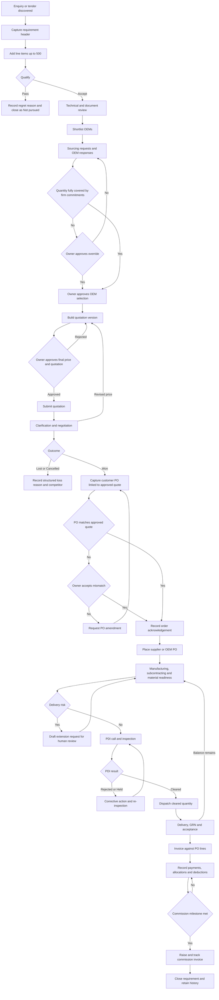

# Product Requirements Document

> **Working product name:** Requirement Lifecycle Control Hub (RLCH), a working name only. **[Assumption]** No product name has been confirmed by the business owner.
>
> **Product principle:** *One requirement, one connected record, one auditable timeline.*

---

## 1. Document Control

| Item | Detail |
|---|---|
| Working product name | Requirement Lifecycle Control Hub (RLCH). **[Assumption: neutral working name; to be replaced by the owner's chosen name]** |
| Document status | Draft for stakeholder validation |
| Version | 0.9 (pre-validation draft) |
| Date | 30 September 2026 |
| Prepared from | 11 supplied sources: 1 requirement brief (PDF), 1 discovery-call transcript (TXT), 9 Excel workbooks (see Section 3) |
| Prepared by | Product / business-systems analysis (drafted with AI assistance; needs human review) |
| Intended audience | Business owner and management, sales, operations and finance leads, solution architect, developers, QA, security reviewer, data-migration lead |
| Confidentiality classification | **Confidential – Commercial / Defence-sector business information.** Do not share outside the project team without the owner's approval. This PRD contains no copied transaction rows, contact details, tax identifiers, bank details or credentials. All examples are masked or made up. |
| Approval required from | Business owner (Ram Prasad or delegate) |

### 1.1 Requirement classification legend

Significant statements in this PRD are tagged as follows:

| Tag | Meaning |
|---|---|
| **[Confirmed]** | Stated by the business owner in the transcript, or stated as a requirement in the brief PDF |
| **[Existing]** | An existing business practice seen in the transcript or workbooks. It is not automatically a requirement. |
| **[Derived]** | A requirement derived logically from confirmed requirements or existing practice |
| **[Assumption]** | A product assumption that needs validation |
| **[Open]** | An open question that must not be treated as a requirement until answered |
| **[Future]** | A future consideration outside the committed scope |

### 1.2 Source reference codes

| Code | Source file | Type |
|---|---|---|
| S1 | `ram-prasad.pdf` (requirement brief, 6 pages) | Business requirement |
| S2 | `Req Conversation.txt` (discovery-call transcript) | Business requirement (owner statements) |
| W1 | `1. Enquries  26-27.xls` | Operational workbook |
| W2 | `2.. Quotation 26-27 .xlsx` | Operational workbook |
| W3 | `3. Orderts 26-27.xls` | Operational workbook |
| W4 | `4. Sales 26-27.xlsx` | Operational workbook |
| W5 | `5. Payments-26-27.xlsx` | Operational workbook |
| W6 | `6. Master List of Approvals).xls` | Operational workbook |
| W7 | `7. Master List of OEM.xls` | Operational workbook |
| W8 | `8. Master List of Customers.xls` | Operational workbook |
| W9 | `Inverbrass Odoo Order Management sheet (1).xlsx` | Detailed order-management design workbook |

---

## 2. Executive Summary

**Business context.** The business owner is a defence contract consultant and business advisor with long experience in the defence sector (S2). Government and defence buyers issue enquiries, RFIs, RFQs and tenders through buyer e-portals, GeM portals, email and direct contact. The consultant fulfils them through a network of OEMs, manufacturers, suppliers and subcontractors (S1, S2, W9). **[Confirmed]**

**Current operating model.** The work runs on Excel workbooks, email, portal monitoring, manual document handling, repeated follow-ups and personal memory (S1, S2). Separate workbooks track enquiries, quotations, orders, sales, payments, approvals, OEMs and customers (W1–W8). A detailed design workbook (W9) shows the target stage model the owner wants. **[Existing]**

**Main operational problems** (ranked in Section 6):

1. The business cannot reliably see whether committed quantities are covered by OEMs.
2. Partial-supply balances across many line items are painful to track.
3. Data-entry errors, such as a missed digit in a price, flow into billing.
4. History is not searchable, so each quotation is rebuilt from scratch.
5. Payment collection stalls because PO documents are missing.
6. Late-delivery (LD) exposure is not flagged early enough to request an extension.
7. Approvals and certificates that expire every 3 to 5 years must be tracked by hand.
8. Follow-ups take about 3 to 4 hours a day. **[Confirmed]**

**Proposed product.** A secure CRM and operational-workflow system. The central record is the **requirement** (RFI / RFQ / enquiry / tender). Every downstream record traces back to it: line items, OEM sourcing, quantity commitments, quotation versions, customer PO, supplier PO, readiness, PDI, dispatch, delivery, acceptance, invoice, payment, deductions, commission, documents, tasks and audit events.

**Expected outcome.** Management sees live pipeline and order status each morning. Quantity gaps and delivery risk are visible before commitments are made. Quotations use comparable history. Balances for quantity, invoices and payments are always visible. Every material change is audited. Human judgement stays mandatory for pricing, OEM selection, compliance and external communication.

**Primary users.** Owner/management, sales, operations, finance and an administrator (S1, W9). Customers, OEMs, suppliers, subcontractors and inspecting authorities are **externally managed parties**. Whether they get direct access is an open question.

**Scope boundary.** The product is not a full ERP, accounting system, manufacturing ERP, legal-advice tool, compliance certifier, generic document generator, or government-portal automation tool (S1). The MVP excludes autonomous external messaging (S1).

---

## 3. Source Analysis

### 3.1 Files analyzed

All 11 files were opened. The content of each was extracted and reviewed.

| Code | File | Opened | Method | Notes |
|---|---|---|---|---|
| S1 | ram-prasad.pdf | Yes | Full text (6 pages) and page images | Requirement brief, including rules, open questions and "what not to build" |
| S2 | Req Conversation.txt | Yes | Full transcript read | Discovery call. Owner statements, facilitator restatements, and hackathon logistics are mixed together. |
| W1 | 1. Enquries  26-27.xls | Yes | Cell values and types (xlrd) | Legacy .xls. Stored formulas could not be read, only computed values. |
| W2 | 2.. Quotation 26-27 .xlsx | Yes | Cell values and formulas (openpyxl) | Formulas inspected |
| W3 | 3. Orderts 26-27.xls | Yes | Cell values and types | Legacy .xls. Formulas not readable. |
| W4 | 4. Sales 26-27.xlsx | Yes | Values and formulas | Formulas inspected |
| W5 | 5. Payments-26-27.xlsx | Yes | Values and formulas | Formulas inspected. Broken references found. |
| W6 | 6. Master List of Approvals).xls | Yes | Values and types | Legacy .xls |
| W7 | 7. Master List of OEM.xls | Yes | Values and types | Legacy .xls |
| W8 | 8. Master List of Customers.xls | Yes | Values and types | Legacy .xls |
| W9 | Inverbrass Odoo Order Management sheet (1).xlsx | Yes | Values, comments, merges | No formulas. One cell comment found. |

### 3.2 Worksheets analyzed

Every sheet was checked for visibility. **No hidden or very-hidden worksheets were found**, and no hidden rows or columns were found in the .xlsx files.

| Workbook | Worksheet | Visible | Used range (approx.) | Content summary |
|---|---|---|---|---|
| W1 | MASTER ENQ QTNS | Yes | 16 rows × 22 cols | Combined enquiry and quotation register for the current year, with header block, year label and a few sample lines |
| W1 | Master POs | Yes | 71 rows × 21 cols | Titled as a pending enquiry/quotation list but holds **PO/order** lines, grouped into year sections with older undated sections and grand totals in lakhs |
| W2 | 26-27 | Yes | 147 rows × 22 cols | Quotation list for one OEM and year, with first rate, second rate, PNC price, PO price and totals |
| W3 | HAL MASTER POs (trailing space in name) | Yes | 80 rows × 33 cols | Customer-specific master order-booking list, year sections from 2020-21 onward, a year-wise summary block and repeating invoice/supply column groups |
| W4 | 26-27 | Yes | 12 rows × 14 cols | Sales register template for one customer, with net/GST/gross and totals in crores |
| W5 | Master 22-23-24-25-26-27 | Yes | 19 rows × 29 cols | Payment and invoice master with ageing, deductions (GST-TDS, TDS, LD, GST on LD), balances and year sections |
| W6 | Master APPL | Yes | 10 rows × 17 cols | Approval certificates with authority, validity, two extension columns and renewal block |
| W7 | Master OEM | Yes | 10 rows × 17 cols | OEM master (single contact, GST, vendor code) plus an approval/renewal block copied from W6 |
| W8 | Master Customer | Yes | 10 rows × 16 cols | Customer master (single contact, GST) plus the same approval/renewal block |
| W9 | Sheet1 | Yes | 26 rows × 7 cols | Stage map: RFI → Quotation → PO → Invoice to OEM → Delivery → Payment to OEM → consultant's invoice, with the fields for each stage |
| W9 | Master Data Inputs | Yes | 20 rows × 4 cols | Field lists for Customer, OEM, Product/Part and Competitor masters. One comment asks which certifications apply. |
| W9 | Input Sheet | Yes | ~200 rows × 4 cols | Module-by-module field specification: field, description and system requirements for 9 modules |
| W9 | Dashboard requirements | Yes | 21 rows × 9 cols | Dashboard items, reports, roles and permissions, automation, integrations, document types, business logic and KPIs |
| W9 | Sheet7 | Yes | 2 rows × 1 col | Two labels: "Manufacturing organisation" and "trading/ marketing" (meaning unclear) |

### 3.3 Analysis limitations

| # | Limitation | Impact |
|---|---|---|
| L1 | W1, W3, W6, W7 and W8 are legacy `.xls`. Only cached cell values could be read, not stored formulas. | Calculation logic for line value, PO value, balances and year totals in these files is **inferred from values**, not confirmed. |
| L2 | The `.xls` files are large (about 1.4–2.9 MB) but hold few populated cells. They may contain formatting, styles or embedded objects that the reader tools cannot see. | Embedded objects, images or macros, if any, were not analyzed. |
| L3 | Most workbooks hold **placeholder or sample rows** (for example "OEM A", "P", "P1/H1", "A/B/C"). W1 "Master POs" appears to hold real historical entries. | Sample rows are **not** treated as requirements. Real rows are **not** copied here. |
| L4 | Contact, mobile, email, GST and bank fields are empty or hold placeholders. | Formats and validation rules for these fields are assumptions. |
| L5 | The transcript contains speech-to-text errors, such as a mangled company name, "liquidity damage" for liquidated damages, and "PDA call" for PDI call. | Meaning was taken from context, and ambiguities are logged. |
| L6 | The PDF links to an external documents folder and a "how it was built" page. These were **not** supplied and **not** accessed. | Anything in those links is out of scope for this analysis. |
| L7 | No sample documents (tender, PO, invoice, PDI report, certificate) were supplied. | Document checklists are derived from field names only. |

### 3.4 Source hierarchy

When sources conflict, this order applies:

1. Explicit **business-owner** statements in S2. Facilitator restatements rank lower and are marked as such.
2. Confirmed requirements in S1.
3. Business processes and structures in W9.
4. Structures and recurring fields in W1–W8.
5. Clearly labelled product assumptions.

### 3.5 Source conflicts

Conflicts are recorded here, not silently resolved. The "PRD handling" column shows the interim design stance.

| ID | Topic | Source A | Source B | PRD handling |
|---|---|---|---|---|
| C-01 | **One or many OEMs per product** | S2: the owner says it is unethical to represent two competing OEMs for the same product, so one OEM is selected per product | S1: several OEMs may cover one requirement (OEM A 600 + OEM B 400). The facilitator in S2 says the same. | Owner's statement takes precedence for **representation** (the OEM-product relationship carries an exclusivity flag and a conflict warning). The data model still allows several OEMs or shipments per requirement line, because S1 requires it and complementary or non-competing sources, subcontractors and split supplies are plausible. **[Open Q-01]** |
| C-02 | **Business model: consultant vs manufacturer** | S1: consultant fulfilling through OEMs | S2: the owner also speaks of "we manufacture", the customer visiting "our factory", buying raw material, and subcontracting enclosures, cable harnesses and PCBs. W9 Sheet7 lists both "Manufacturing organisation" and "trading/marketing". | The PRD supports both modes. Fulfilment can be by an OEM, by an in-house or related manufacturing entity, or by subcontractors. The manufacturing scope is limited to fulfilment visibility. **[Open Q-02]** |
| C-03 | **Organisation names** | W9 and S2: "Inverbrass" / company name (transcription unclear). W1: "IBEL"; quotation refs start "IB/" | W9 Input Sheet: "Supreme Q" (employee, commission invoice). W3: "GAPL" (part no., header). W5: "OEM-ABC", "As per GAPL". W2: "OEM- ABC Pvt Ltd". | Model a **multi-organisation tenant**: the consultant company (and any sister entities) plus OEM principals. Legal entity names must be confirmed. **[Open Q-03]** |
| C-04 | **Who numbers the quotation** | W9 Input Sheet: quotation number "Generated by OEM" | W9 Dashboard: "Automatic quotation numbering". W1/W2: consultant-style references (IB/nn/Mon-YY). | The system generates an internal quotation reference and stores the OEM's quotation number as a separate field. **[Open Q-04]** |
| C-05 | **Requirement status list** | S1: received, qualifying, quoted, submitted, won, lost, cancelled | W9: Open / Under Review / Submitted / Lost / Won / Pass | A single controlled model is defined in Section 21 and mapped to both. "Pass" maps to *Not pursued (regretted)*. **[Derived]** |
| C-06 | **OEM communication duration** | S1: 1 to 10 days | S2 (owner): about 1 week, sometimes 10 days | Reported as "about 1 to 10 days per S1; the owner described about 7 to 10 days". There is no numerical target. |
| C-07 | **Quotation time vs submission window** | S2 (facilitator restatement): 30–45 days of processing | S2 (owner): customers allow about 7–10 days, sometimes 30 or 30–45 days, to submit. Preparation takes 3–4 days. | The owner's statement is used. 30–45 days is the **customer's submission window**, not the preparation time. |
| C-08 | **Number of approval types** | S2: "five to six types" of approval, and elsewhere "four or five agencies" | W9: RCMA, CEMILAC, DGQA, LCSO, MIL standards. W6 samples: CEMILAC, LCSO, RCMA. S2 also cites company-level certifications (ISO 9000/9100 family and an environmental standard, as transcribed). | The approval authority is a **configurable reference list**, not a fixed enum. **[Open Q-08]** |
| C-09 | **Delivery ↔ invoice cardinality** | S1 and W9: one invoice can be fulfilled by several deliveries | W9 Sheet1: delivery quantity follows "invoice/PDI". The requested traceability says every delivery maps to an invoice **or** an approved fulfilment event. | Many-to-many is supported through line-level links (DeliveryLine → InvoiceLine allocation). Deliveries before invoicing are allowed if linked to an approved dispatch. **[Open Q-09]** |
| C-10 | **Commission trigger** | S1 and W9 Dashboard: commission only after the OEM payment milestone | W9 Sheet1: the consultant's invoice goes out "after payment is received by primary client" within 7 days. W9 Input Sheet: commission base = OEM invoice value. | The trigger is a configurable milestone per commission agreement. The default is "customer payment to OEM confirmed". **[Open Q-10]** |
| C-11 | **Deployment and secrecy** | S2 (owner): wants the system as offline as possible for secrecy | S1: suggested stack is hosted Next.js with Supabase/Neon. S2 (facilitator): build online first, then peer-to-peer or an owner-owned server. S2 (facilitator): hackathon grading needs a **password-free** demo link. | Deployment is an **architecture decision needing security review** (Section 22). A password-free demonstration may hold **synthetic data only**. Production must require authentication. Peer-to-peer is **not** assumed to be secure or compliant. |
| C-12 | **Unit of measure** | W3 and W4: "QTY (Mtrs)" | W1: "Qty. (No.)". W5: "QTY (Nos)". | UoM is a mandatory line-level field. No default is inferred during import. |
| C-13 | **Tax labelling** | W5: header "IGST", but the formula uses 18% of net | W4: "GST 18%" hard-coded in the header. W3: "GST". | Tax is modelled as tax lines (type, rate, amount) and is never hard-coded. |
| C-14 | **Enquiry sheet naming** | W1 "Master POs" title: "Master list of pending ENQS/QTNS" | Its columns and content are PO/order data | Treated as order data for migration mapping. **[Open Q-14]** |
| C-15 | **Line value units** | W1 "MASTER ENQ QTNS": line value = qty × price (rupees) | W1 "Master POs": line value appears to be in **lakhs** (PO value ÷ 100,000). W4 totals in **crores**. | All amounts are stored in base currency units. Lakh/crore is a display format only. |
| C-16 | **Enquiry qualification figures** | S1: 25–30 enquiries → ~20 quotations → ~10 orders | S2 owner: "50%, it may be 10" | Consistent. The figures are used only as the context baseline, not as targets. |

### 3.6 Key assumptions

| ID | Assumption |
|---|---|
| A-01 | The base currency is INR. Foreign-currency OEM prices exist (W9 lists INR/USD/EUR, and W7 has a non-Indian OEM location). |
| A-02 | Financial year runs April to March. Year labels such as "26-27" mean FY 2026-27. |
| A-03 | The consultant's own team (owner, sales, operations, finance, admin) are the only authenticated users in MVP. |
| A-04 | Customer POs are received as documents (PDF/paper/portal). Their data is keyed or imported, not received electronically. |
| A-05 | An "approved" flag in OEM, customer or product data is business-provided information backed by evidence documents. The system does not verify it. |
| A-06 | GST-TDS and income-tax TDS deduction rates vary by case and must be configurable. Workbook formulas are not reliable references (see DQ-12 in Section 20). |
| A-07 | Historical data will be migrated only after cleansing and owner sign-off. Until then, historical comparisons are labelled "unvalidated history". |
| A-08 | "PNC" means Price Negotiation Committee (W9). |
| A-09 | "HO" in "Delivery as promised by HO" means Head Office (W3). |
| A-10 | "SRM", "BUD" and "Pur Mail" in W1 SOURCE are enquiry-source codes (for example supplier-relationship portal, budgetary enquiry, purchase email). Their meanings need confirmation (Q-15). |

### 3.7 Confidence notes

| Area | Confidence | Reason |
|---|---|---|
| Lifecycle stages and core rules | High | S1, S2 and W9 agree |
| Volume figures | Medium–High | Stated in S1 and S2 as approximations |
| Field inventories | High for column names, low for semantics of abbreviations | Headings read directly, meanings inferred |
| Calculation rules | Low–Medium | W1/W3 formulas unreadable. W2/W5 formulas are inconsistent or broken. |
| Commission and payment flows | Low | Explicit open question in S1, and C-10 |
| Capacity model (global vs per-order) | Low | Explicit open question in S1 |

---

## 4. Business Background

The consultant helps defence-sector OEMs win and fulfil orders from government and defence buyers. Examples include defence public-sector undertakings and their divisions, and armed-forces users (S2). The business-owner has long defence-sector experience (S2). **[Confirmed]**

**How the business earns revenue.** W9 shows a commission model. The consultant raises a commission invoice to the OEM, based on the OEM's invoice value, after the OEM is paid by the end customer (W9 Sheet1, Input Sheet, Dashboard). S2 also describes manufacturing and subcontracting activity (C-02). **[Confirmed with open questions Q-02, Q-10]**

**End-to-end flow today** (S2, W9, W1–W8):

1. **Discovery.** The team monitors buyer e-portals, GeM portals, email and direct contacts, and receives enquiries through a primary client (S2, W9). **[Existing]**
2. **Capture.** The enquiry is converted into Excel rows (W1). Enquiries with many line items are kept in spreadsheet rows. **[Existing]**
3. **Analysis.** Staff check whether the item was quoted or supplied before, at what price, and whether it was won or lost, and to which competitor. They also check which approvals apply (RCMA, CEMILAC, LCSO, DGQA, MIL or none). **[Existing]**
4. **OEM engagement.** The team gets the OEM price, lead time and confirmation, which takes about 1 to 10 days. **[Existing]**
5. **Quotation.** Specifications and terms are reviewed line by line, because a quoted payment term becomes binding. Preparation takes about 3–4 days, driven by the need to win. A tender checklist is used (S2). **[Existing]**
6. **Evaluation.** The customer evaluates technical compliance first, then opens the price bid. The lowest technically qualified bidder (L1) wins, or the quantity may be split between L1 and L2. A PNC may negotiate the price (S2, W2, W9). **[Existing]**
7. **PO review.** The PO is checked against the quotation for price, quantity, terms and documents using an order-review checklist. Once accepted, the PO is binding (S2). An order acknowledgement is then sent. **[Existing]**
8. **Fulfilment.** Delivery periods are about 3–12 months. The work involves manufacturing, raw-material and component purchasing, and subcontracting of enclosures, cables, harnesses and PCBs (S2). **[Existing]**
9. **PDI.** The supplier issues a PDI call when items are ready and tested, sometimes with an internal test report. Inspectors from the user service or agency inspect in person or by video conference (S2, W9). **[Existing]**
10. **Dispatch and delivery.** Goods ship to the PO location, and partial shipments are common. The customer accepts at its premises. Per the owner's understanding, government buyers are expected to accept within about 7 days if all PO documents are present (S2). **[Existing, not a legal determination]**
11. **Invoice and payment.** One or more invoices are raised against a PO, and payment follows the terms (for example about 30 days). Deductions can include GST-TDS, TDS and LD with GST on LD (W5). Collection stalls when documents such as the invoice, certificate of conformance or approval letter are missing (S2). **[Existing]**
12. **Commission.** The consultant invoices commission after the OEM payment milestone (W9). **[Existing, Open Q-10]**
13. **Repeat business.** A new enquiry for the same item needs a history lookup (S2). **[Existing]**

**Late-delivery exposure.** The owner states that defence orders carry an LD clause. He cited 0.5% per week. The consultant can write before the due date to request a delivery extension without LD, giving reasons such as raw-material shortage or specification issues (S2). **[Existing; rates and legal effect are not determined by the system]**

---
## 5. Current-State Workflow

Each step shows the current practice, its evidence, the pain observed and the tools used today. "Evidence" cites the source codes from Section 1.2.

| # | Step | Current practice | Evidence | Observed pain / gap | Tools today |
|---|---|---|---|---|---|
| 1 | Tender or enquiry discovery | Team monitors each buyer's e-portal, general and other GeM portals, email, direct contacts and primary-client referrals | S2, W9 Sheet1 ("Through Primary Client", "GeM Portal", "Client Portal", "Directly Enquiry") | Manual monitoring. No record of tenders seen but not pursued. | Portals, email |
| 2 | Requirement capture | Enquiry keyed into Excel with OEM, customer, location, source, project, enquiry no./date, due date, product, codes, qty | W1 MASTER ENQ QTNS, S2 | One flat row mixes header, line, quote and status. Large enquiries (up to 500 part numbers) are hard to handle. | Excel |
| 3 | Qualification | Accept or pass. About 5 of 25–30 are regretted as out of range or low value. A regret letter is sent. | S2, W9 Sheet1 ("Accept or Pass (Reason)", "Regret Letter") | Pass reasons are not structured | Excel, email |
| 4 | Technical review | Line-by-line study of specification, drawings and part numbers. Follow-up when spec or drawing is missing or outdated. | S2 | Follow-ups are untracked. Clarification history is lost. | Email, phone |
| 5 | Document review | Tender checklist (first level of checking). Bid type single/double. Submission hard/soft copy. | S2, W9 Input Sheet | Checklist is external to the record. A missing document can disqualify the bid. | Paper/Excel checklist |
| 6 | OEM sourcing | Request OEM price, lead time and MOQ. Verify with the OEM before quoting. About 1–10 days. | S1, S2 | No request/response log. Availability is not separated from commitment. | Email, phone |
| 7 | Quotation preparation | Build price using history, competitor prices and last purchase price. About 3–4 days. | S1, S2, W2 | History is not searchable. Every quote is cross-verified by hand. | Excel |
| 8 | Submission | Submit by the due date through portal, email or hard copy | S2, W9 | Deadline tracking is manual | Portals |
| 9 | Technical clarification | Customer evaluates technical compliance first | S2 | Clarifications are not linked to the quote | Email |
| 10 | Commercial negotiation | Price bid opened. L1 selection. PNC negotiation, with rates revised (first rate → second rate → post-PNC). | S2, W2 | Revised prices overwrite context. Discount tracking needed. | Excel |
| 11 | Award or loss | Won (L1, or split L1/L2) or lost. Competitor details are sometimes captured. | S2, W9 | Loss reasons and competitors are unstructured | Excel remarks |
| 12 | PO review | PO compared with quote for price, quantity, terms and documents. Order-review checklist (second level). | S2 | Errors such as a quoted rate being altered in the PO, or a missing digit, can go unnoticed | Paper/Excel |
| 13 | Order acknowledgement | Acknowledgement sent to customer | S2 | No record of when it was sent or what it said | Email |
| 14 | Manufacturing | OEM or in-house production. Purchase of raw materials and bought-out items. | S2 | No visibility of purchase timing, approved sources or on-time supply | Unknown |
| 15 | Subcontracting | Enclosures, cables, cable harnesses, PCB design and manufacture. Subcontractors must be defence-qualified. | S2 | No subcontractor register or qualification evidence | Unknown |
| 16 | Material readiness | Tracked for critical or delayed dispatches: quantity ready, internal QC, batch and serial | W9 Input Sheet | Readiness is not visible before the PDI call | Email |
| 17 | PDI call | Supplier notifies inspector that items are ready and tested, sometimes with an internal test report | S2, W9 | Calls are not tracked against the PO balance | Email/letter |
| 18 | Inspection | Physical, VC or third-party. Agency can be DGQA, client or internal. Qty offered, cleared, rejected. | S1, W9 | Rejected or held quantities are not reconciled | Paper |
| 19 | Dispatch | Ship to the PO location, with LR/AWB, courier and e-way bill | W9 Input Sheet | Multiple partial dispatches are hard to track | Excel/paper |
| 20 | Delivery | Delivered at customer premises, with GRN and POD | W9 | Pending balance per line is not visible | Paper |
| 21 | Acceptance | Customer accepts or rejects the material | S2, W9 | Acceptance delayed when PO documents are incomplete | Paper |
| 22 | Invoicing | Multiple invoices per PO, with net, GST and gross | W3, W4, W5, W9 | The same invoice is recorded in three workbooks (W3, W4, W5) | Excel |
| 23 | Payment follow-up | Ageing days, payment received, deductions (GST-TDS, TDS, LD, GST on LD), balance, second receipt, final balance | W5, S2 | Follow-up starts at the due date, not before. Broken formulas. | Excel |
| 24 | Commission | Commission invoice raised after the OEM payment milestone, based on OEM invoice value and commission % | W9 | Trigger and chain are unconfirmed | Excel (assumed) |
| 25 | Repeat-order analysis | Lookup of previous quote, PO, price and outcome for the same item | S2, W9 Sheet1 ("Pick up data … from last PO, RFQ, Qtn"), W1 ("Repeat Order") | Manual, slow and sometimes inaccurate | Excel |

---

## 6. Problem Statement

Problems are ranked by business impact, based on the owner's emphasis in S1 and S2.

| Rank | Problem | Description | Affected users | Evidence | Business impact | Priority | Related goal |
|---|---|---|---|---|---|---|---|
| 1 | **Quantity overcommitment** | Team may commit to a quantity the OEMs have not firmly covered. Availability indications are confused with firm commitments. | Owner, sales, operations | S1 §3 ("the hard part") | Non-supply, LD exposure, reputational damage with defence buyers | Must | G-03 |
| 2 | **Unclear partial-supply balances** | Orders with many lines (the owner cited about 50) and varied quantities are shipped in small lots. Supplied and pending quantities are hard to know. | Operations, finance, owner | S2 ("the real pain point"), W3 QTY BAL columns | Wrong invoicing, missed deliveries, disputes | Must | G-04 |
| 3 | **Inaccurate or missing data** | A missed order, invoice or part-number entry, or a price keyed as 10 instead of 100, flows through to billing and to management information | Owner, finance | S2 | Revenue leakage and wrong decisions | Must | G-02, G-09 |
| 4 | **PO and quotation mismatches** | PO price or terms differ from the quote, by error or on purpose. Once accepted, the PO is binding. | Sales, owner | S2 | Direct margin loss and unfavourable payment terms | Must | G-05 |
| 5 | **Slow payment collection** | Follow-up starts late. Payment is held up by missing invoices, certificates of conformance or approval letters. | Finance, owner | S2 | Cash-flow strain | Must | G-06 |
| 6 | **Late-delivery exposure** | Risk is seen too late to request an extension before the due date. The owner cited an LD rate. | Operations, owner | S2, W5 LD columns, W3 revised-date column | Deductions from receipts | Must | G-07 |
| 7 | **Weak historical search** | No searchable history of quotes, wins, losses, prices or competitors. Every quote is cross-verified by hand. | Sales, owner | S1, S2 | Slower, less competitive bids | Must | G-08 |
| 8 | **Fragmented Excel records** | The same facts sit in several workbooks, year sections and customer-specific sheets. Invoice data is repeated in W3, W4 and W5. | All | W1–W8 | Inconsistent figures and duplicated effort | Must | G-01 |
| 9 | **Expired approvals** | Item, system and company approvals renew every 3–5 years. Expiry is tracked by hand. | Operations, owner | S1, S2, W6 | Ineligible quotes or supplies | Must | G-10 |
| 10 | **Missing documents** | Tender and PO documents are missed. A missing document can mean disqualification or payment delay. | Sales, operations, finance | S2, W9 | Lost bids, delayed payment | Must | G-10, G-06 |
| 11 | **Manual follow-ups** | Team spends about 3–4 hours a day following up on specs, orders, acceptance and payments | All | S1, S2 | Productivity loss | Should | G-11 |
| 12 | **Missed deadlines** | Submission due dates, quote validity and PDI dates are tracked in spreadsheets | Sales, operations | S2, W1/W2 due-date columns | Missed bids | Must | G-11 |
| 13 | **Supplier and subcontractor visibility** | No visibility of whether purchases happen on time, from approved sources, and arrive on time | Operations, owner | S2 | Delivery slippage | Should | G-12 |
| 14 | **Incomplete audit history** | Price revisions overwrite earlier values. Certificate extensions overwrite fields. There is no record of who changed what. | Owner | W2, W6, S1 §11 | Disputes, weak control | Must | G-09 |

---

## 7. Product Vision

> **"One requirement, one connected record, one auditable timeline."**

Every opportunity starts as a **requirement** with structured line items. From that record the team can see which OEMs were asked and what they indicated or firmly committed. They can also see how much of each line is covered, what was quoted in each version and what the customer ordered. The same record shows what was made, inspected, dispatched, delivered, accepted, invoiced and paid, and what commission is due. Each fact is entered once and reused downstream. Balances are calculated, not typed.

**Improved control.** Quantity coverage is checked before a quote is approved. PO lines are compared with the approved quote before acknowledgement. Failed or held PDI blocks dispatch. Invoices cannot exceed PO or inspected balances without an approved override. Every material change is audited.

**Improved visibility.** A morning dashboard and grounded plain-language questions show open orders, risks, pending responses, payments due and expiring documents.

**Preserved human judgement.** The system organizes, validates, calculates, searches, summarizes, reminds and suggests. People decide the final bid price, final quotation, OEM selection, compliance acceptance, PO-mismatch acceptance, dispatch overrides, external correspondence and extension letters. AI-generated text is always a draft for human review.

---

## 8. Goals and Success Measures

**Numerical improvement targets are not set.** No validated baseline exists. For each measure: *"Baseline to be established after validated data migration."*

| ID | Phase 1 goal | Success measure (definition in Section 24) | Baseline | Target |
|---|---|---|---|---|
| G-01 | Single connected record for every requirement through to closure | % of active POs, invoices and payments with a complete upstream link chain | Baseline to be established after validated data migration | 100% for records created in the system (structural rule). Migrated records are tracked as exceptions. |
| G-02 | Structured line-item capture | % of requirements with line items as structured rows (not text) | Baseline to be established after validated data migration | Set after baseline |
| G-03 | No uncovered commitments | Count of approved quotation lines with uncovered quantity and no approved override | Baseline to be established after validated data migration | Set after baseline (system rule targets zero unapproved) |
| G-04 | Line-level balances always visible | Outstanding delivery quantity is available for every open PO line | Baseline to be established after validated data migration | Set after baseline |
| G-05 | Every PO reviewed against the approved quote | % of POs with a completed mismatch review before acknowledgement | Baseline to be established after validated data migration | Set after baseline |
| G-06 | Earlier payment follow-up | Invoice ageing, payment collection cycle, % of invoices with a complete document checklist at submission | Baseline to be established after validated data migration | Set after baseline |
| G-07 | Early delivery-risk visibility | % of at-risk lines flagged before the committed date, and extension requests raised before the due date | Baseline to be established after validated data migration | Set after baseline |
| G-08 | Searchable history in quoting | % of quotation versions where comparable history was viewed before approval | Baseline to be established after validated data migration | Set after baseline |
| G-09 | Auditable changes | Material changes with an audit event (structural) | Baseline to be established after validated data migration | 100% (structural rule) |
| G-10 | No surprise document expiry | Documents expiring within the reminder window that have an assigned renewal task | Baseline to be established after validated data migration | Set after baseline |
| G-11 | Follow-ups managed as tasks | Follow-up completion rate and overdue tasks | Baseline to be established after validated data migration | Set after baseline |
| G-12 | Supplier and subcontractor fulfilment visibility | % of supplier PO lines with an expected date and current readiness status | Baseline to be established after validated data migration | Set after baseline |

The volume context from S1 and S2 is used for capacity planning, not as a target. It includes about 25–30 enquiries a month, about 20 quotations a month, about 10 orders a month, about 20–25 active orders at a time, and up to 500 line items per requirement.

---

## 9. Non-Goals

| # | Non-goal | Source |
|---|---|---|
| NG-01 | No automatic legal judgement, including on LD applicability, contract interpretation or dispute outcomes | S1 |
| NG-02 | No automatic regulatory or compliance certification. The system records evidence provided by stakeholders. | S1 |
| NG-03 | No automatic OEM approval or final OEM selection | S1 |
| NG-04 | No automatic final bid price. Suggested prices are decision support only. | S1 |
| NG-05 | No full ERP replacement (inventory, MRP, production planning, HR) | S1 |
| NG-06 | No full accounting replacement (general ledger, statutory GST returns, TDS returns). Only operational invoice and payment tracking. | S1 |
| NG-07 | No government-portal (GeM or buyer e-portal) automation in MVP, including scraping, auto-bidding and auto-submission | S1 |
| NG-08 | No autonomous external messages in MVP. Customer/OEM emails, WhatsApp and letters are drafts that need human send. | S1 |
| NG-09 | No reliance on public demonstration data for business decisions. Demo environments use synthetic data only. | Derived (C-11) |
| NG-10 | No unsupported AI conclusions. AI answers must cite stored records or state that data is missing. | S1 §10 |
| NG-11 | Not a generic document generator | S1 |
| NG-12 | No storage of portal passwords or login credentials. Portal login mapping stores references only (see FR-CUST-04). | Derived (security) |

---
## 10. Stakeholders

### 10.1 Internal users (authenticated system users)

| Stakeholder | Interest | Source |
|---|---|---|
| Owner / management | Pipeline, open orders, risk, cash, approvals, win/loss insight | S1, S2, W9 |
| Sales team | Enquiries, qualification, OEM sourcing, quotations, negotiation, customer response | S1, W9 |
| Operations team | OEM/supplier POs, readiness, subcontracting, PDI, dispatch, delivery, documents | S1, W9 |
| Finance team | Invoices, payments, deductions, ageing, commission, GST/TDS summaries | S1, W9 |
| Administrator | Users, roles, reference data, imports, configuration | W9 ("Admin – Full access") |

### 10.2 Externally managed parties (records only in MVP; direct access is an open question)

| Party | Role in lifecycle | Access in MVP |
|---|---|---|
| Customers / agencies (defence PSUs, their divisions, services, government buyers) | Issue requirements and POs, inspect, accept, pay | No direct access **[Open Q-11]** |
| Primary clients / prime contractors | Channel for some enquiries. May pay OEMs. | No direct access **[Open Q-11]** |
| OEMs | Price, commit, manufacture, invoice, receive payment, pay commission | No direct access **[Open Q-11]** |
| Suppliers (bought-out items, raw material) | Supply inputs for manufacturing | No direct access |
| Manufacturers (in-house or related entity) | Produce items (C-02) | Internal users if part of the tenant **[Open Q-02]** |
| Subcontractors (enclosures, cables/harnesses, PCBs) | Perform subcontracted work. Must be defence-qualified. | No direct access **[Open Q-11]** |
| Inspecting authorities (e.g., DGQA, client QA, third party) and approval authorities (e.g., RCMA, CEMILAC, LCSO) | Inspect, approve, certify | No access. Recorded as organizations. |
| Competitors | Recorded for win/loss intelligence | Not users |

---

## 11. User Personas

### 11.1 Owner / Management

| Aspect | Detail |
|---|---|
| Responsibilities | Bid strategy, final pricing, OEM relationships, approvals, cash flow, customer relationships |
| Pain points | Information arrives late or inaccurate. Has to ask where an order is. No history at hand. Cash stuck in documentation gaps. |
| Key tasks | Review morning dashboard. Approve quotes, OEM selection, overrides and mismatches. Ask plain-language questions. Review wins and losses. |
| Required information | Open requirements by stage, deadlines, coverage gaps, open orders and risk, payments due or overdue, expiring approvals, recent wins and losses with reasons |
| Decisions | Bid/no-bid, final price, OEM choice, accepting PO deviations, extension requests, escalations |
| Success criteria | Can see status of any requirement or order in one place without asking staff. Every approval request has the supporting data attached. |

### 11.2 Sales

| Aspect | Detail |
|---|---|
| Responsibilities | Capture and qualify enquiries, request OEM quotes, build quotations, submit, handle clarification and negotiation, record outcomes |
| Pain points | Re-keying enquiries, no searchable history, chasing OEMs, deadline tracking, missing specs/drawings |
| Key tasks | Create requirement and lines, shortlist OEMs, log responses, build versions, attach documents, record customer responses and loss reasons |
| Required information | Past quotes, wins and losses for the same part or customer, OEM prices and lead times, approvals required and held, coverage |
| Decisions | Proposed pricing (subject to approval), clarification responses, follow-up timing |
| Success criteria | Quote built from structured data with history visible. No missed due dates. |

### 11.3 Operations

| Aspect | Detail |
|---|---|
| Responsibilities | Order review support, supplier/OEM POs, subcontracting, readiness, PDI calls, inspection results, dispatch, delivery, acceptance, delivery-extension requests, compliance documents |
| Pain points | Line-level partial supply tracking, late risk discovery, document gaps at PDI/dispatch |
| Key tasks | Update milestones, record PDI quantities, create dispatches, record GRN/POD, raise extension requests, maintain certificates |
| Required information | PO line balances, OEM expected dates, PDI requirements, document checklists, approvals validity |
| Decisions | PDI scheduling, dispatch readiness (within rules), escalation of delays |
| Success criteria | Outstanding quantity per line always correct. Risk flagged before the due date. |

### 11.4 Finance

| Aspect | Detail |
|---|---|
| Responsibilities | Invoice records, payment receipt recording, deductions, ageing, collection follow-up, commission invoices and receipts |
| Pain points | Broken spreadsheet formulas, invoice data in three places, late follow-up, missing documents blocking payment |
| Key tasks | Record invoices against PO lines, allocate payments, record deductions, run ageing, trigger reminders, raise commission invoices |
| Required information | Invoice balances, due dates, document checklist state, deductions, commission agreements and milestones |
| Decisions | Allocation of payments, deduction classification, escalation |
| Success criteria | Every invoice's balance reconciles. Overdue items have owners and tasks. |

### 11.5 Administrator

| Aspect | Detail |
|---|---|
| Responsibilities | Users, roles, reference lists (statuses, loss reasons, approval authorities, tax rates, UoM), imports, configuration, backups (with IT) |
| Pain points | Messy legacy data, uncontrolled lists |
| Key tasks | Run imports, resolve import errors, maintain reference data, review audit logs |
| Required information | Import results, error reports, user activity |
| Decisions | Mapping rules (with owner sign-off), access grants (with owner approval) |
| Success criteria | Clean, signed-off migration. Least-privilege access. |

---

## 12. Roles and Permissions

**Legend:** C = create, R = read, U = update, A = approve, X = export, — = no access. Field-level restrictions apply (Section 23).

| Capability | Owner / Mgmt | Sales | Operations | Finance | Admin |
|---|---|---|---|---|---|
| Customer / agency master | CRUA | CRU | R | R (+ tax/payment terms U) | CRU |
| OEM / supplier / subcontractor master | CRUA | CRU | CRU | R (+ bank/commission U) | CRU |
| OEM bank details | R | — | — | CRU | — (unless granted) |
| Product / part master | CRUA | CRU | CRU | R | CRU |
| Requirement and lines | CRUA | CRU | R | R | R |
| Qualification (accept/pass) | A | C (propose) | R | — | R |
| Sourcing requests / OEM responses | CRUA | CRU | CRU | R | R |
| Quantity commitments | CRUA | CRU | CRU | R | R |
| Quantity-coverage override | A | Request | Request | — | — |
| OEM selection | A | Propose | Propose | R | R |
| Quotation versions / pricing / margin | CRUA | CRU (margin R) | R (no margin) | R | R |
| Final quotation / bid price approval | A | — | — | — | — |
| Customer response / loss reason | CRU | CRU | R | R | R |
| Customer PO and lines | CRUA | CRU | R | R | R |
| PO mismatch acceptance | A | Request | Request | Request (payment terms) | — |
| Order acknowledgement (record) | A | CRU | R | R | R |
| Supplier / OEM PO | CRUA | R | CRU | R | R |
| Manufacturing / readiness / subcontracting | R | R | CRU | R | R |
| PDI and inspection | R | R | CRU | R | R |
| Dispatch override after failed/held PDI | A | — | Request | — | — |
| Dispatch / delivery / acceptance | R | R | CRU | R | R |
| Delivery-extension request / letter draft | A (send approval) | R | CRU | R | R |
| Invoices | R | R | R | CRU | R |
| Payments, allocations, deductions | R | R | R | CRU | R |
| Commission agreements / invoices | CRUA | R | — | CRU | R |
| Documents / compliance vault | CRUA | CRU (own records) | CRU | CRU (finance docs) | R |
| Compliance approval (acceptance of evidence) | A | — | Request | — | — |
| Dashboard | R (all) | R (own/assigned) | R (ops) | R (finance) | R |
| Natural-language questions | R (all data) | R (permitted data) | R (permitted data) | R (permitted data) | R |
| Reports / export | RX | R (X own) | R (X ops) | RX (finance) | RX |
| Audit log | R | — | — | — | R |
| Users / roles / configuration | A | — | — | — | CRU |
| Import / migration | A (sign-off) | — | — | — | CRU |

**Record-level access.** **[Assumption]** Sales users see all requirements by default. An "assigned accounts only" mode (W9: "View assigned accounts") is configurable per user. Records flagged *Restricted* are visible only to named users and the owner.

**External access.** Direct access for OEMs, subcontractors or customers is **not** included. **[Open Q-11]**

---

## 13. Future-State Workflow

### 13.1 Numbered workflow

| # | Step | Responsible role | Entry condition | Required information | Approval gate | Resulting status | Output | Exit condition | Notification | Exception path |
|---|---|---|---|---|---|---|---|---|---|---|
| 1 | Capture requirement | Sales | Enquiry/tender identified | Customer, division, source, reference, dates, due date, bid/submission type | — | Requirement: *Received* | Requirement header | Header saved | Assignee notified | Duplicate reference → duplicate warning and link |
| 2 | Add line items | Sales | Header exists | Part numbers (customer/OEM), description, qty, UoM, delivery requirement, approvals required | — | *Received* | Requirement lines (1–500) | ≥1 valid line | — | Import errors → row-level report |
| 3 | Qualify | Sales → Owner | Lines captured | History, approvals held, OEM mapping, value | Owner approves *Pass* (configurable) | *Qualifying* → *In preparation* or *Not pursued* | Qualification decision, regret reason | Decision recorded | Owner notified of pass proposals | Missing spec/drawing → clarification task |
| 4 | Technical and document review | Sales / Ops | *Qualifying* | Specs, drawings, tender checklist | — | *Qualifying* | Checklist status | Checklist complete or items waived with reason | Task owners notified | Missing items → clarification tasks |
| 5 | Shortlist OEMs | Sales | *In preparation* | OEM-product mappings, exclusivity flags, approvals | Human confirms shortlist | *In preparation* | Shortlist | ≥1 OEM per line or gap flagged | — | No mapped OEM → gap warning |
| 6 | Sourcing requests and responses | Sales / Ops | Shortlist | Request date, due date, response, price, lead time, MOQ, validity | — | Sourcing request: *Sent* → *Responded* | OEM responses, indications or commitments | Responses logged or overdue | Overdue response reminder | Withdrawal → coverage recalculated |
| 7 | Quantity coverage check | Sales | Responses logged | Required vs firmly committed qty per line | Override needs owner approval | — | Coverage per line | Uncovered = 0 or approved override | Gap alert to owner | Gap → re-source or reduce quoted qty |
| 8 | Select OEM(s) | Owner | Coverage evaluated | Responses, history, performance | **OEM selection approval** | Selection: *Approved* | Approved OEM allocation | Approved | Sales notified | Rejected → re-source |
| 9 | Build quotation version | Sales | OEM approved (or provisional) | Costs, freight, taxes, currency, margin, terms, validity, comparable history | — | Quotation: *Draft* | Quotation version with lines | Version complete | — | Missing cost → validation block |
| 10 | Approve quotation | Owner | Draft complete, checklist complete | Price, margin, coverage, compliance flags | **Final bid price and final quotation approval** | *Approved* | Locked version | Approved | Sales notified | Rejected → new draft version |
| 11 | Submit | Sales | *Approved* | Submission mode, date, proof | — | Quotation: *Submitted*. Requirement: *Submitted*. | Submission record | Submitted before due date | Follow-up task (default 7 days) | Late → flagged. Record reason. |
| 12 | Clarification and negotiation | Sales | *Submitted* | Clarification requests, PNC outcome, revised rates | Revised price needs approval (new version) | Response: *Clarification requested / Technical clarification / Commercial negotiation / Awaiting decision* | Response log, new versions | Outcome known | Tasks for each request | No response → escalation |
| 13 | Record outcome | Sales | Decision received | Won (full/partial, L1/L2 split), lost + reason + competitor, cancelled | — | *Won / Partially won / Lost / Cancelled* | Outcome, loss reason | Recorded | Owner notified | Unknown outcome after validity → task |
| 14 | Capture customer PO | Sales | Won | PO header and lines, terms, documents, delivery schedule | — | PO: *Under review* | PO record linked to approved quote | Lines mapped | Ops and finance notified | No approved quote → blocked |
| 15 | PO mismatch review | Sales / Finance | PO captured | Rate, qty, terms, dates, documents vs quote | **PO mismatch acceptance** if any variance | PO: *Accepted* or *Amendment requested* | Mismatch record | All variances resolved or approved | Owner notified of variances | Reject → request amendment |
| 16 | Order acknowledgement | Sales | PO *Accepted* | Acknowledgement doc | External correspondence approval | PO: *Acknowledged / Open* | Ack record | Sent (manual) | — | — |
| 17 | Place supplier / OEM PO | Operations | PO open | Selected OEM, qty, price, dates | Material commercial decision if price/qty differs from approved | Supplier PO: *Issued* | Supplier PO and lines | Issued | Expected dates tracked | OEM declines → re-source with approval |
| 18 | Manufacturing, subcontracting, readiness | Operations | Supplier PO issued | Milestones, expected dates, qty ready, QC, batch/serial | — | Readiness: *In production → Ready for PDI* | Milestones, readiness records | Qty ready | Risk alert if forecast > committed date | Delay → extension workflow |
| 19 | Delivery-risk review and extension | Operations → Owner | Risk flagged | Reason, evidence, new date | **Delivery-extension letter** human review and approval | Extension: *Draft → Approved → Sent → Granted/Refused* | Extension record | Customer response recorded | Owner alerted | Refused → escalate. LD recorded if later deducted. |
| 20 | PDI call and inspection | Operations | Qty ready | Test reports, documents, qty offered | — | PDI: *Called → Scheduled → Completed* | Offered/cleared/rejected/held qty | Results recorded | Inspection date reminders | Rejected → corrective action and re-PDI |
| 21 | Dispatch | Operations | Cleared qty available (or PDI not required) | Dispatch lines, logistics, e-way bill where applicable | **Dispatch override** if not cleared | Dispatch: *Planned → Dispatched* | Dispatch record | Dispatched | Customer delivery tracking task | Hold → blocked |
| 22 | Delivery and acceptance | Operations | Dispatched | Delivery date, POD, GRN, qty delivered/accepted/rejected | — | Delivery: *Delivered*. Acceptance: *Accepted/Partially accepted/Rejected*. | Delivery and acceptance records | Recorded | Finance notified | Rejection → return/replacement task |
| 23 | Invoice | Finance | Cleared/dispatched qty (per rule) | Invoice lines, taxes, documents checklist, due date | Over-invoicing override needs approval | Invoice: *Raised → Submitted* | Invoice | Submitted with complete checklist | Pre-due reminder (default 15 days) | Missing docs → task |
| 24 | Payment and deductions | Finance | Invoice submitted | Receipts, allocations, TDS, LD, other deductions | Write-off/settlement needs approval | Invoice: *Partially paid → Paid/Closed* | Payment and allocation records | Balance zero or approved closure | Overdue escalation | Dispute → deduction resolution task |
| 25 | Commission | Finance | Trigger milestone met | Agreement, base amount, %, taxes | Commission invoice approval | Commission: *Eligible → Invoiced → Paid* | Commission invoice | Received | Reminder on due date | Dispute → task |
| 26 | Close and learn | Owner / Sales | All lines closed | Outcome data | — | Requirement: *Closed* | History for search and analytics | Closed | — | — |

### 13.2 Workflow diagram

---
## 14. Functional Requirements

**Format.** Each requirement lists: ID, Title, Statement, Rationale, Role, Trigger, Preconditions, Main behaviour, Validation, Exception behaviour, Approval, Priority (MoSCoW), Acceptance criteria and Source classification. IDs are stable and must not be reused. Detailed field lists appear in Section 15.

### 14.1 Customer and agency (FR-CUST)

#### FR-CUST-01 · Customer organisation record
- **Statement:** The system shall keep one record for each customer organisation (agency, PSU, service or government buyer), with divisions and subdivisions as child records.
- **Rationale:** W1/W3 values combine organisation and division in one text value. W9 requires name, division and subdivision.
- **Role:** Sales, Admin · **Trigger:** New customer encountered · **Preconditions:** None
- **Main behaviour:** Create, edit and deactivate an organisation. Add divisions and subdivisions. Show a 360° view of requirements, quotes, POs, invoices and payments.
- **Validation:** Organisation name must be unique (case- and space-insensitive). A division name must be unique within its organisation.
- **Exception behaviour:** A likely duplicate (fuzzy match) prompts a merge or continue choice. Continuing is audited.
- **Approval:** None. A merge of two customers needs Owner approval.
- **Priority:** Must
- **Acceptance criteria:** Given an organisation with two divisions, when a requirement is created for one division, then the requirement appears in the organisation's and that division's history only.
- **Source:** [Confirmed] W9 Master Data Inputs. [Derived] W1/W3 structure.

#### FR-CUST-02 · Customer locations and addresses
- **Statement:** The system shall store multiple locations per customer or division, with typed addresses (billing, delivery, correspondence).
- **Rationale:** W9 lists billing and delivery addresses. W1/W3/W8 have location codes.
- **Role:** Sales, Admin · **Trigger:** Customer setup or new PO delivery location · **Preconditions:** Customer exists
- **Main behaviour:** Add or edit locations. Mark defaults. Select a location on the requirement, PO line delivery schedule and dispatch.
- **Validation:** Address type is required. State is required where GST applies.
- **Exception behaviour:** Deactivated locations stay on historical records.
- **Approval:** None · **Priority:** Must
- **Acceptance criteria:** A PO line can have a delivery location different from the billing address, and each dispatch shows the chosen location.
- **Source:** [Confirmed] W9. [Existing] W8.

#### FR-CUST-03 · Multiple customer contacts
- **Statement:** The system shall store many contacts per customer, division or location. Each contact has a name, designation, role (purchase, QA, inspector, finance), email and phone.
- **Rationale:** W8 has a single SPOC/MOB/Email cell. W9 needs multiple entries.
- **Role:** Sales · **Trigger:** New contact · **Preconditions:** Customer exists
- **Main behaviour:** Add, edit and deactivate contacts. Link contacts to a requirement, PO or inspection.
- **Validation:** One person per record. Email format checked. Phone numbers in E.164 format.
- **Exception behaviour:** Importing a cell with several names creates an import exception. Contacts are not split automatically.
- **Approval:** None · **Priority:** Must
- **Acceptance criteria:** A contact field cannot store two people. Contact details are masked for roles without contact permission.
- **Source:** [Confirmed] W9. [Derived] from W8 structure.

#### FR-CUST-04 · Registrations, portal references and terms
- **Statement:** The system shall record, per customer, the consultant's or OEM's vendor-registration number, GeM registration details, portal names and URLs, the portal login **owner reference**, tax registrations and general payment terms.
- **Rationale:** W9 lists vendor registration, GeM details, portal login mapping and payment terms.
- **Role:** Sales, Finance, Admin · **Trigger:** Setup · **Preconditions:** Customer exists
- **Main behaviour:** Store registration numbers with validity dates. Store a portal reference (name, URL, responsible user). Store default payment terms that pre-fill quotations.
- **Validation:** **Passwords and credentials are rejected**. There are no password fields, and text that looks like a password triggers a warning. GSTIN format is checked, but its correctness is not verified.
- **Exception behaviour:** An expiring registration creates a renewal task.
- **Approval:** None · **Priority:** Must (portal references), Should (GeM details)
- **Acceptance criteria:** The UI and API have no credential field. Registration expiry appears on the dashboard.
- **Source:** [Confirmed] W9. [Derived] security (NG-12).

#### FR-CUST-05 · Customer history view
- **Statement:** The system shall show, per customer or division, the history of requirements, quotations and outcomes, POs, delivery performance, invoices, payments, deductions and ageing.
- **Rationale:** Repeat-requirement analysis (S2).
- **Role:** All (per permission) · **Trigger:** Open customer · **Preconditions:** Records exist
- **Main behaviour:** Tabbed history with filters by date, status and product. Links to records.
- **Validation:** Values follow the role's permissions.
- **Exception behaviour:** Migrated history carries an "unvalidated" badge until signed off.
- **Approval:** None · **Priority:** Must
- **Acceptance criteria:** Payment ageing for a customer matches the payment ageing report for the same filters.
- **Source:** [Derived] S2, W9.

### 14.2 Requirement, RFI, RFQ, enquiry and tender (FR-RFI)

#### FR-RFI-01 · Create requirement header
- **Statement:** The system shall capture a requirement with type (RFI/RFQ/enquiry/tender/repeat/budgetary), customer and division, location, project, source channel, customer reference, portal/GeM tender number, enquiry date, submission deadline, quotation-validity requirement, bid type, submission type, staggered-delivery flag, required delivery, assigned employee and notes.
- **Rationale:** The requirement is the central record (S1).
- **Role:** Sales · **Trigger:** Enquiry discovered · **Preconditions:** Customer exists or is created inline
- **Main behaviour:** Auto-numbered internal reference. Customer reference stored separately. Status *Received*. Timeline starts.
- **Validation:** Customer, source, reference and submission deadline are required. Deadline ≥ enquiry date. A duplicate customer + reference gives a warning.
- **Exception behaviour:** An unknown deadline is allowed as *To be confirmed* with a mandatory follow-up task.
- **Approval:** None · **Priority:** Must
- **Acceptance criteria:** Given a new tender, when saved without a deadline, then a clarification task is created and the requirement shows "Deadline TBC".
- **Source:** [Confirmed] S1 §1, W9 Input Sheet.

#### FR-RFI-02 · Requirement line items (up to 500)
- **Statement:** The system shall hold 1 to 500 line items per requirement. Each line has a customer part number, OEM part number, internal part number, description, quantity, UoM, delivery requirement, approval requirements, specification reference and line notes.
- **Rationale:** S1 and W9 require many lines, not a text field.
- **Role:** Sales · **Trigger:** Header saved · **Preconditions:** Header exists
- **Main behaviour:** Grid entry, paste from clipboard, CSV/Excel line import, and product-master matching per line.
- **Validation:** Qty > 0. UoM required. At least one part number or description. Duplicate part number within the requirement gives a warning.
- **Exception behaviour:** A 501st line is blocked with a message. **[Open Q-12: is 500 a hard maximum?]**
- **Approval:** None · **Priority:** Must
- **Acceptance criteria:** A 500-line requirement imports, saves and renders within the performance limits in Section 22.
- **Source:** [Confirmed] S1 §1, W9.

#### FR-RFI-03 · Automatic numbering
- **Statement:** The system shall generate unique internal references for requirements (and quotations, FR-QUOTE-11) using a configurable pattern with a financial-year component.
- **Rationale:** W9 automation list. Existing references follow the form IB/nn/Mon-YY.
- **Role:** System · **Trigger:** Record creation · **Preconditions:** Pattern configured
- **Main behaviour:** Generate the next number atomically. Numbers are never reused.
- **Validation:** Uniqueness is enforced by the database.
- **Exception behaviour:** A cancelled record keeps its number.
- **Approval:** Pattern changes need Admin action and Owner approval.
- **Priority:** Must
- **Acceptance criteria:** Two users creating records at the same time never receive the same number.
- **Source:** [Confirmed] W9 Dashboard sheet.

#### FR-RFI-04 · Qualification (accept or pass)
- **Statement:** The system shall record a qualification decision (pursue or not pursue), with a structured pass reason, optional regret-letter document and decision maker.
- **Rationale:** About 5 of 25–30 enquiries are regretted (S2). W9 has "Accept or Pass (Reason)".
- **Role:** Sales proposes, Owner decides · **Trigger:** Requirement reviewed · **Preconditions:** Lines exist
- **Main behaviour:** Decision form showing value estimate, history, approvals and OEM mapping. A pass sets status *Not pursued*.
- **Validation:** A pass reason is required.
- **Exception behaviour:** A reopen needs a reason and is audited.
- **Approval:** Configurable. By default the Owner approves a pass.
- **Priority:** Must
- **Acceptance criteria:** A passed requirement appears in the loss/pass analysis with its reason.
- **Source:** [Existing] S2, W9.

#### FR-RFI-05 · Required-document checklist and attachments
- **Statement:** The system shall attach tender documents, RFQ, drawings and specifications to the requirement or line. It shall hold a tender checklist of required submission documents with status (required, prepared, attached, waived with reason).
- **Rationale:** A missing paper can disqualify a bid. A two-level checklist exists today (S2).
- **Role:** Sales · **Trigger:** Requirement in preparation · **Preconditions:** Header exists
- **Main behaviour:** Checklist templates per customer or bid type. Document links. Progress indicator.
- **Validation:** Quotation approval is blocked while mandatory checklist items are open (unless waived).
- **Exception behaviour:** A waiver needs a reason and is audited.
- **Approval:** A waiver needs Owner approval.
- **Priority:** Must
- **Acceptance criteria:** A quotation cannot move to *Approved* while a mandatory item is *Required*.
- **Source:** [Existing] S2. [Confirmed] W9.

#### FR-RFI-06 · Assignment
- **Statement:** The system shall assign an owner (employee) to each requirement and optionally to lines or tasks.
- **Rationale:** W9 "Assigned Employee". Workload reporting.
- **Role:** Owner, Sales lead · **Trigger:** Creation or reassignment · **Preconditions:** User exists
- **Main behaviour:** Assign or reassign, with a notification to the new assignee.
- **Validation:** The assignee must be active and have Sales or Operations role.
- **Exception behaviour:** A deactivated user's open items appear on an admin reassignment list.
- **Approval:** None · **Priority:** Must
- **Acceptance criteria:** The employee workload report counts open requirements per assignee.
- **Source:** [Confirmed] W9.

#### FR-RFI-07 · Status, timeline and notes
- **Statement:** The system shall maintain a controlled requirement status (Section 21) with status-history records, and a unified timeline of all linked events, notes and documents.
- **Rationale:** "One auditable timeline" (S1).
- **Role:** All · **Trigger:** Any linked event · **Preconditions:** Requirement exists
- **Main behaviour:** Status changes only through valid transitions. The timeline aggregates downstream events.
- **Validation:** An invalid transition is rejected.
- **Exception behaviour:** An Admin correction of status needs a reason and is audited.
- **Approval:** None · **Priority:** Must
- **Acceptance criteria:** The timeline shows every status change with actor and timestamp.
- **Source:** [Confirmed] S1.

#### FR-RFI-08 · Deadline reminders
- **Statement:** The system shall create reminders before the submission deadline and quotation-validity expiry at configurable offsets.
- **Rationale:** W9 "Reminder alerts before deadlines".
- **Role:** System · **Trigger:** Deadline approaching · **Preconditions:** Deadline set
- **Main behaviour:** In-app notification and task. An optional internal email (Phase 2).
- **Validation:** Offsets are configurable. **[Assumption]** Defaults are 7, 3 and 1 days.
- **Exception behaviour:** A changed deadline reschedules its reminders.
- **Approval:** None · **Priority:** Must
- **Acceptance criteria:** Changing a deadline removes the old reminders and creates new ones.
- **Source:** [Confirmed] W9.

#### FR-RFI-09 · Repeat-requirement detection
- **Statement:** On line entry, the system shall match each line against past requirement, quotation and PO lines by part number (customer/OEM/internal) and description, and show a compact history indicator.
- **Rationale:** The owner must know whether the item was quoted, won, lost or approved before (S2).
- **Role:** Sales · **Trigger:** Line saved · **Preconditions:** Product/history data exists
- **Main behaviour:** Badge showing prior quotes, POs, last price and outcome, linked to the comparable-history panel (FR-SEARCH-02).
- **Validation:** Match confidence is shown. Fuzzy matches are labelled "possible".
- **Exception behaviour:** No history shows "No comparable history found".
- **Approval:** None · **Priority:** Must
- **Acceptance criteria:** A line with a part number quoted before shows the prior quote reference and outcome.
- **Source:** [Confirmed] S1 §4, S2.

#### FR-RFI-10 · Clarification tracking
- **Statement:** The system shall record clarification items against a requirement or line, such as missing specification, missing or outdated drawing, or part-number discrepancy, each with a follow-up task.
- **Rationale:** Frequent follow-ups for missing specs and drawings (S2).
- **Role:** Sales · **Trigger:** Gap found · **Preconditions:** Requirement exists
- **Main behaviour:** Clarification record, related task, and response capture with document.
- **Validation:** Type and owner are required.
- **Exception behaviour:** Unanswered past due escalates to the owner.
- **Approval:** None · **Priority:** Should
- **Acceptance criteria:** Open clarifications appear on the requirement and in the follow-up tracker.
- **Source:** [Existing] S2.

### 14.3 Product and part master (FR-PROD)

#### FR-PROD-01 · Product with part-number cross-reference
- **Statement:** The system shall store products with an internal part number and many cross-referenced part numbers (customer, OEM, manufacturer), each typed and linked to its organisation.
- **Rationale:** W1 has product code and manufacturer code. W3 has customer and internal part numbers. W9 has client and OEM part numbers.
- **Role:** Sales, Ops · **Trigger:** New item · **Preconditions:** None
- **Main behaviour:** Lookup by any part number. Link to requirement, quote, PO and invoice lines.
- **Validation:** A part number is unique per (type, organisation). Part numbers are stored as **text** with original spacing preserved, plus a normalised search key.
- **Exception behaviour:** Conflicting mappings are flagged for review.
- **Approval:** None · **Priority:** Must
- **Acceptance criteria:** Searching a customer part number returns the product and its OEM part numbers.
- **Source:** [Confirmed] W9. [Existing] W1, W3.

#### FR-PROD-02 · Product attributes
- **Statement:** The system shall hold description, category, UoM, HSN code, technical specifications (text and attachments), MOQ, lead time, shelf life, warranty, country of origin, export restriction flag, standard price and currency.
- **Rationale:** W9 Product/Part Master.
- **Role:** Sales, Ops · **Trigger:** Setup · **Preconditions:** Product exists
- **Main behaviour:** Attributes default into requirement and quote lines and can be edited there.
- **Validation:** UoM comes from a controlled list. HSN format is checked (digits).
- **Exception behaviour:** Missing optional attributes are allowed and shown as blank.
- **Approval:** None · **Priority:** Must (core), Should (shelf life, export flag)
- **Acceptance criteria:** A product without a UoM cannot be saved.
- **Source:** [Confirmed] W9.

#### FR-PROD-03 · Product approval requirements and held approvals
- **Statement:** The system shall record which approval types a product needs (for example RCMA, CEMILAC, LCSO, DGQA, MIL standard, none) and link to approval certificates held (FR-DOC-02).
- **Rationale:** Items must be cross-checked against approvals before quoting or supply (S2).
- **Role:** Ops · **Trigger:** Setup or requirement line · **Preconditions:** Authority reference list
- **Main behaviour:** Show approval status on requirement and quote lines: *Evidence on file (valid)*, *Expiring*, *Expired*, *No evidence*.
- **Validation:** Status is calculated from certificate validity dates. The wording is "evidence on file", never "compliant".
- **Exception behaviour:** If evidence is missing or expired, quote approval shows a warning that the Owner must acknowledge.
- **Approval:** The Owner acknowledges the warning.
- **Priority:** Must
- **Acceptance criteria:** A line needing an approval type with an expired certificate shows "Expired" and requires acknowledgement at approval.
- **Source:** [Confirmed] S2, W9. [Derived] safety boundary.

#### FR-PROD-04 · Pricing history
- **Statement:** The system shall show per product all historical OEM costs, quoted rates (all stages), negotiated rates, PO rates and outcomes, read-only and taken from the transactions.
- **Rationale:** Bid intelligence (S1 §4).
- **Role:** Sales, Owner · **Trigger:** View product · **Preconditions:** Transactions exist
- **Main behaviour:** Chronological list and chart. Filter by customer and OEM.
- **Validation:** Margin fields are hidden from roles without margin permission.
- **Exception behaviour:** Migrated values are labelled as such.
- **Approval:** None · **Priority:** Must
- **Acceptance criteria:** After a revision, both the old and new rates appear in the history.
- **Source:** [Confirmed] S1.

### 14.4 OEM, supplier and subcontractor master (FR-OEM)

#### FR-OEM-01 · Partner organisation record
- **Statement:** The system shall keep one partner-organisation record with one or more types (OEM, supplier, subcontractor, manufacturer, logistics provider, inspection agency, approval authority), plus locations, GSTIN, vendor codes, country, capabilities and status.
- **Rationale:** W7, W9. Subcontractors in S2.
- **Role:** Sales, Ops, Admin · **Trigger:** New partner · **Preconditions:** None
- **Main behaviour:** Create, edit and deactivate. Multiple locations (W7 samples show several locations for one OEM).
- **Validation:** Name uniqueness with fuzzy duplicate check. GSTIN format check per location.
- **Exception behaviour:** Merging duplicates needs Owner approval.
- **Approval:** A merge needs Owner approval.
- **Priority:** Must
- **Acceptance criteria:** One OEM with three locations is a single organisation with three location records.
- **Source:** [Confirmed] W7, W9. [Derived].

#### FR-OEM-02 · Partner contacts
- **Statement:** The system shall store many contacts per partner or location, one person per record, each with a role.
- **Rationale:** W7 single SPOC field. W9 needs multiple entries.
- **Role:** Sales, Ops · **Trigger:** New contact · **Preconditions:** Partner exists
- **Main behaviour:** As FR-CUST-03.
- **Validation:** As FR-CUST-03.
- **Exception behaviour:** As FR-CUST-03.
- **Approval:** None · **Priority:** Must
- **Acceptance criteria:** As FR-CUST-03.
- **Source:** [Confirmed] W9.

#### FR-OEM-03 · Partner–product relationship with exclusivity
- **Statement:** The system shall link partners to products with relationship type (represented OEM, alternate source, subcontract capability), an **exclusive-representation** flag, lead time, MOQ, price validity and a business-provided approved-source flag with evidence.
- **Rationale:** The owner represents one non-competing OEM per product (S2). Shortlisting (S1).
- **Role:** Sales, Owner · **Trigger:** Setup · **Preconditions:** Partner and product exist
- **Main behaviour:** Linking a second *represented* OEM to a product that already has an exclusive OEM raises a conflict warning.
- **Validation:** The approved flag needs an evidence document or reference, otherwise it shows "Unverified (business-provided)".
- **Exception behaviour:** Keeping a conflicting link needs Owner approval and a reason.
- **Approval:** Owner, for an exclusivity conflict.
- **Priority:** Must
- **Acceptance criteria:** Adding a second represented OEM for an exclusive product is blocked until the Owner approves.
- **Source:** [Confirmed] S2. [Open Q-01].

#### FR-OEM-04 · Commercial terms and agreements
- **Statement:** The system shall store per partner the payment terms, freight terms, warranty terms, pricing-validity rules, MOQ rules, commission percentage (per agreement), NDA/agreement status and dates.
- **Rationale:** W9 OEM Master.
- **Role:** Owner, Finance · **Trigger:** Agreement signed or changed · **Preconditions:** Partner exists
- **Main behaviour:** Agreements are dated records with history. They are never overwritten.
- **Validation:** Commission % is between 0 and 100. Effective date is required.
- **Exception behaviour:** Overlapping agreement periods are flagged.
- **Approval:** A commission agreement needs Owner approval.
- **Priority:** Must
- **Acceptance criteria:** A change to commission % creates a new agreement version, and old invoices keep the old %.
- **Source:** [Confirmed] W9.

#### FR-OEM-05 · Bank details (restricted)
- **Statement:** The system shall store partner bank details in encrypted, field-restricted form, visible only to Finance and the Owner, with every view logged.
- **Rationale:** W9 lists bank details. The data is sensitive.
- **Role:** Finance · **Trigger:** Setup · **Preconditions:** Partner exists
- **Main behaviour:** Masked display with reveal-on-demand. The reveal is logged.
- **Validation:** IFSC/SWIFT format checks.
- **Exception behaviour:** A change of bank details triggers an Owner notification and approval.
- **Approval:** A bank-detail change needs Owner approval.
- **Priority:** Should
- **Acceptance criteria:** A Sales user cannot see or export bank fields. Each reveal creates an audit event.
- **Source:** [Confirmed] W9. [Derived] security.

#### FR-OEM-06 · Qualification evidence and defence-qualified status
- **Statement:** The system shall record qualification evidence for partners, such as company certifications (ISO/AS series, as provided), approvals and defence-qualification evidence for subcontractors, with validity dates.
- **Rationale:** Subcontractors must be defence-qualified (S2). Company-level certifications renew (S2).
- **Role:** Ops · **Trigger:** Onboarding or renewal · **Preconditions:** Partner exists
- **Main behaviour:** Evidence documents are linked through the document vault. Status is calculated from validity.
- **Validation:** Wording is "evidence on file". The system does not certify.
- **Exception behaviour:** Expired evidence gives a warning on supplier PO or subcontract assignment, and the Owner must acknowledge.
- **Approval:** Compliance approval to accept evidence (Owner).
- **Priority:** Must
- **Acceptance criteria:** Assigning a subcontractor with expired evidence needs an Owner acknowledgement, which is audited.
- **Source:** [Confirmed] S2. [Open Q-16 criteria].

#### FR-OEM-07 · Partner performance history
- **Statement:** The system shall compute per partner the response time, response rate, commitment reliability, on-time readiness, PDI pass rate and delay history from transactions.
- **Rationale:** W9 KPI "OEM Performance". S1 "past performance".
- **Role:** Owner, Sales · **Trigger:** View partner · **Preconditions:** Transactions exist
- **Main behaviour:** Read-only metrics (Section 24) with drill-down.
- **Validation:** The sample size is shown next to each metric.
- **Exception behaviour:** Fewer than 3 events shows "insufficient data".
- **Approval:** None · **Priority:** Should
- **Acceptance criteria:** Metrics match the OEM performance report.
- **Source:** [Confirmed] S1, W9.

### 14.5 OEM sourcing (FR-SOURCE)

#### FR-SOURCE-01 · Shortlist OEMs per line
- **Statement:** From a requirement, the system shall suggest candidate partners per line from product–partner links and history. A user confirms the shortlist.
- **Rationale:** S1 §2.
- **Role:** Sales · **Trigger:** Requirement in preparation · **Preconditions:** Lines exist
- **Main behaviour:** Candidate list with mapping type, exclusivity, approval-evidence status, lead time and past performance. The user selects the shortlist.
- **Validation:** The suggestion is labelled as a suggestion. There is no auto-selection.
- **Exception behaviour:** No candidates flags the line "No mapped source".
- **Approval:** Human confirmation (Sales). The final selection is FR-SOURCE-05.
- **Priority:** Must
- **Acceptance criteria:** The shortlist is saved only after an explicit user action.
- **Source:** [Confirmed] S1. [Derived] safety.

#### FR-SOURCE-02 · Sourcing request
- **Statement:** The system shall record a sourcing request to each shortlisted partner covering the lines and quantities requested, request date, response due date, channel and attached documents.
- **Rationale:** Record each request and its response (S1).
- **Role:** Sales, Ops · **Trigger:** Shortlist confirmed · **Preconditions:** Shortlist
- **Main behaviour:** Creates the request and a follow-up task at the due date. It can produce a draft email for manual sending (Phase 2 integration).
- **Validation:** Due date ≥ request date.
- **Exception behaviour:** A cancelled request keeps its history.
- **Approval:** None (internal record). External correspondence is sent by a human.
- **Priority:** Must
- **Acceptance criteria:** An overdue request shows on the dashboard "OEM responses pending".
- **Source:** [Confirmed] S1.

#### FR-SOURCE-03 · OEM response capture
- **Statement:** The system shall capture partner responses per line: price, currency, lead time, MOQ, validity, availability indication qty, firm commitment qty (separately), terms, deviations, documents and response date.
- **Rationale:** Distinguish indication from commitment (S1 §3).
- **Role:** Sales, Ops · **Trigger:** Response received · **Preconditions:** Request exists
- **Main behaviour:** The response creates QuantityIndication and/or QuantityCommitment records (FR-QTY-02).
- **Validation:** A firm commitment needs evidence (document or recorded confirmation) and a commitment date.
- **Exception behaviour:** A response after the due date is flagged "late" for performance metrics.
- **Approval:** None · **Priority:** Must
- **Acceptance criteria:** A response with 800 available and 0 committed shows 0 firm coverage.
- **Source:** [Confirmed] S1.

#### FR-SOURCE-04 · Sourcing follow-up
- **Statement:** The system shall create follow-up tasks for pending responses and escalate them past a threshold.
- **Rationale:** OEM communication takes about 1 to 10 days (S1).
- **Role:** System · **Trigger:** Due date passed · **Preconditions:** Pending request
- **Main behaviour:** Task, reminder and escalation to the owner.
- **Validation:** Thresholds are configurable.
- **Exception behaviour:** —
- **Approval:** None · **Priority:** Should
- **Acceptance criteria:** A request 3 days overdue (configurable) escalates.
- **Source:** [Derived] S1, S2.

#### FR-SOURCE-05 · OEM selection approval
- **Statement:** The system shall require an Owner approval to select the OEM(s) and allocated quantities per line before quote approval and supplier-PO placement.
- **Rationale:** No OEM is chosen without human approval (S1).
- **Role:** Owner · **Trigger:** Selection proposed · **Preconditions:** Responses exist
- **Main behaviour:** Approval request with a comparison table of responses. Approve or reject with comments.
- **Validation:** The allocated quantities cannot exceed the firm commitment without an override (FR-QTY-05).
- **Exception behaviour:** Rejection returns to sourcing.
- **Approval:** **Mandatory, Owner.**
- **Priority:** Must
- **Acceptance criteria:** A quotation version cannot be approved while any line has no approved OEM selection (unless flagged "customer-supplied" or "in-house").
- **Source:** [Confirmed] S1.

### 14.6 Quantity coverage (FR-QTY)

#### FR-QTY-01 · Line-level quantity ledger
- **Statement:** The system shall compute, per requirement line and per PO line, all lifecycle quantities defined in Section 15.6 from the underlying transactions. They are never keyed.
- **Rationale:** Quantity balance must be visible across the whole lifecycle (S1).
- **Role:** All · **Trigger:** Any quantity event · **Preconditions:** Line exists
- **Main behaviour:** A "quantity strip" on each line shows required → quoted → indicated → committed → ordered → ready → offered → cleared/rejected/held → dispatched → invoiced → delivered → accepted → outstanding/uncovered.
- **Validation:** Calculations per Section 17. UoM consistency is enforced.
- **Exception behaviour:** A UoM mismatch between linked lines blocks the calculation and raises an exception.
- **Approval:** None · **Priority:** Must
- **Acceptance criteria:** Given ordered 1,000 and two deliveries of 300 and 200 accepted, outstanding shows 500.
- **Source:** [Confirmed] S1, S2.

#### FR-QTY-02 · Indication vs firm commitment
- **Statement:** The system shall store availability indications and firm commitments as separate record types. Only firm, active commitments count toward coverage.
- **Rationale:** S1 §3.
- **Role:** Sales, Ops · **Trigger:** OEM response · **Preconditions:** Sourcing request
- **Main behaviour:** An indication can be converted to a commitment only with evidence and a date.
- **Validation:** Commitment qty > 0. Evidence is required.
- **Exception behaviour:** An expired commitment (past validity) stops counting and raises an alert.
- **Approval:** None · **Priority:** Must
- **Acceptance criteria:** Coverage excludes indications and expired commitments.
- **Source:** [Confirmed] S1.

#### FR-QTY-03 · Multiple sources and shipments per line
- **Statement:** The system shall allow several partner commitments and several scheduled shipments to cover one line, with coverage = Σ active firm commitments.
- **Rationale:** S1 example: 1,000 needed = 600 + 400, uncovered 0.
- **Role:** Sales, Ops · **Trigger:** Commitments recorded · **Preconditions:** Line exists
- **Main behaviour:** Allocation table per line. Schedule split by date.
- **Validation:** The exclusivity warning (FR-OEM-03) applies when a second *represented* OEM is added.
- **Exception behaviour:** —
- **Approval:** OEM selection (FR-SOURCE-05).
- **Priority:** Must
- **Acceptance criteria:** Given required 1,000 with OEM A 600 and OEM B 400 firm, uncovered = 0.
- **Source:** [Confirmed] S1. [Open Q-01].

#### FR-QTY-04 · Coverage warning and quote gate
- **Statement:** The system shall warn when quoted qty exceeds firm coverage on any line, and shall block quotation approval until the gap is closed or overridden.
- **Rationale:** Do not let the team commit to uncovered quantity (S1).
- **Role:** Sales, Owner · **Trigger:** Quote approval requested · **Preconditions:** Quote version
- **Main behaviour:** Red gap indicator per line and on the dashboard "Quantity coverage gaps".
- **Validation:** Gap = max(0, quoted − firm coverage).
- **Exception behaviour:** An override goes through FR-QTY-05.
- **Approval:** Override needs Owner approval.
- **Priority:** Must
- **Acceptance criteria:** A version with a 200-unit gap cannot be approved without an approved override.
- **Source:** [Confirmed] S1.

#### FR-QTY-05 · Coverage override
- **Statement:** The system shall let a user request an override of a coverage gap, stating reason, risk and mitigation. The Owner approves it. The override is recorded against the version and line.
- **Rationale:** Business reality may need a commitment ahead of OEM confirmation, under human control.
- **Role:** Sales requests, Owner approves · **Trigger:** Gap blocks approval · **Preconditions:** Gap exists
- **Main behaviour:** Approval record. The override stays visible downstream as "Committed with override".
- **Validation:** Reason is required.
- **Exception behaviour:** A later commitment that closes the gap marks the override "resolved".
- **Approval:** **Mandatory, Owner.**
- **Priority:** Must
- **Acceptance criteria:** An override appears in the audit log and the coverage report.
- **Source:** [Derived] S1, prompt safety boundary.

#### FR-QTY-06 · Commitment change and withdrawal
- **Statement:** The system shall record changes to or withdrawal of a commitment as new versions with reason and date. It shall recalculate coverage and alert the line owner and the Owner when coverage drops after quote approval or PO.
- **Rationale:** Commitments change.
- **Role:** Sales, Ops · **Trigger:** OEM notice · **Preconditions:** Commitment exists
- **Main behaviour:** Version history. A new gap creates a task.
- **Validation:** Reason is required.
- **Exception behaviour:** A withdrawal after the PO triggers a delivery-risk flag.
- **Approval:** None to record. Replacement sourcing needs OEM selection approval.
- **Priority:** Must
- **Acceptance criteria:** Withdrawing 400 of 1,000 committed shows uncovered 400 and creates a task.
- **Source:** [Derived] S1.

#### FR-QTY-07 · Cross-order partner capacity view
- **Statement:** The system *may* show, per partner and product, the total firm commitments across open requirements and orders against a declared partner capacity.
- **Rationale:** S1 open question 1 (global vs per-order capacity).
- **Role:** Owner, Sales · **Trigger:** View · **Preconditions:** Declared capacity data
- **Main behaviour:** Informational only. It does not reduce coverage automatically.
- **Validation:** Capacity is shown only if a partner-declared figure exists.
- **Exception behaviour:** —
- **Approval:** None · **Priority:** Could (Phase 2 unless Q-05 is confirmed)
- **Acceptance criteria:** A commitment against one requirement does not change coverage on another in MVP.
- **Source:** [Open Q-05].

### 14.7 Quotation (FR-QUOTE)

#### FR-QUOTE-01 · Create quotation from requirement
- **Statement:** The system shall create a quotation only from an existing requirement, copying the selected lines, and shall not allow stand-alone quotations.
- **Rationale:** Every quotation originates from an RFI (S1, W9).
- **Role:** Sales · **Trigger:** Requirement qualified · **Preconditions:** Requirement *In preparation* or later
- **Main behaviour:** Creates quotation header + version 1 + lines linked to requirement lines.
- **Validation:** The requirement FK is mandatory at the database level.
- **Exception behaviour:** Migrated orphan quotations get a placeholder "Legacy requirement" (FR-IMPORT-03).
- **Approval:** None · **Priority:** Must
- **Acceptance criteria:** The API rejects a quotation without a requirement ID.
- **Source:** [Confirmed] S1, W9.

#### FR-QUOTE-02 · Immutable versions
- **Statement:** The system shall keep multiple versions per quotation. Approved or submitted versions are read-only, and any change creates a new version.
- **Rationale:** Revision tracking (W9). Preserve pricing history (W2 rate stages).
- **Role:** Sales · **Trigger:** Revision needed · **Preconditions:** Prior version
- **Main behaviour:** "Create revision" copies the lines. A version reason is required (for example customer clarification, PNC, cost change).
- **Validation:** Only one version can be *Current* at a time.
- **Exception behaviour:** —
- **Approval:** Each version that will be submitted needs approval.
- **Priority:** Must
- **Acceptance criteria:** Version 1 values remain retrievable after version 3 is approved.
- **Source:** [Confirmed] S1, W9.

#### FR-QUOTE-03 · Line pricing build-up
- **Statement:** Each quotation line shall hold OEM cost (linked to response), currency and exchange rate, freight, other costs, target margin, calculated price, proposed unit price, discount, taxes (type/rate), delivery terms, lead time and line total.
- **Rationale:** W9 Quotation module. S1 §4.
- **Role:** Sales · **Trigger:** Editing a draft · **Preconditions:** Version *Draft*
- **Main behaviour:** Live calculation (Section 17). Margin is visible only to permitted roles.
- **Validation:** Price > 0. Currency is required. The exchange rate date is recorded.
- **Exception behaviour:** A missing OEM cost gives a warning and the version cannot be approved (configurable).
- **Approval:** —
- **Priority:** Must
- **Acceptance criteria:** Changing freight recalculates the price and margin, and the change is audited.
- **Source:** [Confirmed] W9, S1.

#### FR-QUOTE-04 · Comparable-history panel
- **Statement:** Before pricing, the system shall show comparable past bids per line: past quoted rates (all stages), outcome, winning or losing price where known, competitor, PO price, date, customer and OEM.
- **Rationale:** He adjusts the bid from history (S1 §4).
- **Role:** Sales, Owner · **Trigger:** Open line pricing · **Preconditions:** History exists
- **Main behaviour:** Panel with match basis (exact part no., cross-reference, description similarity), sorted by recency.
- **Validation:** Each result links to its source record. Unvalidated migrated data is labelled.
- **Exception behaviour:** No match shows "No comparable history".
- **Approval:** None · **Priority:** Must
- **Acceptance criteria:** Viewing the panel is logged (used for metric G-08).
- **Source:** [Confirmed] S1, S2.

#### FR-QUOTE-05 · Recommended price (decision support)
- **Statement:** The system may show a suggested price range derived transparently from cost + target margin and comparable history, with the calculation shown. It shall never set the final price automatically.
- **Rationale:** S1 §4 "recommended price". There is no automatic final bid price.
- **Role:** Sales, Owner · **Trigger:** Pricing · **Preconditions:** Cost exists
- **Main behaviour:** "Suggestion" label, the formula and inputs, and an "apply" button that copies the value into the editable proposed price.
- **Validation:** The suggestion is never saved as approved.
- **Exception behaviour:** Insufficient data shows no suggestion.
- **Approval:** The final price needs Owner approval (FR-QUOTE-06).
- **Priority:** Should
- **Acceptance criteria:** No quotation reaches *Approved* without an explicit human approval event.
- **Source:** [Confirmed] S1. [Derived] safety.

#### FR-QUOTE-06 · Quotation approval
- **Statement:** The system shall route each quotation version for Owner approval before submission. The approval screen shows price, margin, coverage, compliance flags, checklist status and history.
- **Rationale:** Final bid price and final quotation need human approval (S1).
- **Role:** Owner · **Trigger:** Sales submits for approval · **Preconditions:** Validations pass (coverage, checklist, OEM selection)
- **Main behaviour:** Approve or reject with comments. Approval locks the version.
- **Validation:** Approver ≠ preparer, unless the Owner is the preparer **[Assumption]**.
- **Exception behaviour:** Rejected returns to *Draft* as a new version.
- **Approval:** **Mandatory.**
- **Priority:** Must
- **Acceptance criteria:** A version cannot be marked submitted without an approval record.
- **Source:** [Confirmed] S1, W9.

#### FR-QUOTE-07 · Submission record
- **Statement:** The system shall record the submission (date/time, mode: portal/email/hard copy, portal reference, submitted-by, proof document) and set statuses.
- **Rationale:** Deadline control. Submitted status (S1).
- **Role:** Sales · **Trigger:** Submitted externally · **Preconditions:** Approved version
- **Main behaviour:** Creates the first follow-up task (default 7 days).
- **Validation:** Submission after the deadline needs a reason.
- **Exception behaviour:** —
- **Approval:** None (already approved) · **Priority:** Must
- **Acceptance criteria:** The dashboard counts it in "Quotes awaiting response".
- **Source:** [Confirmed] S1.

#### FR-QUOTE-08 · Price-stage history
- **Statement:** The system shall preserve for each line the initial rate, revised rate(s), post-PNC negotiated rate and accepted PO rate as separate, dated records.
- **Rationale:** W2 columns: 1st rate, 2nd rate, price after PNC, PO price after PNC.
- **Role:** Sales · **Trigger:** New version or PO · **Preconditions:** —
- **Main behaviour:** Derived from version history and the PO line. Shown as a stage table.
- **Validation:** —
- **Exception behaviour:** —
- **Approval:** —
- **Priority:** Must
- **Acceptance criteria:** A PNC revision appears as a new version tagged "PNC", and earlier rates are unchanged.
- **Source:** [Existing] W2.

#### FR-QUOTE-09 · Validity tracking
- **Statement:** The system shall record quotation validity and remind users before expiry while the outcome is pending.
- **Role:** Sales · **Trigger:** Validity date · **Preconditions:** Submitted
- **Rationale / Behaviour / Validation:** From W9 "Validity of quotation". Extension of validity is recorded as a new version or amendment.
- **Exception behaviour:** An expired quote with no outcome gets an outcome-check task.
- **Approval:** A validity extension is external correspondence, so the Owner approves it.
- **Priority:** Should
- **Acceptance criteria:** A reminder appears N days before expiry.
- **Source:** [Confirmed] W9.

#### FR-QUOTE-10 · Compliance flags (human-entered)
- **Statement:** The system shall record technical compliance (Yes/No/Partial + deviations) and commercial compliance per version and line, **as human declarations**.
- **Rationale:** W9 fields. Technical qualification first (S2).
- **Role:** Sales · **Trigger:** Quote preparation · **Preconditions:** —
- **Main behaviour:** A deviation list is attached to the version.
- **Validation:** Deviation text is required when "No/Partial".
- **Exception behaviour:** —
- **Approval:** Part of quote approval.
- **Priority:** Must
- **Acceptance criteria:** The label reads "Declared by [user]", not "System verified".
- **Source:** [Confirmed] W9. [Derived] safety.

#### FR-QUOTE-11 · Quotation numbering
- **Statement:** The system shall auto-number quotations internally and store any OEM-generated quotation number separately.
- **Rationale:** Conflict C-04.
- **Role:** System · **Trigger:** Creation · **Preconditions:** —
- **Main behaviour / Validation / Exception:** As FR-RFI-03.
- **Approval:** —
- **Priority:** Must
- **Acceptance criteria:** Both numbers can be searched.
- **Source:** [Confirmed] W9. [Open Q-04].

#### FR-QUOTE-12 · Quotation document output
- **Statement:** The system should produce a quotation document (PDF) from an approved version using an Owner-approved template.
- **Rationale:** W9 "PDF quotation generation". S1 says not a generic document generator.
- **Role:** Sales · **Trigger:** Version approved · **Preconditions:** Template approved
- **Main behaviour:** Renders the document, stores it as a Document linked to the version, and watermarks drafts.
- **Validation:** Only approved versions can render without a watermark.
- **Exception behaviour:** —
- **Approval:** The template needs Owner approval.
- **Priority:** Should (MVP basic template). Advanced templates are Phase 2.
- **Acceptance criteria:** The PDF values equal the approved version values.
- **Source:** [Confirmed] W9. [Future] advanced generation.

### 14.8 Customer response and negotiation (FR-RESP)

#### FR-RESP-01 · Response status tracking
- **Statement:** After submission, the system shall track customer-response statuses: Submitted, Clarification requested, Technical clarification, Commercial negotiation, Awaiting decision, Won, Partially won, Lost, Cancelled, Not pursued (Section 21).
- **Rationale:** S1 §5.
- **Role:** Sales · **Trigger:** Customer communication · **Preconditions:** Submitted version
- **Main behaviour:** Each response is logged with date, type, document and required action.
- **Validation:** Valid transitions only.
- **Exception behaviour:** —
- **Approval:** —
- **Priority:** Must
- **Acceptance criteria:** Each state change creates a StatusHistory row.
- **Source:** [Confirmed] S1.

#### FR-RESP-02 · Automatic follow-up tasks
- **Statement:** The system shall create follow-up tasks on rules, for example no response for 7 days after submission, or a customer request for another document.
- **Rationale:** S1 §5.
- **Role:** System · **Trigger:** Rule met · **Preconditions:** —
- **Main behaviour:** Internal task only. It does not message the customer.
- **Validation:** Configurable rules.
- **Exception behaviour:** —
- **Approval:** —
- **Priority:** Must
- **Acceptance criteria:** 7 days after submission with no response logged, a task exists for the assignee.
- **Source:** [Confirmed] S1.

#### FR-RESP-03 · Negotiation / PNC record
- **Statement:** The system shall record negotiation events (PNC meeting date, participants as contacts, counter-offer, discount asked or given, outcome) and link any revised price to a new version.
- **Rationale:** W2, W9 PNC status. S2.
- **Role:** Sales · **Trigger:** PNC · **Preconditions:** Submitted
- **Main behaviour / Validation:** A revised price needs a new approved version (FR-QUOTE-06).
- **Exception behaviour:** —
- **Approval:** A revised price needs Owner approval.
- **Priority:** Must
- **Acceptance criteria:** A PNC outcome with a lower price cannot be recorded as agreed without an approved version.
- **Source:** [Existing] W2, W9.

#### FR-RESP-04 · Outcome and partial award
- **Statement:** The system shall record the outcome per line: won quantity (supports an L1/L2 split), lost, cancelled or not pursued, with L-position if known.
- **Rationale:** Quantity may be split between L1 and L2 (S2).
- **Role:** Sales · **Trigger:** Decision · **Preconditions:** Submitted
- **Main behaviour:** Line-level outcome. The header outcome is derived (Won / Partially won / Lost).
- **Validation:** Won qty ≤ quoted qty.
- **Exception behaviour:** —
- **Approval:** —
- **Priority:** Must
- **Acceptance criteria:** Quoted 1,000 with 600 awarded shows *Partially won* and 400 lost with reason "quantity split".
- **Source:** [Confirmed] S2.

#### FR-RESP-05 · Structured loss reason and competitor
- **Statement:** For a lost or not-pursued line or requirement, the system shall require a structured loss reason (Section 15.20). Winning price, winning competitor and notes are optional.
- **Rationale:** S1 §9. S2 "whom lost to".
- **Role:** Sales · **Trigger:** Lost/Not pursued · **Preconditions:** —
- **Main behaviour:** Competitor chosen from the competitor master.
- **Validation:** The reason is required. "Other" needs text.
- **Exception behaviour:** —
- **Approval:** —
- **Priority:** Must
- **Acceptance criteria:** The loss-reason report groups by reason and competitor.
- **Source:** [Confirmed] S1. [Open Q-06 labels].

### 14.9 Customer PO and order review (FR-PO)

#### FR-PO-01 · PO capture linked to approved quotation
- **Statement:** The system shall capture a customer PO header (number, date, customer, division, project, linked quotation version, payment terms, delivery terms, warranty, PDI required, PDI mode, partial delivery allowed, special conditions, documents required) and PO lines linked to approved quotation lines.
- **Rationale:** Every PO maps to an approved quotation (S1, W9).
- **Role:** Sales · **Trigger:** PO received · **Preconditions:** Approved quotation with outcome Won/Partially won
- **Main behaviour:** Pre-fill lines from the approved version. The user edits them to match the PO document and attaches the PO copy.
- **Validation:** Quotation-version FK is required. The PO number is unique per customer.
- **Exception behaviour:** A PO with no matching quote (for example a repeat order) needs a requirement + quote created and approved first, or a legacy link on import.
- **Approval:** —
- **Priority:** Must
- **Acceptance criteria:** A PO cannot be saved without an approved quotation link.
- **Source:** [Confirmed] S1, W9.

#### FR-PO-02 · Automated mismatch comparison
- **Statement:** The system shall compare each PO line with its approved quotation line and flag variances in rate, quantity, UoM, part number, delivery date, taxes, and header payment terms, delivery terms and documents.
- **Rationale:** Quoted rates may be altered in POs, and quoted payment terms matter (S2).
- **Role:** Sales, Finance · **Trigger:** PO saved · **Preconditions:** PO lines
- **Main behaviour:** Variance table with severity. Tolerances are configurable (default 0 for rate).
- **Validation:** Section 17 rules R-02, R-05, R-18.
- **Exception behaviour:** A partial award quantity (FR-RESP-04) is expected and not flagged as an error.
- **Approval:** See FR-PO-03.
- **Priority:** Must
- **Acceptance criteria:** Given a quoted rate of 100 and a PO rate of 90, a variance is flagged and the PO cannot be acknowledged until resolved.
- **Source:** [Confirmed] S2.

#### FR-PO-03 · Mismatch resolution
- **Statement:** Each variance shall be resolved as *Corrected in data entry*, *Amendment requested*, or *Accepted by Owner*, with reason.
- **Rationale:** Once accepted, the PO is binding (S2).
- **Role:** Owner approves · **Trigger:** Variances exist · **Preconditions:** —
- **Main behaviour:** Resolution workflow. An accepted variance becomes part of the PO baseline.
- **Validation:** All variances must be resolved before *Acknowledged*.
- **Exception behaviour:** —
- **Approval:** **Mandatory for acceptance (Owner).**
- **Priority:** Must
- **Acceptance criteria:** An audit event shows who accepted which variance and why.
- **Source:** [Confirmed] S2. [Derived].

#### FR-PO-04 · Order-review checklist and acknowledgement
- **Statement:** The system shall provide an order-review checklist and record the order acknowledgement (date, document, sent-by).
- **Rationale:** A second-level checklist exists (S2).
- **Role:** Sales · **Trigger:** PO accepted · **Preconditions:** Variances resolved
- **Main behaviour:** Checklist completion leads to acknowledgement and PO status *Open*.
- **Validation:** Mandatory checklist items must be complete.
- **Exception behaviour:** —
- **Approval:** Sending the acknowledgement is external correspondence, so it needs Owner approval (configurable).
- **Priority:** Must
- **Acceptance criteria:** The PO is not *Open* without an acknowledgement record.
- **Source:** [Existing] S2.

#### FR-PO-05 · PO amendments
- **Statement:** The system shall record PO amendments as versioned child records (amendment no., date, changed fields, reason, document) and never overwrite the original.
- **Rationale:** W9 "PO amendment tracking".
- **Role:** Sales · **Trigger:** Amendment received · **Preconditions:** PO exists
- **Main behaviour:** Amendment → re-run mismatch comparison → approval.
- **Validation:** A quantity reduction cannot go below the already delivered/invoiced qty.
- **Exception behaviour:** —
- **Approval:** A material amendment needs Owner approval.
- **Priority:** Must
- **Acceptance criteria:** The original and amended values are both visible.
- **Source:** [Confirmed] W9.

#### FR-PO-06 · Delivery schedule per line
- **Statement:** The system shall support per-line delivery schedules (staggered deliveries) with committed dates, delivery locations and internally promised dates.
- **Rationale:** W3 "delivery as per PO" and "delivery as promised by HO". W9 staggered delivery.
- **Role:** Sales, Ops · **Trigger:** PO capture · **Preconditions:** PO lines
- **Main behaviour:** Schedule rows (qty, date, location). Risk is evaluated per schedule row.
- **Validation:** Σ schedule qty = line qty.
- **Exception behaviour:** —
- **Approval:** —
- **Priority:** Must
- **Acceptance criteria:** A line with 3 staggered deliveries shows 3 due dates on the risk view.
- **Source:** [Existing] W3, W9.

### 14.10 Supplier / OEM PO (FR-SPO)

#### FR-SPO-01 · Supplier PO linked to customer PO
- **Statement:** The system shall record supplier/OEM POs with lines linked to customer PO lines (and thus to the requirement), including selected partner, qty, price, currency, delivery commitment, terms, documents, status and amendments.
- **Rationale:** S1 §6 "OEM selected and the supplier PO". Buying-side control (S2).
- **Role:** Operations · **Trigger:** Customer PO open · **Preconditions:** Approved OEM selection
- **Main behaviour:** Create from customer PO lines. Partial allocation across partners.
- **Validation:** The partner must match the approved selection, otherwise approval is needed. Σ supplier qty vs customer qty is checked.
- **Exception behaviour:** Qty/price different from the approved allocation needs approval.
- **Approval:** Material commercial decision (Owner) when it deviates.
- **Priority:** Must
- **Acceptance criteria:** Every supplier PO line resolves to one requirement line.
- **Source:** [Confirmed] S1, S2. **[Open Q-10: who issues the supplier PO in the commission model]**

#### FR-SPO-02 · Bought-out and raw-material purchase tracking (light)
- **Statement:** The system should track major purchases for an order (item, supplier, qty, order date, expected date, approved-source flag, received date), without inventory accounting.
- **Rationale:** Buying on time, from approved sources (S2).
- **Role:** Operations · **Trigger:** Purchase placed · **Preconditions:** Customer PO
- **Main behaviour:** List linked to the PO line, feeding delivery risk.
- **Validation:** Expected date is required.
- **Exception behaviour:** An unapproved source gives a warning.
- **Approval:** —
- **Priority:** Should
- **Acceptance criteria:** A late purchase raises delivery risk on the linked line.
- **Source:** [Existing] S2. [Derived]. Scope limited (NG-05).

### 14.11 Manufacturing, readiness and subcontracting (FR-MFG)

#### FR-MFG-01 · Fulfilment milestone timeline
- **Statement:** The system shall keep, per PO line (or schedule row), a milestone timeline with an owner, expected date and actual date for each milestone: OEM PO placed, production started, production done, internal QC, ready for PDI, PDI scheduled, PDI passed, government inspection (if separate), dispatched, delivered and accepted.
- **Rationale:** S1 §7.
- **Role:** Operations · **Trigger:** Supplier PO issued · **Preconditions:** PO line
- **Main behaviour:** Milestone templates by fulfilment type (OEM, in-house, subcontract). Downstream milestones are updated automatically from PDI, dispatch and delivery records.
- **Validation:** Actual date ≤ today. An owner is required.
- **Exception behaviour:** A slipped expected date prompts for a reason, which feeds delivery risk.
- **Approval:** — · **Priority:** Must
- **Acceptance criteria:** Each milestone shows its owner and expected date. Overdue milestones appear on the dashboard.
- **Source:** [Confirmed] S1.

#### FR-MFG-02 · Material readiness record
- **Statement:** The system shall record readiness per PO line: qty ready, manufacturing status, internal QC status, batch numbers, serial numbers (when applicable), tentative PDI date and remarks.
- **Rationale:** W9 Material Readiness module.
- **Role:** Operations · **Trigger:** OEM or in-house update · **Preconditions:** PO line
- **Main behaviour:** Readiness updates the "production-ready qty". Reaching the configured threshold triggers the PDI-call prompt.
- **Validation:** Cumulative ready qty ≤ ordered qty unless an override is approved. Serial count = qty for serialised items.
- **Exception behaviour:** Duplicate serial numbers are rejected.
- **Approval:** — · **Priority:** Must
- **Acceptance criteria:** Recording 300 ready of 1,000 shows ready 300 in the quantity strip.
- **Source:** [Confirmed] W9.

#### FR-MFG-03 · Subcontract assignment
- **Statement:** The system shall assign subcontract work packages (for example enclosure, cable/harness, PCB design or manufacture) to subcontractors against PO lines, with scope, qty, dates, status and qualification-evidence check.
- **Rationale:** Subcontracting management (S2).
- **Role:** Operations · **Trigger:** Work package needed · **Preconditions:** PO line and subcontractor record
- **Main behaviour:** Work-package list feeding delivery risk.
- **Validation:** Qualification evidence status is shown. Expired evidence needs Owner acknowledgement.
- **Exception behaviour:** —
- **Approval:** Owner acknowledgement for expired evidence.
- **Priority:** Should (MVP basic). Expanded workflows are Phase 2.
- **Acceptance criteria:** A late work package raises risk on the linked PO line.
- **Source:** [Confirmed] S2.

### 14.12 PDI and inspection (FR-PDI)

#### FR-PDI-01 · PDI call
- **Statement:** The system shall record a PDI call (date, PO, lines, qty offered, proposed date, inspection mode, agency, internal test report attached, required documents checklist) and track it until confirmation.
- **Rationale:** A PDI call is required before inspection. An internal test report is sometimes needed (S2).
- **Role:** Operations · **Trigger:** Readiness · **Preconditions:** Ready qty ≥ offered qty
- **Main behaviour:** Creates the PDI header and lines, with a follow-up task until the date is confirmed.
- **Validation:** Offered qty ≤ ready qty − already offered and pending.
- **Exception behaviour:** —
- **Approval:** Sending the call letter is external correspondence (human sends it).
- **Priority:** Must
- **Acceptance criteria:** A PDI call for more than the ready qty is rejected.
- **Source:** [Confirmed] S2, W9.

#### FR-PDI-02 · Inspection result by quantity
- **Statement:** The system shall record per PDI line the quantities offered, cleared, rejected and held, plus findings, rejection reasons, inspector, date and inspection certificate.
- **Rationale:** PDI is quantified (S1). Hold is a separate outcome (prompt).
- **Role:** Operations · **Trigger:** Inspection done · **Preconditions:** PDI scheduled
- **Main behaviour:** Line results. The header status is derived.
- **Validation:** Cleared + rejected + held = offered (R-07).
- **Exception behaviour:** An inconsistent sum blocks saving.
- **Approval:** — · **Priority:** Must
- **Acceptance criteria:** Offered 100, cleared 90, rejected 6, held 4 saves. Offered 100 with cleared 95 and rejected 6 does not.
- **Source:** [Confirmed] S1, W9.

#### FR-PDI-03 · Dispatch block and override
- **Statement:** The system shall block dispatch of any quantity that is not PDI-cleared when PDI is required on the PO line. An override needs Owner approval with reason.
- **Rationale:** A failed or held PDI can block dispatch (S1). W9 dispatch hold.
- **Role:** System, Owner · **Trigger:** Dispatch creation · **Preconditions:** PDI required
- **Main behaviour:** Available-to-dispatch = cleared − dispatched.
- **Validation:** Section 17 R-07 (dispatchable = cleared − dispatched).
- **Exception behaviour:** An override is recorded and flagged on all downstream records.
- **Approval:** **Mandatory dispatch override (Owner).**
- **Priority:** Must
- **Acceptance criteria:** Dispatching held quantity without an approved override fails.
- **Source:** [Confirmed] S1, W9.

#### FR-PDI-04 · Corrective action and re-inspection
- **Statement:** The system shall track corrective actions for rejected or held quantity, and re-inspection as a new PDI linked to the original.
- **Rationale:** W9 "Rejection and re-inspection tracking".
- **Role:** Operations · **Trigger:** Rejection/hold · **Preconditions:** PDI result
- **Main behaviour:** Corrective-action task, then a new PDI call referencing the original.
- **Validation:** Re-offered qty ≤ rejected + held from the original.
- **Exception behaviour:** —
- **Approval:** — · **Priority:** Must
- **Acceptance criteria:** Re-inspection history shows both PDIs linked.
- **Source:** [Confirmed] W9.

#### FR-PDI-05 · Invoice gate on PDI (configurable)
- **Statement:** The system shall prevent invoicing quantity beyond PDI-cleared quantity when the PO requires PDI, unless an override is approved.
- **Rationale:** W9 "Invoice lock until PDI approval" and "invoice creation only after approved PDI".
- **Role:** System · **Trigger:** Invoice line entry · **Preconditions:** PDI required
- **Main behaviour / Validation:** Invoiceable = cleared − already invoiced (R-06, R-08).
- **Exception behaviour:** An override needs Owner approval.
- **Approval:** Owner, for an override.
- **Priority:** Must
- **Acceptance criteria:** An invoice line exceeding cleared qty is blocked.
- **Source:** [Confirmed] W9.

### 14.13 Dispatch (FR-DISP)

#### FR-DISP-01 · Dispatch with lines
- **Statement:** The system shall record dispatches (header and lines) covering one or more PO lines. Fields are dispatch date, logistics provider, LR/AWB/tracking reference, e-way bill number (where applicable), delivery location, documents sent and qty per line.
- **Rationale:** W9 dispatch fields. Partial dispatch (S1).
- **Role:** Operations · **Trigger:** Goods shipped · **Preconditions:** Dispatchable qty
- **Main behaviour:** Creates a delivery-tracking task and updates the milestones.
- **Validation:** Line qty ≤ available to dispatch. The location must belong to the PO's schedule or customer.
- **Exception behaviour:** —
- **Approval:** An override is covered by FR-PDI-03.
- **Priority:** Must
- **Acceptance criteria:** Two partial dispatches of 300 and 200 leave 500 undispatched on a 1,000 line.
- **Source:** [Confirmed] S1, W9.

### 14.14 Delivery and acceptance (FR-DEL)

#### FR-DEL-01 · Delivery record
- **Statement:** The system shall record deliveries (header and lines) linked to dispatch lines: delivery date, qty delivered, POD document, GRN number and date, and status (In transit / Delivered).
- **Rationale:** W9 Delivery module.
- **Role:** Operations · **Trigger:** Delivery confirmed · **Preconditions:** Dispatch exists
- **Main behaviour:** Delivered qty updates the balance.
- **Validation:** Delivered ≤ dispatched (R-09).
- **Exception behaviour:** Shortage in transit is recorded as a discrepancy with a task.
- **Approval:** — · **Priority:** Must
- **Acceptance criteria:** Outstanding delivery qty per PO line = ordered − accepted (Section 17).
- **Source:** [Confirmed] W9, S1.

#### FR-DEL-02 · Acceptance record
- **Statement:** The system shall record customer acceptance per delivery line (accepted, rejected, pending), with acceptance date, reference and rejection reason. The 7-day acceptance expectation is tracked as a reminder, not a legal determination.
- **Rationale:** Customer acceptance at premises (S2). Acceptance status (W9).
- **Role:** Operations · **Trigger:** Customer communication · **Preconditions:** Delivered
- **Main behaviour:** An acceptance-pending reminder fires after a configurable number of days (owner-stated 7).
- **Validation:** Accepted + rejected + pending = delivered (R-10).
- **Exception behaviour:** Rejected qty creates a return or replacement task and reopens the outstanding balance.
- **Approval:** — · **Priority:** Must
- **Acceptance criteria:** 7 days after delivery with acceptance pending, a follow-up task exists.
- **Source:** [Existing] S2. [Confirmed] W9.

#### FR-DEL-03 · Line and PO closure
- **Statement:** The system shall close a PO line when accepted qty = ordered qty (after amendments) and invoices are fully settled, or on Owner-approved short-closure with reason.
- **Rationale:** W9 "Auto close after full delivery".
- **Role:** System, Owner · **Trigger:** Balances reach zero · **Preconditions:** —
- **Main behaviour:** Delivery-closed and financially-closed are separate flags.
- **Validation:** —
- **Exception behaviour:** A short-close needs approval.
- **Approval:** Owner, for short-close.
- **Priority:** Must
- **Acceptance criteria:** A PO shows *Delivery complete* and *Financially open* when goods are accepted but payment is pending.
- **Source:** [Confirmed] W9.

### 14.15 Delivery risk and extension (FR-RISK)

#### FR-RISK-01 · Delivery-risk flag
- **Statement:** The system shall compute delivery risk per PO schedule row by comparing forecast completion (the latest of the supplier expected date, milestone forecasts, readiness and PDI timing) with the committed date and the internally promised date. It shall flag *At risk* when the buffer is below a configurable threshold, and *Late* when past due.
- **Rationale:** Flag delivery risk early (S1). LD exposure (S2).
- **Role:** System · **Trigger:** Any date change or nightly job · **Preconditions:** Committed date
- **Main behaviour:** Risk list on the dashboard with reasons and linked records.
- **Validation:** The threshold is configurable **[Assumption: default 15 days, as the facilitator suggested 15 or 30 days]**.
- **Exception behaviour:** A missing forecast shows "Unknown forecast" and counts as a data gap.
- **Approval:** — · **Priority:** Must
- **Acceptance criteria:** A forecast 5 days after the committed date shows *At risk* before the due date.
- **Source:** [Confirmed] S1. [Existing] S2.

#### FR-RISK-02 · Extension request workflow
- **Statement:** The system shall record delivery-extension requests with original date, requested date, reason category (for example raw-material shortage, specification issue, geopolitical/force majeure, customer-caused delay), supporting documents, letter draft, approval, sent date, customer response and granted revised date.
- **Rationale:** Writing before the due date can secure an extension without LD (S2).
- **Role:** Operations drafts, Owner approves · **Trigger:** Risk flagged or manual · **Preconditions:** PO line
- **Main behaviour:** The revised date is applied **only** when the customer grants it. The original date is kept (R-16).
- **Validation:** Requested date > original date.
- **Exception behaviour:** A refused request keeps the original date and creates an escalation task.
- **Approval:** **Mandatory human review and Owner approval of any letter.**
- **Priority:** Must
- **Acceptance criteria:** A generated letter cannot be marked *Sent* without an approval record.
- **Source:** [Existing] S2. [Derived] safety.

#### FR-RISK-03 · LD exposure indicator (informational)
- **Statement:** The system may show an *indicative* LD exposure using the rate and cap configured per PO from its terms. It is labelled "indicative – not a legal determination".
- **Rationale:** The owner cited an LD rate (S2). W5 LD columns.
- **Role:** Owner, Finance · **Trigger:** Late line · **Preconditions:** LD terms entered per PO
- **Main behaviour:** Calculation per Section 17 (C-07). There is no default rate.
- **Validation:** If no terms are entered, the system shows "LD terms not recorded".
- **Exception behaviour:** —
- **Approval:** — · **Priority:** Could
- **Acceptance criteria:** Without PO LD terms, no amount is shown.
- **Source:** [Existing] S2. [Derived] safety.

### 14.16 Invoices (FR-INV)

#### FR-INV-01 · Multiple invoices per PO with lines
- **Statement:** The system shall record invoices (header and lines) against PO lines, allowing many invoices per PO and partial quantities. Fields are issuer (OEM or consultant entity), invoice number and date, lines (qty, rate, net), tax lines, gross, due date, linked PDI and dispatch/delivery, and status.
- **Rationale:** One PO can have multiple invoices (S1, W9).
- **Role:** Finance · **Trigger:** Invoice issued · **Preconditions:** PO line, invoiceable qty
- **Main behaviour:** The due date is calculated from payment terms and the base date **[Open Q-13: invoice date, acceptance date or document submission?]**.
- **Validation:** Rate = PO rate (else variance approval). Qty ≤ invoiceable. Gross = net + tax (R-13). The invoice number is unique per issuer.
- **Exception behaviour:** A credit note is a separate negative document linked to the invoice (Phase 2 detail).
- **Approval:** Over-invoicing or a rate variance needs Owner approval.
- **Priority:** Must
- **Acceptance criteria:** Two invoices of 300 and 200 against a 1,000 line show invoiced 500 and remaining 500.
- **Source:** [Confirmed] S1, W9, W3–W5.

#### FR-INV-02 · Invoice document checklist
- **Statement:** The system shall hold a per-invoice checklist of documents required by the PO (for example invoice copy, certificate of conformance, test certificate, approval letter, PDI report, delivery challan, LR copy, GRN) with status, and warn when the invoice is submitted incomplete.
- **Rationale:** Payments stall when documents are missing (S2).
- **Role:** Finance, Ops · **Trigger:** Invoice created · **Preconditions:** PO document requirements
- **Main behaviour:** Checklist defaults from the PO's documents-required list.
- **Validation:** —
- **Exception behaviour:** Submitting incomplete needs a reason and creates a task.
- **Approval:** — · **Priority:** Must
- **Acceptance criteria:** The invoice list shows "Docs incomplete" and the count of missing items.
- **Source:** [Existing] S2. [Confirmed] W9.

#### FR-INV-03 · Single financial source of truth
- **Statement:** Invoices shall be stored once. Sales reports, ageing and payment views shall be derived from the Invoice, Payment and Allocation records, not re-keyed.
- **Rationale:** Invoice data is duplicated across W3, W4 and W5.
- **Role:** System · **Trigger:** — · **Preconditions:** —
- **Main behaviour / Validation:** No "sales" entity stores amounts separately.
- **Exception behaviour:** Imported duplicates across W3/W4/W5 are de-duplicated (Section 20).
- **Approval:** — · **Priority:** Must
- **Acceptance criteria:** Changing an invoice amount updates the sales report and ageing together.
- **Source:** [Derived].

### 14.17 Payments and deductions (FR-PAY)

#### FR-PAY-01 · Payment receipts
- **Statement:** The system shall record payments (payer, payee, date, amount, mode RTGS/NEFT/wire/other, reference such as UTR/SWIFT, proof document).
- **Rationale:** W9 Payment module. W5.
- **Role:** Finance · **Trigger:** Payment advice · **Preconditions:** Payer exists
- **Main behaviour:** An unallocated amount is kept until allocated.
- **Validation:** Amount > 0. The reference is unique per payer per date **[Assumption]**.
- **Exception behaviour:** A reversal is recorded as a linked reversal, not a deletion.
- **Approval:** — · **Priority:** Must
- **Acceptance criteria:** Unallocated cash is visible on the finance dashboard.
- **Source:** [Confirmed] W9, W5.

#### FR-PAY-02 · Payment allocation
- **Statement:** The system shall allocate each payment to one or more invoices (and optionally to lines), with partial allocations.
- **Rationale:** Partial payments are normal (S1).
- **Role:** Finance · **Trigger:** Payment recorded · **Preconditions:** Open invoices
- **Main behaviour:** Suggests oldest-first; the user confirms.
- **Validation:** Σ allocations ≤ payment amount. The allocation to an invoice cannot exceed its open balance.
- **Exception behaviour:** —
- **Approval:** — · **Priority:** Must
- **Acceptance criteria:** One payment across 3 invoices updates all three balances.
- **Source:** [Confirmed] S1.

#### FR-PAY-03 · Deductions
- **Statement:** The system shall record deductions per invoice by type: GST-TDS, income-tax TDS, LD, tax on LD, other (penalty, short-supply, freight, etc.), each with amount, basis, rate (if given), reference document, status (*Recorded by customer*, *Disputed*, *Accepted*, *Recovered*) and dispute notes.
- **Rationale:** W5 columns. Deductions awaiting resolution (prompt).
- **Role:** Finance · **Trigger:** Payment advice shows a deduction · **Preconditions:** Invoice
- **Main behaviour:** Rates are **entered from the customer's advice** and not computed as fact. The system can show an *expected* amount for comparison.
- **Validation:** Section 17 R-14.
- **Exception behaviour:** A dispute creates a resolution task.
- **Approval:** Accepting a disputed LD or writing off needs Owner approval.
- **Priority:** Must
- **Acceptance criteria:** Invoice balance = gross − allocations − accepted/recorded deductions (Section 17).
- **Source:** [Existing] W5. [Derived].

#### FR-PAY-04 · Ageing
- **Statement:** The system shall compute invoice ageing from the as-of date (system date, not a keyed "TODAY" column), in buckets relative to invoice date and due date.
- **Rationale:** W5 TODAY/DAYS columns.
- **Role:** Finance, Owner · **Trigger:** Report or dashboard · **Preconditions:** Invoices
- **Main behaviour:** Buckets are configurable **[Assumption: 0–30, 31–60, 61–90, >90]**.
- **Validation:** —
- **Exception behaviour:** Invoices without a due date appear under "No due date".
- **Approval:** — · **Priority:** Must
- **Acceptance criteria:** The ageing total equals the outstanding total.
- **Source:** [Existing] W5.

#### FR-PAY-05 · Pre-due reminders and escalation
- **Statement:** The system shall create internal reminders before the due date (owner-stated 15 days), on the due date, and escalations after it. A customer reminder letter may be drafted for human review and sending.
- **Rationale:** Reminder 15 days before the due date (S2). W9 escalation workflow.
- **Role:** System, Finance · **Trigger:** Schedule · **Preconditions:** Due date
- **Main behaviour:** Tasks with escalation to the Owner after a configurable number of days overdue.
- **Validation:** —
- **Exception behaviour:** A disputed invoice pauses escalation while the dispute is open.
- **Approval:** External reminders need human send (NG-08).
- **Priority:** Must
- **Acceptance criteria:** A reminder task exists 15 days (configurable) before the due date.
- **Source:** [Existing] S2. [Confirmed] W9.

#### FR-PAY-06 · Reconciliation and closure
- **Statement:** The system shall mark an invoice *Paid* when the balance = 0 within tolerance, *Partially paid* when 0 < paid < payable, and allow Owner-approved closure with a residual (write-off/settlement).
- **Rationale:** W5 final balance.
- **Role:** Finance · **Trigger:** Allocation or deduction change · **Preconditions:** —
- **Main behaviour / Validation:** R-14 and R-15.
- **Exception behaviour:** —
- **Approval:** Residual closure needs Owner approval.
- **Priority:** Must
- **Acceptance criteria:** The rounding tolerance (default ₹1, configurable) is applied and audited.
- **Source:** [Existing] W5. [Derived].

### 14.18 Commission (FR-COMM)

#### FR-COMM-01 · Commission agreement
- **Statement:** The system shall store commission agreements per OEM (and optionally per product or customer): percentage or slab, base definition (for example OEM invoice net value), trigger milestone, payment terms, and validity dates.
- **Rationale:** W9 OEM master commission %. Commission module.
- **Role:** Owner, Finance · **Trigger:** Agreement · **Preconditions:** OEM
- **Main behaviour:** Versioned.
- **Validation:** One active agreement per scope and date.
- **Exception behaviour:** —
- **Approval:** Owner.
- **Priority:** Must
- **Acceptance criteria:** A commission record references the agreement version in force at its trigger date.
- **Source:** [Confirmed] W9. [Open Q-10].

#### FR-COMM-02 · Commission eligibility and calculation
- **Statement:** The system shall create a *Commission eligible* record when the configured trigger is met (default: customer payment to OEM recorded against the base invoice), calculating base × % as a proposal.
- **Rationale:** Commission follows the OEM-payment milestone (S1, W9).
- **Role:** System, Finance · **Trigger:** Milestone · **Preconditions:** Agreement
- **Main behaviour:** Handles partial payments proportionally **[Assumption; Open Q-10]**.
- **Validation:** Base amount traceable to invoice(s).
- **Exception behaviour:** No agreement creates an exception task.
- **Approval:** Commission approval (Owner) before the invoice is issued.
- **Priority:** Must
- **Acceptance criteria:** No commission record exists without a linked triggering event.
- **Source:** [Confirmed] S1, W9.

#### FR-COMM-03 · Commission invoice and receipt
- **Statement:** The system shall record commission invoices (number, date, base, %, amount, GST, gross, TDS expected and actual, due date, status) and receipts, with outstanding and reminders.
- **Rationale:** W9 commission module.
- **Role:** Finance · **Trigger:** Approved eligibility · **Preconditions:** —
- **Main behaviour:** Receipts use the payment/allocation mechanism (FR-PAY-02).
- **Validation:** Gross = amount + GST. Outstanding = gross − received − TDS.
- **Exception behaviour:** —
- **Approval:** Owner (issuance).
- **Priority:** Must
- **Acceptance criteria:** The commission-receivable dashboard figure equals the Σ outstanding commission invoices + eligible-not-invoiced (shown separately).
- **Source:** [Confirmed] W9.

### 14.19 Documents and compliance (FR-DOC)

#### FR-DOC-01 · Document vault
- **Statement:** The system shall store documents as records (type, title, owner organisation, issue date, expiry date, version, status, confidentiality, file) linked to one or more records (requirement, line, product, partner, customer, PO, PDI, dispatch, invoice, payment, commission).
- **Rationale:** S1 §8. W9 document list.
- **Role:** All (per permission) · **Trigger:** Upload · **Preconditions:** —
- **Main behaviour:** Upload, malware scan, virus-clean state required before download, versioning.
- **Validation:** Allowed file types and size limits. Type is required.
- **Exception behaviour:** A scan failure quarantines the file.
- **Approval:** Document approval where the type requires it.
- **Priority:** Must
- **Acceptance criteria:** A document can link to a product and a requirement at the same time without being duplicated.
- **Source:** [Confirmed] S1, W9.

#### FR-DOC-02 · Certificates, renewals and extensions
- **Statement:** The system shall model approval certificates (authority, holder, certificate number, date, valid-until, approved products/codes, location) with **child records** for validity extensions and renewals. The history is never overwritten.
- **Rationale:** W6 has 2 extension columns and a renewal block. Renewals every 3–5 years (S1, S2).
- **Role:** Operations · **Trigger:** Certificate issued/extended/renewed · **Preconditions:** Authority reference
- **Main behaviour:** Effective validity = the latest granted extension or renewal. The full chain is visible.
- **Validation:** Extension date > prior validity. A renewal links to its predecessor.
- **Exception behaviour:** —
- **Approval:** Compliance approval (Owner) to record evidence as accepted.
- **Priority:** Must
- **Acceptance criteria:** After two extensions and one renewal, all four validity dates are retrievable.
- **Source:** [Existing] W6, W7, W8. [Confirmed] S1.

#### FR-DOC-03 · Expiry reminders
- **Statement:** The system shall remind users before document and certificate expiry and before the "apply for renewal" date, at configurable offsets.
- **Rationale:** W6 "to apply for renewal". W9 expiry reminders.
- **Role:** System · **Trigger:** Schedule · **Preconditions:** Expiry date
- **Main behaviour:** Task for the owner. Dashboard tile.
- **Validation:** Defaults **[Assumption]**: renewal-apply date, and 90/60/30 days before expiry.
- **Exception behaviour:** —
- **Approval:** — · **Priority:** Must
- **Acceptance criteria:** A certificate expiring in 45 days appears on the dashboard.
- **Source:** [Confirmed] S1, W9. [Existing] W6.

#### FR-DOC-04 · Stage document checklists
- **Statement:** The system shall provide configurable checklists per stage (tender submission, order review, PDI, dispatch, invoice) that reference required document types.
- **Rationale:** Two-level checklist (S2). Documents as per PO (W9).
- **Role:** Admin configures · **Trigger:** Stage entry · **Preconditions:** —
- **Main behaviour:** Checklist instances per record.
- **Validation / Exception / Approval:** Waiver needs a reason and Owner approval.
- **Priority:** Must
- **Acceptance criteria:** Checklist completeness is shown on each record.
- **Source:** [Existing] S2. [Derived].

### 14.20 Search (FR-SEARCH)

#### FR-SEARCH-01 · Global search
- **Statement:** The system shall search across requirement reference, project, customer, division, product, any part number, OEM, PO, invoice, dates, status and outcome, returning results grouped by record type within the user's permissions.
- **Rationale:** History is not searchable today (S1).
- **Role:** All · **Trigger:** Query · **Preconditions:** —
- **Main behaviour:** Partial and normalised matching (ignores spaces and hyphens in part numbers). Filters.
- **Validation:** Permission-trimmed.
- **Exception behaviour:** No results suggests close matches.
- **Approval:** — · **Priority:** Must
- **Acceptance criteria:** Searching a part number typed without spaces finds records where it was stored with spaces.
- **Source:** [Confirmed] S1.

#### FR-SEARCH-02 · Comparable history
- **Statement:** For a line or product, the system shall show comparable history with OEM, cost, quoted, negotiated and PO prices, margin, lead time, outcome, competitor, documents, delays, inspection issues and loss reason.
- **Rationale:** S1 §9.
- **Role:** Sales, Owner · **Trigger:** From line or search · **Preconditions:** —
- **Main behaviour:** Table with links. Margin is permission-controlled.
- **Validation / Exception:** Migrated data is labelled.
- **Approval:** — · **Priority:** Must
- **Acceptance criteria:** Each row links to its source records.
- **Source:** [Confirmed] S1.

### 14.21 Dashboard (FR-DASH)

#### FR-DASH-01 · Morning dashboard
- **Statement:** The system shall provide a role-aware morning dashboard with the tiles defined in Section 15.21. Each tile shows a count and value where relevant and drills down to records.
- **Rationale:** S1 §10. S2 owner's closing request (pending enquiries, pending orders, pending payments).
- **Role:** All · **Trigger:** Login · **Preconditions:** —
- **Main behaviour:** Tiles show formula, as-of time and filters on hover.
- **Validation:** Tile counts equal their drill-down counts.
- **Exception behaviour:** Data gaps are counted and shown (for example "12 lines lack forecast date").
- **Approval:** — · **Priority:** Must
- **Acceptance criteria:** Every tile's drill-down list count equals the tile value.
- **Source:** [Confirmed] S1, S2, W9.

### 14.22 Natural-language questions (FR-AI)

#### FR-AI-01 · Grounded plain-language questions
- **Statement:** The system shall answer plain-language questions (for example open orders, wins this month, losses and reasons, delivery risk, pending OEM responses, overdue payments, expiring approvals) **only from authorised stored data**.
- **Rationale:** S1 §10. S2.
- **Role:** All · **Trigger:** Question · **Preconditions:** —
- **Main behaviour:** The question is translated into a **structured, parameterised query over approved views**, never free-form SQL on base tables. The answer shows the result, filters, date range, record count, as-of time and links to records.
- **Validation:** Queries run with the user's permissions. Unsupported questions return "I can't answer that from the stored data". Missing data is stated.
- **Exception behaviour:** An ambiguous question (for example "this month" or "won") shows the interpretation used and lets the user change it.
- **Approval:** — · **Priority:** Must (MVP limited set). Advanced analytics are Phase 2.
- **Acceptance criteria:** For "How many contracts were won this month?", the answer shows the count, the definition (outcome = Won or Partially won, decision date in the current calendar month) and a link to the list. With no data it says so.
- **Source:** [Confirmed] S1. [Derived] safety.

#### FR-AI-02 · AI-drafted text with human review
- **Statement:** Any AI-drafted text (extension letters, reminders, regret letters, summaries) shall be labelled *Draft – requires human review*, shall cite the records used, and shall not be sent by the system in MVP.
- **Rationale:** Safety boundaries. NG-08.
- **Role:** Ops, Sales, Finance · **Trigger:** "Draft" action · **Preconditions:** Source records
- **Main behaviour:** The draft is stored as a document version. Finalising needs an approval record.
- **Validation:** Placeholders stay visible where data is missing. The system never invents values.
- **Exception behaviour:** —
- **Approval:** **Mandatory human approval.**
- **Priority:** Should
- **Acceptance criteria:** A draft cannot be marked final without an approval event, and it lists its source records.
- **Source:** [Derived] S1, S2.

#### FR-AI-03 · AI query logging
- **Statement:** The system shall log every question, the interpreted query, the records returned (IDs), the user and the time. Sensitive-category questions (margin, bank, pricing) are flagged.
- **Rationale:** Accountability.
- **Role:** System · **Trigger:** Question · **Preconditions:** —
- **Main behaviour / Validation / Exception:** Logs follow the retention policy.
- **Approval:** — · **Priority:** Must
- **Acceptance criteria:** An Admin can view the AI query log (no answer content beyond IDs, by default).
- **Source:** [Derived].

### 14.23 Tasks and notifications (FR-TASK)

#### FR-TASK-01 · Tasks
- **Statement:** The system shall provide tasks with owner, due date, source record, priority, status, completion note and escalation, created manually or by rules.
- **Rationale:** Follow-ups take about 3–4 hours a day (S1).
- **Role:** All · **Trigger:** Manual/rule · **Preconditions:** —
- **Main behaviour:** My-tasks view. Overdue highlighted.
- **Validation:** Owner and due date are required.
- **Exception behaviour:** A task whose source record is closed is auto-cancelled with a note (configurable).
- **Approval:** — · **Priority:** Must
- **Acceptance criteria:** Each task links to exactly one source record.
- **Source:** [Confirmed] S1.

#### FR-TASK-02 · Rule-based task generation
- **Statement:** The system shall generate tasks from rules for deadlines, sourcing overdue, no customer response (7 days), clarification pending, milestone overdue, PDI pending, acceptance pending, pre-due payment (15 days), overdue payment, and document expiry.
- **Rationale:** S1, S2, W9.
- **Role:** Admin configures · **Trigger:** Rule · **Preconditions:** —
- **Main behaviour:** Rules are configurable and can be switched on or off. Duplicate prevention.
- **Validation:** —
- **Exception behaviour:** —
- **Approval:** A rule change needs an Admin action, and it is audited.
- **Priority:** Must
- **Acceptance criteria:** A rule does not create duplicate open tasks for the same record and event.
- **Source:** [Confirmed] S1, W9.

#### FR-TASK-03 · Notifications and escalation
- **Statement:** The system shall deliver in-app notifications. Optional internal email notifications to users are available after approval (Phase 2). Escalation goes to the next role after configurable overdue days.
- **Rationale:** W9 email reminders and escalation. NG-08.
- **Role:** System · **Trigger:** Event · **Preconditions:** —
- **Main behaviour:** Notification centre. User preferences.
- **Validation:** Notifications contain no sensitive values when sent by email.
- **Exception behaviour:** —
- **Approval:** Enabling email needs Owner approval.
- **Priority:** Must (in-app), Should (internal email)
- **Acceptance criteria:** No message is sent to external parties automatically.
- **Source:** [Confirmed] W9. [Derived].

### 14.24 Security and access (FR-SEC)

#### FR-SEC-01 · Authentication
- **Statement:** Production shall require authenticated access (SSO or email + password with MFA). Demonstration environments without authentication shall contain synthetic data only.
- **Rationale:** C-11. Defence secrecy (S2).
- **Role:** All · **Trigger:** Access · **Preconditions:** —
- **Main behaviour / Validation:** MFA is mandatory for Owner, Finance and Admin **[Assumption: all users]**. Session timeout.
- **Exception behaviour:** Lockout after repeated failures.
- **Approval:** — · **Priority:** Must
- **Acceptance criteria:** Production cannot be accessed without authentication.
- **Source:** [Derived] S2, prompt.

#### FR-SEC-02 · Role- and record-level authorisation
- **Statement:** The system shall enforce the Section 12 matrix at the API and database layer (not only in the UI), including field-level masking of margin, bank and tax identifiers, and record-level restriction.
- **Rationale:** Least privilege.
- **Role:** System · **Trigger:** Every request · **Preconditions:** —
- **Main behaviour:** Server-side checks and row-level security.
- **Validation / Exception:** Denied access is logged.
- **Approval:** A role change needs Owner approval.
- **Priority:** Must
- **Acceptance criteria:** A direct API call by Sales to read bank details returns 403 and is logged.
- **Source:** [Derived] S1 §11.

#### FR-SEC-03 · Export and download control
- **Statement:** The system shall restrict export by role and log every export and file download (user, time, scope, row count).
- **Rationale:** Sensitive commercial data.
- **Role:** All · **Trigger:** Export · **Preconditions:** —
- **Main behaviour:** Exports are watermarked with user and time **[Should]**.
- **Validation / Exception / Approval:** Bulk export above a threshold needs Owner approval **[Assumption]**.
- **Priority:** Must
- **Acceptance criteria:** An export event exists for each download.
- **Source:** [Derived].

### 14.25 Audit (FR-AUDIT)

#### FR-AUDIT-01 · Immutable audit events
- **Statement:** The system shall write an append-only audit event for every create, update, delete, status change, approval, override, login, export and sensitive view, with record, event, actor, timestamp, previous value, new value, reason and approval reference.
- **Rationale:** S1 §11. W9 audit logs.
- **Role:** System · **Trigger:** Event · **Preconditions:** —
- **Main behaviour:** Audit rows cannot be updated or deleted by any application role.
- **Validation:** Tamper-evident (hash-chain) **[Should]**.
- **Exception behaviour:** An audit-write failure rolls back the business transaction.
- **Approval:** — · **Priority:** Must
- **Acceptance criteria:** Changing a PO rate produces an audit event with old and new values.
- **Source:** [Confirmed] S1, W9.

#### FR-AUDIT-02 · Status history
- **Statement:** Every controlled status change shall create a StatusHistory record (entity, from, to, actor, time, reason).
- **Role:** System · **Trigger:** Transition · **Preconditions:** —
- **Rationale / Behaviour / Validation / Exception:** Supports timelines and cycle-time metrics. There are no free-text status columns.
- **Approval:** — · **Priority:** Must
- **Acceptance criteria:** Quotation turnaround can be computed from status history alone.
- **Source:** [Derived].

#### FR-AUDIT-03 · Approval records
- **Statement:** All approvals (quote, OEM selection, coverage override, PO mismatch, compliance, dispatch override, extension letter, commission, write-off, merge) shall be stored as Approval records with requester, approver, decision, comments, timestamps and the snapshot of the approved values.
- **Role:** System · **Trigger:** Approval · **Preconditions:** —
- **Rationale / Behaviour:** Makes the evidence for decisions reproducible.
- **Validation:** The approver must hold approval rights.
- **Exception behaviour:** —
- **Approval:** — · **Priority:** Must
- **Acceptance criteria:** An approval snapshot can be shown even after later edits.
- **Source:** [Derived] S1.

#### FR-AUDIT-04 · Audit viewer
- **Statement:** Owner and Admin shall be able to view and filter audit history per record, user and date, and export it (the export is logged).
- **Role:** Owner, Admin · **Priority:** Must
- **Rationale / Trigger / Preconditions / Behaviour / Validation / Exception / Approval:** Investigation needs. Opened on demand. No other prerequisites.
- **Acceptance criteria:** A record's "History" tab lists all its audit events.
- **Source:** [Derived].

### 14.26 Excel import and migration (FR-IMPORT)

#### FR-IMPORT-01 · Import wizard
- **Statement:** The system shall import legacy workbooks through a wizard: choose workbook type (enquiry, quotation, orders, sales, payments, approvals, OEM master, customer master), upload, detect header row, map columns (saved templates) and preview.
- **Rationale:** Controlled migration (prompt). Workbooks are templates (S2).
- **Role:** Admin · **Trigger:** Migration · **Preconditions:** Reference data set up
- **Main behaviour:** Handles title blocks, year-section rows and repeated headers (Section 20).
- **Validation:** Template validation of expected columns.
- **Exception behaviour:** Unknown columns are reported and not dropped silently.
- **Approval:** — · **Priority:** Must
- **Acceptance criteria:** The preview shows parsed rows, skipped rows (with reasons) and mapped fields.
- **Source:** [Derived].

#### FR-IMPORT-02 · Conversion and validation
- **Statement:** The system shall convert dates (Excel serials, text), numbers and units (lakh/crore → base), validate currency and UoM, check required fields, and report errors row by row.
- **Rationale:** Section 20 findings.
- **Role:** Admin · **Trigger:** Preview · **Preconditions:** Mapping
- **Main behaviour:** An ImportError record per row and field.
- **Validation:** Text such as "IMM" in a date field is kept as a raw value and flagged, never guessed.
- **Exception behaviour:** —
- **Approval:** — · **Priority:** Must
- **Acceptance criteria:** A text date becomes an error, not a silent null.
- **Source:** [Derived].

#### FR-IMPORT-03 · Matching and duplicate detection
- **Statement:** The system shall match imported customers, divisions, OEMs and products to master records (exact, normalised, fuzzy with confirmation) and detect duplicate transactions across workbooks (for example the same invoice in W3, W4 and W5).
- **Role:** Admin · **Trigger:** Preview · **Preconditions:** —
- **Rationale / Behaviour:** Proposed matches need confirmation. Unmatched values create proposed new masters.
- **Validation / Exception:** Orphan transactions (for example a PO without a quote) are linked to a "Legacy – unlinked" placeholder requirement and flagged.
- **Approval:** Creating a new master through import needs Admin confirmation.
- **Priority:** Must
- **Acceptance criteria:** Importing W3, W4 and W5 creates one invoice per unique issuer + invoice number.
- **Source:** [Derived].

#### FR-IMPORT-04 · Batch, reconciliation, rollback and sign-off
- **Statement:** Each import shall run as an ImportBatch with reconciliation totals (row counts, Σ quantities, Σ net/gross by year, source vs imported), commit, rollback of the entire batch, and Owner sign-off. Every imported record keeps its source workbook, worksheet, source row, batch, import date, importer and validation result.
- **Role:** Admin, Owner · **Trigger:** Commit · **Preconditions:** Preview approved
- **Rationale / Behaviour:** Traceable, reversible migration.
- **Validation:** A batch cannot be *Signed off* while unresolved errors exceed the agreed tolerance.
- **Exception behaviour:** Rollback is blocked if downstream records were created on top of the imported ones. The system then lists them.
- **Approval:** **Owner sign-off.**
- **Priority:** Must
- **Acceptance criteria:** The reconciliation report compares source totals with imported totals and lists the differences with reasons.
- **Source:** [Derived] prompt.

### 14.27 Reporting (FR-RPT)

#### FR-RPT-01 · Standard reports
- **Statement:** The system shall provide the reports in Section 15.25 with filters, drill-down and permission-trimmed values, using the metric definitions in Section 24.
- **Role:** All (per permission) · **Priority:** Must (core ops/finance), Should (profitability, GST/TDS summaries)
- **Rationale / Trigger / Preconditions / Behaviour / Validation / Exception / Approval:** W9 reports list. Run on demand. Values follow the definitions. A data gap shows as "n records excluded: reason". No approval.
- **Acceptance criteria:** Each report states its definition, filters and as-of time.
- **Source:** [Confirmed] W9.

#### FR-RPT-02 · Excel export
- **Statement:** Reports and lists shall be exportable to Excel/CSV subject to FR-SEC-03.
- **Role:** Permitted roles · **Priority:** Must
- **Rationale / Trigger / Preconditions / Behaviour / Validation / Exception / Approval:** W9 "Excel export". Exported on demand. Export is logged. There is no approval below the bulk threshold.
- **Acceptance criteria:** The export matches the on-screen filtered data.
- **Source:** [Confirmed] W9.

---
## 15. Functional Modules

Each module lists its fields, behaviour and rules. Field names are proposed normalized names (Section 18). "Req" = required at save.

### 15.1 Customer and Agency Master

**Related FRs:** FR-CUST-01 to FR-CUST-05.

| Entity | Key fields | Req | Notes |
|---|---|---|---|
| Customer | customer_id, legal_name, short_code, customer_type (PSU / Service / Govt dept / Primary client / Other), status | name, type | "ORG-DIV" combined values from W1/W3 are split on import after confirmation |
| CustomerDivision | division_id, customer_id, name, parent_division_id (subdivision), code | name | Self-reference supports subdivision |
| CustomerLocation | location_id, customer_id, division_id?, city, state, country, location_code | city | W1/W3/W8 "LOC" codes map here |
| Address | address_id, owner_type, owner_id, address_type (billing/delivery/correspondence), lines, pin, state, country | type | Shared by customers and partners |
| CustomerContact | contact_id, customer_id, division_id?, name, designation, contact_role, email, phone, active | name | One person per record |
| TaxRegistration | tax_reg_id, owner_type, owner_id, location_id, tax_type (GSTIN/PAN/other), number (encrypted, masked) | type, number | Format validated, not verified |
| PortalReference | portal_ref_id, customer_id, portal_type (GeM / buyer e-portal / other), portal_name, url, vendor_registration_no, registered_entity, responsible_user_id, valid_until | portal_type | **No credential fields** |
| VendorRegistration | vendor_reg_id, customer_id, registered_entity_id, registration_no, category, valid_from, valid_until, document_id | registration_no | W9 "Vendor Registration Number" |
| PaymentTermTemplate | term_id, description, days, base_event (invoice / acceptance / document submission), advance_pct | days, base_event | Default for quotes and POs |
| Customer history views | Requirements, quotations (outcomes), POs, deliveries (on-time %), invoices, payments, deductions, ageing | — | Derived, read-only |

### 15.2 Requirement, RFI, RFQ, Enquiry and Tender

**Related FRs:** FR-RFI-01 to FR-RFI-10.

**Header fields:** requirement_id, internal_ref (auto), requirement_type (RFI / RFQ / Enquiry / Tender / Repeat / Budgetary), customer_id, division_id, location_id, primary_client_id (if received through a primary client), project_name, source_channel (GeM / buyer portal / email / direct / primary client / OEM / other), source_detail, customer_reference, portal_tender_no, enquiry_date, received_date, submission_deadline (date-time), clarification_deadline, quotation_validity_required_days, bid_type (Single / Double / Other), submission_type (Hard / Soft / Both), staggered_delivery (Y/N), required_delivery_summary, payment_terms_requested, approval_requirements_summary, assigned_user_id, status, qualification_decision, pass_reason_id, regret_letter_document_id, estimated_value (optional), notes, created/updated metadata.

**Line fields:** requirement_line_id, requirement_id, line_no, product_id (nullable until matched), customer_part_no, oem_part_no, internal_part_no, description, specification_ref, drawing_document_id, drawing_revision, quantity_required, uom, required_delivery_date or period, delivery_location_id, approval_types_required (many), line_notes, line_status, outcome, loss_reason_id.

**Rules:**
- Line items are rows, never a text blob.
- A requirement holds 1 to 500 lines (hard limit pending Q-12).
- A regret or pass reason is required for *Not pursued*.
- Attachments are linked Documents (tender document, RFQ, drawings, specifications, corrigenda).
- The timeline aggregates all downstream events.

### 15.3 Product and Part Master

**Related FRs:** FR-PROD-01 to FR-PROD-04.

| Field | Entity | Notes |
|---|---|---|
| internal_part_no, description, category_id, uom, hsn_code | Product | HSN is where applicable |
| customer_part_no (per customer), oem_part_no (per OEM), manufacturer_code | PartNumber (typed cross-reference) | Stored as text, plus a normalized search key |
| technical_specifications (text), spec documents | Product + Document | |
| approval_types_required | ProductApprovalRequirement | Configurable authority list |
| approved partner relationships | OEMProduct | Includes exclusivity flag (C-01) |
| moq, lead_time_days, shelf_life_months, warranty_terms, country_of_origin, export_restriction_flag | Product (defaults) and OEMProduct (partner-specific overrides) | |
| standard_price, currency | ProductPrice (dated) | Never overwritten |
| pricing history | Derived from QuotationLine, OEMResponseLine, POLine | Read-only |

### 15.4 OEM, Supplier and Subcontractor Master

**Related FRs:** FR-OEM-01 to FR-OEM-07.

| Area | Fields |
|---|---|
| Organisation | partner_id, legal_name, partner_types (OEM / supplier / subcontractor / manufacturer / logistics / inspection agency / approval authority / competitor), country, brand/product categories, status, defence_qualified_evidence_status (calculated) |
| Locations | OEMLocation: location_id, partner_id, city, country, address_id, gstin (TaxRegistration), vendor_code (per customer, VendorCode child) |
| Contacts | OEMContact: one person per record with role (sales / technical / QA / finance / dispatch) |
| Portfolio and capabilities | OEMProduct (product, relationship type, exclusive flag, lead time, MOQ, price validity, approved-source flag + evidence), capabilities list (for example enclosures, cable harness, PCB design, PCB manufacture) |
| Commercial | payment terms, freight terms, warranty terms, pricing-validity rules, MOQ rules |
| Agreements | CommissionAgreement (versioned), NDA/agreement document and status/dates |
| Certifications | ComplianceApproval records with renewals/extensions (15.18) |
| Bank | PartnerBankAccount (encrypted, restricted, change needs approval) |
| Performance | Derived metrics (Section 24) |

"Approved" flags are **business-provided information**, shown as "Approved (per business record, evidence: …)".

### 15.5 OEM Sourcing

**Related FRs:** FR-SOURCE-01 to FR-SOURCE-05.

| Record | Fields |
|---|---|
| SourcingShortlist | requirement_line_id, partner_id, suggested_by (system/user), confirmed_by, confirmed_at |
| SourcingRequest | request_id, requirement_id, partner_id, lines (SourcingRequestLine: requirement_line_id, qty_requested), request_date, response_due_date, channel, sent_by, documents, status |
| OEMResponse / OEMResponseLine | response_date, partner quotation number, unit_price, currency, freight, lead_time_days, moq, validity_until, delivery terms, deviations, documents |
| QuantityIndication | response_line_id, qty_available_indicated, indicated_date, valid_until, notes |
| QuantityCommitment | commitment_id, requirement_line_id, partner_id, qty_committed, commitment_date, valid_until, evidence_document_id, version, status (Active / Changed / Withdrawn / Expired / Consumed) |
| OEMSelection (Approval) | requirement_line_id, partner_id, qty_allocated, approval_id |

Follow-up tasks are created at response_due_date. Human approval is needed for the selection.

### 15.6 Quantity Coverage

**Related FRs:** FR-QTY-01 to FR-QTY-07. This module is critical.

**Quantity definitions** (all in the line UoM; calculations in Section 17):

| Quantity | Grain | Definition / source |
|---|---|---|
| Required | Requirement line | requirement_line.quantity_required (latest customer-confirmed) |
| Quoted | Requirement line | Qty on the *current approved or submitted* quotation-version line |
| Availability-indicated | Requirement line | Σ active QuantityIndication. **Informational, never coverage.** |
| Firmly committed | Requirement line | Σ QuantityCommitment where status = Active and valid on the evaluation date |
| Ordered | PO line (and rolled up to requirement line) | Customer POLine qty after approved amendments |
| Production-ready | PO line | Σ MaterialReadiness.qty_ready (cumulative, latest per batch) |
| PDI-offered | PO line | Σ PDILine.qty_offered |
| PDI-cleared | PO line | Σ PDILine.qty_cleared |
| PDI-rejected | PO line | Σ PDILine.qty_rejected (net of later re-cleared qty is shown separately) |
| PDI-held | PO line | Σ PDILine.qty_held not yet resolved |
| Invoiced | PO line | Σ InvoiceLine.qty (excluding cancelled; net of credit notes) |
| Dispatched | PO line | Σ DispatchLine.qty |
| Delivered | PO line | Σ DeliveryLine.qty_delivered |
| Accepted | PO line | Σ AcceptanceLine.qty_accepted |
| Outstanding | PO line | Ordered − Accepted |
| Uncovered | Requirement line (pre-PO) or PO line (post-PO) | max(0, Quoted or Ordered − Firmly committed) |

**Behaviour:**
- Several partners and several shipments per line are supported.
- Partial deliveries are supported.
- Commitment changes and withdrawals are versioned.
- Coverage warnings appear at quote approval, PO acceptance and on the dashboard.
- Overrides require Owner approval.
- Availability is never treated as a firm commitment.
- Cross-order global capacity is an **open design question (Q-05)**. MVP evaluates coverage per requirement or order only.

### 15.7 Quotation and Bid Intelligence

**Related FRs:** FR-QUOTE-01 to FR-QUOTE-12, FR-SEARCH-02.

| Record | Fields |
|---|---|
| Quotation | quotation_id, internal_quote_no, oem_quote_no (optional), requirement_id, customer_id, status, current_version_id |
| QuotationVersion | version_no, version_reason (initial / clarification / revised / PNC / validity extension / other), prepared_by, currency, exchange_rate + rate_date, delivery_terms (Ex-works / FOR / CIF / FOB / other), payment_terms, validity_until, technical_compliance (Y / N / Partial + deviations), commercial_compliance, discount_offered, pnc_status, approval_id, submitted_at, submission_mode, submission_proof_document_id, status |
| QuotationLine | requirement_line_id, product_id, qty_quoted, uom, oem_cost_unit (linked response line), freight_unit, other_cost_unit, landed_cost_unit, target_margin_pct, suggested_price_unit (decision support), proposed_unit_price, discount_pct, tax_lines, line_net, line_gross, lead_time_days, price_stage (Initial / Revised / Negotiated) |
| Price stages | Derived per line: initial rate (v1), revised rate(s), negotiated rate (PNC version), accepted PO rate (from POLine) |
| Outcome | Won / Partially won / Lost / Cancelled / Not pursued / Pending at line level, with loss reason and competitor |

Recommendations are shown as decision support with visible formulas. **Final prices need Owner approval.**

### 15.8 Customer Response and Negotiation

**Related FRs:** FR-RESP-01 to FR-RESP-05.

Response statuses: **Submitted → Clarification requested → Technical clarification → Commercial negotiation → Awaiting decision → Won / Partially won / Lost / Cancelled**. **Not pursued** is set before submission. Full transitions are in Section 21.

CustomerResponse fields: response_id, quotation_version_id, response_date, response_type, summary, requested_items (documents, clarifications), due_date, document_id, handled_by, follow_up_task_id.

Structured follow-up tasks: no response in 7 days (configurable), document requested, PNC scheduled, validity expiring.

### 15.9 Customer PO and Order Review

**Related FRs:** FR-PO-01 to FR-PO-06.

| Record | Fields |
|---|---|
| CustomerPO | po_id, po_number, po_date, customer_id, division_id, project, quotation_version_id (required), payment_terms, delivery_terms, warranty_terms, pdi_required, pdi_mode (Physical / VC / Third-party), inspection_agency, partial_delivery_allowed, special_conditions, ld_terms (rate, basis, cap – as entered), documents_required (list), status, acknowledgement_date, acknowledgement_document_id |
| POLine | po_line_id, po_id, quotation_line_id (required), requirement_line_id (derived), customer_part_no, product_id, qty_ordered, uom, unit_rate, tax_lines, line_net, line_gross, internally_promised_date |
| PODeliverySchedule | po_line_id, qty, committed_date, delivery_location_id, internally_promised_date, revised_date (from granted extension only) |
| POMismatch | po_line_id / po_id, field, quoted_value, po_value, variance, severity, resolution (Corrected / Amendment requested / Accepted), approval_id, reason |
| POAmendment | amendment_no, date, document_id, changes (field, old, new), approval_id |
| OrderReviewChecklist | checklist instance per PO |

The comparisons cover rate, quantity, UoM, payment terms, delivery date, tax and documents. Accepting a mismatch needs human (Owner) approval.

### 15.10 Supplier or OEM PO

**Related FRs:** FR-SPO-01, FR-SPO-02.

| Record | Fields |
|---|---|
| SupplierPO | spo_id, spo_number, partner_id, issue_date, customer_po_id, currency, payment_terms, delivery_terms, status, documents, amendments (SupplierPOAmendment) |
| SupplierPOLine | spo_line_id, spo_id, po_line_id (required), requirement_line_id (derived), commitment_id, qty, uom, unit_price, expected_ready_date, expected_delivery_date |
| PurchaseItem (light) | po_line_id, item, supplier, qty, order_date, expected_date, received_date, approved_source_flag |

### 15.11 Manufacturing, Material Readiness and Subcontracting

**Related FRs:** FR-MFG-01 to FR-MFG-03. This covers fulfilment visibility only. It is not a manufacturing ERP.

| Record | Fields |
|---|---|
| FulfilmentMilestone | po_line_id / schedule_id, milestone_type, owner_user_id, expected_date, forecast_date, actual_date, status, delay_reason |
| MaterialReadiness | readiness_id (auto), po_line_id, spo_line_id, partner_id, qty_ready, manufacturing_status (Not started / In production / Completed / Ready for PDI), internal_qc_status (Pending / Passed / Failed), batch_no, tentative_pdi_date, remarks |
| SerialNumber | readiness_id, serial_no (unique per product) |
| SubcontractWorkPackage | po_line_id, subcontractor_id, scope (capability), qty, start_date, due_date, forecast_date, status, qualification_evidence_status |

Delay risk is computed per FR-RISK-01. Reaching readiness triggers a prompt for a PDI call.

### 15.12 PDI and Inspection

**Related FRs:** FR-PDI-01 to FR-PDI-05.

| Record | Fields |
|---|---|
| PDI (header) | pdi_id (auto), po_id, partner_id, call_date, call_document_id, proposed_date, confirmed_date, inspection_mode (Physical / VC / Third-party), inspection_agency_id, inspector_name (contact), internal_test_report_document_id, required_documents checklist, status, parent_pdi_id (re-inspection) |
| PDILine | po_line_id, readiness_id / batch, qty_offered, qty_cleared, qty_rejected, qty_held, findings, rejection_reason, corrective_action_task_id, re_pdi_required |
| DispatchClearance | pdi_line_id, cleared_qty_available, clearance_status (Cleared / Hold), override_approval_id |

Every PDI change is audited. Failed or held quantity blocks dispatch unless an override is approved.

### 15.13 Dispatch, Delivery and Acceptance

**Related FRs:** FR-DISP-01, FR-DEL-01 to FR-DEL-03.

| Record | Fields |
|---|---|
| Dispatch | dispatch_id, dispatch_date, from_partner_id, logistics_provider_id, tracking_ref (LR/AWB), eway_bill_no (where applicable), delivery_location_id, documents, status |
| DispatchLine | po_line_id, pdi_line_id (if PDI required), qty, batch/serials |
| Delivery | delivery_id, dispatch_id, delivery_date, pod_document_id, grn_no, grn_date, status |
| DeliveryLine | dispatch_line_id, qty_delivered, discrepancy_qty, discrepancy_note |
| Acceptance / AcceptanceLine | delivery_line_id, acceptance_date, qty_accepted, qty_rejected, qty_pending, reference, rejection_reason |
| Closure | po_line.delivery_closed_flag, financial_closed_flag, short_close approval |

Pending balance = ordered − accepted.

### 15.14 Delivery Risk and Extension

**Related FRs:** FR-RISK-01 to FR-RISK-03.

| Field | Meaning |
|---|---|
| original_committed_date | Date on the PO schedule (never overwritten) |
| internally_promised_date | Head-office or internal promise (W3 column) |
| forecast_completion_date | Latest of the relevant milestone, readiness and PDI forecasts |
| risk_buffer_days | committed − forecast |
| risk_threshold_days | Configurable **[Assumption: 15]** |
| risk_status | On track / At risk / Late / Unknown forecast |
| ExtensionRequest | request_id, schedule_id(s), reason_category, reason_text, requested_date, supporting documents, letter draft document, approval_id, sent_date, customer_response (Granted / Partially granted / Refused / Pending), granted_date, response document |

Generated letters need human review and Owner approval. The system makes **no legal conclusion** about LD applicability or waiver.

### 15.15 Invoices

**Related FRs:** FR-INV-01 to FR-INV-03.

Invoice: invoice_id, issuer_type (OEM / consultant entity / in-house manufacturer), issuer_id, invoice_no, invoice_date, customer_po_id, billed_to_customer_id, invoice_type (Full / Partial), currency, net_total, tax_total, gross_total, payment_terms_snapshot, due_date, submitted_date, status, documents checklist, attachments.

InvoiceLine: po_line_id, pdi_line_id (optional), dispatch_line_id / delivery_line_id links (via InvoiceFulfilmentLink, many-to-many), qty, uom, unit_rate, line_net, tax lines (type CGST / SGST / IGST / other, rate, amount), line_gross.

The balance quantity on the PO line is derived.

### 15.16 Payments and Deductions

**Related FRs:** FR-PAY-01 to FR-PAY-06.

| Record | Fields |
|---|---|
| Payment | payment_id, payer_id, payee_id, receipt_date, amount, currency, mode (RTGS / NEFT / Wire / Cheque / Other), reference (UTR/SWIFT – masked), proof_document_id, unallocated_amount (derived) |
| PaymentAllocation | payment_id, invoice_id, invoice_line_id (optional), amount_allocated, allocated_by, allocated_at |
| Deduction | invoice_id, deduction_type (GST-TDS / TDS / LD / Tax on LD / Other), basis_amount, rate_as_advised, amount, advice_reference, status (Recorded / Disputed / Accepted / Recovered / Reversed), resolution_task_id, notes |
| Ageing | Derived. As-of date is the system date. |
| Reminders | Tasks: pre-due, due, overdue. Escalation. |

### 15.17 Commission

**Related FRs:** FR-COMM-01 to FR-COMM-03. The exact trigger and invoicing chain are **open questions (Q-10)**.

CommissionAgreement: partner_id, scope (all / product / customer), rate_pct or slab, base_definition, trigger_milestone, payment_terms_days, valid_from, valid_to, version, approval_id.

CommissionEligibility: agreement_id, base_invoice_id(s), triggering_payment_allocation_id(s), base_amount, commission_amount (proposed), status.

CommissionInvoice: number, date, partner_id, eligibility_ids, base_amount, rate, amount, tax_lines, gross, tds_expected, due_date, status, document_id. Receipts are recorded through Payment and PaymentAllocation. Outstanding is derived.

### 15.18 Document and Compliance Vault

**Related FRs:** FR-DOC-01 to FR-DOC-04.

Document fields: document_id, document_type (controlled list: RFQ, tender, drawing, specification, quotation, PO, PO amendment, order acknowledgement, test certificate, internal test report, PDI report, inspection certificate, certificate of conformance, approval certificate, delivery challan, LR copy, e-way bill, POD, GRN, invoice, payment proof, commission invoice, extension letter, regret letter, NDA/agreement, other), title, owner_organisation, issue_date, expiry_date, version_no, status (Draft / Active / Superseded / Expired / Archived), confidentiality (Internal / Confidential / Restricted), file (store reference, hash, size, mime, scan status), links (DocumentLink: entity_type, entity_id).

ComplianceApproval: authority_id, holder_partner_id, location_id, certificate_no, certificate_date, valid_until, scope (products/codes via ComplianceApprovalProduct), apply_for_renewal_by, status (derived), document_id, evidence_accepted_approval_id.

CertificateExtension: approval_id, extension_seq, extended_until, reference, document_id.

CertificateRenewal: approval_id (predecessor), renewal_no, renewal_date, new_valid_until, successor_approval_id.

The system **records stakeholder-provided compliance evidence and does not certify compliance.**

### 15.19 Search and Historical Intelligence

**Related FRs:** FR-SEARCH-01, FR-SEARCH-02.

| Search keys | Tender/enquiry ref, internal ref, project, customer, division, product, any part number (normalized), OEM, PO no., invoice no., date ranges, status, outcome |
|---|---|
| **Comparable-history columns** | Date, customer/division, requirement ref, OEM, OEM cost, quoted price (each stage), negotiated price, PO price, margin (permitted roles), lead time quoted vs actual, outcome, loss reason, known competitor and price, documents, delays, inspection issues |

### 15.20 Loss Management

**Related FRs:** FR-RESP-05.

LossReason reference list (**starting list per S1, for stakeholder validation, Q-06**):

| Code | Label |
|---|---|
| PRICE | Price |
| TECH_NC | Technical non-compliance |
| DELIVERY | Delivery timeline |
| COMP_PREF | Competitor preference |
| QTY_CAP | Quantity or capacity |
| QTY_SPLIT | Quantity split (L1/L2) – *proposed addition from S2, to validate* |
| CANCELLED | Cancelled by customer |
| NOT_PURSUED | Not pursued (regretted) |
| OTHER | Other (text required) |

Optional fields: competitor_id, winning_price, L-position, source of information, notes.

### 15.21 Dashboard

**Related FRs:** FR-DASH-01. The refresh rule is "on load" (live query or cached ≤ 5 minutes) unless stated otherwise. Scheduled items (ageing, expiry, risk) are recomputed nightly and on any relevant change. The as-of time is shown on every tile.

| # | Tile | Formula | Grain | Source entities | Default filter | Refresh |
|---|---|---|---|---|---|---|
| D-01 | Enquiries awaiting qualification | count(Requirement where status ∈ {Received, Qualifying}) | Requirement | Requirement | Assigned-to-me for Sales, all for Owner | On load |
| D-02 | Quotations pending preparation | count(Requirement where status = In preparation and no approved version) | Requirement | Requirement, QuotationVersion | Due date ascending | On load |
| D-03 | Approaching submission deadlines | count(Requirement not submitted where deadline within N days) | Requirement | Requirement | N = 7 (config) | On load |
| D-04 | Quotes awaiting response | count(Quotation where response status ∈ {Submitted, Clarification requested, Technical clarification, Commercial negotiation, Awaiting decision}) | Quotation | Quotation, CustomerResponse | — | On load |
| D-05 | Open orders by status | count(CustomerPO where status ∈ open states) grouped by status | Customer PO | CustomerPO | — | On load |
| D-06 | Orders at delivery risk | count(distinct PO where any schedule risk_status ∈ {At risk, Late}) | PO (drill to schedule row) | PODeliverySchedule, milestones | — | Nightly + on change |
| D-07 | OEM responses pending | count(SourcingRequest status ∈ {Sent, Follow-up}) split by overdue | Sourcing request | SourcingRequest | — | On load |
| D-08 | Quantity coverage gaps | count(lines where Uncovered > 0 and no approved override), with Σ uncovered qty per UoM | Requirement line / PO line | RequirementLine, QuotationLine, QuantityCommitment, POLine | Open requirements and POs | On load |
| D-09 | Material readiness issues | count(PO lines where milestone overdue or QC failed or forecast > committed) | PO line | FulfilmentMilestone, MaterialReadiness | — | Nightly + on change |
| D-10 | PDI pending | count(PDI status ∈ {Called, Scheduled}) | PDI | PDI | — | On load |
| D-11 | PDI blocked | count(PDI lines where qty_held > 0 or qty_rejected unresolved) | PDI line | PDILine | — | On load |
| D-12 | Partial deliveries | count(PO lines where 0 < Accepted < Ordered) | PO line | POLine, AcceptanceLine | Open POs | On load |
| D-13 | Outstanding quantities | Σ(Ordered − Accepted) per UoM, and count of lines | PO line | POLine, AcceptanceLine | Open POs | On load |
| D-14 | Payments due | Σ invoice open balance where due_date within N days, and count | Invoice | Invoice, PaymentAllocation, Deduction | N = 15 (config) | Nightly + on change |
| D-15 | Overdue payments | Σ open balance where due_date < today, and count, by ageing bucket | Invoice | as D-14 | — | Nightly + on change |
| D-16 | Deductions awaiting resolution | count and Σ amount of Deduction status ∈ {Recorded, Disputed} | Deduction | Deduction | — | On load |
| D-17 | Commission receivable | Σ outstanding CommissionInvoice + Σ eligible-not-invoiced (shown separately) | Commission invoice / eligibility | Commission entities | — | On load |
| D-18 | Documents nearing expiry | count(Document or ComplianceApproval with effective expiry within N days or apply-for-renewal date passed) | Document / approval | Document, ComplianceApproval, extensions | N = 90 (config) | Nightly |
| D-19 | Recent wins | count and value of line outcomes Won / Partially won with decision date in the last N days | Quotation (drill to lines) | Quotation, StatusHistory | N = 30 | On load |
| D-20 | Recent losses | count and value of Lost / Cancelled / Not pursued in the last N days, by loss reason | Requirement / quotation | Quotation, LossReason | N = 30 | On load |

Values are in INR base currency. Foreign-currency items are converted at the recorded rate and marked. Every tile shows "records excluded due to missing data: n".

### 15.22 Natural-Language Questions

**Related FRs:** FR-AI-01 to FR-AI-03.

| Example question | Interpreted definition (shown to user) |
|---|---|
| How many orders are open? | count(CustomerPO status ∈ open states) as of now |
| How many contracts were won this month? | count(quotations with outcome Won or Partially won, decision date in the current calendar month) |
| Which opportunities were lost? | list of Lost outcomes in the chosen period (default: last 30 days) |
| Why were they lost? | grouping by LossReason for the same set, with competitor where recorded |
| Which orders are at delivery risk? | D-06 list |
| Which OEM responses are pending? | D-07 list |
| Which payments are overdue? | D-15 list |
| Which approvals are expiring? | D-18 list |

Rules:
- Answers come only from authorised stored data.
- Filters and date range are shown.
- Answers link to records.
- Missing information is stated.
- The system never invents an answer.
- Role permissions are respected.
- Sensitive queries are logged.

### 15.23 Tasks, Notifications and Reminders

**Related FRs:** FR-TASK-01 to FR-TASK-03.

Task: task_id, title, task_type, source_entity_type, source_entity_id, owner_user_id, due_date, priority (High / Medium / Low), status (Open / In progress / Done / Cancelled), escalation_level, escalated_to, completion_note, created_by (user/rule), rule_id.

Notification: notification_id, user_id, channel (in-app; email optional after approval), event_type, entity link, read_at.

Autonomous external messaging is **not** part of the MVP.

### 15.24 Roles, Approvals and Audit

**Related FRs:** FR-SEC-01 to FR-SEC-03, FR-AUDIT-01 to FR-AUDIT-04.

| Approval type | Requester | Approver (default) | Snapshot captured |
|---|---|---|---|
| Quotation approval (final price and quotation) | Sales | Owner | Version lines, prices, margin, coverage, flags |
| OEM selection | Sales / Ops | Owner | Responses compared, allocation |
| Quantity-coverage override | Sales / Ops | Owner | Gap per line, reason |
| PO mismatch acceptance | Sales / Finance | Owner | Variances |
| Document approval (types requiring approval) | Any | Owner / delegate | Document version |
| Compliance approval (evidence acceptance / expired-evidence acknowledgement) | Ops | Owner | Certificate chain |
| Dispatch override | Ops | Owner | PDI status, qty |
| Extension letter / external correspondence | Ops / Sales | Owner | Draft text + data |
| Commission approval | Finance | Owner | Base, rate, trigger |
| Write-off / short-close / merge | Finance / Admin | Owner | Balances |

Audit events record: record, event, actor, timestamp, previous value, new value, reason and approval reference (FR-AUDIT-01).

### 15.25 Reporting

**Related FRs:** FR-RPT-01, FR-RPT-02. Metric definitions are in Section 24.

| Report | Key measures | Priority |
|---|---|---|
| Enquiries | Received, qualified, passed (with reasons) by period, customer, source | Must |
| Quotation pipeline | By status, age, value, assignee | Must |
| Win rate | M-03 by customer, product, OEM, period | Must |
| Loss reasons | By reason, competitor | Must |
| Customer sales | Invoiced net and gross by customer and division, month and year | Must |
| OEM sales | Invoiced by OEM | Must |
| Product sales | Invoiced by product | Should |
| Open POs | Status, value, outstanding qty and value | Must |
| Delivery adherence | M-08 | Must |
| PDI performance | M-09 and M-10 | Should |
| Outstanding quantities | M-11 by PO line | Must |
| Invoice ageing | M-12 | Must |
| Payment ageing / collection | M-13 and M-14 | Must |
| Deductions | By type, status, customer | Must |
| Commission receivable | Outstanding, eligible, ageing | Must |
| Document expiry | M-16 | Must |
| Employee workload | Open items by assignee and stage | Should |
| Follow-up completion | M-17 | Should |
| Margin / profitability, GST summary, TDS summary | Operational summaries, not statutory returns | Could (Phase 2) |

### 15.26 Excel Import and Migration

**Related FRs:** FR-IMPORT-01 to FR-IMPORT-04. Mapping details are in the Source Workbook Data Dictionary, and cleansing rules are in the Source Data Quality Assessment.

Migration sequence:
1. Reference data: UoM, tax types, authorities, loss reasons, statuses.
2. Customers, divisions and locations (W8, plus distinct values from W1/W3/W4/W5).
3. Partners (W7, plus OEM values in W1).
4. Products and part numbers (W1/W2/W3 codes).
5. Approvals (W6, plus W7/W8 renewal blocks).
6. Requirements and lines (W1 MASTER ENQ QTNS).
7. Quotations (W2 + W1).
8. POs and lines (W1 Master POs + W3).
9. Invoices (W3/W4/W5, de-duplicated).
10. Payments and deductions (W5).
11. Reconciliation and owner sign-off.

Every imported record retains: source workbook, worksheet, source row, import batch, import date, imported by and validation result (ImportLineage).

---
## 16. Business Rules

| # | Rule | Enforcement | Source |
|---|---|---|---|
| BR-01 | Every quotation originates from a requirement. | Mandatory FK. The API rejects orphans. | S1, W9 [Confirmed] |
| BR-02 | Every customer PO maps to an approved quotation version, and every PO line maps to an approved quotation line. | Mandatory FK plus approval-state check | S1, W9 [Confirmed] |
| BR-03 | A requirement may contain many lines (1–500). | Child table. Limit check. | S1, W9 [Confirmed] |
| BR-04 | A quotation may contain many versions, and each version many lines. | Child tables | S1, W9 [Confirmed] |
| BR-05 | A PO may contain many lines and have many invoices. | Child tables. Invoice-line links. | S1, W9 [Confirmed] |
| BR-06 | An invoice may be linked to multiple fulfilment events (dispatches or deliveries) where the approved process permits it. A delivery may relate to multiple invoices. | Many-to-many InvoiceFulfilmentLink | S1, W9 [Confirmed]. Q-09 |
| BR-07 | Partial deliveries are supported. | Line-level quantities | S1, S2 [Confirmed] |
| BR-08 | Partial payments are supported. | PaymentAllocation | S1 [Confirmed] |
| BR-09 | Outstanding balances (quantity and value) must remain visible until closure. | Derived fields on all views | S1 [Confirmed] |
| BR-10 | Availability is not a firm OEM commitment. | Separate entities. Only commitments count. | S1 [Confirmed] |
| BR-11 | An OEM commitment to one requirement does not automatically equal unused global capacity. | MVP computes coverage per requirement or order | S1 open Q [Open Q-05] |
| BR-12 | PDI offered, cleared, rejected and held quantities are distinct, and cleared + rejected + held = offered. | Validation | S1, W9 [Confirmed] |
| BR-13 | When PDI is required, non-cleared quantity cannot be dispatched or invoiced without an approved override. | Gate | S1, W9 [Confirmed] |
| BR-14 | The final bid price requires human (Owner) approval. | Approval gate | S1 [Confirmed] |
| BR-15 | Final OEM selection requires human (Owner) approval. | Approval gate | S1 [Confirmed] |
| BR-16 | PO mismatches against the approved quotation require resolution or an approved override before acknowledgement. | Gate | S2 [Confirmed] |
| BR-17 | Material changes (price, qty, dates, status, terms, approvals, master data) must be audited. | AuditEvent | S1 [Confirmed] |
| BR-18 | Natural-language answers must be grounded in stored data and link to records. | Query layer | S1 [Confirmed] |
| BR-19 | Historical pricing must preserve revisions. Versions are immutable after approval. | Versioning | W2 [Existing], S1 |
| BR-20 | Certificate renewal and extension must preserve previous certificate history. | Child records | W6 [Existing], S1 |
| BR-21 | Each quantity is stored in the line's UoM. Linked lines must share the UoM, or a defined conversion factor must exist. | Validation | C-12 [Derived] |
| BR-22 | Amounts are stored in base units (not lakhs or crores) with an explicit currency. | Storage rule | C-15 [Derived] |
| BR-23 | Tax is stored as tax lines (type, rate, amount). There are no hard-coded rates. | Model | C-13 [Derived] |
| BR-24 | Original committed dates are never overwritten. Revised dates come only from granted extensions or PO amendments. | Model | W3 [Existing] |
| BR-25 | Commission records need a confirmed triggering event per the applicable agreement. | FK and validation | S1, W9 [Confirmed]. Q-10 |
| BR-26 | Representing a second competing OEM for the same product needs Owner approval. | Warning and approval | S2 [Confirmed]. Q-01 |
| BR-27 | "Approved" or "compliant" indicators reflect business-provided evidence, not system certification. | UI wording | Prompt [Derived] |
| BR-28 | No external message is sent automatically in MVP. | Design constraint | S1 [Confirmed] |
| BR-29 | Free-text remarks never replace required structured fields (status, dates, quantities, amounts, references). | Validation | Prompt [Derived] |
| BR-30 | Status values come from controlled lists, and every change creates a status-history record. | Model | Prompt [Derived] |

---

## 17. Reconciliation and Calculations

**General conventions** (apply unless a rule states otherwise):

- **Currency.** Stored in the transaction currency with an INR base equivalent at the recorded exchange rate and rate date. Comparisons use transaction currency when both sides share it, otherwise INR base.
- **UoM.** The line's controlled UoM. Cross-line comparisons need the same UoM or a configured conversion. Otherwise the result is *Not comparable* (exception).
- **Rounding.**
  - Quantities: stored to 3 decimals, displayed per UoM precision.
  - Unit rates: 4 decimals.
  - Line amounts: computed from unrounded values, then rounded half-up to 2 decimals (paise).
  - Invoice totals: the sum of rounded line amounts, with optional round-off to the nearest rupee recorded as a separate round-off line.
  - Tolerance for value equality: ±₹1.00 per document **[Assumption; configurable]**.
- **Execution.** Calculations run in the application on live records. **This PRD executes no reconciliation on confidential source data.**

### 17.1 Reconciliation rules

| ID | Reconciliation | Formula | Grain | Source entities | Exception behaviour | Override permission | Required approval |
|---|---|---|---|---|---|---|---|
| R-01 | Required vs quoted qty | Δ = qty_quoted − qty_required | Requirement line × quotation version | RequirementLine, QuotationLine | Δ ≠ 0 shows a warning with a reason field (for example MOQ, partial bid) | Sales can proceed with reason | Included in quotation approval |
| R-02 | Quoted vs PO qty | Δ = qty_ordered − qty_quoted (approved version) | PO line | POLine, QuotationLine | Δ > 0 is a mismatch (blocks acknowledgement). Δ < 0 is flagged as partial award if an outcome exists, otherwise a mismatch. | Sales/Finance request | Owner (PO mismatch) |
| R-03 | OEM indication vs firm commitment | gap_to_firm = Σ indicated − Σ committed (active) | Requirement line × partner | QuantityIndication, QuantityCommitment | Informational. Indications are never counted as coverage. | — | — |
| R-04 | Customer commitment vs OEM coverage | uncovered = max(0, committed_to_customer − Σ active firm commitments), where committed_to_customer = qty_quoted before PO and qty_ordered after PO | Requirement line / PO line | QuotationLine or POLine, QuantityCommitment | uncovered > 0 blocks quote approval and PO acceptance, and shows a dashboard gap | Sales/Ops request | Owner (coverage override) |
| R-05 | PO rate vs approved quote rate | Δrate = po_unit_rate − approved_quote_unit_rate (latest approved version, incl. PNC) | PO line | POLine, QuotationLine | abs(Δrate) > tolerance (default 0) is a mismatch | Sales/Finance request | Owner (PO mismatch) |
| R-06 | PO qty vs invoiced qty | invoiceable = qty_ordered − Σ invoiced (non-cancelled, net of credit notes). Also ≤ PDI-cleared − invoiced when PDI is required. | PO line | POLine, InvoiceLine, PDILine | Invoice line qty > invoiceable is blocked | Finance request | Owner (over-invoicing override) |
| R-07 | PDI offered vs cleared/rejected/held | offered = cleared + rejected + held. Dispatchable = Σ cleared − Σ dispatched. | PDI line, and PO line for dispatchable | PDILine, DispatchLine | Unequal sums block save. Dispatch > dispatchable is blocked. | Ops request | Owner (dispatch override) |
| R-08 | Invoiced vs dispatched qty | Δ = Σ invoiced − Σ dispatched | PO line | InvoiceLine, DispatchLine | Δ > 0 warns "invoiced ahead of dispatch" (allowed only if the process permits, Q-09). Δ < 0 shows "dispatched not invoiced" (worklist). | Finance | Owner if Δ > 0 and the policy disallows it |
| R-09 | Dispatched vs delivered qty | in_transit = Σ dispatched − Σ delivered − Σ discrepancy | Dispatch line / PO line | DispatchLine, DeliveryLine | in_transit > 0 for more than N days creates a task. Negative values are blocked. | — | — |
| R-10 | Delivered vs accepted qty | delivered = accepted + rejected + pending | Delivery line | DeliveryLine, AcceptanceLine | Unequal sums block save. Pending > 7 days (config) creates a task. | — | — |
| R-11 | Ordered vs supplied qty | outstanding_qty = qty_ordered − Σ accepted. "Supplied" for legacy comparability = Σ delivered. | PO line | POLine, AcceptanceLine, DeliveryLine | outstanding < 0 is blocked (over-supply) unless an amendment exists | Ops request | Owner |
| R-12 | Ordered vs supplied value | outstanding_value = line_net_ordered − Σ invoiced_net (at PO rate) | PO line | POLine, InvoiceLine | Negative is blocked. A difference from qty × rate beyond tolerance is flagged as a rate variance. | Finance | Owner |
| R-13 | Net + tax vs gross | gross = net + Σ tax_lines (+ round-off line) | Invoice line, invoice, PO line, quotation line | InvoiceLine, TaxLine | abs(diff) > ₹1 blocks save | — | — |
| R-14 | Invoice amount vs payments and deductions | open_balance = gross_total − Σ allocations − Σ deductions (status ∈ Recorded, Accepted) | Invoice | Invoice, PaymentAllocation, Deduction | open_balance < −tolerance means over-allocation (blocked). Disputed deductions are shown separately. | Finance | — |
| R-15 | Payment received + outstanding vs payable | payable = gross_total − Σ accepted deductions. Check: Σ allocations + open_balance_excl_disputed = payable ± tolerance. | Invoice | Invoice, PaymentAllocation, Deduction | Mismatch creates a reconciliation exception task | Finance | Owner (write-off / residual closure) |
| R-16 | Original vs revised delivery date | slip_days = effective_date − original_committed_date, where effective_date = latest granted extension date, else original | PO schedule row | PODeliverySchedule, ExtensionRequest | A revised date without a granted extension or amendment is blocked | Ops request | Owner (extension letter) |
| R-17 | Certificate validity vs renewal dates | effective_valid_until = max(original, extensions, renewal successor). Warn if apply_for_renewal_by < today and no renewal is in progress. Error if a renewal date is earlier than the predecessor's issue date. | Compliance approval chain | ComplianceApproval, CertificateExtension, CertificateRenewal | Chronology errors block save | Ops | Owner (compliance approval) |
| R-18 | Negotiated quote rate vs PO rate | Δ = po_unit_rate − negotiated_rate (PNC version if any, else latest approved) | PO line | POLine, QuotationVersion (PNC) | Δ ≠ 0 is a mismatch (same path as R-05) | Sales | Owner |

### 17.2 Supporting calculations

| ID | Calculation | Formula | Grain | Currency / UoM | Rounding | Exception | Override / approval |
|---|---|---|---|---|---|---|---|
| C-01 | Landed cost | oem_cost_unit × fx_rate + freight_unit + other_cost_unit | Quotation line | INR base / line UoM | 4 dp unit | Missing OEM cost blocks approval | — |
| C-02 | Margin % | (proposed_unit_price − landed_cost_unit) ÷ proposed_unit_price × 100 | Quotation line, rolled up to version by value weighting | INR | 2 dp | Price = 0 means not computable | Visible to Owner and Sales only |
| C-03 | Suggested price (decision support) | landed_cost_unit ÷ (1 − target_margin_pct/100), shown alongside the comparable-history min/median/max | Quotation line | INR | 2 dp | Insufficient data means no suggestion | Final price needs Owner approval |
| C-04 | Line amounts | line_net = qty × unit_rate × (1 − discount_pct/100). tax_amount = line_net × rate. line_gross = net + tax. | Any priced line | Transaction currency | 2 dp | — | — |
| C-05 | Due date | base_event_date + payment_term_days | Invoice | — | Days | Missing base event means "No due date" | Finance can edit with reason (audited) |
| C-06 | Ageing days | as_of_date − invoice_date (and − due_date for overdue) | Invoice | — | Whole days | — | — |
| C-07 | Indicative LD (informational) | Only if PO LD terms are entered: rate_as_entered × basis_as_entered × late_periods, capped at cap_as_entered | PO schedule row | INR | 2 dp | No terms means not shown | Labelled "indicative – not a legal determination" |
| C-08 | Commission (proposal) | base_amount_as_defined × rate_pct (or slab) | Commission eligibility | INR | 2 dp | No agreement creates an exception | Owner approval |
| C-09 | Delivery risk buffer | committed_date − forecast_completion_date | Schedule row | — | Days | No forecast means Unknown | — |
| C-10 | Quantity coverage % | min(100, Σ firm commitments ÷ qty_basis × 100) | Requirement / PO line | UoM | 1 dp | qty_basis = 0 means n/a | — |

**Legacy formula note.** Workbook formulas were reviewed but are **not** adopted as rules. Examples: GST-TDS computed as a fixed % of net, TDS computed as a % of GST-TDS, final balance computed as LD + payment balance, and broken `#REF!` sums (Section 20, DQ-12). Deduction amounts are recorded from customer payment advice.

---
## 18. Data Model

### 18.1 Conventions

- **Keys.** Every entity has a surrogate primary key `id` (UUID). Business references (PO number, invoice number, etc.) are unique within their scope and are never used as primary keys.
- **Standard columns.** `created_at`, `created_by`, `updated_at`, `updated_by`, `row_version` (optimistic locking), `tenant_org_id` (the consultant entity or legal entity, per C-03), and `import_lineage_id` (nullable).
- **Deletion.** Soft delete only for business records (`deleted_at` plus reason). Hard deletion follows the retention policy (Section 23).
- **Sensitivity classes.**
  - **R** = Restricted: bank details, tax identifiers, margin, credentials references.
  - **C** = Confidential: pricing, tender data, POs, technical documents.
  - **P** = Personal data: contacts.
  - **I** = Internal: reference data, tasks.
- **Retention classes.**
  - **RT-FIN**: financial records, kept per statutory period (to be confirmed by the finance and legal advisor, Q-17).
  - **RT-CON**: contract lifecycle records, kept for contract life plus the warranty period plus the policy period (Q-17).
  - **RT-DOC**: documents follow the retention of their linked record, and expired certificates are retained as history.
  - **RT-PER**: personal data is kept while the relationship is active, then reviewed.
  - **RT-AUD**: audit data must be retained at least as long as the longest linked record.
- **Audit levels.**
  - **Full**: field-level before and after values.
  - **Status**: status history plus key fields.
  - **Access**: views and exports are logged as well.

### 18.2 Conceptual entity catalogue

| Entity | Description | PK | Key FKs | Cardinality (key) | Owner role | Sens. | Retention | Audit |
|---|---|---|---|---|---|---|---|---|
| Organisation (tenant entity) | Consultant company or sister entity (C-03) | id | — | 1 tenant : n entities | Admin | I | RT-CON | Full |
| User | System user | id | organisation_id | n users : n roles | Admin | P | RT-PER | Full + Access |
| Role | Named role | id | — | — | Admin | I | — | Full |
| Permission | Capability per role, including field-level rules | id | role_id | Role 1:n | Admin | I | — | Full |
| Customer | Buying organisation | id | — | 1:n divisions | Sales | C | RT-CON | Full |
| CustomerDivision | Division or subdivision (self-reference) | id | customer_id, parent_division_id | Customer 1:n | Sales | C | RT-CON | Full |
| CustomerLocation | Site or location | id | customer_id, division_id | Customer 1:n | Sales | C | RT-CON | Full |
| Address | Typed address (shared) | id | owner (polymorphic) | Owner 1:n | Sales/Ops | C | RT-CON | Full |
| CustomerContact | One person | id | customer_id, division_id, location_id | Customer 1:n | Sales | P | RT-PER | Full + Access |
| TaxRegistration | GSTIN, PAN, etc. (encrypted) | id | owner (polymorphic), location_id | Owner 1:n | Finance | R | RT-FIN | Full + Access |
| PortalReference / VendorRegistration | Portal and vendor-registration references (no credentials) | id | customer_id | Customer 1:n | Sales | C | RT-CON | Full |
| Partner (OEM / Supplier / Subcontractor / Agency / Competitor) | External organisation, multi-typed. Specialises into OEM, Supplier and Subcontractor via partner_type. | id | — | Partner 1:n locations | Sales/Ops | C | RT-CON | Full |
| PartnerType | Link partner ↔ type | id | partner_id | Partner 1:n | Admin | I | — | Full |
| OEMLocation | Partner location | id | partner_id | Partner 1:n | Ops | C | RT-CON | Full |
| OEMContact | One person | id | partner_id, location_id | Partner 1:n | Sales/Ops | P | RT-PER | Full + Access |
| PartnerBankAccount | Bank details (encrypted) | id | partner_id | Partner 1:n | Finance | R | RT-FIN | Full + Access |
| VendorCode | Partner's vendor code at a customer | id | partner_id, customer_id | n:n | Sales | C | RT-CON | Full |
| Product | Internal product | id | category_id | Product 1:n part numbers | Sales/Ops | C | RT-CON | Full |
| PartNumber | Typed cross-reference (customer / OEM / manufacturer / internal) | id | product_id, organisation_ref | Product 1:n | Sales | C | RT-CON | Full |
| ProductPrice | Dated standard price | id | product_id | Product 1:n | Sales | C | RT-CON | Full |
| OEMProduct | Partner ↔ product relationship (exclusive flag, lead time, MOQ, approved-source flag) | id | partner_id, product_id | n:n | Sales | C | RT-CON | Full |
| ApprovalAuthority | Reference list (RCMA, CEMILAC, LCSO, DGQA, MIL, ISO/AS…) | id | — | — | Admin | I | — | Full |
| ProductApprovalRequirement | Approval types a product needs | id | product_id, authority_id | n:n | Ops | C | RT-CON | Full |
| ComplianceApproval | Certificate or approval held | id | authority_id, holder_partner_id, location_id, document_id | Holder 1:n | Ops | C | RT-DOC | Full |
| ComplianceApprovalProduct | Products or codes covered | id | approval_id, product_id | n:n | Ops | C | RT-DOC | Full |
| CertificateExtension | Validity extension (sequence) | id | approval_id | Approval 1:n | Ops | C | RT-DOC | Full |
| CertificateRenewal | Renewal linking predecessor → successor | id | predecessor_id, successor_id | 1:1 chain | Ops | C | RT-DOC | Full |
| Competitor | Competitor organisation (Partner type) | id | partner_id | — | Sales | C | RT-CON | Full |
| Requirement | Central record (RFI/RFQ/enquiry/tender) | id | customer_id, division_id, location_id, assigned_user_id | Requirement 1:n lines | Sales | C | RT-CON | Full |
| RequirementLine | Line item | id | requirement_id, product_id | Requirement 1:n (≤500) | Sales | C | RT-CON | Full |
| Clarification | Clarification item | id | requirement_id, requirement_line_id | Requirement 1:n | Sales | C | RT-CON | Status |
| SourcingRequest / SourcingRequestLine | Request to partner, with lines | id | requirement_id, partner_id / requirement_line_id | Requirement 1:n. Request 1:n lines. | Sales/Ops | C | RT-CON | Status |
| OEMResponse / OEMResponseLine | Partner response and line terms | id | sourcing_request_id / request_line_id | Request 1:n responses | Sales | C | RT-CON | Full |
| QuantityIndication | Availability indication | id | response_line_id, requirement_line_id | Line 1:n | Sales | C | RT-CON | Full |
| QuantityCommitment | Firm commitment (versioned) | id | requirement_line_id, partner_id, evidence_document_id | Line 1:n | Sales/Ops | C | RT-CON | Full |
| Quotation | Quote header | id | requirement_id | Requirement 1:n | Sales | C | RT-CON | Full |
| QuotationVersion | Immutable version once approved | id | quotation_id, approval_id | Quotation 1:n | Sales | C | RT-CON | Full |
| QuotationLine | Priced line | id | version_id, requirement_line_id, oem_response_line_id | Version 1:n | Sales | C (margin R) | RT-CON | Full |
| TaxLine | Tax component (polymorphic parent) | id | parent line | Line 1:n | Finance | C | RT-FIN | Full |
| Approval | Approval request and decision with snapshot | id | subject (polymorphic), requester_id, approver_id | Subject 1:n | Owner | C | RT-AUD | Full (immutable) |
| CustomerResponse | Post-submission response or event | id | quotation_version_id | Version 1:n | Sales | C | RT-CON | Status |
| LossReason | Reference list | id | — | — | Admin | I | — | Full |
| LineOutcome | Outcome per line | id | quotation_line_id, loss_reason_id, competitor_id | Line 1:1 | Sales | C | RT-CON | Full |
| CustomerPO | Customer purchase order | id | quotation_version_id, customer_id | Version 1:n (normally 1) | Sales | C | RT-CON | Full |
| POLine | PO line | id | po_id, quotation_line_id | PO 1:n | Sales | C | RT-CON | Full |
| PODeliverySchedule | Staggered delivery row | id | po_line_id, location_id | POLine 1:n | Sales/Ops | C | RT-CON | Full |
| POMismatch | Variance record | id | po_line_id or po_id, approval_id | PO 1:n | Sales | C | RT-CON | Full |
| POAmendment | Amendment (with change set) | id | po_id, document_id, approval_id | PO 1:n | Sales | C | RT-CON | Full |
| SupplierPO | Supplier/OEM PO | id | partner_id, customer_po_id | CustomerPO 1:n | Ops | C | RT-CON | Full |
| SupplierPOLine | Supplier PO line | id | spo_id, po_line_id, commitment_id | SupplierPO 1:n | Ops | C | RT-CON | Full |
| PurchaseItem | Light tracking of bought-out items | id | po_line_id, partner_id | POLine 1:n | Ops | C | RT-CON | Status |
| SubcontractWorkPackage | Subcontracted scope | id | po_line_id, partner_id | POLine 1:n | Ops | C | RT-CON | Status |
| FulfilmentMilestone | Milestone with owner and dates | id | po_line_id / schedule_id, owner_user_id | POLine 1:n | Ops | C | RT-CON | Full |
| MaterialReadiness | Readiness record | id | po_line_id, spo_line_id | POLine 1:n | Ops | C | RT-CON | Full |
| SerialNumber | Serial per readiness batch | id | readiness_id, product_id | Readiness 1:n | Ops | C | RT-CON | Full |
| PDI | PDI call and inspection header | id | po_id, partner_id, agency_id, parent_pdi_id | PO 1:n | Ops | C | RT-CON | Full |
| PDILine | Qty offered, cleared, rejected, held | id | pdi_id, po_line_id, readiness_id | PDI 1:n | Ops | C | RT-CON | Full |
| Dispatch | Shipment header | id | from_partner_id, logistics_partner_id, location_id | PO 1:n (via lines) | Ops | C | RT-CON | Full |
| DispatchLine | Shipment line | id | dispatch_id, po_line_id, pdi_line_id | Dispatch 1:n | Ops | C | RT-CON | Full |
| Delivery | Delivery header | id | dispatch_id | Dispatch 1:n | Ops | C | RT-CON | Full |
| DeliveryLine | Delivered qty | id | delivery_id, dispatch_line_id | Delivery 1:n | Ops | C | RT-CON | Full |
| Acceptance / AcceptanceLine | Customer acceptance per delivery line | id | delivery_id / delivery_line_id | DeliveryLine 1:n | Ops | C | RT-CON | Full |
| ExtensionRequest | Delivery-extension request | id | schedule_id(s), approval_id, document_id | Schedule 1:n | Ops | C | RT-CON | Full |
| Invoice | Invoice header | id | issuer_id, customer_po_id | PO 1:n | Finance | C | RT-FIN | Full |
| InvoiceLine | Invoice line | id | invoice_id, po_line_id, pdi_line_id | Invoice 1:n | Finance | C | RT-FIN | Full |
| InvoiceFulfilmentLink | Invoice line ↔ dispatch or delivery line (qty) | id | invoice_line_id, dispatch_line_id / delivery_line_id | n:n | Finance | C | RT-FIN | Full |
| Payment | Receipt | id | payer_id, payee_id, proof_document_id | — | Finance | C (reference R) | RT-FIN | Full + Access |
| PaymentAllocation | Allocation to invoice or commission invoice | id | payment_id, invoice_id / commission_invoice_id | Payment 1:n. Invoice 1:n. | Finance | C | RT-FIN | Full |
| Deduction | Deduction per invoice | id | invoice_id | Invoice 1:n | Finance | C | RT-FIN | Full |
| CommissionAgreement | Versioned agreement | id | partner_id, approval_id | Partner 1:n | Owner/Finance | R | RT-FIN | Full |
| CommissionEligibility | Triggered entitlement | id | agreement_id, invoice_id, payment_allocation_id | Agreement 1:n | Finance | R | RT-FIN | Full |
| CommissionInvoice | Consultant commission invoice | id | partner_id | Eligibility n:1 | Finance | R | RT-FIN | Full |
| Document | File record (versioned) | id | owner_organisation_id | — | All | C / R (by type) | RT-DOC | Full + Access |
| DocumentLink | Document ↔ any record | id | document_id, entity ref | n:n | All | C | RT-DOC | Full |
| ChecklistTemplate / ChecklistItem | Stage checklists | id | template_id, entity ref, document_id | Record 1:n | Admin/All | I | RT-CON | Status |
| Task | Follow-up task | id | source entity ref, owner_user_id, rule_id | Record 1:n | All | I | RT-CON | Status |
| Notification | In-app notice | id | user_id, entity ref | User 1:n | System | I | Short (policy) | — |
| StatusHistory | Status transitions | id | entity ref, actor_id | Record 1:n | System | I | RT-AUD | Immutable |
| ImportBatch | Import run | id | imported_by | Batch 1:n errors | Admin | C | RT-AUD | Full |
| ImportError | Row or field error | id | import_batch_id | Batch 1:n | Admin | C | RT-AUD | — |
| ImportLineage | Source workbook, sheet and row per imported record | id | import_batch_id, entity ref | Record 1:1 | System | C | RT-AUD | Immutable |
| AuditEvent | Immutable audit record | id | entity ref, actor_id, approval_id | Record 1:n | System | C | RT-AUD | Immutable |
| AIQueryLog | Natural-language query log | id | user_id | User 1:n | System | C | Policy (Q-17) | Immutable |

**Adaptations from the suggested list.** "Supplier" and "Subcontractor" are modelled as **Partner** types, not separate tables. This avoids duplicating masters, because one organisation may play several roles. "PartNumber" is a typed cross-reference. "Acceptance" is at delivery-line grain. PurchaseItem, SubcontractWorkPackage, InvoiceFulfilmentLink, POMismatch, PODeliverySchedule, ExtensionRequest, ImportLineage and AIQueryLog are added because the source analysis supports them.

### 18.3 Entity relationship diagram

```mermaid
erDiagram
    CUSTOMER ||--o{ CUSTOMER_DIVISION : has
    CUSTOMER ||--o{ CUSTOMER_LOCATION : has
    CUSTOMER ||--o{ CUSTOMER_CONTACT : has
    CUSTOMER ||--o{ PORTAL_REFERENCE : has
    CUSTOMER ||--o{ REQUIREMENT : issues
    CUSTOMER_DIVISION ||--o{ REQUIREMENT : raises
    REQUIREMENT ||--|{ REQUIREMENT_LINE : contains
    REQUIREMENT ||--o{ CLARIFICATION : tracks
    PRODUCT ||--o{ PART_NUMBER : "known as"
    PRODUCT ||--o{ REQUIREMENT_LINE : "requested as"
    PARTNER ||--o{ PARTNER_LOCATION : has
    PARTNER ||--o{ PARTNER_CONTACT : has
    PARTNER ||--o{ PARTNER_BANK_ACCOUNT : has
    PARTNER ||--o{ OEM_PRODUCT : supplies
    PRODUCT ||--o{ OEM_PRODUCT : "sourced via"
    APPROVAL_AUTHORITY ||--o{ COMPLIANCE_APPROVAL : issues
    PARTNER ||--o{ COMPLIANCE_APPROVAL : holds
    COMPLIANCE_APPROVAL ||--o{ COMPLIANCE_APPROVAL_PRODUCT : covers
    PRODUCT ||--o{ COMPLIANCE_APPROVAL_PRODUCT : "covered by"
    COMPLIANCE_APPROVAL ||--o{ CERTIFICATE_EXTENSION : extended
    COMPLIANCE_APPROVAL ||--o| CERTIFICATE_RENEWAL : "renewed by"
    REQUIREMENT ||--o{ SOURCING_REQUEST : triggers
    PARTNER ||--o{ SOURCING_REQUEST : receives
    SOURCING_REQUEST ||--|{ SOURCING_REQUEST_LINE : contains
    REQUIREMENT_LINE ||--o{ SOURCING_REQUEST_LINE : "requested in"
    SOURCING_REQUEST ||--o{ OEM_RESPONSE : answered
    OEM_RESPONSE ||--|{ OEM_RESPONSE_LINE : contains
    OEM_RESPONSE_LINE ||--o{ QUANTITY_INDICATION : indicates
    REQUIREMENT_LINE ||--o{ QUANTITY_COMMITMENT : "covered by"
    PARTNER ||--o{ QUANTITY_COMMITMENT : commits
    REQUIREMENT ||--o{ QUOTATION : "quoted in"
    QUOTATION ||--|{ QUOTATION_VERSION : versions
    QUOTATION_VERSION ||--|{ QUOTATION_LINE : contains
    REQUIREMENT_LINE ||--o{ QUOTATION_LINE : "priced in"
    QUOTATION_VERSION ||--o{ CUSTOMER_RESPONSE : receives
    QUOTATION_LINE ||--o| LINE_OUTCOME : "results in"
    LOSS_REASON ||--o{ LINE_OUTCOME : explains
    QUOTATION_VERSION ||--o{ CUSTOMER_PO : "awarded as"
    CUSTOMER_PO ||--|{ PO_LINE : contains
    QUOTATION_LINE ||--o{ PO_LINE : "ordered as"
    PO_LINE ||--|{ PO_DELIVERY_SCHEDULE : "scheduled in"
    CUSTOMER_PO ||--o{ PO_AMENDMENT : amended
    CUSTOMER_PO ||--o{ PO_MISMATCH : reviewed
    CUSTOMER_PO ||--o{ SUPPLIER_PO : "fulfilled via"
    PARTNER ||--o{ SUPPLIER_PO : receives
    SUPPLIER_PO ||--|{ SUPPLIER_PO_LINE : contains
    PO_LINE ||--o{ SUPPLIER_PO_LINE : "sourced by"
    PO_LINE ||--o{ FULFILMENT_MILESTONE : tracks
    PO_LINE ||--o{ MATERIAL_READINESS : readies
    PO_LINE ||--o{ SUBCONTRACT_WORK_PACKAGE : subcontracts
    CUSTOMER_PO ||--o{ PDI : inspected
    PDI ||--|{ PDI_LINE : contains
    PO_LINE ||--o{ PDI_LINE : "offered in"
    DISPATCH ||--|{ DISPATCH_LINE : contains
    PO_LINE ||--o{ DISPATCH_LINE : "shipped in"
    PDI_LINE ||--o{ DISPATCH_LINE : clears
    DISPATCH ||--o{ DELIVERY : "delivered as"
    DELIVERY ||--|{ DELIVERY_LINE : contains
    DISPATCH_LINE ||--o{ DELIVERY_LINE : "received as"
    DELIVERY_LINE ||--o{ ACCEPTANCE_LINE : "accepted in"
    PO_DELIVERY_SCHEDULE ||--o{ EXTENSION_REQUEST : "extended by"
    CUSTOMER_PO ||--o{ INVOICE : billed
    INVOICE ||--|{ INVOICE_LINE : contains
    PO_LINE ||--o{ INVOICE_LINE : "invoiced in"
    INVOICE_LINE ||--o{ INVOICE_FULFILMENT_LINK : links
    DISPATCH_LINE ||--o{ INVOICE_FULFILMENT_LINK : "linked to"
    INVOICE ||--o{ DEDUCTION : "reduced by"
    PAYMENT ||--|{ PAYMENT_ALLOCATION : "allocated via"
    INVOICE ||--o{ PAYMENT_ALLOCATION : "settled by"
    PARTNER ||--o{ COMMISSION_AGREEMENT : agrees
    COMMISSION_AGREEMENT ||--o{ COMMISSION_ELIGIBILITY : triggers
    INVOICE ||--o{ COMMISSION_ELIGIBILITY : "base for"
    COMMISSION_INVOICE ||--|{ COMMISSION_ELIGIBILITY : bills
    COMMISSION_INVOICE ||--o{ PAYMENT_ALLOCATION : "settled by"
    DOCUMENT ||--o{ DOCUMENT_LINK : "linked by"
    USER ||--o{ TASK : owns
    USER ||--o{ APPROVAL : decides
    USER ||--o{ AUDIT_EVENT : performs
    IMPORT_BATCH ||--o{ IMPORT_ERROR : reports
    IMPORT_BATCH ||--o{ IMPORT_LINEAGE : records

    REQUIREMENT {
        uuid id PK
        string internal_ref
        uuid customer_id FK
        string customer_reference
        datetime submission_deadline
        string status
    }
    REQUIREMENT_LINE {
        uuid id PK
        uuid requirement_id FK
        int line_no
        string customer_part_no
        decimal quantity_required
        string uom
    }
    QUANTITY_COMMITMENT {
        uuid id PK
        uuid requirement_line_id FK
        uuid partner_id FK
        decimal qty_committed
        date valid_until
        string status
    }
    QUOTATION_LINE {
        uuid id PK
        uuid version_id FK
        uuid requirement_line_id FK
        decimal qty_quoted
        decimal proposed_unit_price
    }
    PO_LINE {
        uuid id PK
        uuid po_id FK
        uuid quotation_line_id FK
        decimal qty_ordered
        decimal unit_rate
    }
    PDI_LINE {
        uuid id PK
        uuid pdi_id FK
        uuid po_line_id FK
        decimal qty_offered
        decimal qty_cleared
        decimal qty_rejected
        decimal qty_held
    }
    INVOICE_LINE {
        uuid id PK
        uuid invoice_id FK
        uuid po_line_id FK
        decimal qty
        decimal line_net
    }
    AUDIT_EVENT {
        uuid id PK
        string entity_type
        uuid entity_id
        string event
        uuid actor_id FK
        datetime occurred_at
        string previous_value
        string new_value
        string reason
        uuid approval_id FK
    }
```

**Polymorphic links.** DocumentLink, Task, StatusHistory, AuditEvent, Approval and ImportLineage reference `(entity_type, entity_id)`. Integrity is enforced by application services and database triggers. The diagram shows the principal typed relationships only.

### 18.4 Traceability chain (upstream links required)

| Downstream record | Required upstream link | Enforcement |
|---|---|---|
| RequirementLine | Requirement | FK not null |
| SourcingRequestLine | RequirementLine | FK not null |
| OEMResponseLine | SourcingRequestLine | FK not null |
| QuantityIndication / QuantityCommitment | RequirementLine (+ OEMResponseLine for indication) | FK not null |
| QuotationLine | RequirementLine, QuotationVersion | FK not null |
| CustomerPO | QuotationVersion (approved) | FK not null + state check |
| POLine | QuotationLine (approved version) | FK not null + state check |
| SupplierPOLine | POLine (+ commitment where applicable) | FK not null |
| MaterialReadiness / FulfilmentMilestone | POLine | FK not null |
| PDILine | POLine | FK not null |
| DispatchLine | POLine (+ PDILine when PDI is required) | FK not null + gate |
| DeliveryLine | DispatchLine | FK not null |
| AcceptanceLine | DeliveryLine | FK not null |
| InvoiceLine | POLine (+ fulfilment link per policy) | FK not null |
| PaymentAllocation | Payment + (Invoice or CommissionInvoice) | FK not null |
| CommissionEligibility | CommissionAgreement + triggering Invoice/PaymentAllocation | FK not null |

Migrated records lacking upstream data link to a flagged *Legacy – unlinked* placeholder (FR-IMPORT-03). They appear on an exceptions report until resolved.

---
## Source Workbook Data Dictionary

*(Section 19)*

**Scope.** This dictionary covers every source column in W1–W8, and every unique business field in W9 (grouped by module). **No historical record values are copied.**

**Legend.**
- **Req:** Y = required, O = optional, C = conditional.
- **Sens.:** I = internal, C = confidential, R = restricted, P = personal.
- **Confirm:** Y means stakeholder confirmation is required.
- **Types:** text, int, dec(p) = decimal, date, datetime, enum, FK.
- **Worksheet codes:**
  - W1a = MASTER ENQ QTNS
  - W1b = Master POs
  - W2 = 26-27
  - W3 = HAL MASTER POs
  - W4 = 26-27
  - W5 = Master 22-23-24-25-26-27
  - W6 = Master APPL
  - W7 = Master OEM
  - W8 = Master Customer

### 19.1 W1 – Enquiry workbook

| Workbook | Worksheet | Source column | Business meaning | Proposed entity | Proposed field | Type | Req | Validation | Transformation | Sens. | Data-quality concern | Confirm |
|---|---|---|---|---|---|---|---|---|---|---|---|---|
| W1 | W1a | (title block) list name, "Master list of pending ENQS", as-of date | Sheet title and last-updated date | ImportBatch | source_as_of_date | date | O | Valid date | Excel serial → date | I | Title rows sit above the header, so header detection is needed | N |
| W1 | W1a | (year label row, for example "26-27") | Financial-year section marker | — (derived) | financial_year | text | — | Pattern YY-YY | Used to derive FY. Not stored as a table. | I | Section rows inside the data | N |
| W1 | W1a | SN | Serial number within the section | ImportLineage | source_row_ref | int | O | — | Kept as lineage only | I | Restarts per section | N |
| W1 | W1a | OEM | Associated or proposed OEM | OEMSelection / Requirement (proposed partner) | partner_id | FK | O | Match partner master | Fuzzy match with confirmation | C | Placeholder values in sample | Y |
| W1 | W1a | CUS | Customer (sometimes with division suffix) | Requirement | customer_id, division_id | FK | Y | Match customer master | Split "ORG-DIV" after confirmation | C | Customer and division combined | Y |
| W1 | W1a | LOC | Customer location code | Requirement | location_id | FK | O | Match location | Normalise case (for example BLR vs Blr) | C | Inconsistent case | N |
| W1 | W1a | SOURCE | Enquiry source channel | Requirement | source_channel | enum | Y | Controlled list | Map codes (for example SRM, E mail, BUD, Pur Mail) | I | Unexplained codes | Y (Q-15) |
| W1 | W1a | Project | Defence project or programme | Requirement | project_name | text | O | ≤ 200 chars | Trim | C | Free text | N |
| W1 | W1a | ENQ No. | Customer enquiry reference | Requirement | customer_reference | text | Y | Unique per customer (warn) | Trim, keep text | C | — | N |
| W1 | W1a | ENQ DATE | Enquiry date | Requirement | enquiry_date | date | Y | ≤ deadline | Serial → date | C | Serial dates | N |
| W1 | W1a | DUE ON | Submission deadline | Requirement | submission_deadline | datetime | Y | ≥ enquiry date | Serial → date (time defaults to 23:59, to confirm) | C | Sample shows quote date after due date | Y |
| W1 | W1a | QTN REF | Consultant quotation reference | Quotation | internal_quote_no (legacy) | text | C | Unique | Keep text | C | Also appears in W2 (overlap) | N |
| W1 | W1a | QTN DT | Quotation date | QuotationVersion | submitted_at (legacy) | date | C | ≥ enquiry date | Serial → date | C | Overlaps W2 | N |
| W1 | W1a | PRODUCT | Product description | RequirementLine | description | text | Y | Not blank | Trim | C | Placeholder values | N |
| W1 | W1a | PRODUCT CODE | Product or part code (customer or internal) | PartNumber | part_no (type to confirm) | text | C | Text only | Numeric cell → text, no loss of digits | C | Code stored as a number in some rows | Y |
| W1 | W1a | MNFRS CODE | Manufacturer part code | PartNumber | part_no (type = manufacturer) | text | O | Text | Keep text | C | — | N |
| W1 | W1a | Qty. (No.) | Required or quoted quantity | RequirementLine / QuotationLine | quantity_required / qty_quoted | dec(3) | Y | > 0 | UoM = "No." (to confirm) | C | Required vs quoted qty not distinguished | Y |
| W1 | W1a | Price Rs/Ea | Quoted unit price (INR) | QuotationLine | proposed_unit_price | dec(4) | C | ≥ 0 | Currency = INR | C | Stage (initial or final) unclear | Y |
| W1 | W1a | LINE TV (L) | Line total value ("L" may mean lakhs) | — (derived) | line_net | dec(2) | — | Recompute qty × price | **Not imported. Recomputed and compared.** | C | Unit differs between sheets (rupees vs lakhs) | Y |
| W1 | W1a | QTN TV | Quotation total value | — (derived) | version total | dec(2) | — | Σ lines | Recompute and compare | C | Manual total | N |
| W1 | W1a | Remarks | Free notes (for example use context, approval notes) | Requirement / Line notes | notes | text | O | — | Keep. Scan for status/approval hints for manual review. | C | Structured facts hidden in remarks | Y |
| W1 | W1a | Status dt (1st) | Status date (label duplicated) | StatusHistory | changed_at | date | O | Valid date | Needs a paired status. No status column exists. | I | Duplicate header, no status column | Y |
| W1 | W1a | Status dt (2nd) | Second status date | StatusHistory | changed_at | date | O | — | As above | I | Duplicate header | Y |
| W1 | W1b | (title) "Master list of pending ENQS/QTNS", as-of date | Title (actually PO data) | ImportBatch | source_as_of_date | date | O | — | — | I | Title contradicts content. As-of date is older than other files. | Y (Q-14) |
| W1 | W1b | SN | Serial | ImportLineage | source_row_ref | int | O | — | — | I | Restarts. Blank on continuation lines. | N |
| W1 | W1b | OEM | Supplying entity or OEM code | SupplierPO / OEMSelection | partner_id | FK | O | Match | Map codes (for example consultant code vs OEM codes) | C | Often blank | Y |
| W1 | W1b | CUS | Customer + division | CustomerPO | customer_id, division_id | FK | Y | Match | Split "ORG-DIV" | C | Combined | Y |
| W1 | W1b | LOC | Location | CustomerPO | location_id | FK | O | — | Case normalise | C | — | N |
| W1 | W1b | SOURCE | Source channel | Requirement (legacy) | source_channel | enum | O | — | Map codes | I | — | Y |
| W1 | W1b | PO No | Customer PO number | CustomerPO | po_number | text | Y | Unique per customer | Numeric → text. Split embedded text (for example "Repeat-… dt …") into po_number + note + date. | C | Mixed number and text. Embedded dates. | Y |
| W1 | W1b | PO DATE | PO date | CustomerPO | po_date | date | Y | Valid | Serial → date | C | Blank in some rows | N |
| W1 | W1b | PO TV | PO total value | — (derived) | — | dec(2) | — | Recompute | Compare only | C | Often blank | N |
| W1 | W1b | DELY DUE ON | Delivery due date | PODeliverySchedule | committed_date | date | Y | Valid date | Text such as "IMM/Imm" → flag "Immediate", date left null, task created | C | Text in date column | Y |
| W1 | W1b | QTN REF | Linked quotation ref | CustomerPO | quotation_version_id | FK | Y | Must resolve | Numeric refs and "Nil" → unresolved, link to legacy placeholder | C | Missing FK | Y |
| W1 | W1b | QTN DT | Quotation date | QuotationVersion | submitted_at | date | O | — | Serial → date | C | — | N |
| W1 | W1b | PRODUCT | Item description | POLine | description | text | Y | — | Trim | C | Continuation rows without header data | N |
| W1 | W1b | PRODUCT CODE | Part code | PartNumber | part_no | text | C | Text | Keep spaces. Numeric → text. | C | Numeric storage risk | Y |
| W1 | W1b | Qty. (No.) | Ordered qty | POLine | qty_ordered | dec(3) | Y | > 0 | UoM "No." | C | — | N |
| W1 | W1b | Price Rs/Ea | Unit rate | POLine | unit_rate | dec(4) | Y | > 0 | INR | C | Blank in some rows | N |
| W1 | W1b | LINE TV (L) | Line value in lakhs | — (derived) | — | dec | — | — | Not imported (÷100,000 display) | C | Scale unit | Y |
| W1 | W1b | PO TV (2nd) | PO value | — (derived) | — | dec | — | — | Compare only | C | Duplicate concept | N |
| W1 | W1b | Remarks | Notes (for example repeat order, negotiation outcome, competitors, per-day rates) | CustomerPO notes / LineOutcome / Competitor | notes | text | O | — | Manual extraction of competitor and negotiation facts | C | Structured data in remarks | Y |
| W1 | W1b | Status | Status text (sometimes a PO release note) | StatusHistory | to_status | enum | O | Controlled list | Map. Unmappable → note plus exception. | I | Mixed content | Y |
| W1 | W1b | (grand total rows) | Totals in rupees and lakhs | — | — | — | — | — | Used for reconciliation only | C | Manual totals | N |

### 19.2 W2 – Quotation workbook

| Workbook | Worksheet | Source column | Business meaning | Proposed entity | Proposed field | Type | Req | Validation | Transformation | Sens. | Data-quality concern | Confirm |
|---|---|---|---|---|---|---|---|---|---|---|---|---|
| W2 | W2 | (title) OEM name + year | Quotes for one OEM and year | Quotation | partner_id (principal) | FK | Y | Match | Sheet-level value applied to all rows | C | OEM held in the title, not a column | Y |
| W2 | W2 | Updated | As-of date | ImportBatch | source_as_of_date | date | O | — | — | I | — | N |
| W2 | W2 | SN | Serial | ImportLineage | source_row_ref | int | O | — | — | I | — | N |
| W2 | W2 | QTN DT | Quote date | QuotationVersion | version_date | date | Y | — | Date | C | — | N |
| W2 | W2 | Qtn Ref | Quote reference | Quotation | internal_quote_no | text | Y | Unique | — | C | Overlaps W1 | N |
| W2 | W2 | CUS | Customer | Quotation / Requirement | customer_id | FK | Y | Match | — | C | — | N |
| W2 | W2 | Enq No. | Linked enquiry | Quotation | requirement_id | FK | Y | Must resolve to W1 | Match on customer + reference | C | Missing FK possible | N |
| W2 | W2 | Enq Date | Enquiry date | Requirement | enquiry_date | date | Y | Equals W1 | Compare, W1 wins | C | Duplicate of W1 | N |
| W2 | W2 | Due ON | Deadline | Requirement | submission_deadline | date | Y | Equals W1 | Compare | C | Duplicate of W1 | N |
| W2 | W2 | PRODUCT | Description | QuotationLine | description | text | Y | — | — | C | — | N |
| W2 | W2 | PRODUCT CODE | Part code | PartNumber | part_no | text | C | Text | Numeric → text | C | Numeric storage | N |
| W2 | W2 | Qty | Quoted qty | QuotationLine | qty_quoted | dec(3) | Y | > 0 | UoM unknown, default not assumed | C | No UoM column | Y |
| W2 | W2 | 1st Rate | Initial quoted rate | QuotationVersion v1 / QuotationLine | proposed_unit_price (v1) | dec(4) | Y | > 0 | Creates version 1 | C | — | N |
| W2 | W2 | TV (1) | Initial total (formula qty × rate) | — (derived) | — | dec | — | Recompute | Not imported | C | — | N |
| W2 | W2 | Remarks (1st) | Notes on initial quote (for example use or approval) | QuotationVersion | notes | text | O | — | — | C | Structured facts in remarks | Y |
| W2 | W2 | 2nd Rate | Revised rate | QuotationVersion v2 | proposed_unit_price (v2, reason "Revised") | dec(4) | O | ≤ or ≥ v1 allowed | Creates v2 if present | C | — | N |
| W2 | W2 | TV (2) | Revised total | — (derived) | — | dec | — | — | Not imported | C | — | N |
| W2 | W2 | Price after PNC | Negotiated rate | QuotationVersion v3 (reason "PNC") | proposed_unit_price | dec(4) | O | — | Creates PNC version if present | C | — | N |
| W2 | W2 | TV-P | Negotiated total | — (derived) | — | dec | — | — | Not imported | C | — | N |
| W2 | W2 | PO Price after PNC | Accepted PO rate | POLine | unit_rate (compare) | dec(4) | O | Compare with PNC rate (R-18) | Used to validate PO link | C | — | N |
| W2 | W2 | Total PO Value | PO total | — (derived) | — | dec | — | — | Not imported | C | **Formula inconsistency:** some rows multiply by the PNC price instead of the PO price | Y |
| W2 | W2 | Status | Quote status | Quotation / StatusHistory | status | enum | O | Controlled | Map values | I | Empty in samples | Y |
| W2 | W2 | Remarks (2nd) | General notes | Quotation | notes | text | O | — | — | C | Duplicate header name | N |
| W2 | W2 | (Total row) | Column totals | — | — | — | — | — | Reconciliation only | C | Manual totals | N |

### 19.3 W3 – Orders workbook

| Workbook | Worksheet | Source column | Business meaning | Proposed entity | Proposed field | Type | Req | Validation | Transformation | Sens. | Data-quality concern | Confirm |
|---|---|---|---|---|---|---|---|---|---|---|---|---|
| W3 | W3 | (sheet name) customer-specific | Orders for one customer | CustomerPO | customer_id | FK | Y | — | Sheet → customer | C | One sheet per customer does not scale | Y |
| W3 | W3 | (header) entity code, "Master order booking list", Updated | Owning entity and as-of date | Organisation / ImportBatch | tenant_org_id | FK | Y | — | Map entity code | I | Entity differs from other files (C-03) | Y |
| W3 | W3 | (year rows) | FY sections 20-21 … 26-27 | — | financial_year | text | — | — | Derived | I | Typo labels (for example "22-24", "225-26") | Y |
| W3 | W3 | SLNO | Serial | ImportLineage | source_row_ref | int | O | — | — | I | — | N |
| W3 | W3 | CUS | Customer | CustomerPO | customer_id | FK | Y | — | — | C | — | N |
| W3 | W3 | LOC | Location | CustomerPO | location_id | FK | O | — | — | C | — | N |
| W3 | W3 | Project | Project | Requirement / CustomerPO | project_name | text | O | — | Trim (header has a trailing space) | C | — | N |
| W3 | W3 | PO NO. | PO number | CustomerPO | po_number | text | Y | Unique per customer | Text | C | — | N |
| W3 | W3 | PO DT | PO date | CustomerPO | po_date | date | Y | — | Serial → date | C | — | N |
| W3 | W3 | ITEMS | Item description | POLine | description | text | Y | — | — | C | — | N |
| W3 | W3 | CUS PART NO | Customer part no. | PartNumber (customer) | part_no | text | C | — | Text | C | — | N |
| W3 | W3 | (entity) PART No. | Internal/OEM part no. | PartNumber (internal or OEM) | part_no | text | C | — | Text | C | Entity-specific label | Y |
| W3 | W3 | QTY (Mtrs) | Ordered qty in metres | POLine | qty_ordered, uom = m | dec(3) | Y | > 0 | UoM from header | C | Metres vs numbers elsewhere | Y |
| W3 | W3 | RATE | Unit rate | POLine | unit_rate | dec(4) | Y | > 0 | INR | C | — | N |
| W3 | W3 | TOT VAL w/o GST (Rs) | Net line value | — (derived) | line_net | dec(2) | — | qty × rate | Compare | C | — | N |
| W3 | W3 | GST | Tax amount | TaxLine | amount | dec(2) | C | Rate × net | Rate unknown, needs a tax type | C | No rate or type | Y |
| W3 | W3 | T Val Incl GST | Gross value | — (derived) | line_gross | dec(2) | — | R-13 | Compare | C | — | N |
| W3 | W3 | DEL AS PER PO/CUS | Committed delivery date | PODeliverySchedule | committed_date | date | Y | — | Date | C | Line break in header | N |
| W3 | W3 | DEL AS PROMD BY HO | Internally promised date | PODeliverySchedule | internally_promised_date | date | O | — | Date | C | "HO" meaning assumed | Y |
| W3 | W3 | P Terms | Payment terms | CustomerPO | payment_terms | text → FK | O | Map to template | Parse days | C | Free text | Y |
| W3 | W3 | INV No | Invoice number (first slot) | Invoice | invoice_no | text | C | Unique per issuer | De-duplicate with W4/W5 | C | Repeating groups | N |
| W3 | W3 | Inv Dt | Invoice date | Invoice | invoice_date | date | C | — | — | C | — | N |
| W3 | W3 | Net Val | Invoice net | InvoiceLine | line_net | dec(2) | C | — | — | C | Duplicate of W4/W5 | N |
| W3 | W3 | GST (2nd) | Invoice tax | TaxLine | amount | dec(2) | C | — | — | C | Duplicate header | N |
| W3 | W3 | TV | Invoice gross | — (derived) | — | dec | — | R-13 | Compare | C | — | N |
| W3 | W3 | VAL (2) SUPLIED | Supplied value (slot 2) | InvoiceLine (2nd invoice) | line_net | dec(2) | C | — | Unpivot repeating group | C | Numbering inconsistent: no "QTY (2)" column exists | Y |
| W3 | W3 | QTY (3) SUPPLIED | Supplied qty (slot 3) | InvoiceLine / DeliveryLine | qty | dec(3) | C | — | Unpivot | C | Supplied (delivered) vs invoiced unclear | Y |
| W3 | W3 | VAL (3) SUPLIED | Supplied value (slot 3) | InvoiceLine | line_net | dec(2) | C | — | Unpivot | C | Spelling | Y |
| W3 | W3 | QTY BAL | Outstanding qty | — (derived) | outstanding_qty | dec | — | R-11 | **Not imported. Recomputed and compared.** | C | Manual balance | N |
| W3 | W3 | VALUE BAL | Outstanding value | — (derived) | outstanding_value | dec | — | R-12 | Recompute and compare | C | Manual balance | N |
| W3 | W3 | PL ADV NEW DATE | Revised delivery date advised | ExtensionRequest | granted_date (legacy) | date | O | > committed | Import as legacy "revised date – basis unknown" | C | Unclear whether granted or requested | Y |
| W3 | W3 | REMARKS | Notes | CustomerPO notes | notes | text | O | — | — | C | — | N |
| W3 | W3 | (year-wise summary block) | Order booking and sales totals by FY, in crores | — | — | — | — | — | Reconciliation only | C | All zero in file. Manual. | N |

### 19.4 W4 – Sales workbook

| Workbook | Worksheet | Source column | Business meaning | Proposed entity | Proposed field | Type | Req | Validation | Transformation | Sens. | Data-quality concern | Confirm |
|---|---|---|---|---|---|---|---|---|---|---|---|---|
| W4 | W4 | (header) "Customer" label + customer; entity + "SALES-26-27" | Sheet-level customer and issuer | Invoice | billed_to_customer_id, issuer_id | FK | Y | — | Apply to rows | C | Misspelt label | Y |
| W4 | W4 | SN. | Serial | ImportLineage | source_row_ref | int | O | — | — | I | — | N |
| W4 | W4 | CUS | Customer | Invoice | billed_to_customer_id | FK | Y | — | — | C | — | N |
| W4 | W4 | LOC | Location | Invoice | location_id | FK | O | — | — | C | — | N |
| W4 | W4 | INV NO | Invoice number | Invoice | invoice_no | text | Y | Unique per issuer | De-dupe with W3/W5 | C | Same invoice in 3 files | N |
| W4 | W4 | INV DT | Invoice date | Invoice | invoice_date | date | Y | — | — | C | — | N |
| W4 | W4 | PO NO | PO number | Invoice | customer_po_id | FK | Y | Must resolve | Match | C | Missing FK possible | N |
| W4 | W4 | PO DATE | PO date | CustomerPO | po_date (compare) | date | O | Equals PO | Compare only | C | Duplicate | N |
| W4 | W4 | ITEM | Item | InvoiceLine | po_line_id | FK | Y | Match PO line | By description or part | C | Description matching risk | Y |
| W4 | W4 | QTY (Mtrs) | Invoiced qty | InvoiceLine | qty | dec(3) | Y | ≤ invoiceable | UoM m | C | UoM conflict | Y |
| W4 | W4 | NET | Net amount | InvoiceLine | line_net | dec(2) | Y | — | — | C | — | N |
| W4 | W4 | GST 18% | Tax at 18% | TaxLine | rate, amount | dec | Y | — | Rate taken from data, not the header | C | Hard-coded rate in header | Y |
| W4 | W4 | GROSS | Gross | — (derived) | — | dec | — | R-13 | Compare | C | — | N |
| W4 | W4 | Remarks | Notes (for example "Paid") | — | — | text | O | — | "Paid" is **not** imported as status. Status is derived from payments. | C | Status in remarks | Y |
| W4 | W4 | (totals; "In Cr") | Totals and crore conversion | — | — | — | — | — | Reconciliation only | C | Scale | N |

### 19.5 W5 – Payments workbook

| Workbook | Worksheet | Source column | Business meaning | Proposed entity | Proposed field | Type | Req | Validation | Transformation | Sens. | Data-quality concern | Confirm |
|---|---|---|---|---|---|---|---|---|---|---|---|---|
| W5 | W5 | (header) OEM, "Master payment-invoice", as-of | Issuer and as-of date | Invoice / ImportBatch | issuer_id | FK | Y | — | — | C | Sheet name lists years not present | Y |
| W5 | W5 | (year rows 2026-27, 2025-26, 2024-25) | FY sections | — | financial_year | — | — | — | Derived | I | Formulas inside a section-label row | N |
| W5 | W5 | SN. | Serial | ImportLineage | source_row_ref | int | O | — | — | I | — | N |
| W5 | W5 | CUS | Customer | Invoice | billed_to_customer_id | FK | Y | — | — | C | — | N |
| W5 | W5 | LOC | Location | Invoice | location_id | FK | O | — | — | C | — | N |
| W5 | W5 | INV NO (1st) | Invoice number | Invoice | invoice_no | text | Y | Unique | De-dupe | C | Duplicate column | N |
| W5 | W5 | INV DT | Invoice date | Invoice | invoice_date | date | Y | — | — | C | — | N |
| W5 | W5 | TODAY | As-of date keyed manually | — | — | date | — | — | **Not imported.** The system uses the current date. | I | Manual "today" | N |
| W5 | W5 | DAYS | Ageing days | — (derived) | — | int | — | C-06 | Not imported | I | Formula depends on manual TODAY | N |
| W5 | W5 | PO NO | PO number | Invoice | customer_po_id | FK | Y | Resolve | — | C | — | N |
| W5 | W5 | PO DATE | PO date | — | — | date | O | Compare | — | C | Duplicate | N |
| W5 | W5 | QTY (Nos) | Invoiced qty | InvoiceLine | qty | dec(3) | Y | — | UoM "Nos" | C | UoM conflict with W4 | Y |
| W5 | W5 | NET VAL | Net | Invoice | net_total | dec(2) | Y | — | — | C | Some totals are broken references | N |
| W5 | W5 | IGST | Tax | TaxLine | type = IGST?, amount | dec(2) | Y | — | Type to confirm (header IGST, formula 18%) | C | Label vs formula mismatch | Y |
| W5 | W5 | G VAL | Gross | — (derived) | — | dec | — | R-13 | Compare | C | — | N |
| W5 | W5 | INV NO (2nd) | Repeated invoice number | — | — | text | — | Equals 1st | Consistency check only | C | Duplicate column | N |
| W5 | W5 | Pmnt Recd | First payment received | Payment + PaymentAllocation | amount | dec(2) | C | ≤ payable | Creates payment 1 | C | — | N |
| W5 | W5 | Dt Recd (1st) | First receipt date | Payment | receipt_date | date | C | ≥ invoice date | — | C | Duplicate header | N |
| W5 | W5 | As per (entity) (merged, 2 unnamed sub-columns) | Amount per the entity's own records (meaning unclear) | — | — | dec | — | — | **Quarantined** pending clarification | C | Merged header, unnamed sub-columns | Y |
| W5 | W5 | GTDS | GST-TDS deduction | Deduction (type GST-TDS) | amount | dec(2) | C | — | Import value as recorded. The formula is not adopted. | C | Formula assumes a fixed % | Y |
| W5 | W5 | TDS | Income-tax TDS | Deduction (type TDS) | amount | dec(2) | C | — | As recorded | C | **Formula computes TDS as a % of GTDS (suspect)** | Y |
| W5 | W5 | LD | Late-delivery deduction | Deduction (type LD) | amount | dec(2) | C | — | As recorded | C | — | Y |
| W5 | W5 | GST/on LD | Tax on LD | Deduction (type Tax on LD) | amount | dec(2) | C | — | As recorded | C | — | Y |
| W5 | W5 | TOT DED | Total deductions | — (derived) | — | dec | — | Σ deductions | Compare | C | Manual | N |
| W5 | W5 | Pmnt Bal | Balance after first receipt | — (derived) | — | dec | — | R-14 | Compare | C | Formula ignores deductions | Y |
| W5 | W5 | Bal Pmnt Recd | Second payment | Payment + PaymentAllocation | amount | dec(2) | C | — | Creates payment 2 | C | Repeating group | N |
| W5 | W5 | Dt Recd (2nd) | Second receipt date | Payment | receipt_date | date | C | — | — | C | Duplicate header | N |
| W5 | W5 | Final Bal | Final balance | — (derived) | — | dec | — | R-15 | Compare | C | **Formula adds LD to balance (suspect)** | Y |
| W5 | W5 | Remarks | Notes (single-letter codes observed) | Invoice notes | notes | text | O | — | Code meaning to confirm | C | Unexplained codes | Y |

### 19.6 W6 – Approvals workbook

| Workbook | Worksheet | Source column | Business meaning | Proposed entity | Proposed field | Type | Req | Validation | Transformation | Sens. | Data-quality concern | Confirm |
|---|---|---|---|---|---|---|---|---|---|---|---|---|
| W6 | W6 | (header) holder, title, "Updatet As on" | Holder OEM and as-of date | ImportBatch | source_as_of_date | date | O | — | — | I | Misspelling | N |
| W6 | W6 | SN | Serial | ImportLineage | source_row_ref | int | O | — | — | I | — | N |
| W6 | W6 | OEM | Certificate holder | ComplianceApproval | holder_partner_id | FK | Y | Match | — | C | — | N |
| W6 | W6 | APP AUTH | Approval authority | ComplianceApproval | authority_id | FK | Y | Reference list | Map codes (for example CEMILAC, LCSO, RCMA) | I | — | Y (Q-08) |
| W6 | W6 | LOC | Holder location (site approved) | ComplianceApproval | location_id | FK | O | — | — | C | — | N |
| W6 | W6 | CERTIFICATE NO. | Certificate number | ComplianceApproval | certificate_no | text | Y | Unique per authority | Case normalise for matching only | C | Case inconsistency | N |
| W6 | W6 | CER DT | Issue date | ComplianceApproval | certificate_date | date | Y | ≤ valid until | Serial → date | C | — | N |
| W6 | W6 | VALID TILL (1st) | Original validity | ComplianceApproval | valid_until | date | Y | > issue date | — | C | Duplicate header with renewal validity | N |
| W6 | W6 | VALIDITY EXTENDED TILL (1) | First extension | CertificateExtension (seq 1) | extended_until | date | O | > valid_until | Creates child record | C | Fixed number of slots | N |
| W6 | W6 | VALIDITY EXTENDED TILL (2) | Second extension | CertificateExtension (seq 2) | extended_until | date | O | > ext 1 | Creates child record | C | — | N |
| W6 | W6 | ITEMS APPROVED | Approved items | ComplianceApprovalProduct | product_id | FK (many) | Y | Match product | Split lists (confirm delimiter) | C | Placeholder values | Y |
| W6 | W6 | PRODUCT CODE | Approved product codes | ComplianceApprovalProduct / PartNumber | part_no | text | C | — | Pair with items | C | — | Y |
| W6 | W6 | TO APPLY FOR RENEWAL | Renewal application due date | ComplianceApproval | apply_for_renewal_by | date | O | < effective validity | — | C | — | N |
| W6 | W6 | RENEWAL NO. | Renewal certificate no. | CertificateRenewal → successor ComplianceApproval | certificate_no | text | C | — | Creates successor | C | — | N |
| W6 | W6 | RENEWAL DT | Renewal date | CertificateRenewal | renewal_date | date | C | ≥ predecessor issue date | — | C | — | N |
| W6 | W6 | VALID TILL (2nd) | Renewed validity | Successor ComplianceApproval | valid_until | date | C | > renewal date | — | C | Duplicate header | N |
| W6 | W6 | REMARKS | Notes | ComplianceApproval | notes | text | O | — | — | C | — | N |

### 19.7 W7 – OEM master workbook

| Workbook | Worksheet | Source column | Business meaning | Proposed entity | Proposed field | Type | Req | Validation | Transformation | Sens. | Data-quality concern | Confirm |
|---|---|---|---|---|---|---|---|---|---|---|---|---|
| W7 | W7 | SN | Serial | ImportLineage | source_row_ref | int | O | — | — | I | — | N |
| W7 | W7 | OEM | OEM name | Partner (type OEM) | legal_name | text | Y | Unique (fuzzy) | Same name on multiple rows → one partner with several locations | C | Repeated names | Y |
| W7 | W7 | Loaction | Location (city or country) | OEMLocation | city, country | text | Y | — | Spelling fixed in mapping | C | Misspelt header. Non-Indian locations imply currency. | N |
| W7 | W7 | Cor Add | Correspondence address | Address (type correspondence) | lines | text | O | — | Parse | C | Placeholder | N |
| W7 | W7 | SPOC | Single point of contact name | OEMContact | name | text | O | One person | Multiple names → import exception | P | Single contact field | N |
| W7 | W7 | MOB | Mobile | OEMContact | phone | text | O | E.164 | Normalise | P | — | N |
| W7 | W7 | Email | Email | OEMContact | email | text | O | Format | Lowercase | P | — | N |
| W7 | W7 | GST No. | GSTIN | TaxRegistration | number (encrypted) | text | C | Format check | Mask in UI | R | Placeholder values | N |
| W7 | W7 | Vendor Code | Vendor code (at which customer?) | VendorCode | code, customer_id | text | O | — | Customer must be specified | C | Missing customer context | Y |
| W7 | W7 | ITEMS APPROVED | Approved items | OEMProduct (approved_source flag) + ComplianceApprovalProduct | product_id | FK | O | — | Business-provided flag | C | Duplicates W6 | Y |
| W7 | W7 | PRODUCT CODE | Codes | PartNumber | part_no | text | O | — | — | C | — | N |
| W7 | W7 | TO APPLY FOR RENEWAL / RENEWAL NO. / RENEWAL DT / VALID TILL | Renewal of what? (vendor registration or approval) | VendorRegistration or ComplianceApproval | per target | date/text | O | — | **Quarantined** until the target is confirmed | C | Block copied from W6 | Y |
| W7 | W7 | REMARKS | Notes | Partner notes | notes | text | O | — | — | C | — | N |

### 19.8 W8 – Customer master workbook

| Workbook | Worksheet | Source column | Business meaning | Proposed entity | Proposed field | Type | Req | Validation | Transformation | Sens. | Data-quality concern | Confirm |
|---|---|---|---|---|---|---|---|---|---|---|---|---|
| W8 | W8 | SN | Serial | ImportLineage | source_row_ref | int | O | — | — | I | — | N |
| W8 | W8 | Customer | Customer name | Customer | legal_name / short_code | text | Y | Unique | Split division if combined | C | Division not separated | Y |
| W8 | W8 | Loaction | Location | CustomerLocation | city | text | Y | — | Case normalise | C | Misspelt header | N |
| W8 | W8 | Cor Add | Correspondence address | Address | lines | text | O | — | — | C | — | N |
| W8 | W8 | SPOC | Contact | CustomerContact | name | text | O | One person | — | P | Single field | N |
| W8 | W8 | MOB | Mobile | CustomerContact | phone | text | O | E.164 | — | P | — | N |
| W8 | W8 | Email | Email | CustomerContact | email | text | O | Format | — | P | — | N |
| W8 | W8 | GST No. | Customer GSTIN | TaxRegistration | number | text | O | Format | Mask | R | Placeholder | N |
| W8 | W8 | ITEMS APPROVED | Items for which the consultant or OEM is an approved vendor with this customer (interpretation) | VendorRegistration scope / OEMProduct | product_id | FK | O | — | — | C | Meaning ambiguous | Y |
| W8 | W8 | PRODUCT CODE | Codes | PartNumber | part_no | text | O | — | — | C | — | N |
| W8 | W8 | TO APPLY FOR RENEWAL / RENEWAL NO. / RENEWAL DT / VALID TILL | Probably vendor-registration renewal | VendorRegistration | valid_until etc. | date/text | O | — | Quarantined until confirmed | C | Copied block | Y |
| W8 | W8 | REMARKS | Notes | Customer notes | notes | text | O | — | — | C | — | N |

### 19.9 W9 – Detailed order-management workbook (field specification)

W9 is a **design specification**, not a data file. Its fields map to the model below. Sensitivity follows the entity class in Section 18.2. "Confirm" marks fields needing stakeholder input.

| Worksheet / module | Source field(s) | Proposed entity.field | Type | Req | Notes / concern | Confirm |
|---|---|---|---|---|---|---|
| Sheet1 – RFI | Tracking number, Date, Project name, Part description, Part number, Qty, Delivery required | Requirement.internal_ref, enquiry_date, project_name; RequirementLine.* | mixed | Y | — | N |
| Sheet1 – RFI | Special remarks (RCMA, CEMILAC, LCSO, MIL, no approvals) | ProductApprovalRequirement / RequirementLine.approval_types_required | FK many | O | Structured list, not remarks | N |
| Sheet1 – RFI | Through primary client, GeM portal, client portal, employee, direct enquiry | Requirement.source_channel, primary_client_id | enum | Y | — | Y (Q-15) |
| Sheet1 – RFI | Due date, single/double bid, hard/soft copy, staggered delivery, MOQ | Requirement.submission_deadline, bid_type, submission_type, staggered_delivery; OEMProduct.moq | mixed | Y/O | — | N |
| Sheet1 – RFI | Accept or pass (reason), regret letter | Requirement.qualification_decision, pass_reason_id, regret_letter_document_id | enum/FK | C | — | N |
| Sheet1 – RFI | Payment terms, forward to primary client, validity, pick-up of history | Requirement.payment_terms_requested; primary-client flow; history panel | mixed | O | Meaning of "forward to primary client" | Y |
| Sheet1 – Quotation | Tracking no., RFI no., price, delivery terms, part no., qty, PNC, date, validity, discounts, technical discussion, competitors, approval status, pending order/quote per line | Quotation*, QuotationVersion*, QuotationLine*, CustomerResponse, Competitor, RFI-09 badge | mixed | — | — | N |
| Sheet1 – PO | Qty as quoted, price as quoted, part number, qty, "generally single PO per quotation", "1 line item to many", PDI / no PDI, VC or in person, PDI inspector | POLine vs QuotationLine (R-02, R-05); CustomerPO.pdi_required, pdi_mode; PDI.inspector | mixed | — | "1 line items to many" meaning (one quote line to many PO lines?) | Y |
| Sheet1 – Invoice to OEM | Invoice no., date, part no., qty, full/partial, balance, net, GST, gross, multiple invoices per PO, dispatch date, documents as per PO | Invoice*, InvoiceLine*, TaxLine, Dispatch.dispatch_date, checklist | mixed | — | Stage name suggests invoice *to* the OEM, but content suggests the OEM's invoice to the customer | Y (Q-10) |
| Sheet1 – Delivery | Acceptance of material, parts as per PDI, qty as per invoice/PDI | AcceptanceLine, DeliveryLine | mixed | — | — | N |
| Sheet1 – Payment to OEM | Due on as per terms | Invoice.due_date | date | — | Payer is the customer or primary client | Y |
| Sheet1 – Consultant invoice | After payment received by primary client, terms, within 7 days | CommissionAgreement.trigger_milestone, payment_terms_days | mixed | — | Trigger definition | Y (Q-10) |
| Master Data Inputs – Customer | Name, division, subdivision, contacts (multiple), email, phone, billing and delivery address, GST, GeM registration, vendor registration no., portal login mapping, payment terms, approval requirements | Customer, CustomerDivision, CustomerContact, Address, TaxRegistration, PortalReference, VendorRegistration, PaymentTermTemplate | mixed | — | Portal login mapping → reference only, no credentials | Y |
| Master Data Inputs – OEM | Name, brand/category, country of origin, contacts, email, phone, portfolio, MOQ rules, lead time, pricing validity, freight, warranty, payment terms, commission %, NDA/agreement status, certification details (expiry, validity), bank details | Partner, OEMContact, OEMProduct, CommissionAgreement, Document (NDA), ComplianceApproval, PartnerBankAccount | mixed | — | Cell comment asks "what certifications" (Q-08) | Y |
| Master Data Inputs – Product | Part no. (client and OEM), description, HSN, OEM mapping, UoM, category, specifications, compliance certifications (RCMA, CEMILAC, DGQA, LCSO, MIL), lead time, MOQ, shelf life, export restriction, standard price, currency | Product, PartNumber, OEMProduct, ProductApprovalRequirement, ProductPrice | mixed | — | — | N |
| Master Data Inputs – Competitor | (heading only, no fields) | Partner (type competitor): name, notes | text | O | Fields undefined | Y |
| Input Sheet – RFI module | Project, customer (name, division, subdivision), OEM, part description, part numbers (OEM and client, up to 500), qty, delivery requirement, bid type, submission type, source, GeM tender no., due date, validity requirement, staggered delivery, approval requirements, assigned employee, status (Open/Under review/Submitted/Lost/Won/Pass), regret letter, date, remarks, competitor if lost | Requirement.*, RequirementLine.*, LineOutcome | mixed | — | Status list conflict (C-05) | N |
| Input Sheet – Quotation module | Quotation no. (generated by OEM), linked RFI, date, customer, OEM, part no., description, qty, unit price, currency, freight, taxes, delivery terms, lead time, payment terms, validity, discount, PNC status, technical and commercial compliance, submission status, version, attachment, remarks (carried to PO stage) | Quotation.*, QuotationVersion.*, QuotationLine.*, Document | mixed | — | Numbering conflict (C-04). "Carry notes to PO" → notes are linked on the timeline. | Y |
| Input Sheet – PO module | PO no., date, linked quotation, customer, OEM, part no., qty, unit price, value, taxes, delivery schedule, partial allowed, PDI required, PDI mode, inspector, documentation required, special conditions, warranty, payment terms, status (Open/Processing/Completed), attachment | CustomerPO.*, POLine.*, PODeliverySchedule, Document | mixed | — | — | N |
| Input Sheet – Material readiness | ID, linked PO, OEM, part no., qty ready, manufacturing status, QC status, batch, serials, tentative PDI date, remarks | MaterialReadiness.*, SerialNumber | mixed | — | Scope: "critical / delayed dispatches" – all or selected POs? | Y |
| Input Sheet – PDI module | PDI ID, linked PO, item, OEM, client, inspection type, agency, date, inspector, test certificates, compliance documents, qty offered, cleared, rejected, rejection reason, re-PDI, status, dispatch clearance | PDI.*, PDILine.*, DispatchClearance, Document | mixed | — | "Held" qty not in W9 (added per S1 and prompt) | N |
| Input Sheet – OEM invoice module | Invoice no., date, linked PO, linked PDI, customer, OEM, part no., qty, full/partial, balance, net, GST, gross, dispatch date, LR/AWB, courier, e-way bill, documents submitted, multiple invoices, due date, status (Raised/Submitted/Approved/Paid), attachments | Invoice.*, InvoiceLine.*, Dispatch.*, checklist | mixed | — | Invoice status "Paid" is derived, not keyed | N |
| Input Sheet – Delivery module | Delivery ref, linked invoice, date, location, qty delivered, status, acceptance status, GRN, pending balance, POD, closure, remarks | Delivery.*, DeliveryLine.*, AcceptanceLine, InvoiceFulfilmentLink | mixed | — | Delivery linked to invoice (C-09) | Y |
| Input Sheet – Payment module | Payment ref, linked invoice, customer, OEM, invoice amount, received, balance, date, terms, mode, proof, overdue days, follow-up status, status, remarks | Payment.*, PaymentAllocation.*, Task | mixed | — | Purpose: "client payments made to OEMs" | Y (Q-10) |
| Input Sheet – Commission module | Commission invoice no., linked OEM invoice, OEM, customer, %, base amount, amount, GST, gross, date, due date, status, received date, TDS, outstanding, attachment, remarks | CommissionInvoice.*, CommissionEligibility.*, CommissionAgreement | mixed | — | Names a different consultant entity (C-03) | Y |
| Dashboard requirements | Dashboard items, reports, roles, automation, integrations, document types, business logic, KPIs | Sections 12, 15.21, 15.25, 24, 25 | — | — | Integrations treated as proposed (Section 25) | Y |
| Sheet7 | "Manufacturing organisation", "trading/ marketing" | Organisation.business_mode (proposed) | enum | O | Meaning unclear (C-02) | Y (Q-02) |

---
## Source Data Quality Assessment

*(Section 20)*

The findings below come from structural inspection. **No source data has been corrected.** All corrections happen through the controlled import process, with lineage and sign-off.

### 20.1 Findings

| ID | Dimension | Finding (paraphrased, no row values) | Files | Severity | Proposed handling |
|---|---|---|---|---|---|
| DQ-01 | Spelling inconsistencies | Misspelt file names, sheet labels and headers (for example "Enquries", "Orderts", "Loaction", "Updatet", "Customert", "SUPLIED", "Negociation", "Discusstion", "Stagerred", "approcal", "cetrifications", "Divisioon", "Enteries") | W1, W3–W9 | Low | Header synonyms in mapping templates. Source headers stay unchanged in lineage. |
| DQ-02 | Repeated headings and title blocks | Title rows above headers. Year-section header rows inside data ranges. Section titles repeated per FY. | W1, W3, W5 | Medium | Header-row detection. Section rows are skipped and logged, and FY is derived from them. |
| DQ-03 | Merged cells | Merged title cells in every workbook. A merged header over two unnamed sub-columns in W5. A merged cell in the W3 summary block. | All | Medium | Unmerge in parsing. Unnamed sub-columns are quarantined. |
| DQ-04 | Blank and placeholder rows | Many blank rows. Rows with only formulas. Placeholder rows (single letters, "P1/H1", "A/B/C"). | W2, W4, W5, W6–W8 | Medium | Skip fully blank rows. Rows with placeholder values are flagged "sample" and not imported to production. |
| DQ-05 | Duplicate column names | Duplicated headers: status date (×2), invoice number (×2), receipt date (×2), valid-till (×2), GST (×2), remarks (×2) | W1, W2, W3, W5, W6 | Medium | Map by position with explicit meaning. Duplicate invoice numbers are checked for equality. |
| DQ-06 | Multiple concepts in one column | Customer + division combined. PO number field holds text such as repeat-order notes with embedded dates. Status column holds a PO-release note. Remarks hold competitor names, negotiation outcomes and rates. | W1, W3 | High | Split with confirmation. Extracted facts are proposed and a user confirms them. The original is kept in notes. |
| DQ-07 | Dates as serial values | Dates stored as Excel serial numbers in .xls files | W1, W3, W6–W8 | Low | Convert using the workbook's date system (1900 vs 1904 check). |
| DQ-08 | Dates as text | Delivery due recorded as "IMM"/"Imm". Dates embedded in text. | W1 | High | Keep raw value, set the date null, flag "Immediate – date unknown", and create a clarification task. **Never guess.** |
| DQ-09 | Inconsistent abbreviations and case | Location codes in mixed case. Certificate numbers in mixed case. Undefined source codes. | W1, W6, W8 | Low | Reference-list mapping with owner confirmation. |
| DQ-10 | Missing statuses | Enquiry sheet has status dates but no status column. Quotation statuses are empty. Sales "status" is kept in remarks. | W1, W2, W4 | High | Status derived from downstream evidence (quote exists → Quoted; PO exists → Won). Unknown → *Legacy – status unknown*. |
| DQ-11 | Manual totals | Grand totals, lakh/crore conversions and year-wise summaries are typed or partially formula-based. The summary block is all zeros. | W1, W2, W3, W4 | Medium | Not imported. Used only as reconciliation targets. |
| DQ-12 | Formula inconsistencies | `#REF!` broken sums (W5). Total PO value multiplies by the negotiated price instead of the PO price in some rows (W2). TDS computed as a % of GST-TDS (W5). Final balance adds LD to the payment balance (W5). Payment balance ignores deductions (W5). Formulas placed in a section-label row (W5). Ageing depends on a manually keyed "today" (W5). | W2, W5 | High | No formula is adopted. Stored values are imported as *recorded*, and system recalculations are compared. Differences go to the reconciliation report. |
| DQ-13 | Unit ambiguity | Quantity in metres in orders and sales, but in numbers in enquiries and payments, for what may be the same items | W1, W3, W4, W5 | High | UoM is required per line. Conflicts are flagged, not converted. |
| DQ-14 | Currency and scale ambiguity | Line values in rupees on one sheet and lakhs on another. Totals in crores. Foreign OEM location implies non-INR prices. | W1, W3, W4, W7 | High | Store base units. A scale factor is declared per mapped column. Currency is required. |
| DQ-15 | Mixed years | One workbook spans FY 2020-21 to 2026-27 with typo labels. Sheet name lists years that don't match its sections. Files labelled "26-27" hold older data. | W1, W3, W5 | Medium | FY derived from the transaction date, not labels. Label mismatches are logged. |
| DQ-16 | Sample vs production data | Most workbooks hold made-up or placeholder rows. W1 "Master POs" appears to hold real historical orders. | All | High | Classify every batch as *Sample* or *Production*. Sample data never goes to production. The owner confirms which files are authoritative (Q-18). |
| DQ-17 | Information hidden in remarks | Competitors, discount outcomes, per-day rates, "Approved", "Paid", "Repeat Order" and query replies are kept in remarks | W1, W2, W4 | Medium | Remarks are imported to notes. A guided extraction queue exists for loss reasons, competitors and payment status. |
| DQ-18 | Missing foreign-key references | Quotation reference "Nil" or numeric-only values. PO rows without quote ref. OEM blank. Continuation lines without header values. | W1 | High | Link to the *Legacy – unlinked* placeholder. Continuation lines inherit the header only with confirmation. Report orphans. |
| DQ-19 | Personal or confidential information | Contact, mobile, email, GSTIN and bank columns exist (mostly empty). Real PO numbers, product codes and prices exist in W1b. | W1, W7, W8, W9 | High | Restricted handling. Test environments get masked or synthetic data. Nothing is copied into documentation. |
| DQ-20 | Part codes as numbers | Some product codes stored as numbers, which risks lost leading zeros or scientific notation. Others are stored as spaced text. | W1, W2 | Medium | Read as text where possible. Flag numeric codes for verification. Normalised search key without spaces. |
| DQ-21 | Sequence anomalies | Sample quote date later than the submission due date. Sheet "updated" dates differ across files. | W1, W2 | Low | Validation warnings on import, not blocking for legacy data. |
| DQ-22 | Customer-partitioned sheets | Orders sheet dedicated to one customer | W3 | Medium | Unpivot into a single PO table with customer FK. |
| DQ-23 | Repeating column groups | Invoice or supply slots 1–3 and payment slots 1–2 as columns | W3, W5 | High | Unpivot into Invoice/InvoiceLine and Payment/Allocation rows. |
| DQ-24 | Entity-name inconsistency | Different organisation names and codes across files (C-03) | W1–W5, W9 | High | Organisation mapping confirmed by the owner before import. |
| DQ-25 | Unreadable formulas | Legacy .xls formulas not accessible (L1) | W1, W3, W6–W8 | Medium | Treat all computed columns as *recorded values* only. |

### 20.2 Cleansing rules

1. **No silent correction.** Every transformation is logged in ImportLineage with the raw value.
2. **Trim and normalise** whitespace. Case-normalise codes for *matching* only. Display values keep the source form until the master is confirmed.
3. **Dates.** Serial → ISO date. Text dates are parsed only against explicit patterns (for example dd-mm-yy), with a confirmation sample. All other text → null + error.
4. **Numbers.** Strip thousands separators. Apply the declared scale factor (×100,000 for lakhs, ×10,000,000 for crores) only when mapped explicitly.
5. **Part numbers.** Keep as text. Create a normalised key (uppercase, no spaces or hyphens) for matching.
6. **UoM and currency.** Take them from mapped headers or the batch default declared by the importer, which is recorded. Missing values → error.
7. **Placeholders.** Values in a configured placeholder list (single letters, "P1", "H1", "A", "B", "C", "OEM A", …) mark the row as *Sample*.

### 20.3 Mapping rules

- Mapping templates per workbook type, with header synonyms (Section 19).
- Year-section rows set the context FY but never create records.
- Repeating groups are unpivoted into child rows.
- Derived columns (totals, balances, ageing) are **never** imported as facts. They are captured as `recorded_value` for reconciliation.

### 20.4 Duplicate-resolution rules

| Entity | Match key | Rule |
|---|---|---|
| Customer / Partner | Normalised name (+ GSTIN when present) | Exact match → link. Fuzzy score ≥ threshold → propose (user confirms). Otherwise → new (Admin confirms). |
| Product | Normalised part number + organisation type | Same key → same PartNumber. Conflicting descriptions → review queue. |
| Requirement | Customer + customer reference | Duplicate → merge proposal |
| Quotation | Internal quote no. | W1 and W2 rows with the same ref → one quotation. W2 rate stages become versions. |
| CustomerPO | Customer + PO number | W1b and W3 duplicates → one PO. Conflicting values → review. |
| Invoice | Issuer + invoice no. | W3, W4 and W5 duplicates → one invoice. Amounts must agree within tolerance, otherwise review. |
| Payment | Payer + date + amount (+ reference) | Duplicate → review |

### 20.5 Exception handling

- Row-level errors create ImportError records (severity: Blocking / Warning / Info).
- Blocking errors exclude the row. Warnings import the row with a data-quality flag.
- An exception queue is assigned to the Admin, with an owner escalation for business decisions (split customer/division, loss-reason extraction, UoM conflicts).

### 20.6 Reconciliation

For each batch the system produces:
- Source row count
- Imported, skipped and error counts
- Σ quantity by UoM
- Σ net and gross by FY and customer
- Source-recorded totals vs system-computed totals, with differences and reasons

### 20.7 Sign-off process

1. Admin runs the import on a **staging** environment with production-like security.
2. The reconciliation report and exception list go to the owner.
3. The owner confirms authoritative sources (Q-18), mapping decisions and tolerated residual errors.
4. The Owner signs off in-system (Approval record on the ImportBatch).
5. The batch is promoted to production.
6. Migrated history remains labelled *Migrated* in comparable-history views, and optionally *Unvalidated* until reviewed.

---

## 21. Status Models

**Conventions.**
- Statuses are controlled reference values. Every transition writes StatusHistory.
- "→" lists the valid next states. Terminal states are marked (T).
- A reopen from a terminal state needs an Owner-approved reason unless stated otherwise.

### 21.1 Requirement

| Status | Meaning | Valid next |
|---|---|---|
| Received | Captured | Qualifying, Not pursued, Cancelled |
| Qualifying | Being reviewed (specs, docs, history) | In preparation, Not pursued, Cancelled |
| In preparation | Sourcing and quotation under way | Quoted, Not pursued, Cancelled |
| Quoted | Approved quotation version exists, not yet submitted | Submitted, In preparation (revision), Cancelled |
| Submitted | Quotation submitted, outcome pending | Won, Partially won, Lost, Cancelled |
| Won | All quoted lines awarded | Closed |
| Partially won | Some lines or quantity awarded | Closed |
| Lost (T) | Not awarded | — |
| Not pursued (T) | Regretted or passed | — |
| Cancelled (T) | Customer cancelled or withdrawn | — |
| Closed (T) | All resulting POs closed | — |

**Mapping to sources:**
- S1 "received, qualifying, quoted, submitted, won, lost, cancelled" is fully covered.
- W9 "Open" = Received/Qualifying, "Under Review" = Qualifying/In preparation, "Pass" = Not pursued.

### 21.2 Sourcing request

Draft → Sent → (Responded | Partially responded | Declined | Overdue) ; Overdue → Responded | Declined | Cancelled ; Partially responded → Responded ; Responded/Declined/Cancelled (T)

### 21.3 OEM response

Received → Under evaluation → (Accepted for quotation | Rejected | Superseded) ; Accepted → Superseded (new response) ; Rejected/Superseded (T). Validity expiry sets the flag *Expired* (derived, not a transition).

### 21.4 Quantity commitment

Active → (Changed → new version Active) | Withdrawn (T) | Expired (T) | Consumed (T, allocated to a supplier PO)

### 21.5 Quotation (version level)

| Status | Valid next |
|---|---|
| Draft | Pending approval, Discarded (T) |
| Pending approval | Approved, Rejected |
| Rejected | Draft (new version) (T for this version) |
| Approved | Submitted, Superseded (T) |
| Submitted | Superseded (T) (when a revised version is submitted), Closed (T) |

The quotation header's current status = the status of the current version. The outcome is held separately (21.6).

### 21.6 Customer response / outcome

Submitted → Clarification requested | Technical clarification | Commercial negotiation | Awaiting decision | Won | Partially won | Lost | Cancelled

- Clarification requested ⇄ Technical clarification → Commercial negotiation → Awaiting decision → Won | Partially won | Lost | Cancelled
- Any non-terminal state → Cancelled
- Won, Partially won, Lost and Cancelled are (T)
- **Not pursued** is set only from the requirement before submission.

### 21.7 Customer PO

Draft (captured) → Under review → (Amendment requested → Under review) | Accepted → Acknowledged → Open → In fulfilment → Delivery complete → Financially closed (T)
- Short-closed (T, Owner approval)
- Cancelled (T)

### 21.8 Supplier PO

Draft → Issued → Acknowledged by supplier → In progress → Completed (T)
- Amended (loops back to Acknowledged)
- Cancelled (T)

### 21.9 Manufacturing (milestone)

Not started → In progress → Completed (T)
- Any → Delayed (flag with forecast) → In progress / Completed
- Not applicable (T)

### 21.10 Material readiness

Not ready → Partially ready → Ready for PDI → Offered for PDI (T for that qty)
- QC failed → Not ready (rework)

### 21.11 PDI

Draft → Called → Scheduled → In inspection → Completed (Passed | Partially passed | Failed | Held)
- Held → Re-inspection called (new PDI linked)
- Failed → Corrective action → Re-inspection called
- Cancelled (T)
- Line result states: Cleared / Rejected / Held (per quantity)

### 21.12 Dispatch

Planned → Ready → Dispatched → (Delivered | Partially delivered) (T)
- Blocked (PDI hold) → Ready (after clearance or approved override)
- Cancelled (T, before Dispatched)

### 21.13 Delivery

In transit → Delivered → (Discrepancy reported → Resolved) → Closed (T)

### 21.14 Acceptance

Pending → Accepted (T) | Partially accepted | Rejected
- Partially accepted → Accepted (after resolution) | Closed with rejection (T)
- Rejected → Replacement in progress → Pending

### 21.15 Invoice

Draft → Raised → Submitted (to customer) → (Under customer processing) → Partially paid → Paid (T)
- Disputed (from Submitted or Partially paid) → Submitted / Partially paid
- Cancelled (T, Draft/Raised only; otherwise via credit note)
- Closed with residual (T, Owner approval)

### 21.16 Payment

Recorded → Partially allocated → Fully allocated (T)
- Reversed (T, with linked reversal)

### 21.17 Commission

Not yet eligible → Eligible → Approved → Invoiced → Partially received → Received (T)
- Disputed ⇄ Invoiced
- Written off (T, Owner approval)

### 21.18 Document

Draft → Pending approval (if the type requires it) → Active → Superseded (T) | Expired (derived from date) | Archived (T)
- Quarantined (scan failure) → Deleted (T, secure deletion)

### 21.19 Approval

Requested → Approved (T) | Rejected (T) | Withdrawn (T) | Expired (T, request not decided within the SLA, configurable)

### 21.20 Import batch

Uploaded → Mapped → Validated (with errors | clean) → Preview approved → Committed → Reconciled → Signed off (T)
- Rolled back (T)
- Failed (T)

---
## 22. Non-Functional Requirements

Figures marked **[Assumption]** are proposed engineering targets based on the stated volumes (about 25–30 requirements a month, about 20–25 active orders, up to 500 lines per requirement, and a small team). They need validation and are not business-owner commitments.

| ID | Area | Requirement | Priority |
|---|---|---|---|
| NFR-01 | Confidentiality | All business data is classified (Section 18.1). Restricted fields (bank, tax IDs, margin) are field-level protected. No data is used to train external AI models. | Must |
| NFR-02 | Authentication | Production requires authentication with MFA (at least Owner, Finance and Admin; recommended for all). Session timeout **[Assumption: 30 min idle]**. Account lockout. No shared accounts. | Must |
| NFR-03 | Role-based authorisation | Enforced server-side and in the database (row-level security) per Section 12. The UI hides what the server denies. | Must |
| NFR-04 | Least privilege | Default-deny. Time-bound elevated access. Quarterly access review by the Owner. | Must |
| NFR-05 | Encryption in transit | TLS 1.2+ for all traffic, including internal service calls. HSTS on web. | Must |
| NFR-06 | Encryption at rest | Database, backups and file storage encrypted. Restricted fields get application-level encryption with separately managed keys. | Must |
| NFR-07 | Secure attachments | Allow-list of file types. Size limit **[Assumption: 50 MB]**. Malware scan before availability. Files served through short-lived signed URLs only after an authorisation check. No public buckets. | Must |
| NFR-08 | Auditability | Append-only audit (FR-AUDIT-01). Tamper-evidence **[Should]**. Audit is retained at least as long as the linked records. | Must |
| NFR-09 | Backup | Automated encrypted backups. **[Assumption: daily full + point-in-time recovery]**. Off-site or separate-account copy. Restore tested at least quarterly. | Must |
| NFR-10 | Recovery | **[Assumption: RPO ≤ 24 h, RTO ≤ 8 h for MVP]**, to be validated with the owner. | Must |
| NFR-11 | Availability | Business-hours availability target **[Assumption: 99.5% monthly]**. Planned maintenance outside business hours (IST). | Should |
| NFR-12 | Performance | Typical page and API response ≤ 2 s (p95) **[Assumption]**. A 500-line requirement or quotation grid loads ≤ 4 s and saves ≤ 5 s (p95) **[Assumption]**. Dashboard ≤ 3 s. | Must |
| NFR-13 | Scalability | Designed for at least 10× the stated volumes without re-architecture **[Assumption]**. Pagination and virtualised grids for large line sets. | Should |
| NFR-14 | Search performance | Global search returns first results ≤ 2 s (p95) on the full migrated history **[Assumption]**. Part-number normalised index. | Must |
| NFR-15 | Accessibility | WCAG 2.1 AA for core workflows. Keyboard navigation for grids. Colour is not the only indicator (for example risk flags carry text labels). | Should |
| NFR-16 | Responsive design | Full function on desktop. Dashboard, tasks, approvals and record lookup usable on tablet and phone. | Must (desktop), Should (mobile) |
| NFR-17 | Import performance | Parse and validate a workbook of up to 5,000 rows in ≤ 60 s **[Assumption]**. Asynchronous processing with progress indication. | Should |
| NFR-18 | Data integrity | FK constraints for all traceability links (18.4). Transactional writes. Optimistic locking. Server-side validation duplicates client validation. Derived balances are computed and never keyed. | Must |
| NFR-19 | Observability | Structured logs (no sensitive values). Metrics. Error alerting. Job monitoring for reminders and nightly calculations. Security event alerts (failed logins, bulk exports). | Must |
| NFR-20 | Error handling | User-friendly messages that name the failed rule and next step. The UI shows what is missing, failed or empty (S1 stack note). No stack traces to users. Idempotent retries for jobs. | Must |
| NFR-21 | Export controls | Role-restricted export. Every export and download is logged. Optional watermarking. Bulk-export approval threshold. Defence-related technical documents can be flagged *Restricted – no export*. | Must |
| NFR-22 | Secure deletion | Soft delete with retention. Hard deletion under the retention policy with verification. Secure deletion from file storage and scheduled purge from backups per policy. | Should |
| NFR-23 | Environment separation | Separate development, test/staging and production, with separate credentials and keys. **Production data is never copied to dev/test unless masked.** Demo environments use synthetic data only. | Must |
| NFR-24 | Secrets management | Secrets in a managed vault or environment secret store. Nothing in code or repositories. Rotation procedure. Least-privilege service accounts. | Must |
| NFR-25 | Safe AI behaviour | AI features use permission-aware retrieval of structured, parameterised queries. Grounded answers with citations to records. Refusal when data is unavailable. Prompt-injection controls (Section 23). AI can be switched off per tenant. | Must |
| NFR-26 | Localisation | INR formatting with optional lakh/crore display. IST time zone. Date format dd-mm-yyyy in UI (ISO in storage). | Must |
| NFR-27 | Data residency | **[Open Q-19]** Hosting region and residency requirements need confirmation. The recommendation is that data stays in India. | Must (decision) |

### 22.1 Deployment options (require security review)

The owner wants the system to be as offline as possible for secrecy (S2). The brief suggests a hosted Postgres and Next.js stack (S1). The following are **architecture options**. None is assumed to be secure or compliant by default. Each needs a security review, threat model and owner decision (Q-19).

| Option | Description | Considerations |
|---|---|---|
| A. Managed cloud (e.g., hosted Postgres + web hosting) | Fastest to build | Data residency, vendor access, shared infrastructure, backups and key ownership |
| B. Private cloud / dedicated tenancy | Owner-controlled account in a chosen region | Operating responsibility, cost, hardening |
| C. On-premises / owner-owned server | Data stays on owner premises (the facilitator suggested an owner-owned server) | Physical security, patching, backups, remote access (VPN), availability |
| D. Offline-capable client with sync | Local-first operation | Conflict resolution, device loss, encryption on devices |
| E. Peer-to-peer | Suggested by the facilitator as a later phase | **Not assumed secure or compliant.** Needs specialist review of identity, encryption, data integrity, audit and backup. Not recommended without that review. |

A password-free demonstration (hackathon grading) is permitted **only** with synthetic data and must be isolated from any real data.

---

## 23. Security, Privacy and Responsible AI

### 23.1 Data protection controls

| Data category | Examples | Controls |
|---|---|---|
| Sensitive commercial information | Pricing, margins, OEM costs, negotiated rates, commission % | Role and field restrictions. Margin hidden from Operations. Export logging. Watermark. |
| Contact information | Names, phones, emails of customer and partner staff | Personal data. Need-to-know access. Masked in exports for non-authorised roles. Retention review. |
| Tax identifiers | GSTIN, PAN | Encrypted at application level. Masked display (last 4). Reveal logged. |
| Bank information | Partner bank accounts, payment references | Encrypted. Finance and Owner only. Reveal logged. Changes need Owner approval and out-of-band verification. |
| Portal credentials | Buyer portal and GeM logins | **Never stored.** Only portal reference and responsible user. Credential-like input is blocked or warned. |
| Product and technical documents | Drawings, specifications, test reports | Confidential or Restricted classification. Download logging. Optional no-export flag. Malware scanning. |
| Tender information | Tender documents, bid values | Confidential. Access restricted by assignment where configured. |
| Pricing history | Historical quotes and POs | Confidential. Margin fields restricted. |

### 23.2 Access and activity logging

- Log logins, failed logins, permission denials, record views of Restricted entities, reveals of masked fields, exports and downloads (user, time, scope, count), and AI queries.
- Alert on anomalies, such as bulk export, access outside business hours (configurable) and repeated denials.

### 23.3 Data minimisation, test data and demonstration data

- Collect only fields with a defined purpose (Section 19).
- Test and staging use **masked or synthetic** data. The masking replaces names, contacts, tax IDs, bank data, PO numbers and prices.
- Public or hackathon demonstrations use **synthetic data only** (NG-09). No real customer, OEM, PO or price data.
- This PRD itself contains no copied transaction rows or personal data.

### 23.4 Responsible AI controls

| Control | Requirement |
|---|---|
| Human review of AI output | All AI-generated text is a draft with a visible label. Finalising and sending need an approval record (FR-AI-02). |
| Grounded answers | Answers come only from permission-filtered structured queries over approved views. Each answer lists filters, the date range and linked records (FR-AI-01). |
| Missing-data transparency | If required data is missing or incomplete, the answer says so and quantifies the excluded records. |
| No invention | The model must not fabricate values, dates, names or reasons. Template placeholders stay visible when data is absent. |
| Prompt-injection resistance | Document and email content is treated as **data, never instructions**. Tool and query capabilities are fixed allow-lists (read-only for Q&A). The model cannot change permissions, approvals or records. System instructions are isolated from user and document content. Outputs are validated against schemas. |
| Malicious-document handling | Uploaded files are malware-scanned. Active content (macros, scripts) is stripped or blocked from preview. Files are parsed in a sandbox. Size and page limits apply. |
| Secure file scanning | Scan on upload and on re-download after signature updates **[Should]**. Quarantine workflow. |
| Role-aware retrieval | Retrieval runs under the requesting user's identity and permissions. No cross-role leakage through summaries. |
| Safety boundaries | No legal, regulatory or compliance judgement. No final price, OEM selection, dispatch override or submission by AI (Sections 7 and 9). |
| Model and data governance | Use AI providers only under terms that exclude training on customer data. Provider and region need owner approval (Q-19). AI can be disabled. |
| Retention and deletion | AI query logs and drafts follow the retention policy (Q-17). Deleting a record deletes its derived drafts. |

---

## 24. Metrics and Reporting Definitions

**General.**
- All metrics use status history and dates in IST.
- Default period = calendar month.
- Migrated records are included only after sign-off and are flagged in drill-downs.
- The data-quality dependencies listed must be met, or the metric shows "insufficient data".

| ID | Metric | Definition | Formula | Grain | Source entities | Filters | Exclusions | Data-quality dependencies |
|---|---|---|---|---|---|---|---|---|
| M-01 | Enquiry-to-quotation conversion | Share of requirements received in the period that reached Submitted | count(req received in period that reached Submitted) ÷ count(req received in period) | Requirement | Requirement, StatusHistory | Period, customer, source, assignee | Cancelled by customer before qualification (shown separately) | Accurate received date and status history |
| M-02 | Quote-to-order conversion | Share of submitted quotations that resulted in a PO | count(quotations submitted in period with ≥1 linked PO) ÷ count(quotations submitted in period) | Quotation | Quotation, CustomerPO | Period, customer, OEM | Quotations still pending (reported separately as "pending") | PO → quotation links |
| M-03 | Win rate | Share of decided quotations won (full or partial) | count(outcome ∈ {Won, Partially won}) ÷ count(outcome ∈ {Won, Partially won, Lost}) for decisions in period. Also value-weighted. | Quotation (and line for value) | Quotation, LineOutcome | Period, customer, product, OEM | Cancelled, Not pursued | Recorded outcomes and decision dates |
| M-04 | Loss reasons | Distribution of loss reasons | count and value by LossReason for Lost and Not pursued in the period | Line or requirement | LineOutcome, LossReason, Competitor | Period, customer, product | — | Structured reason captured (FR-RESP-05) |
| M-05 | Quotation turnaround time | Time from receipt to submission | median and mean(submitted_at − received_date) in days | Requirement / quotation | Requirement, QuotationVersion, StatusHistory | Period, assignee, line count band | Requirements never submitted | Timestamps. Migrated data may lack them. |
| M-06 | OEM response time | Time for a partner to respond | median(response_date − request_date), and % within due date | Sourcing request | SourcingRequest, OEMResponse | Period, partner | Cancelled requests | Request and response dates |
| M-07 | Quantity coverage | Share of committed quantity covered by firm OEM commitments | Σ min(firm_committed, qty_basis) ÷ Σ qty_basis across open lines (per UoM). Also count of lines with a gap. | Requirement / PO line | RequirementLine, QuotationLine, POLine, QuantityCommitment | Customer, OEM, status | Lines with UoM conflicts (reported) | Commitments recorded with evidence |
| M-08 | Delivery adherence | Share of scheduled quantity delivered (accepted) on or before the committed date | Σ qty accepted by the effective committed date ÷ Σ qty due in the period. Shown against both the original and the extension-adjusted date. | PO schedule row | PODeliverySchedule, AcceptanceLine, ExtensionRequest | Period, customer, OEM | Short-closed qty | Acceptance dates, schedule rows |
| M-09 | PDI pass rate | Cleared share of offered quantity at first inspection | Σ cleared (first PDI) ÷ Σ offered (first PDI) | PDI line | PDILine | Period, OEM, product, agency | Re-inspections (reported separately) | Quantified PDI results |
| M-10 | PDI rejected quantity | Quantity rejected at inspection | Σ qty_rejected (and held) in period | PDI line | PDILine | Period, OEM, product | — | As above |
| M-11 | Outstanding delivery quantity | Quantity ordered but not yet accepted | Σ(qty_ordered − Σ accepted) for open PO lines, per UoM | PO line | POLine, AcceptanceLine | Customer, OEM, due-date band | Short-closed lines | Complete acceptance records |
| M-12 | Invoice ageing | Open invoice balances by age | Σ open_balance by bucket of (as_of − invoice_date) | Invoice | Invoice, PaymentAllocation, Deduction | Customer, issuer | Fully paid, closed with residual | Invoice dates, allocations |
| M-13 | Payment ageing | Overdue balances by days past due | Σ open_balance by bucket of (as_of − due_date) where due_date < as_of | Invoice | as M-12 | Customer, issuer | No due date (reported) | Due-date base event (Q-13) |
| M-14 | Payment collection cycle | Time from invoice to full settlement | median(final allocation date − invoice_date) for invoices paid in period. Also weighted by value. | Invoice | Invoice, PaymentAllocation | Period, customer | Disputed invoices (reported separately) | Allocation dates |
| M-15 | Commission recovery time | Time from eligibility to receipt | median(receipt date − eligibility date) for commission settled in period | Commission invoice | CommissionEligibility, CommissionInvoice, PaymentAllocation | Period, partner | Written off | Trigger definition (Q-10) |
| M-16 | Approval expiry | Approvals and documents expiring or expired | count by band (expired, ≤30, 31–60, 61–90 days) of effective validity. Also renewal-application overdue count. | Compliance approval / document | ComplianceApproval, extensions, renewals, Document | Authority, holder, product | Superseded | Validity dates |
| M-17 | Follow-up completion | Share of tasks completed on time | count(tasks done ≤ due_date) ÷ count(tasks due in period) | Task | Task | Period, owner, task type | Auto-cancelled tasks | Tasks used consistently |
| M-18 | Customer repeat business | Share of customers or value from repeat buyers | count(customers with POs in period and a prior PO) ÷ count(customers with POs in period). Also repeat-requirement share (lines matched to prior history). | Customer / PO | CustomerPO, RequirementLine history match | Period | — | Customer de-duplication |
| M-19 | OEM performance | Composite view per partner (not a single score) | Response time (M-06), response rate, commitment reliability (Σ delivered from commitments ÷ Σ committed), on-time readiness (% milestones on time), PDI pass rate (M-09), delay count | Partner | SourcingRequest, OEMResponse, QuantityCommitment, FulfilmentMilestone, PDILine | Period, product | Partners with < 3 events show "insufficient data" | Complete milestone and PDI data |

**Employee reports.** Employee workload and closure rate (W9 "Employee Closure Rate") are reported as workload and throughput facts, such as open items and completed items by assignee. They are **not** individual performance scores. **[Open Q-20]** The owner must confirm how these reports will be used.

---
## 25. MVP and Phased Scope

### 25.1 Phase 1: MVP (in priority order)

| # | Capability | Key FRs | Notes |
|---|---|---|---|
| 1 | Requirement and line-item management (≤500 lines) | FR-RFI-01…10 | Includes checklist, clarifications and repeat detection |
| 2 | Customer, product and OEM master data | FR-CUST-*, FR-PROD-*, FR-OEM-01…04, 06 | Bank details (FR-OEM-05) are Should |
| 3 | OEM sourcing | FR-SOURCE-01…05 | Manual send. Recorded in the system. |
| 4 | Quantity coverage | FR-QTY-01…06 | FR-QTY-07 (global capacity) deferred (Q-05) |
| 5 | Quotation versions and history | FR-QUOTE-01…11, FR-RESP-* | Basic PDF (FR-QUOTE-12) is Should |
| 6 | PO traceability and mismatch review | FR-PO-01…06, FR-SPO-01 | |
| 7 | Material readiness | FR-MFG-01, 02 (FR-MFG-03 basic) | Visibility only |
| 8 | PDI | FR-PDI-01…05 | |
| 9 | Partial dispatch and delivery | FR-DISP-01, FR-DEL-01…03, FR-RISK-01, 02 | Extension letter drafts need human review |
| 10 | Invoice and payment tracking | FR-INV-*, FR-PAY-*, FR-COMM-* | Commission trigger is configurable pending Q-10 |
| 11 | Document expiry | FR-DOC-01…04 | |
| 12 | Search | FR-SEARCH-01, 02 | |
| 13 | Dashboard | FR-DASH-01 | Tiles D-01…D-20 |
| 14 | Roles | FR-SEC-01…03 | |
| 15 | Approvals | FR-AUDIT-03 and approval gates | |
| 16 | Audit | FR-AUDIT-01, 02, 04 | |
| 17 | Controlled Excel migration | FR-IMPORT-01…04 | Staging, reconciliation, owner sign-off |
| (+) | Natural-language questions (limited set) | FR-AI-01, 03 | The 8 question types in 15.22 only. The owner cited this as what would make the software worth paying for (S2). |
| (+) | Tasks and in-app notifications | FR-TASK-01…03 | In-app only |

### 25.2 Phase 2

- Advanced document generation (templates for quotations, order acknowledgements, PDI calls, extension letters, payment reminders), with human approval.
- Expanded manufacturing workflows (FR-MFG-03 full, FR-SPO-02).
- Expanded subcontractor workflows (onboarding checklist, qualification renewals).
- Approved email integration: internal notifications first, then human-approved outbound drafts sent from the system.
- Approved external notifications (for example optional WhatsApp, W9 marks it as optional), subject to security review.
- Advanced capacity planning (FR-QTY-07), if Q-05 confirms a global capacity model.
- Advanced natural-language analytics (trend and comparative questions) and AI drafting (FR-AI-02 expanded).
- Additional financial reports: margin, profitability, GST summary, TDS summary (operational only).
- Deployment hardening per the chosen option (Section 22.1), including private hosting or on-premises.
- Credit notes and complex invoice adjustments.

### 25.3 Future considerations (uncommitted)

These ideas are supported by the sources but **not committed**. Each needs a separate business case and security review.

- **Government-portal support** (GeM or buyer portals). W9 lists it as "if feasible". It would be read-only import of tender notices at most. There is no automated bidding or submission.
- **Portal/tender discovery log.** Recording tenders seen but not pursued (from the S2 discussion).
- **Cloud document storage integration** (W9), subject to the residency decision.
- **GST reporting tool integration** (W9). Operational export only. No statutory filing.
- **AI-assisted quotation preparation** to shorten preparation time. The owner said this is not a priority today (S2).
- **External portals** for OEMs or subcontractors to update readiness and commitments (Q-11).
- **Offline or peer-to-peer operation**, only after specialist security review (Section 22.1).

---

## 26. User Stories

Priority uses MoSCoW. Each story links to FRs.

**US-01 Multi-line requirement (Must)**
As a **sales executive**, I want to capture a tender with all its line items as separate rows, so that each part can be sourced, priced and tracked independently.
- *Given* a tender with 320 part numbers in a spreadsheet, *when* I import the lines into a new requirement, *then* 320 lines are created with part numbers, quantities and UoM, and any row errors are listed by row number.
- *Given* a requirement with 500 lines, *when* I try to add another line, *then* the system blocks it and explains the limit.
- FRs: FR-RFI-01, FR-RFI-02.

**US-02 OEM shortlist (Must)**
As a **sales executive**, I want the system to suggest OEMs mapped to each line, so that I can quickly send sourcing requests to the right partners.
- *Given* lines with mapped products, *when* I open sourcing, *then* I see suggested partners with exclusivity, evidence status and lead time, and nothing is shortlisted until I confirm it.
- *Given* a line with no mapped partner, *then* it is flagged "No mapped source".
- FRs: FR-SOURCE-01, FR-OEM-03.

**US-03 Availability versus commitment (Must)**
As a **sales executive**, I want to record an OEM's availability separately from its firm commitment, so that coverage counts only real commitments.
- *Given* an OEM response indicating 800 available and 0 committed, *when* I view coverage, *then* firm coverage is 0 and indicated is 800, shown separately.
- *Given* I convert 600 to a commitment without evidence, *then* the system asks for evidence and a commitment date.
- FRs: FR-SOURCE-03, FR-QTY-02.

**US-04 Quantity gap (Must)**
As the **owner**, I want quote approval blocked when committed quantities don't cover what we quote, so that we never promise what OEMs can't supply.
- *Given* 1,000 required, OEM A 600 firm and OEM B 400 firm, *then* uncovered = 0 and approval can proceed.
- *Given* OEM B withdraws, *then* uncovered = 400, the version cannot be approved, and a coverage-gap task is created.
- *Given* I approve an override with a reason, *then* approval proceeds and the line shows "Committed with override".
- FRs: FR-QTY-03…06.

**US-05 Historical bid comparison (Must)**
As a **sales executive**, I want to see past quotes, outcomes and prices for the same part before pricing, so that I can bid competitively.
- *Given* a part quoted twice before (one won, one lost to a competitor), *when* I open line pricing, *then* both appear with stage prices, outcome, competitor and links.
- *Given* no history exists, *then* "No comparable history" is shown.
- FRs: FR-QUOTE-04, FR-SEARCH-02.

**US-06 Quote revision (Must)**
As a **sales executive**, I want to create a revised version after clarification or PNC, so that earlier prices are preserved.
- *Given* approved version 1, *when* I create a revision tagged "PNC", *then* version 2 is a draft copy and version 1 stays unchanged and viewable.
- FRs: FR-QUOTE-02, FR-QUOTE-08, FR-RESP-03.

**US-07 Quote approval (Must)**
As the **owner**, I want to approve the final price and quotation with all the context in one screen, so that I decide confidently.
- *Given* a version submitted for approval, *when* I open it, *then* I see price, margin, coverage, compliance declarations, checklist status and history.
- *When* I approve, *then* the version locks and an approval record with a snapshot is stored.
- *Given* the mandatory checklist is incomplete, *then* the approval button is disabled with the reason shown.
- FRs: FR-QUOTE-06, FR-RFI-05, FR-AUDIT-03.

**US-08 PO mismatch (Must)**
As a **sales executive**, I want the PO compared automatically with the approved quote, so that no price or term error is accepted by mistake.
- *Given* a quoted rate of 100 and a PO rate of 90, *when* I save the PO, *then* a rate variance is flagged and acknowledgement is blocked.
- *When* the owner accepts the variance with a reason, *then* the PO can be acknowledged and the audit shows the decision.
- *Given* 45-day terms were quoted and the PO states 60 days, *then* a payment-term variance is flagged.
- FRs: FR-PO-02, FR-PO-03.

**US-09 Material readiness (Must)**
As an **operations executive**, I want to record ready quantities with batch and serial numbers, so that I know when to call PDI.
- *Given* a PO line of 1,000, *when* I record 300 ready with a batch, *then* the quantity strip shows ready 300 and a PDI-call prompt appears.
- *Given* 1,100 ready is entered without an override, *then* it is rejected.
- FRs: FR-MFG-02.

**US-10 PDI blockage (Must)**
As the **owner**, I want held or rejected PDI quantity blocked from dispatch, so that we don't ship uninspected material.
- *Given* offered 100, cleared 90, held 10, *when* operations tries to dispatch 100, *then* only 90 is allowed.
- *When* I approve an override for 10 with a reason, *then* dispatch proceeds and every downstream record shows the override flag.
- FRs: FR-PDI-02, FR-PDI-03.

**US-11 Partial dispatch (Must)**
As an **operations executive**, I want to dispatch part of a line with logistics details, so that staggered supplies are tracked.
- *Given* 90 cleared, *when* I dispatch 50 with an LR number, *then* dispatched = 50 and dispatchable = 40.
- FRs: FR-DISP-01.

**US-12 Partial delivery (Must)**
As an **operations executive**, I want outstanding quantities per line after each delivery, so that I always know what remains.
- *Given* an order of 1,000 with deliveries of 300 and 200 accepted, *then* outstanding = 500 and the PO shows "Partial delivery".
- *Given* 10 of a delivery are rejected, *then* outstanding increases by 10 and a replacement task is created.
- FRs: FR-DEL-01, FR-DEL-02, FR-QTY-01.

**US-13 Invoice balance (Must)**
As a **finance executive**, I want invoices checked against PO and inspected balances, so that we never over-bill or under-bill.
- *Given* 500 cleared and 300 already invoiced, *when* I raise an invoice for 250, *then* it is blocked (max 200) unless an override is approved.
- *Given* net 1,000 and tax 180, *then* gross must equal 1,180 ± ₹1.
- FRs: FR-INV-01, FR-PDI-05.

**US-14 Partial payment (Must)**
As a **finance executive**, I want to allocate one payment across several invoices, so that each invoice's balance is accurate.
- *Given* a receipt of 5 lakh and three open invoices, *when* I allocate 2 + 2 + 1 lakh, *then* each invoice balance reduces accordingly and the payment is fully allocated.
- *Given* an allocation above an invoice's balance, *then* it is rejected.
- FRs: FR-PAY-01, FR-PAY-02.

**US-15 Payment deduction (Must)**
As a **finance executive**, I want to record TDS, GST-TDS, LD and tax-on-LD deductions from the customer's advice, so that balances reconcile and disputes are tracked.
- *Given* a payment with LD deducted, *when* I record the LD as *Disputed*, *then* the invoice shows the disputed amount separately and a resolution task exists.
- *When* the owner accepts the LD, *then* the balance recalculates and the decision is audited.
- FRs: FR-PAY-03, FR-PAY-06.

**US-16 Commission (Must)**
As a **finance executive**, I want commission to become eligible only when the agreed OEM-payment milestone occurs, so that we invoice commission at the right time.
- *Given* an agreement with a 5% rate (made-up example) and a trigger of "customer payment to OEM recorded", *when* the payment is allocated to the OEM invoice, *then* a commission-eligible record is created with base and amount as a proposal awaiting owner approval.
- *Given* no agreement exists, *then* an exception task is created instead.
- FRs: FR-COMM-01…03.

**US-17 Document expiry (Must)**
As an **operations executive**, I want reminders before approvals and certificates expire, so that we can renew in time.
- *Given* a certificate with an apply-for-renewal date next week, *then* a task is assigned and it appears on the dashboard.
- *When* I record an extension, *then* the original validity stays visible and the effective validity updates.
- FRs: FR-DOC-02, FR-DOC-03.

**US-18 Dashboard (Must)**
As the **owner**, I want a morning dashboard of pipeline, orders, risks, cash and expiries, so that I know status without asking anyone.
- *Given* I log in, *then* tiles D-01…D-20 show counts and values with as-of time.
- *When* I open "Orders at delivery risk", *then* the list count equals the tile value and each row shows the reason.
- FRs: FR-DASH-01.

**US-19 Natural-language question (Must)**
As the **owner**, I want to ask "What did we lose this month and why?", so that I get answers without building reports.
- *Given* 4 losses this month, *then* the answer lists them grouped by reason, shows the date range and definition, and links to each record.
- *Given* losses without recorded reasons, *then* the answer says "2 losses have no recorded reason".
- *Given* a sales user without margin permission asks about margins, *then* the system declines that part.
- FRs: FR-AI-01, FR-AI-03.

**US-20 Audit history (Must)**
As the **owner**, I want to see who changed a PO rate, when and why, so that disputes can be resolved.
- *Given* a PO rate changed after an amendment, *when* I open History, *then* I see old and new values, the actor, the time, the reason and the linked approval.
- FRs: FR-AUDIT-01, FR-AUDIT-04.

**US-21 Excel import (Must)**
As an **administrator**, I want to import legacy workbooks with validation, preview and rollback, so that history is migrated accurately with sign-off.
- *Given* the orders workbook with year sections and repeating invoice columns, *when* I import, *then* section rows are skipped, invoices are unpivoted, and the preview shows errors such as text in date fields.
- *When* I commit, *then* a reconciliation report compares source and imported totals.
- *When* the owner signs off, *then* the batch becomes final. *Given* a problem is found before sign-off, *then* I can roll back the whole batch.
- FRs: FR-IMPORT-01…04.

**US-22 Delivery-extension request (Should)**
As an **operations executive**, I want a drafted extension request when a line is at risk, so that we can ask for an extension before the due date.
- *Given* a line flagged *At risk*, *when* I choose "Draft extension request", *then* a draft letter is created with the data it used, labelled "requires human review", and cannot be marked sent without owner approval.
- *When* the customer grants a new date, *then* the effective date updates and the original date is preserved.
- FRs: FR-RISK-01, FR-RISK-02, FR-AI-02.

**US-23 Pre-due payment reminder (Should)**
As a **finance executive**, I want a reminder 15 days before each invoice falls due, together with its document-checklist status, so that missing documents are fixed before the customer delays payment.
- *Given* an invoice due in 15 days with a missing certificate of conformance, *then* a task lists the missing document.
- FRs: FR-PAY-05, FR-INV-02.

---

## 27. Open Questions

| ID | Question | Why it matters | Source | Owner |
|---|---|---|---|---|
| Q-01 | Can more than one OEM supply the same product for one requirement line (split supply), given the one-OEM-per-product ethics principle? | Coverage model and exclusivity rules (C-01) | S1, S2 | Business owner |
| Q-02 | Does the business (or a related entity) manufacture in-house, or only facilitate OEMs? What does W9 Sheet7 mean? | Scope of manufacturing and subcontracting features (C-02) | S2, W9 | Business owner |
| Q-03 | What are the exact legal entities (consultant company, any sister entities, the names seen in files) and which ones use the system? | Tenant model, invoice issuers, numbering (C-03) | W1–W5, W9, S2 | Business owner |
| Q-04 | Who numbers quotations: the consultant, the OEM, or both? | Numbering (C-04) | W9 | Business owner |
| Q-05 | Is OEM capacity global across orders or evaluated per order? | FR-QTY-07, BR-11 | S1 Q1 | Business owner |
| Q-06 | Confirm the loss-reason labels (including "quantity split L1/L2"). | Reporting | S1 Q4 | Business owner |
| Q-07 | Which documents take the week: generated from data, reused, obtained from OEMs, or hand-prepared? | Phase 2 document-generation priorities | S1 Q3 | Business owner / Ops |
| Q-08 | What is the complete list of approval authorities and certification types (item, system, company-level)? | Reference data (C-08) | S2, W6, W9 comment | Business owner / Ops |
| Q-09 | Can an invoice be raised before dispatch or delivery? Is "many deliveries per invoice" the normal case? | BR-06, R-08 | S1, W9 | Finance |
| Q-10 | Who invoices whom, who pays the OEM, and exactly when is commission earned? Confirm with one real transaction. | Commission and payment model (C-10) | S1 Q2, W9 | Business owner / Finance |
| Q-11 | Should OEMs, subcontractors or customers get any direct system access? | Security scope and roles | Prompt | Business owner |
| Q-12 | Is 500 lines a hard maximum or a typical upper bound? | Validation and performance | S1, W9 | Business owner |
| Q-13 | What base event starts payment terms: invoice date, acceptance, or document submission? | Due dates and ageing | S2, W5 | Finance |
| Q-14 | Is the W1 "Master POs" sheet an order list, a pending-quotation list, or both? | Migration mapping | W1 | Sales |
| Q-15 | What do the source codes (for example SRM, BUD, Pur Mail) mean? How does the "through primary client" channel work? | Source reference list | W1, W9 | Sales |
| Q-16 | What are the criteria and evidence for a "defence-qualified" subcontractor? | FR-OEM-06 | S2 | Business owner / Ops |
| Q-17 | What retention periods apply to financial, contract, personal, audit and AI-log data? | Retention and deletion | Derived | Finance / legal advisor |
| Q-18 | Which workbooks and columns are authoritative and trustworthy for history, quote comparison and win/loss analysis? Which files are sample data? | Migration scope (DQ-16) | S1 Q5 | Business owner |
| Q-19 | What deployment model, hosting region, data-residency rules and AI provider are acceptable? | Architecture (C-11) | S1, S2 | Business owner + security reviewer |
| Q-20 | How will employee workload and closure reports be used? | Responsible use of employee data | W9 | Business owner |
| Q-21 | Is "government inspection" separate from PDI? Who records held quantity, and what resolves a hold? | PDI model | S1 | Ops |
| Q-22 | Should LD terms (rate, basis, cap) be captured per PO? The owner cited a weekly rate. Is an indicative exposure display wanted? | FR-RISK-03 | S2, W5 | Business owner |
| Q-23 | Is material-readiness tracking for all orders, or only critical or delayed ones (W9 note)? | Scope of FR-MFG-02 | W9 | Ops |
| Q-24 | Do customer quotations ever use non-INR currency? | Currency handling | W9, W7 | Sales / Finance |
| Q-25 | Does a pass (regret) decision always need owner approval? | Workflow configuration | S2 | Business owner |
| Q-26 | Is an automated customer reminder wanted in Phase 2 (for example 15 days before the due date), and through which channel? | Integration scope | S2, W9 | Business owner |
| Q-27 | What do the renewal columns in the OEM and customer masters refer to (vendor registration or item approval)? | Mapping (19.7, 19.8) | W7, W8 | Ops |
| Q-28 | What do the merged "As per [entity]" payment columns mean? | Mapping (19.5) | W5 | Finance |
| Q-29 | Which items are measured in metres versus numbers? | UoM (C-12) | W1, W3–W5 | Ops |

---

## 28. Appendices

### 28.1 Verification of known business context

| Claim to verify | Supported? | Source(s) | Used in PRD as |
|---|---|---|---|
| ~25–30 enquiries per month | Yes | S1, S2 | Context (not a target) |
| ~20 quotations per month | Yes | S1, S2 (about 5 regretted) | Context |
| ~10 resulting orders | Yes | S1, S2 ("50%, maybe 10") | Context |
| ~20–25 active orders at a time | Yes | S1, S2 | Context and sizing |
| Quotation preparation ~3–4 days | Yes | S1, S2 | Context |
| OEM communication ~1–10 days | Partly | S1 (1–10 days). S2: about 1 week to 10 days. | Context, with conflict C-06 |
| Documentation ~1 week | Yes | S1, S2 | Context. Breakdown is an open question (Q-07). |
| Follow-ups ~3–4 hours/day | Yes | S1. S2 (facilitator estimate, owner agreed). | Context |
| Up to 500 line items | Yes | S1, W9 | Requirement (Q-12) |
| Multiple approval types | Yes | S2, W6, W9 | Requirement (Q-08) |
| Periodic renewal of approvals | Yes (3–5 years) | S1, S2, W6 | Requirement |
| Partial deliveries normal | Yes | S1, S2, W9 | Requirement |
| Multiple invoices per PO | Yes | S1, W9 | Requirement |
| Partial payments normal | Yes | S1, W9, W5 structure | Requirement |
| Quantity balances need lifecycle visibility | Yes | S1, S2, W3 | Requirement |

### 28.2 Glossary

| Term | Meaning |
|---|---|
| RFI / RFQ | Request for information / quotation |
| GeM | Government e-Marketplace (India) |
| OEM | Original equipment manufacturer |
| PNC | Price Negotiation Committee |
| L1 / L2 | Lowest / second-lowest technically qualified bidder |
| PDI | Pre-dispatch inspection |
| DGQA, RCMA, CEMILAC, LCSO | Inspection or approval bodies named in the sources (maintained as a configurable reference list) |
| LD | Liquidated damages (late-delivery deduction). The transcript says "liquidity damage". |
| GRN | Goods receipt note |
| POD | Proof of delivery |
| LR / AWB | Lorry receipt / air waybill |
| TDS / GST-TDS | Tax deducted at source (income tax / GST) |
| HSN | Harmonised System of Nomenclature code |
| HO | Head office (assumed) |
| UoM | Unit of measure |
| Lakh / Crore | 100,000 / 10,000,000 (display formats only) |

### 28.3 Source-to-section traceability (summary)

| Source | Principal PRD sections informed |
|---|---|
| S1 | 2, 6–9, 13–17, 21, 25, 27 |
| S2 | 3.5, 4–6, 10–11, 14 (FR-RFI-04/05, FR-PO-02, FR-RISK, FR-PAY-05), 22.1, 27 |
| W1 | 15.2, 15.7, 15.9, 19.1, 20 |
| W2 | 15.7, FR-QUOTE-08, 19.2, 20 |
| W3 | 15.9, 15.13–15.15, 19.3, 20 |
| W4 | FR-INV-03, 19.4, 20 |
| W5 | 15.16, 17, 19.5, 20 |
| W6 | 15.18, FR-DOC-02, 19.6 |
| W7 | 15.4, 19.7 |
| W8 | 15.1, 19.8 |
| W9 | 5, 12, 14, 15 (all modules), 19.9, 24, 25 |

*End of document.*
