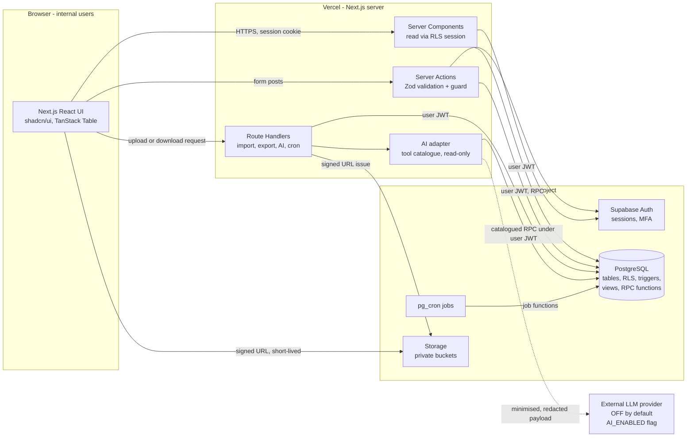
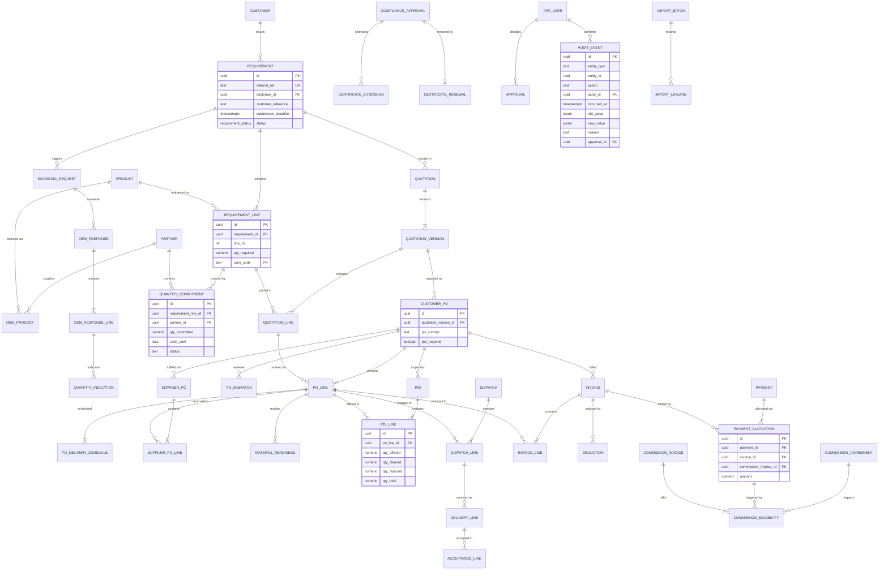
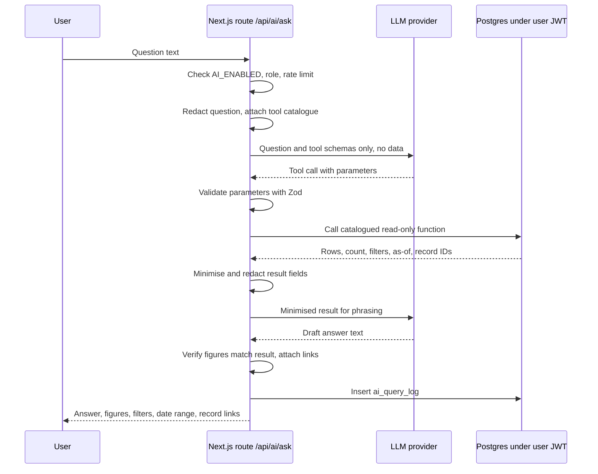

# Technology Stack Document

> **Product (working name):** Requirement Lifecycle Control Hub (RLCH). **[Assumption]** This is the neutral working name from PRD.md §1. It is not a confirmed product name.
>
> **Principle carried from the PRD:** *One requirement, one connected record, one auditable timeline.*

**Statement labels used in this document**

| Label | Meaning |
|---|---|
| **[Confirmed]** | Stated by the business owner in the transcript, or in the requirement brief |
| **[Recommended]** | An architect's recommendation. It is not yet confirmed by the owner. |
| **[Assumption]** | A technical assumption that needs validation (see Section 25) |
| **[Verify at build]** | A version, limit or service feature that must be checked against current vendor documentation before relying on it |

---

## 1. Document Control

| Item | Detail |
|---|---|
| Product working name | Requirement Lifecycle Control Hub (RLCH) **[Assumption]** |
| Document | Technology Stack Document (`TECH-STACK.md`) |
| Version | 0.9 |
| Status | Draft for architecture and security review |
| Date | 30 September 2026 |
| Companion documents | `PRD.md` v0.9 (requirements, source of truth for scope). `IMPLEMENTATION-PLAN.md` (to be written next; it will sequence the work described here). |
| Prepared from | PRD.md (read in full), ram-prasad.pdf, Req Conversation.txt, and the nine workbooks (see §2.2) |
| Audience | Solution architect, full-stack developers, database developer, QA, security reviewer, data-migration lead, business owner (for decisions in §22 and §26) |
| Confidentiality | Confidential – project team only. This document contains **no** real customer, OEM, pricing, contact, bank, tax or credential data. All examples are fictional. |
| Decision owner | Business owner (Ram Prasad or delegate) for hosting, AI-provider and data-residency decisions. The architect owns technical choices within those decisions. |

---

## 2. Purpose and Scope

### 2.1 What this document covers

- The technology used for each layer of the MVP (Phase 1) and the reasons for each choice.
- The architecture: components, request flow, and where validation, authorisation, calculation and audit happen.
- The database design approach: conventions, core tables, integrity rules, and calculation views.
- Security design: authentication, roles, Row Level Security, file storage and audit.
- Excel import architecture for the supplied `.xls` and `.xlsx` workbook formats.
- The design of search, the natural-language (AI) question layer, and scheduled jobs.
- Environments, deployment, secrets, testing, performance targets and a release security checklist.
- Phase 2 hosting options for confidentiality, without any compliance claims.

### 2.2 Sources analysed

| Code | Source | How it was used | Read status |
|---|---|---|---|
| PRD | PRD.md | Primary source. All sections read, including FR IDs, BR-01…30, R-01…18, the data model, status models and NFRs. | Read in full |
| S1 | ram-prasad.pdf | Suggested stack, rules, and "what not to build" | Read in full (text) |
| S2 | Req Conversation.txt | Owner statements on secrecy and offline preference. Facilitator guidance on build order, free deployment and the password-free review link. | Read in full |
| W1–W8 | Enquiry, Quotation, Orders, Sales, Payments, Approvals, OEM and Customer workbooks | Workbook formats (legacy `.xls` vs `.xlsx`), header layouts, year sections, repeating columns and volumes. These drive the import design (§12). | Read. Cell content was taken from the project's asset archive. Structural detail (merges, formulas, hidden sheets) was inspected during PRD analysis and is recorded in PRD §3 and §19–20. |
| W9 | Inverbrass Odoo Order Management sheet (1).xlsx | Integrations list, automation list, roles, document types, KPIs | Read in full |

**Files that could not be read:** none. **Limitation carried from the PRD (L1):** stored formulas in the legacy `.xls` workbooks could not be read, only their cached values. The import design therefore treats all workbook totals and formulas as untrusted (§12).

### 2.3 Source Conflicts

Source precedence for this document: (1) owner statements in S2, (2) S1 requirements and suggested stack, (3) PRD.md, (4) workbook structures, (5) labelled assumptions. Conflicts are recorded here and are **not** resolved silently.

| ID | Topic | Source A | Source B | Handling in this document |
|---|---|---|---|---|
| TS-C1 | **Internet exposure vs hosted stack** | S2 (owner): wants the system "as offline as possible" for secrecy | S1: hosted Next.js on Vercel/Netlify with Supabase/Neon. S2 (facilitator): build online first. | Phase 1 is hosted as S1 suggests, and this is the only way to meet the evaluation-link requirement. The owner's preference drives **portability rules** (§3) and the Phase 2 options (§22). **Production use with real data on public cloud needs an owner decision (Q-T1, Q-T3).** |
| TS-C2 | **Password-free demo link vs authentication** | S2 (facilitator): reviewers need a link with "no password on it" | S1: "auth included". PRD FR-SEC-01: production requires authentication. | **[Recommended]** Authentication stays on everywhere. The demo environment offers **one-click role sign-in buttons** backed by synthetic demo accounts, so reviewers never type a password (§17.4). The demo holds synthetic data only. |
| TS-C3 | **Peer-to-peer as Phase 2** | S2 (facilitator): convert to peer-to-peer later | PRD §22.1: peer-to-peer is not assumed secure or compliant | Treated as one Phase 2 **option needing specialist review** (§22). It is not a committed direction. |
| TS-C4 | **Supabase vs Neon** | S2 (facilitator): Supabase is "the safest option" and Neon is optional | S1: Supabase or Neon | **[Recommended]** Supabase for the MVP, because it bundles Postgres, Auth, Storage and RLS in one free project (§4). Neon stays a documented alternative (Q-T2). |
| TS-C5 | **Automatic customer reminders** | S2 (owner): a reminder letter should reach the customer 15 days before payment is due. The facilitator suggested automatic LD-extension follow-up. | S1: no auto-messaging as a baseline. PRD NG-08: no autonomous external messages in MVP. | MVP produces **internal** tasks and **drafts** only. A human sends external messages. Automated external sending is Phase 2 and needs approval (§15). |
| TS-C6 | **Email / WhatsApp / GeM integrations** | W9: email integration, WhatsApp (optional), GeM support "if feasible" | S1: no portal automation or auto-messaging. PRD §25: Phase 2 or future. | None are in the MVP stack (§23). |
| TS-C7 | **Manufacturing scope** | S2 (owner): "we need" manufacturing and subcontracting management | S1: not an ERP. PRD C-02: fulfilment visibility only. | The stack supports milestone and readiness tables only. There is no MRP engine (§23). |

### 2.4 What this document does not cover

- Detailed UI visual design, copywriting or branding.
- The sequenced build plan, estimates and milestones. These belong in `IMPLEMENTATION-PLAN.md`.
- Legal, regulatory, tax or defence-compliance advice. **No statement in this document certifies compliance with any law, standard or defence requirement.**
- Pricing or plan limits of any vendor. **[Verify at build]** Check each vendor's current terms before relying on a free tier.

---

## 3. Guiding Architecture Principles

| # | Principle | How the stack enforces it |
|---|---|---|
| P1 | **One requirement, one connected record, one auditable timeline** | Every downstream table has a NOT NULL foreign key back up the chain to `requirement` (§8.5). A unified `v_requirement_timeline` view unions status history, audit events, documents and tasks (§9). |
| P2 | **Postgres is the single source of truth** | All business data, balances, statuses, tasks, notifications and audit are stored in Postgres. There is no business state in browser storage, the file system or third-party SaaS. Files live in object storage, but their metadata and links live in Postgres. |
| P3 | **Integrity in the database, not only the UI** | Foreign keys, CHECK constraints, enums, triggers and `SECURITY DEFINER` workflow functions enforce PRD business rules (§10). UI checks give fast feedback only. |
| P4 | **Secure by default** | Authentication is required. Row Level Security is enabled on every table with a default-deny policy. Storage is private. Privileged keys are server-only. Exports and reveals are logged (§11). |
| P5 | **Human approval for material decisions** | Gates are implemented as database state transitions that require an `approval` row with `decision='approved'` by a user holding the `owner` role (§10.6). AI has no write path. |
| P6 | **Grounded AI** | AI can only call a fixed catalogue of read-only, parameterised query functions under the user's session. It never generates SQL. It is off by default (§14). |
| P7 | **Portable: cloud today, private server tomorrow** | Plain SQL migrations. Standard Postgres features only in business logic. Supabase-specific pieces (Auth, Storage, pg_cron) sit behind thin adapters in `lib/platform/*` (§22). |
| P8 | **Synthetic data only in demo** | The demo environment is a separate database project, seeded from a synthetic seed script. A `DEMO_MODE` flag shows a banner and enables one-click role sign-in. Real-data import is disabled in demo (§16). |
| P9 | **Show what is missing, failed or empty** | A standard `<DataState>` component distinguishes *loading*, *empty (no records yet)*, *missing data (records exist but a required field is absent)*, *failed (error with reference ID)* and *forbidden* (§6.3). This is an S1 requirement. |
| P10 | **Calculate, don't type, balances** | Quantity and money balances exist only as SQL views and functions. Screens, reports, exports and AI answers read the same views (§9). |

---
## 4. Stack Summary Table

**Version policy.** No version numbers are fixed in this document. Use the **latest stable release at build time**, pin exact versions in `package.json` and the lockfile, and record them in `IMPLEMENTATION-PLAN.md`. Do not use canary or beta releases.

| Layer | Technology | Version guidance | Reason | Alternatives considered |
|---|---|---|---|---|
| Language | **TypeScript** in `strict` mode (also `noUncheckedIndexedAccess`) | Latest stable at build time | Type safety for a data-heavy domain with many money and quantity fields. Shares types between UI, server and generated DB types. | JavaScript (rejected: no type safety) |
| Runtime | **Node.js LTS** | Active LTS at build time. **[Verify at build]** Check which Node versions the host supports. | Required by Next.js. LTS keeps it stable and portable to a self-hosted server. | Bun, Deno (rejected: less portable for Phase 2 self-hosting) |
| Framework | **Next.js (App Router)** with React Server Components and Server Actions | Latest stable at build time | **[Confirmed]** S1. Server-first rendering keeps secrets and queries on the server. Runs on Vercel and can be self-hosted (`next start` or standalone output) for Phase 2. | Remix, SvelteKit (rejected: S1 names Next.js) |
| UI library and styling | **Tailwind CSS** + **shadcn/ui** (copied-in components built on **Radix UI** primitives) + **lucide-react** icons | Latest stable at build time | Accessible primitives with keyboard and focus handling (NFR-15). Components are owned in the repo, not a runtime dependency. Fast to build. | MUI, Chakra, Mantine (heavier runtime, less control) |
| Data grid (≤500 lines) | **TanStack Table** (headless) + **TanStack Virtual** (row virtualisation) | Latest stable at build time | Handles 500-line requirement and quotation grids with inline edit, keyboard navigation, column pinning and virtual scrolling (FR-RFI-02, NFR-12). Headless, so it matches the design system. | AG Grid Community (capable, but heavier and has licence tiers), MUI DataGrid (paid features) |
| Forms and validation | **React Hook Form** + **Zod** schemas shared by client and server (`lib/schemas/*`) | Latest stable at build time | One schema validates in the browser for fast feedback and again in the Server Action as the security boundary. Zod types flow into forms. | Formik + Yup, Valibot |
| Money and quantity maths in TS | **decimal.js** (or `big.js`) | Latest stable at build time | Avoids floating-point errors in client-side previews. **Authoritative values are still computed in Postgres `numeric`** (§9). | Native `number` (rejected: floating-point rounding) |
| Dates | **date-fns** + **date-fns-tz** (Asia/Kolkata display) | Latest stable at build time | Tree-shakeable. Handles IST display and dd-mm-yyyy format (NFR-26). | Day.js, Luxon |
| Charts | **Recharts** | Latest stable at build time | Simple React charts for dashboard trends and ageing buckets. Lightweight. | Chart.js, ECharts (heavier) |
| Database | **PostgreSQL** hosted on **Supabase** | Postgres major version provided by Supabase at build time. **[Verify at build]** It must support `security_invoker` views (PG15+). | **[Confirmed]** S1. Relational integrity, `numeric` types, views, triggers, RLS, full-text search and `pg_trgm` in one engine. | **Neon** (acceptable per S1, see Q-T2), self-hosted Postgres (Phase 2) |
| Auth | **Supabase Auth** (email + password, with TOTP MFA) via **`@supabase/ssr`** cookie sessions | Latest stable at build time. **[Verify at build]** MFA features. | **[Confirmed]** "auth included". Integrates with RLS through `auth.uid()`. Session cookies are HTTP-only. | Auth.js / NextAuth (needed with Neon), Clerk (external SaaS, less portable) |
| Authorisation | **Postgres Row Level Security** + role table (`app_user_role`) + helper functions `app.has_role()` + field masking views. Server-side permission guard in `lib/auth/guard.ts`. | n/a | Enforced at the database, so a bug in the UI or API cannot leak data (FR-SEC-02). | App-only checks (rejected: violates P3/P4) |
| File storage | **Supabase Storage**, **private buckets only**, with short-lived **signed URLs** issued after a server-side permission check | n/a. **[Verify at build]** Signed-URL expiry options and upload size limits. | Keeps files next to the DB with the same auth model (FR-DOC-01, NFR-07). There is an S3-compatible path for Phase 2 (MinIO or another S3 store). | AWS S3, Cloudflare R2 (extra vendor) |
| Migrations | **Supabase CLI** migrations as **plain `.sql` files** in `supabase/migrations/` | Latest stable at build time | Plain SQL is portable to any Postgres (P7), easy to review, and runs in CI. | Prisma Migrate, Drizzle Kit (add an ORM layer that hides SQL constraints) |
| Data access | **supabase-js** (typed) for CRUD. **Postgres RPC functions** for multi-row workflow transitions. No ORM. | Latest stable at build time | Keeps business rules in SQL functions and triggers, where they are enforced for every client. | Prisma, Drizzle (rejected for MVP. Drizzle is a Phase 2 option if leaving Supabase.) |
| Type generation | **`supabase gen types typescript`** → `lib/db/types.gen.ts`, regenerated in CI and checked for drift | n/a | End-to-end types from the schema. CI fails if the generated file is stale. | Hand-written types (drift risk) |
| Excel parsing (.xls and .xlsx) | **SheetJS Community Edition** (`xlsx`), installed from the **official SheetJS distribution** | Latest stable at build time. **[Verify at build]** The npm registry copy has historically lagged the vendor's distribution. Install from the source SheetJS documents and check its security advisories. | One library reads legacy BIFF `.xls` (W1, W3, W6–W8) and OOXML `.xlsx` (W2, W4, W5, W9). Exposes merged ranges, raw cell types and serial dates. Also writes `.xlsx` for exports (FR-RPT-02). | ExcelJS (no legacy `.xls` read support; rejected as the sole parser), server-side Python (adds a runtime) |
| Search | **Postgres full-text search** (`tsvector`, GIN) + **`pg_trgm`** trigram similarity + a normalised part-number key column | n/a | Meets FR-SEARCH-01 inside the DB, under RLS, with no extra service or data copy (P2, P7). | Meilisearch, Typesense, Algolia (extra service, data duplication, harder to secure) |
| Scheduled jobs | **`pg_cron`** (Supabase extension) calling idempotent SQL job functions. **Fallback:** Vercel Cron → authenticated route handler → same SQL functions. | **[Verify at build]** pg_cron availability on the chosen plan, and Vercel Cron limits on the chosen plan | Jobs are pure SQL (risk flags, reminders, expiry tasks), so they run the same on a private server (P7). | External cron SaaS |
| Background functions | **Next.js Route Handlers** (Node runtime) for imports and AI calls. **Postgres functions** for transactional work. **Supabase Edge Functions** only if a job exceeds host time limits. | **[Verify at build]** Function duration limits on the hosting plan | Keeps one codebase. Large imports are chunked into batches, so each request stays short (§12). | A queue service (Inngest, etc.). Deferred until needed. |
| AI / natural-language layer | **Provider-agnostic adapter** (`lib/ai/provider.ts`) using a chat-completion API with **tool/function calling**. The provider, model and endpoint come from environment variables. **Feature flag `AI_ENABLED` defaults to false.** | Provider SDK latest stable at build time | FR-AI-01…03. The model only chooses among catalogued read-only tools (§14). The adapter allows a self-hosted or in-region model later. | Direct text-to-SQL (rejected: unsafe, violates P6) |
| PDF output (basic quotation) | **@react-pdf/renderer** (server-side) | Latest stable at build time | FR-QUOTE-12 is a Should. Renders an approved version into a stored Document. No headless browser needed. | Puppeteer/Playwright PDF (heavy on serverless) |
| Testing – unit | **Vitest** + **@testing-library/react** | Latest stable at build time | Fast TS unit tests for schemas, parsers and calculation previews | Jest |
| Testing – database | **pgTAP** via `supabase test db` | Latest stable at build time | Tests constraints, triggers, views and **RLS per role** inside Postgres (§19) | App-level integration tests only (insufficient for RLS) |
| Testing – end-to-end | **Playwright** (desktop and mobile viewports) | Latest stable at build time | Full RFI-to-payment lifecycle, role logins, responsive checks | Cypress |
| Accessibility testing | **@axe-core/playwright** | Latest stable at build time | Automated WCAG checks in E2E runs (NFR-15) | Manual audit only |
| Linting and formatting | **ESLint** (Next.js config + `@typescript-eslint`) + **Prettier**. **sqlfluff** (Postgres dialect) for SQL. | Latest stable at build time | Consistent code and SQL style. Catches unsafe patterns. | Biome (a viable alternative) |
| Hosting – web | **Vercel** (Hobby tier for evaluation) | **[Verify at build]** Plan terms, including any commercial-use restrictions on free tiers | **[Confirmed]** S1/S2. Preview deployments per branch. Free public URL for reviewers. | **Netlify** (acceptable per S1), self-hosted Node (Phase 2) |
| Hosting – data | **Supabase** (separate projects for demo and production) | **[Verify at build]** Free-tier project count, pausing and backup terms | **[Confirmed]** S1/S2 | Neon + separate auth and storage |
| Monitoring and logging | Vercel runtime logs + Supabase logs. **Structured JSON logger** (`lib/log.ts`) with PII redaction. `audit_event` and `access_log` tables for business and security events. **Optional:** Sentry error tracking after owner approval (data leaves the stack). | **[Verify at build]** | NFR-19 with no extra vendor by default. Business audit stays in Postgres. | Datadog, New Relic (cost and data egress) |
| Source control and CI/CD | **GitHub** (private repo) + **GitHub Actions** (lint, typecheck, unit, pgTAP, E2E on preview, type-drift check, dependency audit). **Dependabot** for dependency updates. Vercel Git integration for deploys. | n/a | Standard, free for small private repos. **[Verify at build]** Actions minutes. | GitLab CI |

**Deliberately not in the MVP stack** (no PRD requirement needs them yet): an ORM, a separate search engine, a message queue, Redis, an email or WhatsApp provider, a GeM or portal connector, a vector database, or a document OCR service.

---

## 5. Architecture Overview

### 5.1 Component diagram



### 5.2 Request flow – reads

1. The browser requests a page. The Next.js middleware refreshes the Supabase session cookie. Unauthenticated users are sent to `/login`.
2. A Server Component creates a **user-scoped** Supabase client from the session cookie. The anon key plus the user JWT means **RLS applies**.
3. The query selects from base tables or, for balances, from `security_invoker` **views** (§9), so RLS on the underlying tables still applies.
4. The result is passed to a `<DataState>` wrapper, which renders loading, empty, missing-data, failed or forbidden states explicitly (§6.3).
5. File links are never public. The UI requests `/api/files/[id]/url`, the route checks permission, writes `access_log`, and returns a signed URL with a short expiry.

### 5.3 Request flow – writes

1. The user submits a form or grid batch. React Hook Form runs Zod validation on the client for fast feedback.
2. A **Server Action** re-validates with the **same Zod schema** (the security boundary). It then calls `guard(capability)`, which checks the role from `app_user_role` (defence in depth; RLS still decides).
3. Simple CRUD goes through supabase-js under the user JWT. **Workflow transitions** (approve quotation, accept PO mismatch, dispatch, allocate payment, commit import) call a **Postgres RPC function**, which runs as one transaction.
4. Inside Postgres:
   - CHECK constraints and FKs reject invalid data.
   - `BEFORE` triggers enforce gates such as PDI clearance, coverage and status transitions.
   - `AFTER` triggers write `status_history` and `audit_event`.
   - If the audit insert fails, the whole transaction rolls back (FR-AUDIT-01).
5. The action returns a typed result: `{ ok: true, data } | { ok: false, code, message, fieldErrors, ref }`. Database errors raised with a custom SQLSTATE and a rule code (for example `BR-13`) are mapped to user-readable messages that name the failed rule (NFR-20).
6. `revalidatePath` / `revalidateTag` refreshes the affected views.

### 5.4 Where each concern lives

| Concern | Primary location | Secondary / defence in depth |
|---|---|---|
| Input validation | Zod schema in the Server Action | Zod in the browser (UX only). DB CHECK and NOT NULL constraints (final). |
| Authorisation | **Postgres RLS policies** | `guard()` in Server Actions and Route Handlers. UI hides disallowed actions. |
| Business-rule gates (BR-01…30) | **Postgres FKs, triggers and RPC functions** | Server Action pre-checks for friendly messages |
| Calculations and balances | **Postgres views and functions** (§9) | decimal.js previews in the browser (labelled "preview") |
| Status transitions | `app.transition(entity, id, to_status, reason)` RPC checks the allowed-transitions table | UI shows only valid next states |
| Auditing | **Postgres triggers** → `audit_event` (insert-only) | Server writes `access_log` for reads, exports and downloads |
| Approvals | `approval` table + RPC `app.decide_approval()` (owner only) | UI approval inbox |
| Scheduling | `pg_cron` → SQL job functions | Vercel Cron fallback calls the same functions |
| AI grounding | Catalogue of read-only SQL functions (§14) | Output schema validation in the adapter |

---

## 6. Front-End Architecture

### 6.1 Folder and route structure

```text
app/
  (auth)/
    login/                      # email+password, MFA; demo: one-click role buttons (§17.4)
  (app)/
    layout.tsx                  # shell: nav, role badge, DEMO banner, notification bell
    dashboard/                  # D-01..D-20 tiles (PRD 15.21)
    requirements/               # FR-RFI
      page.tsx                  # list + filters
      new/
      [id]/
        page.tsx                # header + timeline
        lines/                  # 500-line virtualised grid, paste/import
        sourcing/               # FR-SOURCE shortlist, requests, responses
        coverage/               # FR-QTY coverage strip per line
        quotations/             # FR-QUOTE versions, pricing, history panel
        documents/
        timeline/
    quotations/[id]/            # version compare, approval, submission, responses (FR-RESP)
    orders/                     # Customer PO (FR-PO)
      [id]/
        review/                 # mismatch table + resolution
        lines/                  # PO line balances strip
        schedule/               # delivery schedule + risk (FR-RISK)
        supplier-pos/           # FR-SPO
        readiness/              # FR-MFG milestones, readiness, subcontract
        pdi/                    # FR-PDI calls and results
        dispatches/             # FR-DISP
        deliveries/             # FR-DEL + acceptance
        invoices/               # FR-INV (read link to finance)
        extensions/             # extension requests + draft letters
    finance/
      invoices/                 # FR-INV
      payments/                 # FR-PAY allocation screen
      deductions/
      ageing/
      commission/               # FR-COMM
    masters/
      customers/                # FR-CUST
      partners/                 # FR-OEM (OEM/supplier/subcontractor/agency/competitor)
      products/                 # FR-PROD
    compliance/                 # FR-DOC certificates, extensions, renewals, expiry
    documents/                  # vault search
    search/                     # FR-SEARCH global + comparable history
    ask/                        # FR-AI natural-language questions (hidden if AI off)
    tasks/                      # FR-TASK my tasks, follow-up tracker
    approvals/                  # approval inbox (owner)
    reports/                    # FR-RPT (PRD 15.25)
    admin/
      users/  roles/  reference-data/  rules/
      imports/                  # FR-IMPORT wizard, batches, errors, reconciliation
      audit/                    # FR-AUDIT-04 viewer
  api/
    files/[id]/url/route.ts     # signed URL issue + access_log
    exports/[report]/route.ts   # xlsx/csv export + access_log
    imports/[batch]/route.ts    # chunked parse/validate/commit
    ai/ask/route.ts             # AI adapter endpoint (flagged)
    cron/[job]/route.ts         # fallback scheduler (secret-protected)
components/
  data-state/                   # <DataState> loading/empty/missing/failed/forbidden
  status/                       # <StatusBadge>, <RiskFlag>, <CoverageBar>, <QtyStrip>
  grid/                         # <LineGrid> TanStack Table + Virtual wrapper
  forms/  approvals/  timeline/  ui/ (shadcn)
lib/
  auth/ (session, guard)  db/ (clients, types.gen.ts)  schemas/ (Zod)
  platform/ (storage, auth, scheduler adapters for portability)
  ai/ (provider, tools, redact)  import/ (parsers, mappers, validators)
  money.ts  qty.ts  dates.ts  log.ts  errors.ts
supabase/
  migrations/  seed/ (synthetic only)  tests/ (pgTAP)
```

### 6.2 Component conventions

- **Server Components by default.** Client Components are used only for interactivity (grids, forms, dialogs). They are named `*.client.tsx`.
- **No direct DB calls from Client Components.** All reads come from Server Components. All writes go through Server Actions or Route Handlers.
- **One Zod schema per form**, in `lib/schemas`, imported by both the form and the action.
- Money is displayed with `formatINR(value, { scale: 'unit' | 'lakh' | 'crore' })`. Storage is always in base units (BR-22).
- Every entity page has the same tabs: *Details · Lines · Documents · Timeline · History (audit)*. This keeps the "one connected record" navigation consistent.
- Every derived number shows its definition in a tooltip (for example "Outstanding = Ordered − Accepted, as of 09:14 IST").

### 6.3 Empty, loading, error and missing-data states

S1 requires the screen to separate what is missing, what failed and what is empty. The `<DataState>` component makes this mandatory for every list, tile and panel.

| State | When | UI treatment | Example text |
|---|---|---|---|
| **Loading** | Query in flight | Skeleton rows matching the layout. No spinners that hide the layout. | — |
| **Empty** | Query succeeded, zero records, **no filter applied** | Neutral illustration and primary action | "No requirements yet. Create the first one or import a workbook." |
| **Filtered-empty** | Zero records **because of filters** | Show the active filters and a "Clear filters" action | "No results for Customer = Alpha Defence Ltd, Status = Won." |
| **Missing data** | Records exist but fields needed for a calculation are absent | Amber badge on the row or tile, with a count and a link to fix | "3 lines have no forecast date, so risk cannot be calculated." |
| **Failed** | Server or DB error | Red panel with a plain-language message, the rule code if any, and a reference ID matching the server log. Retry button. | "Could not save dispatch: BR-13 (quantity not PDI-cleared). Ref 7F2A." |
| **Forbidden** | RLS or guard denied | Lock icon. No data leakage (does not reveal the record exists if not permitted). | "You don't have access to this information." |
| **Partial** | Some panels loaded, one failed | Each panel has its own `<DataState>`. A failure in one panel never blanks the page. | — |

Dashboard tiles also show "Records excluded due to missing data: *n*" (PRD 15.21).

### 6.4 Coverage and status indicators

| Component | Shows | Rules |
|---|---|---|
| `<QtyStrip>` | Required → Quoted → Indicated → **Committed** → Ordered → Ready → Offered → Cleared / Rejected / Held → Dispatched → Invoiced → Delivered → Accepted → Outstanding | Values from views (§9). Indicated is shown as a hatched, secondary style so it is **never** confused with committed (BR-10). |
| `<CoverageBar>` | Firm coverage % and uncovered quantity | Green = fully covered. Amber = covered with an approved override. Red = uncovered gap. Always paired with text such as "Uncovered 200 Nos". |
| `<StatusBadge>` | Controlled status from PRD §21 | Colour **and** text label (NFR-15). Tooltip shows who changed it and when. |
| `<RiskFlag>` | On track / At risk / Late / Unknown forecast | "Unknown forecast" is a distinct grey state, not green |
| `<EvidenceBadge>` | Evidence on file (valid) / Expiring / Expired / No evidence | Wording never says "compliant" or "certified" (BR-27) |
| `<OverrideMarker>` | Record created under an approved override | Links to the approval record |
| `<MigratedBadge>` | Record from an import batch. "Unvalidated" until sign-off. | Links to lineage (workbook, sheet, row) |

### 6.5 Large tables (up to 500 lines)

- `<LineGrid>` uses TanStack Table with **row virtualisation** (TanStack Virtual). Only visible rows plus overscan are rendered.
- **Batch save**: edits are held in a client-side dirty set and saved through one Server Action that calls a single RPC (`app.upsert_requirement_lines(requirement_id, jsonb)`), in one transaction, with row-level error return.
- **Paste from Excel**: clipboard TSV is parsed client-side, validated with the line schema, and the preview shows row errors before save.
- **Server-side pagination** (keyset, `ORDER BY line_no`) is used for lists **across** records, such as requirement lists and search results. Grids **within** one record load all lines (≤500) at once, then virtualise.
- Sticky header and first columns. Keyboard navigation (arrow, Enter, Tab). Column visibility is saved per user.
- The hard limit of 500 is enforced in the DB (§10) with a clear message (FR-RFI-02, pending Q-12).

### 6.6 Responsive and accessibility requirements

- **Desktop first** for data entry. **Tablet and phone** layouts for the dashboard, tasks, approvals, record lookup and search (NFR-16). On narrow screens, grids switch to a stacked card view that shows key columns only.
- **WCAG 2.1 AA** target (NFR-15):
  - Semantic HTML and labelled form controls.
  - Visible focus.
  - Colour contrast checked.
  - Status never shown by colour alone.
  - `aria-live` for save and error messages.
  - Grids operable by keyboard.
- Automated axe checks run in Playwright. Manual keyboard-only pass before release (§21).
- Locale: IST time zone, `dd-mm-yyyy` display, ISO storage, INR with optional lakh/crore display (NFR-26).

---

## 7. Back-End and Server Layer

### 7.1 Server Actions and Route Handlers

| Use | Mechanism | Examples |
|---|---|---|
| Form submits and single-record mutations | **Server Actions** (`'use server'`) | Create requirement, add OEM response, record PDI result |
| Multi-row or workflow transitions | Server Action → **Postgres RPC** (one transaction) | `app.approve_quotation_version`, `app.accept_po_mismatch`, `app.create_dispatch`, `app.allocate_payment`, `app.commit_import_batch` |
| Streaming, file and binary responses | **Route Handlers** (Node runtime) | Signed URLs, Excel/CSV export, import upload and chunk processing, AI question endpoint |
| Scheduled job fallback | Route Handler protected by `CRON_SECRET` header | `/api/cron/[job]` calls `app.job_*()` functions |

All Server Actions follow one wrapper:

```ts
// lib/actions/define-action.ts (illustrative)
export function defineAction<S extends z.ZodTypeAny, R>(opts: {
  schema: S;
  capability: Capability;          // e.g. 'quotation.approve'
  run: (input: z.infer<S>, ctx: Ctx) => Promise<R>;
}) {
  return async (raw: unknown): Promise<ActionResult<R>> => {
    const ctx = await getSessionContext();          // user, roles; throws if unauthenticated
    if (!ctx) return fail('UNAUTHENTICATED');
    const parsed = opts.schema.safeParse(raw);      // server-side validation = security boundary
    if (!parsed.success) return fail('VALIDATION', parsed.error.flatten());
    if (!can(ctx, opts.capability)) return fail('FORBIDDEN');   // defence in depth; RLS decides
    try { return ok(await opts.run(parsed.data, ctx)); }
    catch (e) { return mapDbError(e); }             // BR codes -> readable message + ref id
  };
}
```

### 7.2 Input validation

- **Zod** schemas mirror DB constraints:
  - quantities `> 0` with ≤ 3 decimals
  - rates with ≤ 4 decimals
  - amounts with ≤ 2 decimals
  - required UoM and currency from the reference lists
  - part numbers treated as strings, never numbers
  - date ordering (for example deadline ≥ enquiry date)
- Unknown keys are rejected (`.strict()`).
- String length limits on all free text.
- **Credential guard**: FR-CUST-04 requires that no password-like values are stored. The schemas for portal references have no password field, and a heuristic rejects values that look like credentials in free-text fields on those forms.
- File uploads are validated **server-side** for MIME type (sniffed, not just the extension), size, and allow-listed type before a storage upload URL is issued.

### 7.3 Permission checks

- **Layer 1 – RLS** (authoritative): every table has `ENABLE ROW LEVEL SECURITY` and policies per role (§11.3).
- **Layer 2 – `guard(capability)`** in every Server Action and Route Handler, using a capability map derived from PRD §12 (for example `quotation.approve → owner`).
- **Layer 3 – UI**: hides actions the user cannot perform. This is cosmetic only.
- Approval RPCs check `app.has_role('owner')` **inside** the function, and also check that the approver is not the preparer where required (FR-QUOTE-06).

### 7.4 Safe use of privileged keys

| Key | Where it may be used | Where it must never appear |
|---|---|---|
| Supabase **anon/publishable** key | Browser and server (it is public by design; RLS protects data) | — |
| Supabase **service-role/secret** key | **Only** in: (a) the import commit worker after the Admin role check, for bulk lineage writes that bypass per-row RLS; (b) seed scripts in local/demo; (c) the demo one-click sign-in action (§17.4). Every use is wrapped in `lib/db/admin-client.ts`, which is marked `import 'server-only'` and logs its caller. | Client bundles, `NEXT_PUBLIC_*` variables, logs, error messages, the repo |
| Field-encryption key (`FIELD_ENCRYPTION_KEY`) | Server-only encryption and decryption of bank and tax fields (§11.5) | Browser, DB, logs |
| AI provider key | Server-only AI adapter | Browser, logs, prompts |

**Build-time guard:** a CI step fails if any server-only env var name appears in the client bundle output, or if a file importing `admin-client` lacks `server-only`.

---
## 8. Database Design

### 8.1 Naming and key conventions

| Item | Convention |
|---|---|
| Schemas | `public` holds business tables exposed through the API with RLS. `app` holds helper functions, RPCs and job functions. `audit` holds `audit_event` and `access_log`. `staging` holds import staging tables. `ref` holds reference lists. |
| Tables | `snake_case`, singular (`requirement`, `requirement_line`, `po_line`) |
| Primary key | `id uuid primary key default gen_random_uuid()` on every table |
| Human-readable references | Separate unique columns, generated by `app.next_ref(kind, fy)` from a `ref_sequence` table with row locking, so there are no gaps or races (FR-RFI-03). Examples: `internal_ref` = `RQ/26-27/0001`, `internal_quote_no` = `QT/26-27/0001`. Customer and OEM references (`customer_reference`, `po_number`, `oem_quote_no`) are stored as `text` and never used as keys. |
| Foreign keys | `<entity>_id`, always with an explicit `ON DELETE RESTRICT` (business records are never cascade-deleted) |
| Indexes | Every FK is indexed. Composite indexes for dashboard filters (§20). |
| Enums | Postgres `enum` types for **closed** lists that also drive logic (statuses). Reference **tables** (`ref.*`) for owner-editable lists (UoM, tax type, approval authority, loss reason, document type, source channel). |

### 8.2 Audit columns and soft delete

Every business table includes:

```sql
created_at  timestamptz not null default now(),
created_by  uuid        not null default auth.uid() references app_user(id),
updated_at  timestamptz not null default now(),
updated_by  uuid        references app_user(id),
row_version integer     not null default 1,         -- optimistic locking
tenant_org_id uuid      not null references organisation(id),  -- PRD C-03 multi-entity
import_batch_id uuid    references import_batch(id), -- lineage (nullable)
deleted_at  timestamptz,                             -- soft delete
deleted_reason text,
constraint soft_delete_reason check (deleted_at is null or deleted_reason is not null)
```

- A shared `BEFORE UPDATE` trigger sets `updated_at` and `updated_by`, increments `row_version`, and rejects stale versions.
- **Soft delete only** for business records. RLS policies add `deleted_at is null` for normal reads. Hard delete is reserved for the retention job, under an Admin/Owner-approved policy (Q-T6).
- **Immutable after approval:** approved `quotation_version`, `approval`, `audit_event`, `status_history` and `import_lineage` rows cannot be updated or deleted (trigger + RLS).

### 8.3 Money, quantity, currency and unit of measure

| Concept | Type | Rule |
|---|---|---|
| Quantity | `numeric(18,3)` | CHECK `>= 0` (`> 0` where the PRD requires). Always paired with `uom_code`. |
| Unit rate / price | `numeric(18,4)` | CHECK `>= 0` |
| Line and document amounts | `numeric(18,2)` | Computed from unrounded values, rounded half-up (PRD §17). Stored where the business document states them, such as an invoice line. Otherwise derived. |
| Percentages | `numeric(7,4)` | CHECK `between 0 and 100` |
| Currency | `char(3)` FK → `ref.currency` (ISO 4217) | Required on every priced header. The base currency is INR **[Assumption A-01]**. |
| FX | `fx_rate numeric(18,8)`, `fx_rate_date date` | Required when the currency ≠ INR |
| UoM | `uom_code` FK → `ref.uom` | Required on every line. Linked lines must share a UoM or have a row in `ref.uom_conversion` (BR-21). |
| Tax | `tax_line` rows (type, rate, amount) | Never a hard-coded 18% (BR-23) |
| Scale | Always base units | Lakh and crore are **display only** (BR-22) |

**Never use `float`, `real` or `double precision`** for money or quantity. The TypeScript side reads `numeric` as strings and converts with decimal.js.

### 8.4 Status enums and status history

- One enum per lifecycle entity, with values exactly as in PRD §21. Examples:
  - `requirement_status`: `received, qualifying, in_preparation, quoted, submitted, won, partially_won, lost, not_pursued, cancelled, closed`
  - `quotation_version_status`: `draft, pending_approval, approved, rejected, submitted, superseded, discarded, closed`
  - `pdi_status`, `dispatch_status`, `invoice_status`, `commission_status`, `import_batch_status`, and so on.
- `ref.status_transition(entity, from_status, to_status, requires_approval_type)` lists the **allowed transitions**.
- Status changes go only through `app.transition(entity text, id uuid, to_status text, reason text)`, which:
  1. Checks that the transition is allowed.
  2. Checks the approval if required.
  3. Updates the row.
  4. Inserts into `status_history(entity, entity_id, from_status, to_status, actor, at, reason, approval_id)`.
- A trigger blocks direct `UPDATE … SET status` that bypasses `app.transition` (it checks a transaction-local setting that only `app.transition` sets).
- Derived statuses (for example invoice *Partially paid* / *Paid*) are **computed** in views, not typed (FR-INV-03).

### 8.5 Foreign keys that enforce PRD business rules

| PRD rule | Enforcement |
|---|---|
| BR-01 Every quotation originates from a requirement | `quotation.requirement_id uuid not null references requirement(id)`. `quotation_line.requirement_line_id not null`, plus a trigger that checks the line belongs to the same requirement. |
| BR-02 Every customer PO maps to an approved quotation version | `customer_po.quotation_version_id uuid not null references quotation_version(id)`. `BEFORE INSERT` trigger: the version status must be `approved`, `submitted` or `closed` **and** have an `approval` row with `decision = 'approved'`. `po_line.quotation_line_id not null`, with the same version check. |
| BR-05/06 Many invoices per PO; invoice ↔ fulfilment many-to-many | `invoice.customer_po_id not null`. `invoice_line.po_line_id not null` (must belong to the same PO). `invoice_fulfilment_link(invoice_line_id, dispatch_line_id, qty)`. |
| Payments link to invoices through allocations | `payment` has **no** `invoice_id` column. `payment_allocation(payment_id not null, invoice_id, commission_invoice_id, amount)` with CHECK `(invoice_id is not null) <> (commission_invoice_id is not null)` (exactly one target). |
| BR-25 Commission needs a triggering event | `commission_eligibility.agreement_id not null`, `base_invoice_id not null`, `trigger_allocation_id not null references payment_allocation(id)` |
| Traceability chain (PRD 18.4) | NOT NULL FKs: `supplier_po_line.po_line_id`, `pdi_line.po_line_id`, `dispatch_line.po_line_id`, `delivery_line.dispatch_line_id`, `acceptance_line.delivery_line_id`, `material_readiness.po_line_id` |
| Migrated orphans (FR-IMPORT-03) | They link to a per-tenant placeholder `requirement` with `is_legacy_placeholder = true` and a `data_quality_flag`. The FKs are still satisfied, and the orphan is visible in an exceptions report. |
| BR-20 Certificates keep history | `certificate_extension(approval_id, seq, extended_until)` and `certificate_renewal(predecessor_id, successor_id)` are **insert-only** |

### 8.6 Core tables, grouped and mapped to the PRD data model

| Group | Tables | PRD §18.2 entity |
|---|---|---|
| Identity and access | `organisation`, `app_user` (1:1 with `auth.users`), `app_role`, `app_user_role`, `capability`, `role_capability`, `user_record_scope` (assigned-accounts mode) | Organisation, User, Role, Permission |
| Reference | `ref.uom`, `ref.uom_conversion`, `ref.currency`, `ref.tax_type`, `ref.approval_authority`, `ref.loss_reason`, `ref.document_type`, `ref.source_channel`, `ref.status_transition`, `ref_sequence`, `app_setting` (thresholds, reminder offsets) | LossReason, ApprovalAuthority, reference data |
| Customer master | `customer`, `customer_division` (self-ref `parent_division_id`), `customer_location`, `address`, `customer_contact`, `tax_registration` (encrypted value + masked last-4), `portal_reference` (**no credential columns**), `vendor_registration`, `payment_term_template` | Customer, CustomerDivision, CustomerLocation, Address, CustomerContact, TaxRegistration, PortalReference / VendorRegistration |
| Partner master | `partner`, `partner_type_link`, `partner_location`, `partner_contact`, `partner_bank_account` (encrypted), `vendor_code`, `partner_capability`, `commission_agreement` (versioned) | Partner (OEM / Supplier / Subcontractor / Agency / Competitor), OEMLocation, OEMContact, PartnerBankAccount, VendorCode, CommissionAgreement |
| Product | `product`, `part_number` (`part_no_raw text`, `part_no_norm text generated`), `product_price`, `oem_product` (`is_exclusive_representation`, `approved_source_flag`, `evidence_document_id`), `product_approval_requirement` | Product, PartNumber, ProductPrice, OEMProduct, ProductApprovalRequirement |
| Compliance | `compliance_approval`, `compliance_approval_product`, `certificate_extension`, `certificate_renewal` | ComplianceApproval, CertificateExtension, CertificateRenewal |
| Requirement | `requirement`, `requirement_line`, `clarification`, `checklist_template`, `checklist_item` | Requirement, RequirementLine, Clarification, Checklist |
| Sourcing and coverage | `sourcing_shortlist`, `sourcing_request`, `sourcing_request_line`, `oem_response`, `oem_response_line`, `quantity_indication`, `quantity_commitment` (versioned; `status` Active/Changed/Withdrawn/Expired/Consumed), `oem_selection`, `coverage_override` | SourcingRequest(Line), OEMResponse(Line), QuantityIndication, QuantityCommitment |
| Quotation | `quotation`, `quotation_version`, `quotation_line`, `tax_line` (polymorphic parent), `customer_response`, `negotiation_event`, `line_outcome`, `competitor` (view over `partner`) | Quotation, QuotationVersion, QuotationLine, CustomerResponse, LineOutcome |
| Customer PO | `customer_po`, `po_line`, `po_delivery_schedule`, `po_mismatch`, `po_amendment`, `po_amendment_change` | CustomerPO, POLine, PODeliverySchedule, POMismatch, POAmendment |
| Supplier and fulfilment | `supplier_po`, `supplier_po_line`, `purchase_item`, `subcontract_work_package`, `fulfilment_milestone`, `material_readiness`, `serial_number` | SupplierPO(Line), PurchaseItem, SubcontractWorkPackage, FulfilmentMilestone, MaterialReadiness, SerialNumber |
| PDI and logistics | `pdi`, `pdi_line`, `dispatch_override`, `dispatch`, `dispatch_line`, `delivery`, `delivery_line`, `acceptance`, `acceptance_line`, `extension_request` | PDI(Line), Dispatch(Line), Delivery(Line), Acceptance, ExtensionRequest |
| Finance | `invoice`, `invoice_line`, `invoice_fulfilment_link`, `payment`, `payment_allocation`, `deduction`, `commission_eligibility`, `commission_invoice` | Invoice(Line), InvoiceFulfilmentLink, Payment, PaymentAllocation, Deduction, CommissionEligibility, CommissionInvoice |
| Documents | `document`, `document_version`, `document_link` (polymorphic `entity_type`, `entity_id`) | Document, DocumentLink |
| Work management | `task`, `task_rule`, `notification`, `approval` (polymorphic subject + `snapshot jsonb`) | Task, Notification, Approval |
| History and audit | `status_history`, `audit.audit_event`, `audit.access_log`, `ai_query_log` | StatusHistory, AuditEvent, AIQueryLog |
| Import | `import_batch`, `import_file`, `staging.raw_row`, `staging.mapped_row`, `import_error`, `import_lineage`, `import_mapping_template` | ImportBatch, ImportError, ImportLineage |

**Polymorphic links** (`document_link`, `task`, `approval`, `status_history`, `audit_event`) use `(entity_type text, entity_id uuid)`. Their integrity is enforced by a trigger that checks the target exists in the table named by a CHECK-constrained `entity_type` list.

### 8.7 Core ER diagram



---

## 9. Calculations and Reporting Views

**Rule:** quantity and financial balances are calculated **in the database**. Screens, reports, Excel exports, dashboard tiles and AI answers all read the **same views**, so every surface shows the same numbers (P10, FR-INV-03). No balance column is stored or typed.

**View conventions:**
- Every view is created `WITH (security_invoker = true)` **[Verify at build: PG15+]**, so the RLS of the querying user applies to the underlying tables.
- Views exclude soft-deleted rows.
- Heavy dashboard aggregates can later become materialised views refreshed by `pg_cron` if needed (§20). The MVP starts with plain views.

The SQL below is **illustrative** and shows the intended logic. Final DDL belongs in migrations with pgTAP tests. Formulas follow PRD §17.

### 9.1 Requirement line quantity coverage — `v_requirement_line_coverage`

```sql
create view v_requirement_line_coverage with (security_invoker = true) as
with q as (   -- quoted qty on the current approved/submitted version
  select ql.requirement_line_id, ql.qty_quoted
  from quotation_line ql
  join quotation_version qv on qv.id = ql.quotation_version_id
  join quotation qt on qt.id = qv.quotation_id and qt.current_version_id = qv.id
  where qv.status in ('approved','submitted')
),
ind as (      -- availability indications (informational only, BR-10)
  select requirement_line_id, sum(qty_available_indicated) as qty_indicated
  from quantity_indication
  where deleted_at is null and (valid_until is null or valid_until >= current_date)
  group by requirement_line_id
),
com as (      -- firm, active, in-validity commitments only
  select requirement_line_id, sum(qty_committed) as qty_committed
  from quantity_commitment
  where status = 'active' and deleted_at is null
    and (valid_until is null or valid_until >= current_date)
  group by requirement_line_id
)
select rl.id                         as requirement_line_id,
       rl.requirement_id,
       rl.uom_code,
       rl.qty_required,
       coalesce(q.qty_quoted, 0)     as qty_quoted,
       coalesce(ind.qty_indicated,0) as qty_indicated,
       coalesce(com.qty_committed,0) as qty_committed,
       greatest(0, coalesce(q.qty_quoted, rl.qty_required) - coalesce(com.qty_committed,0)) as qty_uncovered,
       exists (select 1 from coverage_override co
               where co.requirement_line_id = rl.id and co.status = 'approved') as has_approved_override
from requirement_line rl
left join q   on q.requirement_line_id   = rl.id
left join ind on ind.requirement_line_id = rl.id
left join com on com.requirement_line_id = rl.id
where rl.deleted_at is null;
```

Before a quote exists, the coverage basis is `qty_required`. After a quote exists, it is `qty_quoted` (R-04). A post-PO variant (`v_po_line_coverage`) uses `qty_ordered`. Global cross-order capacity is **not** computed (BR-11, Q-T4).

### 9.2 PO line balances — `v_po_line_balance`

```sql
create view v_po_line_balance with (security_invoker = true) as
select pl.id as po_line_id, pl.customer_po_id, pl.uom_code,
       pl.qty_ordered_effective                                   as qty_ordered,  -- after approved amendments
       coalesce(r.qty_ready,0)      as qty_ready,
       coalesce(p.qty_offered,0)    as qty_pdi_offered,
       coalesce(p.qty_cleared,0)    as qty_pdi_cleared,
       coalesce(p.qty_rejected,0)   as qty_pdi_rejected,
       coalesce(p.qty_held,0)       as qty_pdi_held,
       coalesce(d.qty_dispatched,0) as qty_dispatched,
       coalesce(i.qty_invoiced,0)   as qty_invoiced,
       coalesce(dl.qty_delivered,0) as qty_delivered,
       coalesce(a.qty_accepted,0)   as qty_accepted,
       pl.qty_ordered_effective - coalesce(a.qty_accepted,0)                     as qty_outstanding,     -- R-11
       case when po.pdi_required
            then coalesce(p.qty_cleared,0) + coalesce(o.qty_override,0) - coalesce(d.qty_dispatched,0)
            else pl.qty_ordered_effective - coalesce(d.qty_dispatched,0) end      as qty_dispatchable,    -- R-07
       least(pl.qty_ordered_effective,
             case when po.pdi_required then coalesce(p.qty_cleared,0) + coalesce(o.qty_override,0)
                  else pl.qty_ordered_effective end) - coalesce(i.qty_invoiced,0) as qty_invoiceable,     -- R-06
       pl.line_net_ordered - coalesce(i.net_invoiced,0)                          as value_outstanding_net -- R-12
from po_line pl
join customer_po po on po.id = pl.customer_po_id
left join lateral (select sum(qty_ready) qty_ready from material_readiness where po_line_id = pl.id and deleted_at is null) r on true
left join lateral (select sum(qty_offered) qty_offered, sum(qty_cleared) qty_cleared,
                          sum(qty_rejected) qty_rejected, sum(qty_held) qty_held
                   from pdi_line where po_line_id = pl.id and deleted_at is null) p on true
left join lateral (select sum(qty) qty_override from dispatch_override
                   where po_line_id = pl.id and status = 'approved') o on true
left join lateral (select sum(qty) qty_dispatched from dispatch_line dl2
                   join dispatch dd on dd.id = dl2.dispatch_id and dd.status <> 'cancelled'
                   where dl2.po_line_id = pl.id) d on true
left join lateral (select sum(qty) qty_invoiced, sum(line_net) net_invoiced from invoice_line il
                   join invoice iv on iv.id = il.invoice_id and iv.status <> 'cancelled'
                   where il.po_line_id = pl.id) i on true
left join lateral (select sum(del.qty_delivered) qty_delivered from delivery_line del
                   join dispatch_line x on x.id = del.dispatch_line_id where x.po_line_id = pl.id) dl on true
left join lateral (select sum(al.qty_accepted) qty_accepted from acceptance_line al
                   join delivery_line del on del.id = al.delivery_line_id
                   join dispatch_line x on x.id = del.dispatch_line_id where x.po_line_id = pl.id) a on true
where pl.deleted_at is null;
```

### 9.3 PDI summary — `v_pdi_summary`

Per PDI and per PO line: `qty_offered, qty_cleared, qty_rejected, qty_held`, plus the flag `is_consistent = (qty_cleared + qty_rejected + qty_held = qty_offered)`. The flag should always be true because of the CHECK in §10. It also exposes `first_pass_cleared_pct` (first PDI only, M-09) and `open_hold_qty`. The source is `pdi_line` joined to `pdi`, with `parent_pdi_id is null` for first-pass metrics.

### 9.4 Invoice balance — `v_invoice_balance`

```sql
create view v_invoice_balance with (security_invoker = true) as
select iv.id as invoice_id, iv.issuer_id, iv.billed_to_customer_id, iv.customer_po_id, iv.currency,
       iv.gross_total,
       coalesce(pa.paid,0)                                                   as amount_received,
       coalesce(dd.gst_tds,0)  as ded_gst_tds,  coalesce(dd.it_tds,0) as ded_tds,
       coalesce(dd.ld,0)       as ded_ld,       coalesce(dd.tax_on_ld,0) as ded_tax_on_ld,
       coalesce(dd.other,0)    as ded_other,
       coalesce(dd.counted,0)                                                as deductions_counted,   -- Recorded + Accepted
       coalesce(dd.disputed,0)                                               as deductions_disputed,
       iv.gross_total - coalesce(pa.paid,0) - coalesce(dd.counted,0)         as open_balance,         -- R-14
       case when iv.gross_total - coalesce(pa.paid,0) - coalesce(dd.counted,0) <= app.setting_num('value_tolerance')
            then 'paid'
            when coalesce(pa.paid,0) > 0 then 'partially_paid'
            else 'unpaid' end                                                as derived_payment_state
from invoice iv
left join lateral (select sum(amount) paid from payment_allocation
                   where invoice_id = iv.id and reversed_at is null) pa on true
left join lateral (select
      sum(amount) filter (where deduction_type='gst_tds' and status in ('recorded','accepted')) gst_tds,
      sum(amount) filter (where deduction_type='tds'     and status in ('recorded','accepted')) it_tds,
      sum(amount) filter (where deduction_type='ld'      and status in ('recorded','accepted')) ld,
      sum(amount) filter (where deduction_type='tax_on_ld' and status in ('recorded','accepted')) tax_on_ld,
      sum(amount) filter (where deduction_type='other'   and status in ('recorded','accepted')) other,
      sum(amount) filter (where status in ('recorded','accepted')) counted,
      sum(amount) filter (where status = 'disputed') disputed
    from deduction where invoice_id = iv.id and deleted_at is null) dd on true
where iv.deleted_at is null and iv.status <> 'cancelled';
```

Deduction amounts are **as advised by the customer**. There are no hard-coded TDS or LD rates (PRD A-06, DQ-12).

### 9.5 Payment ageing — `v_payment_ageing`

It joins `v_invoice_balance` with `invoice.invoice_date` and `due_date` and computes, as of `current_date` in IST:
- `age_days_from_invoice`
- `days_past_due`
- `bucket` from `app_setting.ageing_buckets` (default 0–30, 31–60, 61–90, >90) **[Assumption]**
- `no_due_date` flag

It filters to `open_balance > tolerance`. The keyed "TODAY" column from the workbook is never used (FR-PAY-04).

### 9.6 Delivery risk — `v_delivery_risk`

Per `po_delivery_schedule` row:
- `original_committed_date`
- `effective_committed_date` = latest **granted** extension, else original (R-16)
- `internally_promised_date`
- `forecast_completion_date` = greatest of the open milestone forecasts, supplier-PO expected dates and the tentative PDI date for that line
- `buffer_days = effective_committed_date − forecast_completion_date`
- `risk_status`:
  - `late` when today > effective date and outstanding > 0
  - `at_risk` when buffer < `app_setting.risk_threshold_days` (default 15, **[Assumption]**)
  - `unknown_forecast` when there is no forecast
  - `on_track` otherwise
- `risk_reasons text[]` (for example `milestone_overdue`, `commitment_withdrawn`, `pdi_held`)

The optional indicative LD figure (FR-RISK-03, Could) is computed **only** from LD terms entered on the PO and is labelled "indicative – not a legal determination".

### 9.7 Certificate expiry including renewals — `v_certificate_effective_validity`

```sql
create view v_certificate_effective_validity with (security_invoker = true) as
with recursive chain as (   -- walk renewal chain to the latest successor
  select ca.id as root_id, ca.id as current_id, 0 as depth
  from compliance_approval ca
  where not exists (select 1 from certificate_renewal r where r.successor_id = ca.id)
  union all
  select c.root_id, r.successor_id, c.depth + 1
  from chain c join certificate_renewal r on r.predecessor_id = c.current_id
)
select c.root_id, c.current_id as latest_approval_id, ca.authority_id, ca.holder_partner_id,
       ca.valid_until as base_valid_until,
       greatest(ca.valid_until, coalesce(max(ce.extended_until), ca.valid_until)) as effective_valid_until,
       ca.apply_for_renewal_by,
       case when greatest(ca.valid_until, coalesce(max(ce.extended_until), ca.valid_until)) < current_date then 'expired'
            when greatest(ca.valid_until, coalesce(max(ce.extended_until), ca.valid_until)) < current_date + 90 then 'expiring'
            else 'valid' end as evidence_status      -- wording: evidence on file, not "compliant"
from chain c
join compliance_approval ca on ca.id = c.current_id
left join certificate_extension ce on ce.approval_id = ca.id
where c.depth = (select max(depth) from chain c2 where c2.root_id = c.root_id)
group by c.root_id, c.current_id, ca.id;
```

A companion view, `v_document_expiry`, covers other documents that carry an `expiry_date`.

### 9.8 Dashboard KPIs — `v_dashboard_kpis`

There is one row per tile code (D-01…D-20, PRD 15.21). Columns: `tile_code, count_value, amount_value (INR), qty_by_uom jsonb, excluded_missing_count, as_of timestamptz`. Each tile is a `UNION ALL` branch reading the views above (for example D-08 from `v_requirement_line_coverage where qty_uncovered > 0 and not has_approved_override`, and D-15 from `v_payment_ageing where days_past_due > 0`). Drill-down lists use the **same predicates**, exposed as `v_tile_<code>` views, so tile count = list count (FR-DASH-01).

### 9.9 Bid history for quote comparison — `v_bid_history`

There is one row per historical `quotation_line`, with:
- `part_no_norm` (all cross-referenced part numbers via `part_number`), `product_id`, `customer_id`, `division_id`
- `requirement internal_ref`, `version_no`, `version_reason` (initial / revised / PNC), `version date`
- `oem partner_id`, `oem_cost_unit`, `proposed_unit_price`
- `margin_pct` — **exposed only through `v_bid_history_with_margin`, which has an RLS-equivalent role check for Owner/Sales** (PRD §12)
- `lead_time_days`, `line outcome`, `loss_reason`, `competitor`, `winning_price`
- `po_unit_rate` (via `po_line`)
- `delivery slip days` (from `v_delivery_risk` history), `pdi_rejected_qty`
- `is_migrated`, `is_validated`

It is indexed on `part_no_norm` and trigram description. It powers FR-QUOTE-04 and FR-SEARCH-02.

### 9.10 Other shared views

| View | Purpose |
|---|---|
| `v_requirement_timeline` | Union of status_history, audit_event (material only), documents, tasks, approvals, customer responses. The "one auditable timeline". |
| `v_commission_receivable` | Eligible-not-invoiced + outstanding commission invoices (D-17) |
| `v_oem_performance` | M-06, M-09, M-19 inputs, with sample sizes |
| `v_metric_*` | One view per PRD metric M-01…M-19, with the definition in `COMMENT ON VIEW` |

---

## 10. Database Integrity Rules

Rules are enforced by constraints and triggers. Trigger errors use `RAISE EXCEPTION USING ERRCODE = 'P0001', MESSAGE = 'BR-13: …', HINT = '<rule id>'` so the server can map them to readable messages (§5.3).

### 10.1 No negative quantities or amounts

```sql
alter table pdi_line add constraint pdi_qty_nonneg check (
  qty_offered >= 0 and qty_cleared >= 0 and qty_rejected >= 0 and qty_held >= 0);
alter table pdi_line add constraint pdi_qty_balance check (
  qty_cleared + qty_rejected + qty_held = qty_offered);                       -- BR-12, R-07
alter table requirement_line add constraint rl_qty_pos check (qty_required > 0);
alter table payment add constraint pay_amt_pos check (amount > 0);
alter table payment_allocation add constraint alloc_amt_pos check (amount > 0);
alter table deduction add constraint ded_amt_nonneg check (amount >= 0);
alter table acceptance_line add constraint acc_balance check (
  qty_accepted >= 0 and qty_rejected >= 0 and qty_pending >= 0);
```

The same pattern (`>= 0`, `> 0` where required) applies to every `numeric` quantity, rate and amount column. Credit notes are separate documents with their own sign convention (Phase 2).

### 10.2 Cross-row balance guards

`BEFORE INSERT/UPDATE` triggers read `v_po_line_balance` (with `FOR UPDATE` on the parent `po_line` to serialise concurrent writes) and block:

| Trigger | Blocks | PRD |
|---|---|---|
| `trg_invoice_line_qty` | invoice qty > `qty_invoiceable`, unless an approved over-invoicing override exists | R-06, FR-PDI-05 |
| `trg_delivery_line_qty` | delivered > dispatched on the dispatch line | R-09 |
| `trg_acceptance_line_qty` | accepted + rejected + pending ≠ delivered | R-10 |
| `trg_alloc_amount` | Σ allocations of a payment > payment amount. Allocation > invoice open balance. | R-14, FR-PAY-02 |
| `trg_readiness_qty` | cumulative ready > ordered, unless an override exists | FR-MFG-02 |
| `trg_pdi_offer_qty` | offered > ready − already offered | FR-PDI-01 |
| `trg_req_line_limit` | more than 500 lines per requirement (the limit is read from `app_setting` so it can change after Q-12) | FR-RFI-02 |
| `trg_uom_match` | linked line UoM differs and no `ref.uom_conversion` row exists | BR-21 |

### 10.3 Dispatch blocked when required PDI is not cleared

```sql
create function app.trg_dispatch_line_pdi_gate() returns trigger language plpgsql as $$
declare v record;
begin
  select b.qty_dispatchable, po.pdi_required
    into v
    from v_po_line_balance b
    join customer_po po on po.id = b.customer_po_id
   where b.po_line_id = new.po_line_id
   for update of po;            -- lock parent to serialise concurrent dispatches
  if v.pdi_required and new.qty > v.qty_dispatchable then
    raise exception using errcode = 'P0001',
      message = format('BR-13: dispatch qty %s exceeds PDI-cleared available %s', new.qty, v.qty_dispatchable),
      hint = 'Request a dispatch override (owner approval required).';
  end if;
  return new;
end $$;
create trigger dispatch_line_pdi_gate before insert or update on dispatch_line
  for each row execute function app.trg_dispatch_line_pdi_gate();
```

An approved override is a `dispatch_override(po_line_id, qty, approval_id not null, status)` row. Only `app.decide_approval()` (owner) can set its `status = 'approved'`. The override qty is added to the dispatchable qty in `v_po_line_balance` (§9.2), and every dispatch line created under it carries `override_id` for downstream flags (FR-PDI-03).

### 10.4 Customer commitment exceeds firm OEM commitment

| Point | Behaviour |
|---|---|
| Line edit / sourcing screen | **Warning**: `v_requirement_line_coverage.qty_uncovered > 0` is shown in red (FR-QTY-04) |
| `app.transition('quotation_version', …, 'pending_approval')` | **Block** if any line has `qty_uncovered > 0` and no approved `coverage_override`. Error `BR-10/FR-QTY-04` lists the lines. |
| `app.approve_quotation_version()` | Re-checks coverage inside the transaction (in case a commitment was withdrawn in between) |
| `customer_po` acceptance (`→ accepted`) | Re-checks `v_po_line_coverage`. Blocks if uncovered with no override. |
| Commitment withdrawal after approval or PO | `AFTER UPDATE` trigger on `quantity_commitment` creates a `task` and a `notification` for the line owner and the Owner (FR-QTY-06) |

### 10.5 PO price or quantity mismatch creates an approval item

```sql
-- after insert/update on po_line: compare with the approved quotation line
create function app.trg_po_line_mismatch() returns trigger language plpgsql as $$
declare ql record;
begin
  select qty_quoted, proposed_unit_price, uom_code into ql
    from quotation_line where id = new.quotation_line_id;
  delete from po_mismatch where po_line_id = new.id and resolution is null;   -- recompute open items
  if new.unit_rate <> ql.proposed_unit_price then
    insert into po_mismatch(po_line_id, field, quoted_value, po_value, severity)
    values (new.id, 'unit_rate', ql.proposed_unit_price::text, new.unit_rate::text, 'high');   -- R-05/R-18
  end if;
  if new.qty_ordered <> ql.qty_quoted then
    insert into po_mismatch(po_line_id, field, quoted_value, po_value, severity)
    values (new.id, 'qty', ql.qty_quoted::text, new.qty_ordered::text,
            case when new.qty_ordered > ql.qty_quoted then 'high' else 'medium' end);        -- R-02
  end if;
  if new.uom_code <> ql.uom_code then
    insert into po_mismatch(po_line_id, field, quoted_value, po_value, severity)
    values (new.id, 'uom', ql.uom_code, new.uom_code, 'high');
  end if;
  return new;
end $$;
```

- Header-level comparisons (payment terms, delivery terms, documents required) are made by a similar trigger on `customer_po`.
- Every inserted `po_mismatch` with `severity <> 'info'` also inserts an `approval(subject_type='po_mismatch', status='requested')` item into the Owner's inbox.
- A partial award recorded in `line_outcome` downgrades a lower-quantity variance to `info`, per FR-PO-02.
- `app.transition('customer_po', id, 'acknowledged')` **blocks** while any `po_mismatch` has `resolution is null`, or has `resolution = 'accepted'` without an approved `approval_id` (BR-16).

### 10.6 Approval gates (human decisions)

`app.decide_approval(approval_id, decision, comment)`:
- is `SECURITY DEFINER`
- checks `app.has_role('owner')`
- blocks self-approval where configured
- writes a `snapshot jsonb` of the subject at decision time
- the `approval` row then becomes immutable

Gated subjects are: quotation version (final price and quotation), OEM selection, coverage override, PO mismatch acceptance, dispatch override, compliance evidence acceptance, extension letter or external correspondence, commission issuance, write-off / short-close / merge, and import sign-off. **No code path, including AI, can insert an `approval` with `decision='approved'` except this function.**

### 10.7 Certificate renewals as new rows

- `certificate_extension` and `certificate_renewal` are **insert-only**. `BEFORE UPDATE OR DELETE` triggers raise `BR-20`.
- `compliance_approval.valid_until`, `certificate_no` and `certificate_date` are immutable once set. Corrections are made through a new row plus a `supersedes_id` link and an audit reason.
- Chronology CHECKs:
  - extension `extended_until` > the previous effective validity
  - renewal date ≥ predecessor `certificate_date` (R-17)

### 10.8 Other integrity rules

| Rule | Mechanism |
|---|---|
| Approved/submitted quotation versions are immutable (BR-19) | `BEFORE UPDATE` trigger on `quotation_version` and `quotation_line` when the parent status is not `draft` |
| Original committed date is never overwritten (BR-24) | `po_delivery_schedule.original_committed_date` is immutable. The effective date comes from granted `extension_request`. |
| One active commission agreement per scope and date | Exclusion constraint on `(partner_id, scope_key, daterange(valid_from, valid_to))` using `btree_gist` **[Verify at build]** |
| Exclusive OEM representation (BR-26) | Partial unique index on `oem_product(product_id) where is_exclusive_representation and relationship_type='represented' and deleted_at is null`. A second link needs owner approval, which sets `exclusivity_override_approval_id`. |
| No credentials stored (NG-12) | No such columns exist. A CHECK on `portal_reference.notes` rejects common credential patterns (defence in depth). |
| Audit completeness (FR-AUDIT-01) | A generic `AFTER INSERT/UPDATE/DELETE` trigger on every business table writes `audit.audit_event` with `to_jsonb(old)` and `to_jsonb(new)`, minus encrypted fields. A failure aborts the transaction. |

---
## 11. Authentication, Authorization, and Audit

### 11.1 Authentication

- **Supabase Auth**, with email + password and **TOTP MFA** required for the Owner, Finance and Admin roles (recommended for everyone, PRD NFR-02). **[Verify at build]** Check the MFA enforcement options.
- **Invite-only**: public self-sign-up is **disabled** in production. The Admin invites users, and the Owner approves role grants.
- Sessions use HTTP-only, Secure, SameSite=Lax cookies via `@supabase/ssr`. Middleware refreshes them.
- Idle timeout is 30 minutes **[Assumption]**. Account lockout and rate limits use Supabase Auth settings. **[Verify at build]**
- **Production must never be password-free.** The one-click role sign-in exists only when `DEMO_MODE=true` (§17.4).

### 11.2 Roles and role-to-module access matrix

Roles: `owner` (Owner/Management), `sales`, `operations`, `finance`, `admin`. A user can hold several roles. The table is derived from PRD §12.

Legend: C create · R read · U update · A approve · X export · — none.

| Module / capability | Owner | Sales | Operations | Finance | Admin |
|---|---|---|---|---|---|
| Customer master | CRUA | CRU | R | R (+U tax/terms) | CRU |
| Partner (OEM/supplier/subcontractor) master | CRUA | CRU | CRU | R (+U bank/commission) | CRU |
| Partner bank details (encrypted) | R (reveal logged) | — | — | CRU (reveal logged) | — |
| Product / part master | CRUA | CRU | CRU | R | CRU |
| Requirements and lines | CRUA | CRU | R | R | R |
| Sourcing, responses, commitments | CRUA | CRU | CRU | R | R |
| Coverage override / OEM selection | **A** | request | request | — | — |
| Quotations (margin visible) | CRUA | CRU | R (no margin) | R | R |
| Final quotation / bid price approval | **A** | — | — | — | — |
| Customer response, loss reasons | CRU | CRU | R | R | R |
| Customer PO, mismatch review | CRUA | CRU | R | R (+request) | R |
| PO mismatch acceptance | **A** | request | request | request | — |
| Supplier PO | CRUA | R | CRU | R | R |
| Readiness, milestones, subcontract | R | R | CRU | R | R |
| PDI and inspection | R | R | CRU | R | R |
| Dispatch override | **A** | — | request | — | — |
| Dispatch, delivery, acceptance | R | R | CRU | R | R |
| Extension requests and letter drafts | **A** (send) | R | CRU | R | R |
| Invoices, payments, deductions | R | R | R | CRU | R |
| Commission | CRUA | R | — | CRU | R |
| Documents / compliance vault | CRUA | CRU (own records) | CRU | CRU (finance docs) | R |
| Compliance evidence acceptance | **A** | — | request | — | — |
| Dashboard | R (all) | R (own/assigned) | R (ops) | R (finance) | R |
| Natural-language questions | R | R (permitted data) | R (permitted data) | R (permitted data) | R |
| Reports / export | RX | R, X own | R, X ops | RX finance | RX |
| Audit log viewer | R | — | — | — | R |
| Users, roles, reference data, rules | A | — | — | — | CRU |
| Imports / migration | A (sign-off) | — | — | — | CRU |

### 11.3 Row Level Security approach

- **Every table in exposed schemas has RLS enabled.** Default deny: there are no policies granting `anon`. The CI check `select … from pg_tables where rowsecurity = false` must return zero rows for `public`, `audit`, `staging` and `ref`.
- Helper functions (`STABLE`, `SECURITY DEFINER`, fixed `search_path`):
  - `app.current_user_id()`
  - `app.has_role(role text)`
  - `app.has_any_role(text[])`
  - `app.in_tenant(org uuid)`
  - `app.can_see_account(customer_id uuid)` (assigned-accounts mode, W9 "View assigned accounts")
- Policy pattern (illustrative):

```sql
alter table quotation_line enable row level security;

create policy ql_select on quotation_line for select
  using (app.in_tenant(tenant_org_id)
         and deleted_at is null
         and app.has_any_role(array['owner','sales','operations','finance','admin'])
         and app.can_see_account((select q.customer_id from quotation q
                                  join quotation_version v on v.quotation_id = q.id
                                  where v.id = quotation_line.quotation_version_id)));

create policy ql_write on quotation_line for insert
  with check (app.has_any_role(array['owner','sales']));
create policy ql_update on quotation_line for update
  using (app.has_any_role(array['owner','sales']))
  with check (app.has_any_role(array['owner','sales']));
-- No delete policy: soft delete via update only.
```

- **Field-level masking.** Margin and cost columns are **not** selected by base-table grants for the `operations` role. Operations reads `v_quotation_line_ops` (without margin or cost). The column-level `GRANT` excludes the restricted columns. Bank and tax values are stored encrypted (§11.5), so even a leaked row shows ciphertext.
- **Restricted records**: rows with `is_restricted = true` are visible only to `owner` and users listed in `record_access_grant`.
- Workflow RPCs are `SECURITY DEFINER` but always check the role and tenant first and set `search_path = ''`.
- pgTAP tests run every policy as each role (§19).

### 11.4 Private file storage with short-lived signed URLs

| Control | Design |
|---|---|
| Buckets | `documents`, `imports` and `exports`. All **private**. No public buckets exist (NFR-07). |
| Object path | `/{tenant_org_id}/{document_id}/{version}/{sha256}.{ext}`. There are no customer names in paths. |
| Upload | A Server Action validates type, size and role → creates a `document` row with `scan_status='pending'` → issues a **signed upload URL** → the client uploads → the server verifies the checksum and sniffs the MIME type. |
| Malware scanning | **MVP [Recommended]:** allow-list of types (PDF, PNG, JPG, XLSX, XLS, DOCX, CSV), size limit (default 25 MB **[Assumption]**, PRD NFR-07 allows up to 50 MB), macro-enabled formats **rejected** (`.xlsm`, `.docm`), no in-browser rendering of Office files, and the PDF preview is sandboxed. **Deviation:** PRD FR-DOC-01 requires a malware scan. The free hosted stack has no built-in scanner, so files stay `scan_status='unscanned'` with a visible warning until a scanner is added. A ClamAV worker on a private server is planned for Phase 2 (Q-T8). |
| Download | `/api/files/[id]/url` → RLS check on `document_link` → write `access_log` → signed URL with a **short expiry** (default 60 s **[Assumption]**) and `Content-Disposition: attachment` |
| Deletion | Soft delete in the DB. Storage objects are purged by the retention job (§15) only. |

### 11.5 Encryption of restricted fields

- Bank account numbers, IFSC/SWIFT codes, and full GSTIN/PAN values are encrypted **in the application** with AES-256-GCM using `FIELD_ENCRYPTION_KEY` (server-only). The DB stores the ciphertext plus a masked copy (last 4 characters) for display.
- Reveal: a Server Action checks the role (Finance or Owner), decrypts, returns the value for display only, and writes `access_log(action='reveal')`.
- Key rotation: a `key_version` column is stored with each value, and a rotation script re-encrypts.
- **[Recommended]** The application-level approach is portable to self-hosting. Supabase-specific column encryption features are **not** relied on. **[Verify at build]** Check their current status if they are reconsidered.
- Database-at-rest and backup encryption are provided by the host. **[Verify at build]** Confirm for the chosen plan and region.

### 11.6 Insert-only audit event table

```sql
create table audit.audit_event (
  id           bigint generated always as identity primary key,
  occurred_at  timestamptz not null default now(),
  actor_id     uuid,                       -- null only for system jobs (actor_kind='system')
  actor_kind   text not null check (actor_kind in ('user','system','import')),
  tenant_org_id uuid not null,
  entity_type  text not null,
  entity_id    uuid not null,
  action       text not null,              -- insert|update|delete|status_change|approve|override|export|...
  old_value    jsonb,
  new_value    jsonb,
  reason       text,
  approval_id  uuid,
  request_id   text,                       -- correlates with server logs
  prev_hash    bytea,                      -- optional hash chain (FR-AUDIT-01 "Should")
  row_hash     bytea
);
revoke update, delete, truncate on audit.audit_event from public, authenticated, anon, service_role;
create trigger audit_event_immutable before update or delete on audit.audit_event
  for each row execute function app.raise_immutable();
```

- It is written by a generic trigger on every business table (§10.8), and by RPCs for approvals and overrides.
- **Reason is required** for overrides, approvals, status corrections, soft deletes and mismatch acceptance. The RPC signature makes `reason` NOT NULL.
- The Owner and Admin read it through `v_audit_event` (RLS). There is no update or delete path for any role.
- **[Should]** The hash chain (`row_hash = sha256(prev_hash || canonical row)`) is computed in the insert trigger to give tamper evidence.

### 11.7 Logging of exports, downloads, approvals and overrides

| Event | Table | Fields |
|---|---|---|
| Report or list export | `audit.access_log` | user, time, report code, filters (jsonb), row count, format |
| File download or preview URL issue | `audit.access_log` | user, document_id, version, purpose |
| Reveal of a masked field | `audit.access_log` | user, entity, field |
| Login, failed login, MFA challenge | Supabase Auth logs + `audit.access_log` (on successful session start) | user, IP (truncated), user agent |
| Permission denied (guard or RLS error) | `audit.access_log` | user, capability, entity |
| Approval decision | `approval` (immutable) + `audit_event(action='approve')` | subject, decision, snapshot, reason |
| Override (coverage, dispatch, over-invoice, short-close) | Override row + `audit_event(action='override')` | qty or amount, reason, approval_id |
| AI question | `ai_query_log` | user, question, tool calls and parameters, returned record IDs, flagged sensitive categories. **No answer text by default.** |
| Bulk export above the threshold | `approval` item required first | threshold in `app_setting` |

Export files are **watermarked** in a header row or footer with the user and timestamp **[Should]** (FR-SEC-03).

---

## 12. Excel Import and Migration Architecture

### 12.1 Supported workbook templates

Templates are based on the supplied files and saved in `import_mapping_template`. Admins can clone and edit them.

| Template code | Source (format) | Target entities | Layout handling |
|---|---|---|---|
| `ENQ_MASTER` | W1 "MASTER ENQ QTNS" (**.xls**) | requirement, requirement_line, quotation (legacy), part_number | Title rows above the header. FY label rows. Two duplicated "Status dt" columns. |
| `ENQ_MASTER_POS` | W1 "Master POs" (**.xls**) | customer_po, po_line | FY sections. Continuation rows with blank headers. Text in date column ("IMM"). PO number mixed with text. Line value in lakhs. |
| `QTN_LIST` | W2 "26-27" (**.xlsx**) | quotation, quotation_version (1st rate, 2nd rate, PNC), quotation_line | OEM taken from the title cell. Rate stages become versions. |
| `ORDER_BOOK` | W3 customer-specific sheet (**.xls**) | customer_po, po_line, po_delivery_schedule, invoice (unpivoted slots) | Seven FY sections with typo labels. Repeating invoice/supply column groups. Header cells with line breaks. |
| `SALES_REG` | W4 "26-27" (**.xlsx**) | invoice, invoice_line (de-duplicated) | Customer in the header cell. Totals rows. Crore conversion row. |
| `PAYMENT_MASTER` | W5 (**.xlsx**) | payment, payment_allocation, deduction | FY sections. Merged header with two unnamed sub-columns (quarantined). Two payment slots. |
| `APPROVALS` | W6 (**.xls**) | compliance_approval, certificate_extension, certificate_renewal | Extension slots 1–2 become child rows. The renewal block becomes a successor record. |
| `OEM_MASTER` | W7 (**.xls**) | partner, partner_location, partner_contact, vendor_code | Repeated OEM names become one partner with several locations. The renewal block is quarantined (Q-27). |
| `CUSTOMER_MASTER` | W8 (**.xls**) | customer, customer_location, customer_contact | The renewal block is quarantined |
| `LINES_GENERIC` | Any `.xlsx` / `.xls` / `.csv` | requirement_line (paste or import into one requirement) | The simple header row is mapped by the user |

W9 is a design specification and is **not** imported as data.

### 12.2 Pipeline

```mermaid
flowchart LR
    U[Upload file<br/>Admin only] --> S[Store in private imports bucket<br/>hash, size, type check]
    S --> P[Parse with SheetJS<br/>server route handler]
    P --> H[Detect header row<br/>and section rows]
    H --> M[Apply mapping template<br/>header synonyms]
    M --> R[staging.raw_row and staging.mapped_row<br/>workbook, sheet, row number]
    R --> V[Validate and match<br/>dates, numbers, UoM, currency,<br/>duplicates, master data]
    V --> PV[Preview and error report<br/>row level]
    PV --> RC[Reconciliation totals<br/>source vs computed]
    RC --> C{Commit batch}
    C -->|approved by Admin| T[Insert target rows<br/>in chunks, one transaction per chunk,<br/>with import_lineage]
    T --> SO{Owner sign-off}
    SO -->|signed off| F[Batch final<br/>records marked validated]
    SO -->|rejected| RB[Rollback batch]
    C -->|cancel| X[Discard staging]
```



### 12.3 Parsing and header detection

- **SheetJS** reads with `cellDates: false` (serials kept raw), `cellNF: true`, `raw: true` and `sheetStubs: true`. Merged ranges come from `ws['!merges']`, and hidden flags from the workbook properties.
- **Formulas are not evaluated or trusted.** Only cached values are read. Formula presence is recorded in lineage (`had_formula = true`) when available (not for legacy `.xls`, PRD L1).
- **Header detection:** score each of the first 15 rows by matches against the template's header synonyms (for example `"Loaction" → location`, `"QTY (Mtrs)" → qty + uom=m`). The best-scoring row is the header. The user confirms it in the preview.
- **Section rows** (for example "26-27" or "MASTER ORDER BOOKING LIST- 24-25") match a pattern. They set `context_fy` and are skipped with an Info log entry.
- **Duplicate headers** are mapped by position (for example "Status dt" #1 and #2, "INV NO" #1 and #2).
- **Repeating groups** (W3 invoice/supply slots, W5 payment slots) are **unpivoted** into child rows.
- **Continuation rows** (blank header columns under a filled row) are proposed to inherit the parent's header values. **The user must confirm this.** It is never automatic (DQ-18).

### 12.4 Staging tables

```sql
create table staging.raw_row (
  id bigint generated always as identity primary key,
  import_batch_id uuid not null references import_batch(id),
  source_workbook text not null,      -- file name as uploaded
  source_sheet    text not null,
  source_row      integer not null,   -- 1-based Excel row number
  context_fy      text,
  cells           jsonb not null,     -- {colLetter: {v, t, w}} raw value, type, formatted text
  is_section_row  boolean not null default false,
  is_sample_row   boolean not null default false   -- placeholder detection (DQ-04, DQ-16)
);
create table staging.mapped_row (
  raw_row_id bigint primary key references staging.raw_row(id),
  target_entity text not null,
  payload jsonb not null,             -- normalised field values
  match_results jsonb,                -- customer/partner/product match candidates + scores
  validation_status text not null check (validation_status in ('ok','warning','blocking'))
);
create table import_error (
  id bigint generated always as identity primary key,
  import_batch_id uuid not null, raw_row_id bigint, field text,
  severity text not null check (severity in ('blocking','warning','info')),
  rule_code text not null, message text not null, raw_value text
);
create table import_lineage (       -- immutable, one per created target record
  id bigint generated always as identity primary key,
  import_batch_id uuid not null, entity_type text not null, entity_id uuid not null,
  source_workbook text not null, source_sheet text not null, source_row integer not null,
  imported_at timestamptz not null default now(), imported_by uuid not null,
  validation_result text not null
);
```

### 12.5 Validation rules

| Check | Rule | Example error |
|---|---|---|
| Excel serial dates | Convert using the workbook's date system (1900 vs 1904 flag), then check the range (for example 2015–2035) | `DATE_OUT_OF_RANGE` |
| Text in date columns | Parse only against explicit patterns (`dd-mm-yy`, `dd.mm.yyyy`). Values like "IMM", "Imm" or "Nil" → raw value kept, field null, Warning plus a task. **Never guessed.** | `DATE_TEXT_UNPARSED` |
| Numbers | Strip thousands separators. Reject non-numeric values. Declared **scale factor** per column (lakh ×100,000, crore ×10,000,000). | `NUMBER_INVALID` |
| Part numbers | Read as **text**. A numeric cell with scientific notation or more than 15 digits is flagged for verification. `part_no_norm` = uppercase, no spaces or hyphens. | `PARTNO_NUMERIC_PRECISION` |
| Currency | Required. Taken from the template default or column. Must exist in `ref.currency`. | `CURRENCY_MISSING` |
| UoM | Required. Taken from the header token (`Mtrs` → m, `No.`/`Nos` → nos) or the batch default declared by the importer. No silent default. | `UOM_MISSING` / `UOM_CONFLICT` |
| Required fields | Per target entity (PRD §19 Req column) | `REQUIRED_MISSING` |
| Master-data matching | Exact → normalised → trigram similarity above threshold. A **proposed** match needs user confirmation. Unmatched values create a *proposed* master that needs Admin confirmation. | `MATCH_AMBIGUOUS` |
| Combined values | For example "ORG-DIV" is split only with a confirmed rule | `SPLIT_UNCONFIRMED` |
| Duplicates | Keys per PRD §20.4. Invoice = issuer + number across W3/W4/W5. PO = customer + number. | `DUPLICATE_IN_BATCH` / `DUPLICATE_EXISTING` |
| Placeholders | Values in `app_setting.placeholder_values` (for example single letters, "P1", "H1", "OEM A") → row flagged *sample*. **Blocked** from commit in production. | `SAMPLE_ROW` |
| Credentials | Any cell resembling a password or login in master imports → Blocking | `CREDENTIAL_DETECTED` |

### 12.6 Untrusted source content

- **Formulas, typed totals and balances** (for example LINE TV, QTN TV, QTY BAL, VALUE BAL, Pmnt Bal, Final Bal, TOT DED, DAYS, the "TODAY" column, and the crore/lakh rows) are **never imported as facts**. They are stored in `mapped_row.payload.recorded_values` and compared with the system-computed values in the reconciliation report (PRD DQ-11, DQ-12).
- **Remarks** are imported to `notes` as plain text. They never set a status, amount or date. A guided extraction queue lets a user promote a remark into structured fields (loss reason, competitor, payment status) with an audit reason.
- Uploaded content is **data only**. It is never passed to the AI layer as instructions (§14.7).

### 12.7 Preview, reconciliation, commit and rollback

1. **Preview** (Admin): parsed, skipped (with reason), warning and blocking counts, a sample of mapped rows, and the list of proposed new masters.
2. **Reconciliation report** (downloadable, access-logged):
   - row counts
   - Σ quantity by UoM
   - Σ net and gross by FY, customer and issuer
   - source-recorded totals vs system-computed totals, with differences and reasons
3. **Commit** (`app.commit_import_batch(batch_id)`):
   - processes rows in **chunks** (default 500 rows per chunk **[Assumption]**), one transaction per chunk
   - every created row gets `import_batch_id` plus an `import_lineage` row
   - business triggers still run, and imported rows are marked `is_migrated = true`
   - gates that need approvals (for example BR-02) are satisfied only through **legacy placeholders** flagged for review, never by fabricated approvals
4. **Rollback** (`app.rollback_import_batch(batch_id)`): soft-deletes all rows with that `import_batch_id`, in reverse dependency order. It is **blocked** if non-import records now reference them, and returns the list of blockers.
5. **Owner sign-off** (`approval` subject `import_batch`) moves the batch to *Signed off* and records `is_validated = true` (PRD §20.7). Until then, history views show the *Unvalidated* badge.
6. Imports of real data run **only in production or a secured staging environment**. The **demo** environment disables real imports: `DEMO_MODE` accepts only the bundled synthetic sample files (§16).

---

## 13. Search Architecture

| Aspect | Design |
|---|---|
| Engine | Postgres full-text search + `pg_trgm`, inside the same DB and under RLS (FR-SEARCH-01, P2) |
| Search document | A `search_document` table maintained by triggers. Columns: `entity_type, entity_id, tenant_org_id, title, ref_codes text[], part_nos_norm text[], body tsvector, customer_id, partner_id, status, event_date`. One row per requirement, requirement line, quotation, PO, invoice, partner, customer, product and document. |
| Text config | `simple` dictionary. The content is codes and names, so stemming is not helpful for part numbers. `unaccent` if available **[Verify at build]**. |
| Indexes | GIN on `body`. GIN trigram on `title`. GIN on `ref_codes` and `part_nos_norm`. B-tree on `(tenant_org_id, entity_type, event_date)`. |
| Part numbers | The normalised key (uppercase, no spaces, hyphens, dots or slashes) is matched **exactly** first, then by prefix, then by trigram similarity. So "4769247702 73" finds "4769 247 702 73" (FR-SEARCH-01 acceptance). |
| References | Tender/enquiry refs, internal refs, PO and invoice numbers are matched in `ref_codes` with exact and prefix matching |
| Ranking | Exact code match > prefix > `ts_rank` > trigram similarity. Recent records get a small boost. |
| API | `app.search(q text, filters jsonb, limit int, cursor text)` is a `SECURITY INVOKER` function, so RLS filters the results. Results are grouped by entity type. |
| Comparable history | `v_bid_history` filtered by `part_no_norm` or product, plus trigram description similarity with a displayed confidence ("exact", "cross-reference", "possible"). Rows are labelled *Migrated* or *Unvalidated* where relevant (FR-QUOTE-04). |
| Zero results | Suggest the nearest trigram matches: "Did you mean…" |
| Scale | The expected volume (hundreds of requirements a year, up to 500 lines each) is well within Postgres FTS capability. Performance targets are in §20. |

---

## 14. Natural-Language Question (AI) Architecture

### 14.1 Design summary

- **Tool calling over a fixed catalogue.** The model receives the user's question plus a list of tool definitions. It can only choose a tool and fill its **typed parameters**. It never writes SQL.
- **Read-only.** Every tool maps to a `SECURITY INVOKER`, `STABLE` SQL function over the views in §9. Tools have no insert, update or delete path. The DB role used by the adapter has only `SELECT` and `EXECUTE` on those functions.
- **The user's session.** Tools execute with the **user-scoped** Supabase client (user JWT), so RLS and field masking apply exactly as on screen. The service-role key is **never** used for AI.
- **Grounded answers.** The final answer is assembled by **server code** from tool results using a template. The model may only rephrase or summarise the **returned** rows. Numbers in the answer are checked against the tool result before display.
- **Off by default.** `AI_ENABLED=false` in every environment until the owner approves an external model provider (Q-T3). With AI off, the `/ask` page offers the same catalogue as a **structured query picker** (dropdown + filters), so FR-AI-01 value is still delivered without an LLM.

### 14.2 Flow



### 14.3 Tool catalogue (MVP)

These map to the PRD 15.22 questions.

| Tool | Parameters (validated) | Source view | Returns |
|---|---|---|---|
| `count_open_orders` | `status?[]`, `customer_id?` | `v_tile_d05` | count by status + PO IDs |
| `list_wins` | `from`, `to` (default: current calendar month, IST) | `v_metric_m03` | count, value, quotation IDs |
| `list_losses` | `from`, `to`, `customer_id?` | line outcomes | list + IDs |
| `loss_reasons_breakdown` | `from`, `to` | `v_metric_m04` | reason → count and value, competitor where recorded, **count with no reason** |
| `orders_at_delivery_risk` | `risk_status?[]` | `v_delivery_risk` | rows + reasons + IDs |
| `pending_oem_responses` | `overdue_only?` | `v_tile_d07` | rows + IDs |
| `overdue_payments` | `min_days?` | `v_payment_ageing` | rows, buckets, total + IDs |
| `expiring_approvals` | `within_days` (default 90) | `v_certificate_effective_validity` | rows + IDs |
| `pending_quotations` | — | `v_tile_d02` | rows + IDs |
| `coverage_gaps` | `requirement_id?` | `v_requirement_line_coverage` | lines + uncovered qty + IDs |

Adding a tool requires a code change, review and pgTAP tests. Tools cannot be added at runtime.

### 14.4 Answer contract

Every answer shows:
1. **Result** (figure or list)
2. **Definition used**, for example "Won = outcome Won or Partially won. Decision date 1–30 Sep 2026 (IST)."
3. **Filters and date range**
4. **Record count and as-of time**
5. **Links** to each record
6. **Data gaps**, for example "2 losses have no recorded reason." (FR-AI-01, BR-18)

**Insufficient data:** if the question does not map to a tool, the tool returns zero rows, or required fields are missing, the answer says so plainly. For example: "I can't answer that from the stored data" or "No wins are recorded between 1 and 30 Sep 2026." **It never guesses.**

**Permission:** if the question needs data the user cannot see (for example margin for Operations), the tool returns a permission marker and the answer says: "That information isn't available to your role."

### 14.5 Data minimisation and redaction

- **The first model call** sends the question text and tool schemas only. No database data is sent.
- **The second call** (optional phrasing) sends only the minimised result fields needed to phrase the answer: counts, statuses, reason codes, dates, and **internal reference codes instead of customer or OEM names** where possible.
- Never sent: contact details, tax IDs, bank data, document contents, prices or margins. Price and margin values are held server-side and inserted into the templated answer after the model returns.
- Redaction (`lib/ai/redact.ts`) removes emails, phone numbers, GSTIN/PAN patterns and long digit strings from the question before sending.
- **[Recommended]** The answer can be assembled **without** the second call (template only). This is the default configuration, so the model never sees result data. Enabling phrasing is a separate flag, `AI_PHRASING_ENABLED` (default false).

### 14.6 Provider configuration

- Configured through the environment: `AI_PROVIDER`, `AI_MODEL`, `AI_API_BASE_URL`, `AI_API_KEY` (server-only), `AI_REGION_NOTE` (documentation only).
- The adapter uses a generic chat-completions + tools interface, so it can point to a hosted provider, an in-region endpoint, or a **self-hosted model** on the owner's server in Phase 2.
- **Provider selection is an owner decision** (Q-T3). It needs confirmation of data-use terms (no training on customer data), region and retention. **No provider is assumed approved.**
- Timeouts, a per-user rate limit, and a monthly request cap are set in `app_setting`.

### 14.7 Prompt-injection protection

- The model never receives uploaded document text in the MVP. Document drafting (FR-AI-02) is **Phase 2**.
- The system prompt is fixed in code. User text is placed in a delimited user message and **never** concatenated into system instructions.
- The tool allow-list is fixed. Unknown tool names are rejected.
- Parameters are validated with Zod: IDs must be UUIDs the user can read, and date ranges are bounded.
- The output is validated. Any figure in the model's text that does not appear in the tool result causes the server to fall back to the template-only answer.
- When document text is introduced in Phase 2, it must be passed as quoted data with a "treat as data" wrapper, stripped of active content, length-capped, and processed only by read-only tools.

### 14.8 Feature flags

| Flag | Default | Owner of change |
|---|---|---|
| `AI_ENABLED` | `false` (all environments) | Owner approval recorded as an `approval` item before switching to true in production |
| `AI_PHRASING_ENABLED` | `false` | Owner |
| `AI_DEMO_ENABLED` | `false`. May be set `true` in **demo only**, because demo data is synthetic. | Architect |

---

## 15. Notifications and Scheduled Jobs

**MVP rule:** notifications are **in-app only**, stored in the `notification` table and shown in the bell and task list. **There are no automatic external messages** (NG-08, BR-28). Email and WhatsApp are **Phase 2** and need owner approval (TS-C5, TS-C6). Letters and reminders to customers and OEMs are produced as **drafts** for a human to send.

All jobs are **idempotent SQL functions** `app.job_<name>()`, run by `pg_cron`. They de-duplicate using `task(rule_id, entity_id, due_date)` uniqueness, and write a `job_run` row (start, end, rows affected, error) for monitoring.

| Job | Schedule (IST) **[Assumption]** | Logic | Output | PRD |
|---|---|---|---|---|
| `quotation_deadlines` | Daily 07:00 | Requirements not submitted with a deadline in {7, 3, 1} days (config), plus deadline passed | Task + notification to the assignee. Owner escalation when passed. | FR-RFI-08 |
| `quotation_validity` | Daily 07:00 | Submitted quotes with no outcome whose validity ends within N days | Task | FR-QUOTE-09 |
| `customer_no_response` | Daily 07:05 | Submitted ≥ 7 days (config) with no `customer_response` | Follow-up task | FR-RESP-02 |
| `oem_response_followup` | Daily 07:10 | Sourcing requests past `response_due_date` (Overdue) and past escalation days | Task. Owner escalation. | FR-SOURCE-04 |
| `commitment_expiry` | Daily 07:10 | Active commitments past `valid_until` → status `expired`. Coverage recalculated by the views. | Notification to the line owner | FR-QTY-02 |
| `delivery_risk_refresh` | Daily 06:30 + after relevant writes (trigger enqueues) | Evaluates `v_delivery_risk`. New `at_risk` or `late` rows. | Task + Owner notification. The dashboard reads the view live. | FR-RISK-01 |
| `milestone_overdue` | Daily 06:45 | Milestones with expected date < today and no actual date | Task to the milestone owner | FR-MFG-01 |
| `pdi_pending_blocked` | Daily 07:15 | PDI in Called/Scheduled past the proposed date. PDI lines with open held or rejected qty. | Task to Operations | FR-PDI-01/04 |
| `acceptance_pending` | Daily 07:20 | Delivered lines with pending acceptance ≥ 7 days (config) | Task | FR-DEL-02 |
| `payment_due` | Daily 07:30 | Open invoices due in 15 days (config) → task with document-checklist status. Due today → task. | Task + notification to Finance | FR-PAY-05 |
| `payment_overdue` | Daily 07:30 | Past due by the escalation thresholds. Disputed invoices are paused. | Escalation to the Owner | FR-PAY-05 |
| `commission_due` | Daily 07:35 | Commission invoices past the due date | Task to Finance | FR-COMM-03 |
| `certificate_expiry` | Daily 06:00 | `v_certificate_effective_validity` and `v_document_expiry` at 90/60/30 days (config), plus the apply-for-renewal date passed | Task to the Operations owner. Dashboard D-18. | FR-DOC-03 |
| `registration_expiry` | Weekly Mon 06:00 | Vendor or portal registrations expiring | Task | FR-CUST-04 |
| `demo_reset` | Daily 02:00 (**demo only**) | Truncate and re-seed synthetic data | — | §16 |
| `retention_purge` | Monthly (disabled until Q-T6 is answered) | Hard-delete eligible soft-deleted rows and storage objects per policy | `audit_event` of the purge summary | NFR-22 |

**Fallback:** if `pg_cron` is unavailable on the chosen plan, a Vercel Cron job calls `/api/cron/[job]` with `CRON_SECRET`, which runs the same SQL function. **[Verify at build]** Check the cron frequency limits on the hosting plan.

---

## 16. Environments

| Environment | Purpose | Hosting | Data rules | Access |
|---|---|---|---|---|
| **Local** | Development and tests | `supabase start` (local Docker Postgres, Auth and Storage) + `next dev` | **Synthetic seed only.** Real workbooks are never copied to developer machines. Masked extracts only with owner approval. | Developer |
| **CI** | Automated tests | GitHub Actions with an ephemeral local Supabase | Synthetic fixtures, including deliberately bad workbooks built from scratch that mimic the real layouts | CI runner |
| **Preview** | Per-branch review | Vercel preview deployments → shared **demo** Supabase project (or a per-PR branch DB if the plan supports it **[Verify at build]**) | **Synthetic only** | Team (Vercel preview protection **[Verify at build]**) |
| **Demo / Evaluation** | Public review link for evaluators (S2) | Vercel production deployment of a **separate Vercel project** + **separate Supabase project** | **Synthetic data only**, with fictional names such as "Alpha Defence Ltd", "Orion Components Pvt Ltd" and "Part DX-1001". Nightly reset. Real imports disabled. Uploads limited and cleared nightly. `AI_DEMO_ENABLED` may be true. | Public URL with **one-click role sign-in**. A "DEMO – synthetic data" banner is on every page. |
| **Production** | Real business use | Separate Vercel project + separate Supabase project in the approved region (Q-T1, Q-T3) | Real data after signed-off migration. **Not usable until the owner approves hosting and data residency.** | Invite-only, MFA, no demo sign-in. `DEMO_MODE=false` is enforced at build time. |

**Separation rules:**
- Demo and production share **no** database, storage, keys or auth users.
- A startup check refuses to boot if `DEMO_MODE=true` and `NEXT_PUBLIC_SUPABASE_URL` equals the production project URL (stored as `PRODUCTION_SUPABASE_URL_GUARD`).
- Production data is never restored into demo, preview or local environments.

---

## 17. Deployment

### 17.1 Prerequisites

- A GitHub private repository. Vercel and Supabase accounts owned by the **business owner's organisation** (not a personal developer account), with the developer invited.
- Supabase CLI, Node LTS, and Docker installed locally.
- Decide the Supabase **region** for each project. For demo, any region. For production, per Q-T1/Q-T3. **[Verify at build]** Check the available regions.

### 17.2 Step-by-step (Vercel + Supabase)

1. **Create Supabase projects:** `rlch-demo` and, later, `rlch-prod`. Record the project URL and keys in a password manager, never in the repo.
2. **Configure Auth** per project:
   - disable public sign-ups (prod)
   - enable email + TOTP MFA
   - set the site URL and redirect URLs to the Vercel domain
   - set password rules and rate limits
3. **Enable extensions** through migrations: `pgcrypto`, `pg_trgm`, `btree_gist`, `pg_cron`, plus `unaccent` if needed. **[Verify at build]** Check availability.
4. **Link and migrate:** `supabase link --project-ref <demo-ref>`, then `supabase db push` to apply `supabase/migrations/*.sql` in order.
5. **Create Storage buckets** (in a migration or SQL): `documents`, `imports` and `exports`, all **private**, with storage RLS policies.
6. **Seed:**
   - **Demo:** `supabase db seed` runs `supabase/seed/demo.sql`. It creates the synthetic tenant, reference lists, five demo users (one per role) and a synthetic lifecycle dataset covering all modules.
   - **Prod:** reference lists only, **no demo users and no sample transactions.**
7. **Generate types:** `supabase gen types typescript --project-id <ref> > lib/db/types.gen.ts`. Commit the file. CI checks for drift.
8. **Create the Vercel project(s):** import the GitHub repo, framework = Next.js, Node LTS. Set environment variables per environment (§18). Mark server-only variables as *Sensitive*.
9. **Deploy:** push to `main` → the Vercel production deployment of the **demo** project. The production project deploys from a protected `release` branch with manual promotion.
10. **Schedule jobs:** a migration creates the `pg_cron` schedules (§15). Demo also gets `demo_reset`.
11. **Run smoke tests** (§17.5) against the deployed URL.
12. **Record** the deployed commit SHA, migration version and seed version in the release notes.

### 17.3 Migrations, seed and preview deployments

- Migrations are **forward-only**, timestamped `.sql` files, and reviewed in pull requests. Destructive changes need a two-step (expand → migrate data → contract) sequence.
- CI runs:
  1. `supabase db reset` (applies all migrations and seed locally)
  2. `supabase test db` (pgTAP)
  3. the type-drift check
- **Preview deployments** point to the demo DB. Migrations are applied to demo **only** on merge to `main`, via a GitHub Action with the demo DB credentials. Previews built from unmerged schema changes use CI's ephemeral DB for tests only.
- **Production migrations**: a manual GitHub Actions workflow (`workflow_dispatch`) with an approval environment. Take a backup or snapshot before applying. **[Verify at build]** Check the backup options on the chosen plan.

### 17.4 Demo access through one-click role sign-in

This meets the S2 requirement that reviewers have "no password" to type, while keeping authentication on (TS-C2).

- `/login` in demo shows five buttons: **Sign in as Owner · Sales · Operations · Finance · Admin**, plus a note: "Demo environment – synthetic data only."
- Each button calls the Server Action `demoSignIn(role)`, which:
  1. Checks `DEMO_MODE === 'true'` and that the Supabase URL is not the production URL (hard guard).
  2. Signs in the pre-seeded demo user for that role **on the server**. The demo passwords are server-only env vars (`DEMO_USER_PASSWORDS_JSON`) and are never sent to the browser.
  3. Sets the normal session cookie. RLS then applies exactly as for real users.
- The demo users have MFA disabled **(demo only)**.
- Rate limit per IP. All demo sessions write `access_log(actor_kind='demo')`.
- The nightly `demo_reset` restores the dataset, so reviewers can freely create, approve and override records.
- **The code path is compiled out or disabled in production:** the action returns `404` unless `DEMO_MODE` is true, and a CI test asserts this.

### 17.5 Post-deployment smoke tests

Run automatically with Playwright against the deployed URL (`SMOKE_BASE_URL`), plus a short manual checklist.

| # | Check | Expected |
|---|---|---|
| 1 | `/` redirects unauthenticated users to `/login` | 302 → `/login` |
| 2 | Demo: one-click sign-in as each of the 5 roles | Dashboard loads with the role badge |
| 3 | Dashboard tiles render | Each tile shows a value or an explicit empty/missing state. No errors. |
| 4 | Create a requirement with 3 lines, refresh the page | Data persists after refresh (S1). It also persists after the next redeploy. |
| 5 | Sales user tries to approve a quotation | Button absent. Direct action call returns FORBIDDEN. |
| 6 | Operations user opens a quotation | Margin column not present |
| 7 | Dispatch more than the PDI-cleared qty | Blocked with a BR-13 message |
| 8 | Upload a PDF, then download it | Signed URL works and expires. `access_log` row exists. |
| 9 | Global search for a synthetic part number without spaces | Record found |
| 10 | `/ask` with AI off | The structured query picker works. It returns a figure, filters and links. |
| 11 | Mobile viewport (390 px) dashboard and tasks | Usable. No horizontal scroll on key screens. |
| 12 | `pg_cron` job run log | Latest run succeeded |
| 13 | Production only: `/login` shows no demo buttons, and `demoSignIn` returns 404 | Confirmed |

---
## 18. Environment Variables and Secrets

**Names only. Values are never written in this document, the repo, tickets or chat.** Secrets live in the Vercel environment settings (marked *Sensitive*), GitHub Actions secrets, and a password manager owned by the business.

| Variable | Scope | Server-only | Purpose |
|---|---|---|---|
| `NEXT_PUBLIC_SUPABASE_URL` | All envs | No (public) | Supabase project URL |
| `NEXT_PUBLIC_SUPABASE_ANON_KEY` | All envs | No (public; RLS protects data) | Anon/publishable key for user-scoped clients |
| `SUPABASE_SERVICE_ROLE_KEY` | All envs | **Yes** | Privileged key. Used only via `lib/db/admin-client.ts` (§7.4). |
| `SUPABASE_PROJECT_REF` | CI | **Yes** | Migrations and type generation |
| `SUPABASE_DB_PASSWORD` / `SUPABASE_ACCESS_TOKEN` | CI | **Yes** | `supabase db push` in GitHub Actions |
| `FIELD_ENCRYPTION_KEY` | Prod, demo | **Yes** | AES-256-GCM key for bank and tax fields (§11.5) |
| `FIELD_ENCRYPTION_KEY_VERSION` | Prod, demo | **Yes** | Key rotation |
| `APP_ENV` | All | Yes | `local` · `ci` · `preview` · `demo` · `production` |
| `DEMO_MODE` | All | Yes | `true` only in local, preview and demo |
| `DEMO_USER_PASSWORDS_JSON` | Demo only | **Yes** | Server-side one-click sign-in (§17.4) |
| `PRODUCTION_SUPABASE_URL_GUARD` | All | Yes | Boot guard that prevents demo mode against the prod DB |
| `CRON_SECRET` | Demo, prod | **Yes** | Protects the `/api/cron/*` fallback |
| `AI_ENABLED` | All | Yes | Feature flag, default `false` |
| `AI_PHRASING_ENABLED` | All | Yes | Default `false` |
| `AI_DEMO_ENABLED` | Demo | Yes | Default `false` |
| `AI_PROVIDER` / `AI_MODEL` / `AI_API_BASE_URL` | Where AI is enabled | Yes | Provider configuration |
| `AI_API_KEY` | Where AI is enabled | **Yes** | Provider key |
| `AI_MONTHLY_REQUEST_CAP` | Where AI is enabled | Yes | Cost and usage guard |
| `STORAGE_SIGNED_URL_TTL_SECONDS` | All | Yes | Signed URL expiry (default 60 **[Assumption]**) |
| `MAX_UPLOAD_MB` | All | Yes | Upload size limit |
| `LOG_LEVEL` | All | Yes | Structured logging |
| `SENTRY_DSN` | Only if approved | **Yes** (server DSN) | Optional error tracking |
| `SMOKE_BASE_URL` | CI | Yes | Target for smoke tests |

**`.env.example` approach**

- Commit `.env.example` listing **every variable name** with an empty value and a one-line comment. Mark server-only variables with `# SERVER-ONLY – never prefix NEXT_PUBLIC_`.
- `.env*.local` files are in `.gitignore`. A pre-commit hook (gitleaks or a similar secret scanner) blocks committed secrets.
- `lib/env.ts` validates variables at startup with Zod. The app **fails fast** if a required variable is missing, or if a server-only variable is exposed with the `NEXT_PUBLIC_` prefix.
- Rotation: document a procedure for rotating each secret. Rotate immediately if a secret is suspected leaked. Rotate the Supabase keys and the encryption key version on a schedule agreed with the owner.

---

## 19. Testing Strategy

| Level | Tool | Focus | Examples (all synthetic data) | Gate |
|---|---|---|---|---|
| Static | TypeScript strict, ESLint, Prettier, sqlfluff | Type errors, unsafe patterns, SQL style | No `any` in domain code. No client import of `admin-client`. | Every PR |
| Unit – schemas | Vitest | Zod schemas match DB constraints | qty `0` rejected. Rate with 5 decimals rejected. Deadline before enquiry date rejected. | Every PR |
| Unit – calculations (TS previews) | Vitest | decimal.js previews equal SQL results | net 1000 + tax 180 = gross 1180. Rounding half-up at 2 dp. Lakh/crore display. | Every PR |
| **DB – calculation views** | pgTAP | Every view in §9 against fixture scenarios | 1,000 required, OEM A 600 + OEM B 400 firm → uncovered 0. Withdraw B → uncovered 400. Indication 800 → coverage unchanged. Ordered 1,000, accepted 300 + 200 → outstanding 500. PDI 100 = 90/6/4. Invoice 1,180 − paid 1,000 − TDS 20 → open 160. Renewal chain → effective validity. | Every PR |
| **DB – integrity rules** | pgTAP | Constraints and triggers in §10 | Quotation without requirement → error. PO on draft version → BR-02 error. Dispatch > cleared → BR-13 error. Dispatch with approved override → OK. Update of approved quotation line → error. Update of `certificate_extension` → error. 501st line → error. Payment allocation over balance → error. | Every PR |
| **DB – RLS per role** | pgTAP (`set local role authenticated; set request.jwt.claims …`) | Every table and view as owner, sales, operations, finance, admin, and an anonymous user | Operations cannot select margin. Sales cannot read bank accounts. Finance cannot approve a quotation. Anon sees zero rows everywhere. Assigned-accounts user sees only assigned customers. Nobody can update or delete `audit_event`. | Every PR (release blocker) |
| DB – RLS coverage | SQL assertion in CI | No table without RLS. No policy granting `anon`. | Query `pg_tables` / `pg_policies` | Every PR |
| Integration – server actions | Vitest + local Supabase | Validation → guard → RPC → error mapping | FORBIDDEN for the wrong role. BR code mapped to a message. Audit row written. | Every PR |
| **Import – bad data** | Vitest + pgTAP, with synthetic `.xls` and `.xlsx` fixtures generated to mimic the real layouts | Parser and validator robustness | Title rows. FY section rows. Merged headers. Duplicate headers. "IMM" in a date column. Part number stored as a number. Lakh-scaled column. Mixed UoM. Placeholder rows. Repeating invoice slots. Duplicate invoice across three files. Credential-like cell. Empty sheet. Corrupt file. Macro-enabled file rejected. Rollback blocked by a dependent record. | Every PR |
| **E2E – full lifecycle** | Playwright | RFI → payment → commission in one scenario | Create requirement (5 lines) → shortlist → responses (indication vs commitment) → coverage gap → override approval → quote v1 → owner approval → submit → PNC v2 → won → PO with rate mismatch → owner accepts → ack → supplier PO → readiness → PDI (partial clear, hold) → dispatch blocked → dispatch cleared qty → delivery → partial acceptance → invoice → partial payment + TDS deduction → balance → commission eligible → commission invoice. Timeline shows all events. | Merge to main |
| E2E – roles | Playwright | Menu, actions and data visibility per role | Each demo role sees only the permitted modules | Merge to main |
| **Responsive** | Playwright projects: desktop 1440, tablet 820, phone 390 | Layout and usability | Dashboard, tasks, approvals and search usable on a phone. The 500-line grid is usable on desktop. | Merge to main |
| Accessibility | @axe-core/playwright + a manual keyboard pass | WCAG 2.1 AA checks | No critical axe violations on key pages | Release |
| Performance | Playwright timings + `EXPLAIN ANALYZE` on seeded volume | Targets in §20 | A 500-line grid load, dashboard and search on seeded data | Release |
| AI | Vitest with a mocked provider | Tool selection, parameter validation, no-data message, figure verification, redaction, flag off | An injection string in the question does not change the tool allow-list. Figures not in the result trigger the template fallback. | Every PR (when AI code changes) |
| Security | Dependency audit (`npm audit` / Dependabot), secret scan, a manual checklist (§21) | Known vulnerabilities, leaked secrets | Build fails on a high or critical advisory without a waiver | Every PR / release |
| Smoke | Playwright against the deployed URL | §17.5 | — | Every deploy |

**Test data policy:** all fixtures are synthetic and generated in the repo. **No real workbook rows are committed**, even for import tests. Fixtures only reproduce the *structure* of the real files.

---

## 20. Performance Targets

There is no production baseline, so **all targets are proposed** **[Assumption]**. They follow PRD NFR-12/14/17 and are sized on the stated volumes: about 25–30 requirements a month, about 20–25 active orders, up to 500 lines per requirement, and a small internal team.

| Area | Proposed target (p95) | Design measures |
|---|---|---|
| Typical page (server render) | ≤ 2 s | Server Components. Selective columns. Indexed FKs. |
| **500-line requirement or quotation grid** – load | ≤ 4 s | One query for lines + one for coverage (view), with no per-row queries. Row virtualisation. JSON payload with only the visible columns. |
| 500-line grid – batch save | ≤ 5 s | A single RPC with a `jsonb` array. Set-based `INSERT … ON CONFLICT`. Triggers written set-based where possible. |
| Dashboard (20 tiles) | ≤ 3 s | `v_dashboard_kpis` in one round trip. Composite indexes on `(tenant_org_id, status)`, `(due_date)`, `(submission_deadline)`, `(valid_until)`. Materialised view refreshed every 5 minutes by `pg_cron` **only if** measured to be slower. |
| Global search | ≤ 2 s on the full migrated history | GIN indexes on the `tsvector`, trigram and array columns. `LIMIT` with keyset cursor. |
| Import parse and validate | ≤ 60 s for 5,000 rows | Parse once. Stage in batches of 500 rows. Validation in SQL set operations. Progress polling. Chunked commits keep each request within host function time limits **[Verify at build]**. |
| Scheduled jobs | Each job ≤ 60 s | Set-based SQL. Idempotent. `job_run` timing logged. |
| AI answer | ≤ 8 s including the provider call | One tool call per question in the MVP. Timeout and template fallback. |

**Indexing checklist:** every FK. `status` + tenant. Date columns used in tiles. `part_no_norm`. Unique business refs. Partial indexes `where deleted_at is null`.

**Load check before release:** seed the demo DB with synthetic data at about 10× the stated volume (NFR-13), for example 3,000 requirements, 50 of them with 500 lines, 2,500 POs and 10,000 invoices. Verify the targets with `EXPLAIN ANALYZE`.

---

## 21. Security Checklist

Tick each item before any release that will hold real data. Items marked (D) also apply to the demo environment.

**Identity and access**
- [ ] (D) Authentication is required on every route except `/login` and static assets.
- [ ] Production has public sign-up disabled. Users are invite-only.
- [ ] MFA is enforced for Owner, Finance and Admin.
- [ ] (D) The demo one-click sign-in works only when `DEMO_MODE=true`, and returns 404 in production (tested).
- [ ] (D) Role grants match PRD §12. Role changes need Owner approval and are audited.

**Database**
- [ ] (D) RLS is enabled on **every** table in `public`, `audit`, `staging` and `ref`. The CI assertion passes.
- [ ] (D) There are no policies granting `anon`.
- [ ] (D) pgTAP RLS tests pass for all five roles plus anonymous.
- [ ] (D) `SECURITY DEFINER` functions set `search_path` and check role and tenant first.
- [ ] (D) `audit_event`, `approval`, `status_history` and `import_lineage` cannot be updated or deleted by any role (tested).
- [ ] (D) Business-rule triggers (§10) are present and tested.
- [ ] Bank and tax fields are encrypted, and the masked copy is shown by default. Reveals are logged.

**Secrets and configuration**
- [ ] (D) No secrets in the repo (secret scanner passes). `.env.example` has names only.
- [ ] (D) `SUPABASE_SERVICE_ROLE_KEY`, `FIELD_ENCRYPTION_KEY` and `AI_API_KEY` are absent from client bundles (CI check).
- [ ] (D) `lib/env.ts` validation passes. There are no `NEXT_PUBLIC_` secrets.
- [ ] Production and demo use separate Supabase projects, keys and Vercel projects.

**Files**
- [ ] (D) All storage buckets are private. Downloads only through short-lived signed URLs after a permission check.
- [ ] (D) The upload allow-list and size limit are enforced server-side. Macro-enabled formats are rejected.
- [ ] Malware-scanning status is visible. The unscanned-file risk is accepted in writing by the owner or a scanner is deployed (Q-T8).

**Data protection**
- [ ] (D) The demo contains **synthetic data only** (seed reviewed). No real names, POs, prices, contacts, GSTINs or bank data.
- [ ] Production data residency and hosting region are approved by the owner (Q-T1).
- [ ] No portal credentials are stored anywhere (schema review).
- [ ] Exports and downloads are logged. The bulk-export approval threshold is configured.
- [ ] Backups are enabled and a **restore has been tested**. **[Verify at build]** Plan capabilities.
- [ ] Retention periods are agreed (Q-T6), or the purge job is kept disabled.

**AI**
- [ ] (D) `AI_ENABLED=false` in production unless an owner approval record exists.
- [ ] (D) AI uses the user-scoped client only. There is no service-role path (code review + test).
- [ ] (D) Only catalogued read-only tools exist. Free-form SQL is impossible (code review).
- [ ] (D) Redaction and figure verification tests pass.
- [ ] The provider's data-use and region terms are reviewed and approved (Q-T3).

**Application**
- [ ] (D) Security headers: HSTS, `X-Content-Type-Options`, `Referrer-Policy`, `frame-ancestors 'none'`, and a Content-Security-Policy without `unsafe-eval` where feasible.
- [ ] (D) Server Actions validate with Zod and call `guard()`. There are no unchecked Route Handlers.
- [ ] (D) Errors shown to users contain no stack traces or SQL. The reference ID maps to the server log.
- [ ] (D) Logs contain no PII, secrets or document contents (log review).
- [ ] (D) The dependency audit is clean or has documented waivers.
- [ ] (D) The rate limit on login and on `/api/ai/ask` is enabled.
- [ ] An incident contact and a key-rotation procedure are documented.

---

## 22. Phase 2 Hosting and Confidentiality Options

The owner wants minimal internet exposure (S2). **No option below is automatically secure, compliant or suitable for defence-related information.** Each option needs a **security review, a threat model and a data-residency review** by a qualified reviewer, plus an owner decision, before it holds real data. The stack in §4 was chosen so that the application can move between these options with limited change (P7).

**Portability built into Phase 1:**
- Plain SQL migrations with standard Postgres.
- Business logic in SQL and in Next.js.
- `lib/platform/*` adapters for auth, storage and scheduling.
- No dependency on Vercel-only runtime features: use the Node runtime, avoid edge-only APIs, and support `output: 'standalone'`.

| Option | Description | Benefits | Risks | Effort | Prerequisites |
|---|---|---|---|---|---|
| **A. Owner-controlled server (self-hosted Next.js + Postgres)** | Next.js standalone build behind a reverse proxy (for example Nginx or Caddy) on a server owned or controlled by the business, on-premises or a dedicated VM. Postgres runs on the same or a separate host. Two paths: **self-hosted Supabase** (keeps Auth, Storage and RLS APIs) or **plain Postgres** + an auth library (for example Auth.js) + an S3-compatible store (for example MinIO). ClamAV worker for file scanning. pg_cron or system cron. | Data stays under owner control. No third-party SaaS in the data path. File scanning becomes practical. The AI model can be self-hosted. | The owner takes on patching, backups, monitoring, physical security, power and network, and disaster recovery. Misconfiguration risk. Single point of failure. Skills needed. | **Medium–High.** About 2–4 weeks of engineering for migration and hardening **[Assumption]**, plus ongoing operations. The self-hosted Supabase path is lower code change. The plain Postgres path needs the auth and storage adapters swapped. | Hardware or VM, a named operator, a backup target (off-site), TLS certificates, OS hardening baseline, monitoring, a tested restore, security review sign-off |
| **B. Private network / VPN-only access** | Any hosting (A or a private cloud tenancy) with the app reachable **only** over a VPN or zero-trust tunnel. No public ingress. IP allow-listing on the DB. | Greatly reduces the internet-facing attack surface. Works together with A. Users keep a normal web experience once connected. | VPN credential management and device security. Remote-access friction. Misconfigured tunnels. Does not protect against compromised authorised devices. Evaluator and demo access would need a separate public demo. | **Low–Medium** on top of A or B hosting | A VPN or zero-trust solution chosen and reviewed. Device policy. User onboarding. MFA on VPN. Logging. |
| **C. Peer-to-peer or offline-capable setup** | (C1) **Offline-capable client**: local database on each device (for example SQLite or embedded Postgres) syncing to an owner server when connected. (C2) **Peer-to-peer**: devices sync directly without a central server (as the facilitator suggested). | Can work without internet. Can minimise central data exposure. | **Highest complexity and risk.** Multi-writer conflicts break the "single source of truth" and database-enforced rules (P2, P3). RLS and audit immutability are hard to guarantee on user devices. Device loss exposes data unless it is strongly encrypted. Sync bugs can corrupt balances. Peer discovery and identity are hard to secure. **Not recommended without specialist review.** | **High.** A significant redesign of the data layer, sync and conflict resolution. Many PRD rules (approvals, coverage gates) need a central authority. | A specialist security and architecture review. A defined conflict model. Device encryption and MDM. A recovery plan. Evidence that options A+B are insufficient. |

**[Recommended]** direction for the owner to consider: **A + B** (an owner-controlled server reachable only over VPN), with a separate public **demo** kept on Vercel and Supabase holding synthetic data only. **This is a recommendation, not a confirmed decision.** It depends on Q-T1, Q-T3 and Q-T7 and on the outcome of a security review.

---

## 23. Out of Scope for the MVP Stack

| Item | Reason | Source |
|---|---|---|
| Government-portal / GeM automation (scraping, auto-bid, auto-submission) | Not a baseline requirement | S1, PRD NG-07 |
| Automatic external messaging (email, WhatsApp, SMS to customers or OEMs) | Human send only. Drafts allowed. | S1, PRD NG-08, BR-28 |
| Outbound email integration, even human-approved | Phase 2 after approval | PRD §25.2 |
| Full ERP (inventory, MRP, production planning, HR) | Visibility only | S1, PRD NG-05 |
| Full accounting (general ledger, statutory GST/TDS returns) and accounting-system integration | Operational tracking only (Q-T5) | S1, PRD NG-06 |
| Automatic final pricing or bid submission | Suggestions only. Owner approves. | S1, PRD NG-04, BR-14 |
| Automatic OEM selection or approval | Owner approves | S1, PRD NG-03, BR-15 |
| Automatic legal, regulatory or compliance judgement (including LD applicability) | Evidence recording only | S1, PRD NG-01/02 |
| AI drafting of letters from documents (FR-AI-02) | Phase 2 (Should) | PRD §25 |
| Global cross-order OEM capacity planning (FR-QTY-07) | Depends on Q-T4 | PRD §25 |
| External portals for OEMs, subcontractors or customers | Q-11 | PRD §10.2 |
| Advanced document-generation templates | Phase 2 | PRD §25.2 |
| Margin, profitability, GST and TDS summary reports | Could / Phase 2 | PRD §15.25 |
| Credit notes and complex invoice adjustments | Phase 2 | PRD §25.2 |
| Peer-to-peer or offline operation | Phase 2 option after review | §22 |
| Separate search engine, message queue, vector DB, OCR | No MVP requirement needs them | §4 |
| Generic document generator | Explicitly excluded | S1, PRD NG-11 |

---

## 24. Technical Risks and Mitigations

| # | Risk | Likelihood | Impact | Mitigation |
|---|---|---|---|---|
| R1 | Real confidential data placed in the public demo | Medium | High | Separate projects. Synthetic seed. Real imports disabled in demo. Boot guard. Nightly reset. Checklist items (D). |
| R2 | Owner does not approve public-cloud hosting for real data | Medium | High | Portable design (P7). Phase 2 options A+B prepared. Production go-live gated on Q-T1. |
| R3 | RLS policy gap leaks data across roles | Medium | High | Default-deny. pgTAP tests per role per table. CI RLS-coverage assertion. Field masking through views and column grants. |
| R4 | Business rules bypassed through direct table writes | Low | High | Rules in triggers and RPCs, not only in the UI. Direct status updates blocked. The service-role key is confined. |
| R5 | Free-tier limits (DB pausing, storage, function duration, cron frequency) disrupt evaluation or production | Medium | Medium | **[Verify at build]** Check current terms. Keep the demo active. Chunked imports. Cron fallback. Plan a paid tier or self-host for production. |
| R6 | SheetJS legacy `.xls` parsing edge cases, or package-source advisories | Medium | Medium | Install from the official source. Pin the version. Parse on the server only. Fixtures that mimic W1/W3/W6–W8. Fallback: ask the user to re-save as `.xlsx`. |
| R7 | Malware in uploaded files (no scanner in MVP) | Medium | High | Allow-list. Reject macro formats. No inline Office rendering. Attachment download. Visible "unscanned" status. ClamAV in Phase 2 (Q-T8). |
| R8 | AI returns wrong or invented figures, or leaks data to the provider | Medium | High | Off by default. Catalogue tools only. User-scoped client. Template answers. Figure verification. Redaction. Provider approval (Q-T3). |
| R9 | Calculation drift between screens, reports and exports | Low | High | One set of SQL views used everywhere (P10). pgTAP scenario tests. |
| R10 | Performance of 500-line grids and triggers under concurrent edits | Medium | Medium | Virtualisation. Batch RPC. Set-based triggers. Parent-row locks for balance gates. Load test at 10× volume. |
| R11 | Concurrency races on balances (two dispatches at once) | Low | High | `SELECT … FOR UPDATE` on the parent `po_line` in gate triggers. Unique constraints. Optimistic locking. |
| R12 | Migration data quality (UoM, scale, duplicates) corrupts history | High | High | Staging. Untrusted totals. Reconciliation report. Owner sign-off. Batch rollback. The *Unvalidated* badge. |
| R13 | Open business questions (commission chain, capacity, invoice timing) change the schema | High | Medium | Configurable triggers and settings (for example `commission_agreement.trigger_milestone`, the invoice-before-dispatch policy flag). Expand/contract migrations. |
| R14 | Vendor lock-in to Supabase features | Medium | Medium | Standard SQL. Adapters in `lib/platform`. Self-hosted Supabase as the low-change exit. |
| R15 | Key or secret leakage | Low | High | Secret scanning. Server-only modules. Env validation. Rotation procedure. Least-privilege keys. |
| R16 | The single developer's knowledge is not transferred | Medium | Medium | Repo docs, ADRs (architecture decision records), migrations as the schema source of truth, runbooks for deploy and restore |

---

## 25. Assumptions

| ID | Assumption | Reason | Impact if wrong |
|---|---|---|---|
| TA-01 | Supabase (hosted) is acceptable for the **demo** with synthetic data | S1/S2 suggest it. Synthetic data carries no confidentiality risk. | Use Neon + Auth.js + S3, or self-host even for the demo |
| TA-02 | The Supabase Postgres version supports `security_invoker` views, `pg_cron`, `pg_trgm` and `btree_gist` | These are standard on current Supabase **[Verify at build]** | Replace with SECURITY DEFINER functions plus explicit checks, or external cron. The design stays the same. |
| TA-03 | Users are internal staff only (5 roles), about 10 or fewer concurrent users | PRD A-03, small team | More users → review connection pooling and plan tiers |
| TA-04 | The base currency is INR, the time zone is IST, and the FY runs April–March | PRD A-01/A-02 | Currency, FY and ref-number logic changes |
| TA-05 | 500 lines is the practical maximum per requirement | PRD FR-RFI-02 / Q-12 | Raise `app_setting.max_lines` and re-test performance |
| TA-06 | File sizes are typically ≤ 25 MB | Typical tender PDFs and drawings | Increase the limit and consider resumable uploads |
| TA-07 | A signed URL expiry of 60 s and a session idle timeout of 30 min are acceptable | Security default | Tune the settings |
| TA-08 | The hosting free tiers are sufficient for evaluation | S2 ("completely free") | Upgrade the plan for the evaluation period **[Verify at build]** |
| TA-09 | The AI provider is **not** approved until the owner decides | Defence-sector confidentiality (S2) | If approved earlier, enable the flags after the checklist |
| TA-10 | Coverage is computed per requirement or order, not global capacity | PRD BR-11, Q-05 open | Add a `partner_capacity` table and a cross-order view (FR-QTY-07) |
| TA-11 | Invoices are recorded in this system, not synchronised from an accounting package | PRD NG-06, FR-INV-03 | Add an integration or import and decide the source of truth (Q-T5) |
| TA-12 | The job schedule times (06:00–07:35 IST) suit the team's morning routine | "Morning view" (S1) | Adjust the cron schedules |
| TA-13 | The developer and owner will hold separate Vercel and Supabase organisations for demo and production | Separation of duties | Otherwise use separate projects within one organisation, with restricted membership |
| TA-14 | A malware-scanning gap is tolerable for the demo (synthetic uploads only) | No free scanner in the hosted stack | Add a scanning service before real uploads |

---

## 26. Open Technical Questions

Every question has an owner and a reason. No item is left as an unexplained "TBD".

| ID | Question | Why it matters | Owner | Needed by |
|---|---|---|---|---|
| Q-T1 | **Data residency:** must production data stay in India? Is hosted cloud acceptable at all for real data? | Region choice. Supabase or self-host. Go-live gate. (PRD Q-19, TS-C1) | Business owner + security reviewer | Before production setup |
| Q-T2 | **Supabase or Neon for production?** (Neon would need a separate auth and storage solution) | Auth, RLS and storage wiring. Portability path. | Architect proposes, owner decides | Before production setup |
| Q-T3 | **Is an external AI provider acceptable for this data, and in which region?** Or only a self-hosted model? | Enabling FR-AI-01 in production. Provider terms. | Business owner + security reviewer | Before `AI_ENABLED=true` in prod |
| Q-T4 | **Is OEM capacity global across orders?** (PRD Q-05) | Commitment design: per-line only vs a `partner_capacity` ledger with cross-order reservations | Business owner | Before Phase 2 capacity work. The MVP assumes per-order. |
| Q-T5 | **What is the accounting source of truth for invoices and GST?** Is it this system, the OEM's system, or an accounting package? | Whether invoices are keyed, imported or integrated. GST reporting scope. Duplicate-entry risk. | Business owner + Finance | Before invoice module sign-off |
| Q-T6 | **Retention periods** for documents, financial records, audit logs, AI logs and personal data (PRD Q-17) | The retention and purge job, storage growth, and legal obligations (for a legal advisor to determine) | Finance / legal advisor | Before production go-live. The purge job stays disabled until then. |
| Q-T7 | **When should the move to an owner-controlled server happen?** Before go-live, or after an initial cloud period? Who will operate it? | Phase 2 plan, budget, and staffing | Business owner | At MVP acceptance |
| Q-T8 | **Malware scanning:** accept the unscanned-file risk temporarily, or require a scanner before real uploads? | FR-DOC-01 compliance with the PRD and risk R7 | Business owner + security reviewer | Before real uploads |
| Q-T9 | **Are invoices ever raised before dispatch or delivery?** (PRD Q-09) | Whether `trg_invoice_line_qty` allows invoicing ahead of dispatch (policy flag) | Finance | Before invoice gate configuration |
| Q-T10 | **Commission trigger and invoicing chain** (PRD Q-10) | The `commission_eligibility` trigger logic | Business owner + Finance | Before commission module sign-off |
| Q-T11 | **Legal entities and tenancy** (PRD Q-03): one tenant with several entities, or separate tenants? | `tenant_org_id` scoping, numbering sequences per entity | Business owner | Before schema freeze |
| Q-T12 | **Is optional Sentry (or similar) error tracking acceptable?** Error data would leave the stack. | Observability vs data exposure | Business owner | Before enabling |
| Q-T13 | **Demo data realism:** may the demo mimic the real workbook layouts with fictional values? | Evaluator experience vs confidentiality | Business owner | Before demo seed is final |

---

## 27. Traceability to PRD

| PRD module / requirement IDs | Technology components that deliver them |
|---|---|
| 15.1 Customer master · FR-CUST-01…05 | `customer*` tables, `tax_registration` (app-level encryption), `portal_reference` (no credential columns), RLS, `/masters/customers`, `v_customer_history` |
| 15.2 Requirement · FR-RFI-01…10 | `requirement`, `requirement_line` (≤500 trigger), `app.next_ref`, `<LineGrid>` (TanStack Table + Virtual), `checklist_*`, `clarification`, `app.transition`, `v_requirement_timeline`, `quotation_deadlines` job, repeat detection via `v_bid_history` + `pg_trgm` |
| 15.3 Product master · FR-PROD-01…04 | `product`, `part_number` (`part_no_norm`), `product_price`, `product_approval_requirement`, `<EvidenceBadge>`, `v_bid_history` |
| 15.4 Partner master · FR-OEM-01…07 | `partner*`, `oem_product` (exclusive-representation partial unique index + owner approval), `partner_bank_account` (encrypted, reveal logged), `commission_agreement` (exclusion constraint), `v_oem_performance` |
| 15.5 OEM sourcing · FR-SOURCE-01…05 | `sourcing_*`, `oem_response*`, `oem_selection` + `app.decide_approval`, `oem_response_followup` job |
| 15.6 Quantity coverage · FR-QTY-01…06 (07 deferred) | `quantity_indication` vs `quantity_commitment` (separate tables), `v_requirement_line_coverage`, `v_po_line_coverage`, `coverage_override` + approval, coverage gate in `app.transition` / `app.approve_quotation_version`, commitment-withdrawal trigger, `<QtyStrip>`, `<CoverageBar>` |
| 15.7 Quotation · FR-QUOTE-01…12 | `quotation*` (immutable after approval), `tax_line`, decimal.js previews + SQL `numeric`, `v_bid_history` (margin view role-gated), approval RPC, `@react-pdf/renderer` (FR-QUOTE-12) |
| 15.8 Customer response · FR-RESP-01…05 | `customer_response`, `negotiation_event`, `line_outcome`, `ref.loss_reason`, `customer_no_response` job |
| 15.9 Customer PO · FR-PO-01…06 | `customer_po` (FK + trigger to an approved version), `po_line`, `trg_po_line_mismatch` → `po_mismatch` + approval, acknowledgement gate, `po_amendment*`, `po_delivery_schedule` |
| 15.10 Supplier PO · FR-SPO-01/02 | `supplier_po*`, `purchase_item` |
| 15.11 Manufacturing / readiness · FR-MFG-01…03 | `fulfilment_milestone`, `material_readiness`, `serial_number`, `subcontract_work_package`, `milestone_overdue` job |
| 15.12 PDI · FR-PDI-01…05 | `pdi`, `pdi_line` (balance CHECK), `trg_dispatch_line_pdi_gate`, `dispatch_override` + approval, invoice gate trigger, `v_pdi_summary`, `pdi_pending_blocked` job |
| 15.13 Dispatch / delivery / acceptance · FR-DISP-01, FR-DEL-01…03 | `dispatch*`, `delivery*`, `acceptance_line` (balance CHECK), `v_po_line_balance`, `acceptance_pending` job |
| 15.14 Delivery risk / extension · FR-RISK-01…03 | `v_delivery_risk`, `extension_request` + approval (letter drafts human-approved), `delivery_risk_refresh` job, `<RiskFlag>` |
| 15.15 Invoices · FR-INV-01…03 | `invoice*`, `invoice_fulfilment_link`, `trg_invoice_line_qty`, `v_invoice_balance` (single financial source) |
| 15.16 Payments / deductions · FR-PAY-01…06 | `payment`, `payment_allocation` (exactly-one-target CHECK), `deduction`, `v_invoice_balance`, `v_payment_ageing`, `payment_due` / `payment_overdue` jobs |
| 15.17 Commission · FR-COMM-01…03 | `commission_agreement`, `commission_eligibility` (FK to triggering allocation), `commission_invoice`, `v_commission_receivable`, `commission_due` job |
| 15.18 Document / compliance vault · FR-DOC-01…04 | Supabase Storage (private) + signed URLs, `document*`, `document_link`, `compliance_approval`, insert-only `certificate_extension` / `certificate_renewal`, `v_certificate_effective_validity`, `certificate_expiry` job, upload allow-list (scanner Phase 2) |
| 15.19 Search · FR-SEARCH-01/02 | `search_document`, Postgres FTS + `pg_trgm`, `app.search()` (security invoker), `v_bid_history` |
| 15.20 Loss management · FR-RESP-05 | `ref.loss_reason`, `line_outcome`, `v_metric_m04` |
| 15.21 Dashboard · FR-DASH-01 | `v_dashboard_kpis`, `v_tile_*`, Recharts, `<DataState>` missing-data counts |
| 15.22 Natural-language questions · FR-AI-01/03 (02 Phase 2) | AI adapter, tool catalogue of read-only SQL functions, user-scoped client, redaction, `ai_query_log`, `AI_ENABLED` flag, structured query picker fallback |
| 15.23 Tasks / notifications · FR-TASK-01…03 | `task`, `task_rule`, `notification`, `pg_cron` jobs (§15), in-app bell. No external sending. |
| 15.24 Roles / approvals / audit · FR-SEC-01…03, FR-AUDIT-01…04 | Supabase Auth + MFA, RLS + `app.has_role`, `guard()`, `approval` + `app.decide_approval`, `audit.audit_event` (insert-only, hash chain), `audit.access_log`, `/admin/audit` |
| 15.25 Reporting · FR-RPT-01/02 | `v_metric_*` views, SheetJS `.xlsx` export via `/api/exports`, export logging and watermark |
| 15.26 Excel import · FR-IMPORT-01…04 | SheetJS (`.xls` + `.xlsx`), `staging.raw_row` / `mapped_row`, `import_error`, `import_lineage`, `import_mapping_template`, `app.commit_import_batch` / `app.rollback_import_batch`, owner sign-off approval |
| BR-01…30 | Enforced per §8.5 and §10 (FKs, CHECKs, triggers, RPC gates) |
| R-01…R-18 (PRD §17) | §9 views and §10 triggers. Tested in pgTAP (§19). |
| Metrics M-01…M-19 | `v_metric_*` views with `COMMENT ON VIEW` definitions |
| NFR-01…27 | §4, §11, §16–§21 (security, performance, environments, localisation). Residency: Q-T1. |
| Status models (PRD §21) | Postgres enums + `ref.status_transition` + `app.transition` + `status_history` |
| Deployment options (PRD §22.1) | §22 options A/B/C. §17 Phase 1 deployment. |

*End of document.*
